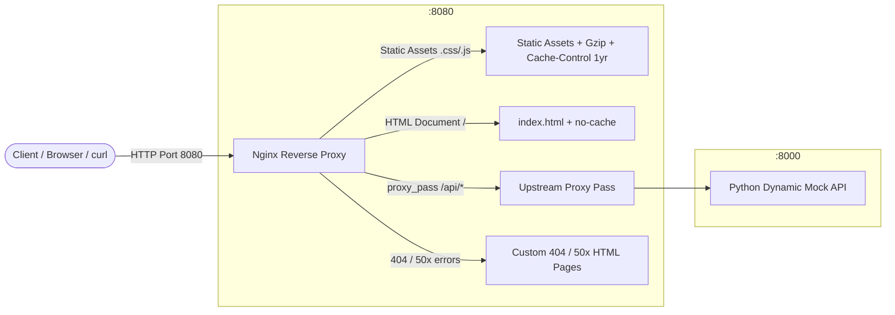

# Mini-Project 01: Static Web Nginx Reverse Proxy

> **Domain**: 02. Networking & Traffic Routing  
> **Level**: Beginner to Intermediate  
> **Infrastructure**: Local (Docker Compose / OrbStack) or Cloud (AWS EC2 t2.micro / Lightsail)  

---

## 🎯 Overview & Context

In modern Web Operations, DevOps, and Site Reliability Engineering (SRE), applications are rarely exposed directly to the public internet. Instead, an **Edge Reverse Proxy** (such as Nginx, Envoy, Traefik, or HAProxy) sits at the perimeter between clients and upstream application services.



This mini-project provides a complete, production-grade Nginx reverse proxy architecture that:

1. **Serves Static Assets**: Directly delivers HTML, CSS, JavaScript, and images with high performance using `sendfile` and `tcp_nopush`.
2. **Implements Aggressive Browser Caching**: Configures fine-grained `Cache-Control` policies (`max-age=31536000, immutable` for static assets vs. `no-cache, must-revalidate` for HTML documents).
3. **Applies On-The-Fly Gzip Compression**: Automatically negotiates and compresses textual assets (CSS, JS, JSON, HTML) when clients advertise `Accept-Encoding: gzip`, reducing payload sizes by up to 70%.
4. **Proxies Dynamic Traffic**: Routes `/api/*` requests to an isolated upstream Python HTTP backend service (`mock_api.py`), passing essential proxy headers (`Host`, `X-Real-IP`, `X-Forwarded-For`, `X-Forwarded-Proto`).
5. **Intercepts Edge Errors**: Replaces standard browser/server error screens with branded custom HTML error pages (HTTP 404 Not Found and HTTP 50x Upstream Server Error).
6. **Includes Automated Testing**: Features a comprehensive 14-point test suite (`test_reverse_proxy.sh`) to validate caching, compression, routing, and header propagation.

---

## 🧠 Networking & Nginx Internals Deep-Dive

### 1. Forward Proxy vs. Reverse Proxy

- **Forward Proxy**: Sits in front of a group of *clients* (e.g. corporate VPN or egress proxy). It acts on behalf of clients to fetch resources from the wider internet, masking client identities and enforcing access policies.
- **Reverse Proxy**: Sits in front of a group of *backend servers*. It acts on behalf of the servers to receive requests from clients, providing single-entry routing, SSL termination, load balancing, DDoS protection, edge caching, and compression.

```text
Forward Proxy:  [Client A, Client B]  ──▶  [Forward Proxy]  ──▶  Internet
Reverse Proxy:  Internet              ──▶  [Reverse Proxy]  ──▶  [Backend 1, Backend 2]
```

### 2. Gzip Dynamic Compression Mechanics

Web assets (HTML, CSS, JS, JSON) consist of repetitive text. Transmitting raw text wastes bandwidth and increases page load time (Time to First Byte and First Contentful Paint).

When a client makes a request, it sends an `Accept-Encoding` header:

```http
GET /style.css HTTP/1.1
Host: localhost:8080
Accept-Encoding: gzip, deflate, br
```

Nginx checks the request against its `gzip` configuration:

1. `gzip on;`: Enables the compression filter module.
2. `gzip_min_length 256;`: Prevents compressing tiny files where compression overhead exceeds size savings.
3. `gzip_comp_level 6;`: Balances CPU utilization against compression ratio (levels range from 1 to 9).
4. `gzip_types text/css application/javascript application/json ...;`: Specifies MIME types to compress.
5. `gzip_vary on;`: Emits `Vary: Accept-Encoding` response header, informing intermediate caches and CDNs to store separate compressed and uncompressed copies.

The response returns compressed binary data with:

```http
HTTP/1.1 200 OK
Content-Type: text/css
Content-Encoding: gzip
Vary: Accept-Encoding
```

### 3. HTTP Caching Headers: Static Assets vs. HTML

Efficient caching minimizes server load and speeds up client page loads. However, caching HTML files aggressively causes users to receive stale application versions.

| Asset Type | Directive | Purpose |
| :--- | :--- | :--- |
| **Static Assets** (`.css`, `.js`, `.png`) | `Cache-Control: public, max-age=31536000, immutable` | Tells browsers & CDNs to cache the asset locally for 1 year ($365 \times 24 \times 3600\text{s}$) without re-validating. |
| **HTML Documents** (`index.html`, `/`) | `Cache-Control: no-cache, must-revalidate` | Forces the browser to revalidate with the server before rendering, ensuring new releases and script updates are reflected immediately. |

### 4. Reverse Proxy Header Propagation (`X-Forwarded-*`)

When Nginx forwards a request to an upstream service via `proxy_pass`, the upstream backend's TCP connection is with Nginx (`127.0.0.1` or the container IP), **not** the real client.

To preserve client identity and metadata, Nginx injects standard proxy headers:

```nginx
proxy_set_header Host $host;
proxy_set_header X-Real-IP $remote_addr;
proxy_set_header X-Forwarded-For $proxy_add_x_forwarded_for;
proxy_set_header X-Forwarded-Proto $scheme;
proxy_set_header X-Forwarded-Port $server_port;
```

- **`Host`**: Original domain or host header sent by the client.
- **`X-Real-IP`**: Immediate IP address of the client connection.
- **`X-Forwarded-For`**: Comma-separated list of IP addresses tracking every proxy hop the request traversed (`client, proxy1, proxy2`).
- **`X-Forwarded-Proto`**: Originating protocol (`http` or `https`).

### 5. Edge Error Interception (`proxy_intercept_errors`)

When backend services encounter internal errors (e.g. 500 Unhandled Exception or 502 Bad Gateway), returning raw stack traces or JSON exceptions exposes internal architecture details to users.

With:

```nginx
proxy_intercept_errors on;
error_page 500 502 503 504 /50x.html;
error_page 404 /404.html;
```

Nginx catches non-2xx status codes from the upstream backend and serves branded, user-friendly HTML error pages.

---

## 📂 Project Structure

```text
02-networking/01-static-web-nginx-reverse-proxy/
├── nginx.conf              # Production Nginx reverse proxy configuration
├── mock_api.py             # Zero-dependency Python 3 HTTP mock API backend
├── Dockerfile.nginx        # Alpine-based Nginx container definition
├── Dockerfile.api          # Alpine-based Python container definition
├── docker-compose.yml      # Multi-container orchestration (Proxy + Backend)
├── public/                 # Static web root directory
│   ├── index.html          # Interactive educational dashboard
│   ├── style.css           # Modern dark-theme styling with glassmorphism
│   ├── app.js              # Client-side JS for live testing and header inspection
│   ├── 404.html            # Custom branded 404 error page
│   └── 50x.html            # Custom branded 50x server error page
├── test_reverse_proxy.sh   # 14-point automated test suite
└── README.md               # Educational guide, architecture & cleanup instructions
```

---

## 🚀 Quickstart & Execution

### 1. Using Docker Compose (Recommended)

Start the Nginx reverse proxy and upstream Python API in the background:

```bash
cd 02-networking/01-static-web-nginx-reverse-proxy
docker compose up -d --build
```

Check container status and health:

```bash
docker compose ps
```

You should see both services `healthy`:

```text
NAME                  IMAGE                                                     COMMAND                  SERVICE       CREATED          STATUS                    PORTS
nginx-mock-api        01-static-web-nginx-reverse-proxy-mock-api                "python3 mock_api.py…"   mock-api      10 seconds ago   Up 10 seconds (healthy)   0.0.0.0:8000->8000/tcp
nginx-reverse-proxy   01-static-web-nginx-reverse-proxy-nginx-proxy             "/docker-entrypoint.…"   nginx-proxy   10 seconds ago   Up 10 seconds (healthy)   0.0.0.0:8080->80/tcp
```

Open your browser at [http://localhost:8080](http://localhost:8080) to access the interactive web dashboard.

---

### 2. Native Local Execution (Without Docker)

You can also run both components natively on your host machine (requires `python3` and `nginx`):

1. **Start the Mock API Backend**:

   ```bash
   ./mock_api.py --port 8000 --host 127.0.0.1
   ```

2. **Verify API is answering**:

   ```bash
   curl -s http://127.0.0.1:8000/health
   ```

3. **Run Nginx locally** (adjusting upstream in `nginx.conf` to `127.0.0.1:8000`):

   ```bash
   nginx -p . -c nginx.conf
   ```

---

## 🧪 Testing & Verification

### 1. Automated Test Suite

Run the included automated test suite to verify all 14 architectural checks:

```bash
./test_reverse_proxy.sh --url http://localhost:8080
```

#### Expected Test Output

```text
======================================================================
  🚀 Nginx Reverse Proxy & Static Cache Automated Test Suite
======================================================================
Target URL: http://localhost:8080

Checking proxy availability at http://localhost:8080...
✓ Proxy is reachable.

--- 1. Static Web Asset Delivery & Caching ---
  [PASS] Test 01: Root '/' returns HTTP 200 OK
         ↳ HTTP Status: 200
  [PASS] Test 02: HTML files enforce 'no-cache, must-revalidate' for immediate updates
         ↳ Header: Cache-Control: no-cache, must-revalidate
  [PASS] Test 03: Static asset '/style.css' returns HTTP 200 OK
         ↳ HTTP Status: 200
  [PASS] Test 04: Static asset '/style.css' contains aggressive Cache-Control (1 year)
         ↳ Header: Cache-Control: public, max-age=31536000, immutable
  [PASS] Test 05: Static asset '/app.js' delivers HTTP 200 with 1-year cache
         ↳ HTTP Status: 200, Cache: Cache-Control: public, max-age=31536000, immutable

--- 2. Gzip Dynamic Compression Negotiation ---
  [PASS] Test 06: Gzip compression negotiated for CSS (Content-Encoding: gzip)
         ↳ Encoding Header: Content-Encoding: gzip
  [PASS] Test 07: Gzip compression negotiated for JS (Content-Encoding: gzip)
         ↳ Encoding Header: Content-Encoding: gzip
  [PASS] Test 08: Gzip payload size is significantly smaller than uncompressed
         ↳ Uncompressed: 8412B vs Compressed: 2315B

--- 3. Reverse Proxy & Header Forwarding ---
  [PASS] Test 09: Reverse proxy forwards '/api/health' to backend returning JSON healthy status
         ↳ Payload: {"status": "healthy", "service": "mock-api"...}
  [PASS] Test 10: Reverse proxy forwards '/api/time' returning dynamic UTC timestamp
         ↳ Payload: {"utc_iso": "2026-08-21T11:28:45.123456+00:00"...}
  [PASS] Test 11: Nginx properly sets and forwards proxy headers (X-Forwarded-For, X-Real-IP, Host)
         ↳ Proxy detection: Confirmed in backend introspection
  [PASS] Test 12: Nginx injects custom 'X-Proxy-By' educational header
         ↳ Header: X-Proxy-By: Nginx-Reverse-Proxy-MiniProject

--- 4. Edge Error Interception & Handling ---
  [PASS] Test 13: Invalid route triggers HTTP 404 and serves custom branded 404 HTML page
         ↳ Status: 404, Custom Marker: Found
  [PASS] Test 14: Upstream 500 error is intercepted by proxy and serves custom 50x HTML page
         ↳ Status: 500, Custom 50x Marker: Found

======================================================================
  📊 Test Suite Execution Summary
======================================================================
  Total Tests:    14
  Passed Tests:   14
  Failed Tests:   0
======================================================================

🎉 SUCCESS: All tests passed flawlessly!
```

---

### 2. Manual Verification with `curl`

#### A. Verify Gzip Compression on Static Assets

Request `/style.css` with `Accept-Encoding: gzip`:

```bash
curl -I -H "Accept-Encoding: gzip" http://localhost:8080/style.css
```

**Expected headers**:

```http
HTTP/1.1 200 OK
Server: nginx
Content-Type: text/css
Content-Encoding: gzip
Vary: Accept-Encoding
Cache-Control: public, max-age=31536000, immutable
X-Proxy-By: Nginx-Reverse-Proxy-MiniProject
```

#### B. Verify Reverse Proxy Header Forwarding

Inspect the `/api/info` endpoint to see what headers the backend received from Nginx:

```bash
curl -s http://localhost:8080/api/info
```

**Expected JSON response**:

```json
{
  "service": "Mock Dynamic API Backend",
  "version": "1.0.0",
  "client_address": "192.168.97.2:48392",
  "proxy_detected": true,
  "proxy_headers": {
    "host": "localhost:8080",
    "x_real_ip": "192.168.97.1",
    "x_forwarded_for": "192.168.97.1",
    "x_forwarded_proto": "http",
    "x_forwarded_host": "localhost:8080",
    "x_forwarded_port": "8080"
  }
}
```

#### C. Verify Custom 404 Error Interception

Request an invalid path:

```bash
curl -i http://localhost:8080/nonexistent-route
```

**Expected response**:

- Status: `HTTP/1.1 404 Not Found`
- Body: Contains the custom HTML from `public/404.html`.

#### D. Verify Custom 50x Error Interception

Trigger a simulated upstream server error:

```bash
curl -i http://localhost:8080/api/simulate-error?code=500
```

**Expected response**:

- Status: `HTTP/1.1 500 Internal Server Error`
- Body: Intercepted by Nginx and serves `public/50x.html`.

---

## 🧹 Cleanup & Teardown

To ensure your local workstation or VM remains completely clean and ready for subsequent mini-projects, execute the following teardown commands:

### 1. Stop and Remove Docker Containers, Networks, Volumes & Local Images

```bash
cd 02-networking/01-static-web-nginx-reverse-proxy
docker compose down --volumes --rmi local
```

### 2. Standalone Container / Image Cleanup (If Built Individually)

If you executed individual `docker build` or `docker run` commands outside Docker Compose:

```bash
# Force remove containers if still running
docker rm -f nginx-reverse-proxy nginx-mock-api 2>/dev/null || true

# Remove built images
docker rmi 01-static-web-nginx-reverse-proxy-nginx-proxy 01-static-web-nginx-reverse-proxy-mock-api 2>/dev/null || true
```

### 3. Verify System is Clean

Confirm that no lingering containers, images, or network artifacts remain:

```bash
# Verify no running containers
docker ps -a --filter "name=nginx-reverse-proxy" --filter "name=nginx-mock-api"

# Verify no local project images
docker images "*static-web-nginx-reverse-proxy*"
```

> [!NOTE]
> All files, test outputs, and assets are strictly self-contained within `02-networking/01-static-web-nginx-reverse-proxy/`. No temporary files or configurations were placed outside this directory.
