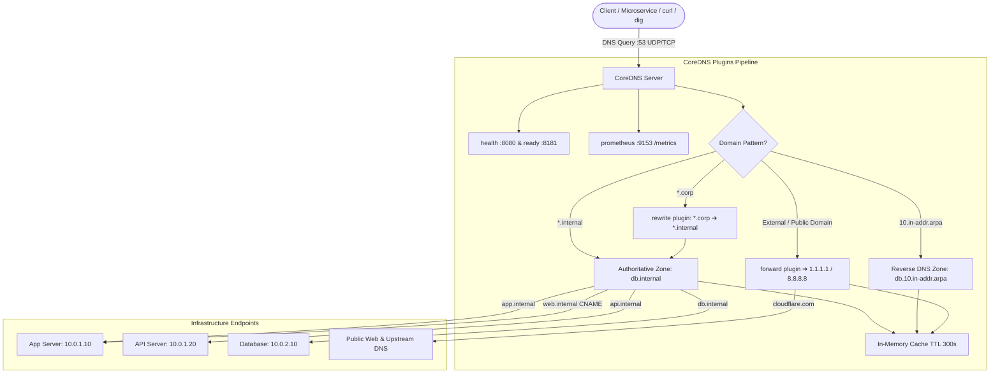

# Mini-Project 02: Internal DNS Server with CoreDNS

> **Domain**: 02. Networking & Traffic Routing  
> **Level**: Beginner to Intermediate  
> **Infrastructure**: Local (Docker Compose / OrbStack) or Cloud (AWS EC2 / Linux VM)  

---

## 🎯 Overview & Context

In modern cloud computing, microservices architectures, and Kubernetes clusters, services dynamically communicate using human-readable domain names rather than hardcoded IP addresses.

An **Internal DNS Server** is the foundational naming backbone of private infrastructure:

- It resolves internal hostnames (such as `api.internal`, `db.internal`, `redis.internal`) to private VPC/overlay IP addresses (`10.0.x.x`).
- It enables **Split-Horizon routing** (serving internal IP addresses to internal clients while seamlessly forwarding public queries to external DNS resolvers).
- It powers **Service Discovery** via `SRV` and `CNAME` records without requiring client-side configuration changes.
- It accelerates lookup latency through **in-memory DNS caching**.



This mini-project deploys a production-grade, containerized **CoreDNS** server configured with:

1. **Authoritative Private Forward Zone (`.internal`)**: Full RFC 1035 zone definition containing `A`, `CNAME`, `TXT`, and `SRV` records.
2. **Authoritative Reverse DNS Zone (`10.in-addr.arpa`)**: `PTR` records resolving private IPv4 addresses (`10.0.x.x`) back to canonical domain names.
3. **Split-Horizon / Domain Rewriting (`.corp` -> `.internal`)**: Transparent alias rewriting for legacy internal naming schemes.
4. **Recursive Upstream Forwarding**: High-availability fallback forwarding to upstream public resolvers (`1.1.1.1`, `8.8.8.8`) for external domain resolution.
5. **In-Memory Query Caching**: Configurable TTL caching reducing internal resolution latency to sub-millisecond speeds (< 1ms).
6. **Observability & Health Probing**: Built-in HTTP health check (`:8080/health`), readiness probe (`:8181/ready`), and Prometheus metrics exporter (`:9153/metrics`).
7. **Automated 24-Point Test Suite (`dns_test_client.sh`)**: Automated validation of all record types, flags, upstream routing, caching, and health endpoints.

---

## 🧠 DNS Fundamentals for DevOps & SREs

If you are new to networking, DNS (Domain Name System) is often called the "phonebook of the Internet." Here is what every engineer must know:

### 1. Authoritative DNS vs. Recursive DNS Resolvers

```text
+-----------------------+        +--------------------------+        +--------------------------+
|      DNS Client       |  ───▶  |    Recursive Resolver    |  ───▶  |   Authoritative Server   |
| (Browser, dig, app)   |        | (e.g. 1.1.1.1, CoreDNS)  |        | (Holds original records) |
+-----------------------+        +--------------------------+        +--------------------------+
```

- **Authoritative DNS Server**: The ultimate source of truth for a specific zone (e.g., `.internal`). It holds the original zone file and returns an **Authoritative Answer (`aa` flag)**.
- **Recursive DNS Resolver**: A server that travels across the DNS hierarchy on behalf of a client to find the answer, caching responses along the way. CoreDNS in this project acts as **both**: an authoritative server for `.internal` and a recursive caching forwarder for the rest of the internet.

---

### 2. Common DNS Record Types Explained

| Record Type | Full Name | Purpose | Example from this Project |
| :--- | :--- | :--- | :--- |
| **`A`** | Address Record | Maps a hostname to an **IPv4** address ($32$-bit). | `app.internal. ➔ 10.0.1.10` |
| **`AAAA`** | IPv6 Address Record | Maps a hostname to an **IPv6** address ($128$-bit). | `app.internal. ➔ 2001:db8::1` |
| **`CNAME`** | Canonical Name | Creates an alias pointing one hostname to another hostname. | `web.internal. ➔ app.internal.` |
| **`TXT`** | Text Record | Carries arbitrary text metadata, SPF email verification, or ownership tokens. | `info.internal. ➔ "environment=production"` |
| **`SRV`** | Service Record | Defines hostname, port, weight, and priority for service discovery. | `_http._tcp.app.internal. ➔ 8080 app.internal.` |
| **`PTR`** | Pointer Record | Used in **Reverse DNS** to map an IP address back to a hostname. | `10.1.0.10.in-addr.arpa. ➔ app.internal.` |
| **`SOA`** | Start of Authority | Mandatory zone header containing serial number, administrator email, and sync timers. | `ns1.internal. hostmaster.internal. ...` |
| **`NS`** | Name Server | Specifies the authoritative nameservers for the zone. | `internal. ➔ ns1.internal.` |

---

### 3. Understanding Reverse DNS (`in-addr.arpa`)

When resolving `app.internal`, the DNS hierarchy looks from right to left (`.internal` $\rightarrow$ `app`).

For an IP address like `10.0.1.10`, the most specific number is at the end (`10`), but DNS trees read from right to left. To make IP lookups hierarchical, IPv4 addresses are reversed and appended with `.in-addr.arpa`:

$$\text{IP: } 10.0.1.10 \quad \Longrightarrow \quad \text{Reverse Domain: } 10.1.0.10\text{.in-addr.arpa.}$$

When you execute `dig -x 10.0.1.10`, `dig` queries `10.1.0.10.in-addr.arpa.` for a `PTR` record, which returns `app.internal.`.

---

### 4. What is Split-Horizon DNS?

In enterprise environments, internal infrastructure often shares domain naming conventions with external networks, or uses legacy aliases (e.g. `.corp` or `.local`).

**Split-Horizon DNS** allows a single DNS server to provide different answers depending on context:

1. Queries for `.internal` or `.corp` return private IP addresses (`10.0.x.x`).
2. Queries for public websites (like `example.com` or `google.com`) are forwarded upstream to public recursive resolvers (`1.1.1.1`).
3. CoreDNS's `rewrite` plugin allows legacy queries (e.g., `app.corp`) to be automatically rewritten into `app.internal` on the fly without breaking older clients.

---

### 5. DNS Caching and TTL (Time-To-Live)

Every DNS response includes a **TTL** (in seconds).

- A TTL of `300` tells clients and caching resolvers: *"You may cache this answer for 300 seconds (5 minutes) before querying the authoritative server again."*
- **Cache Hit vs Cache Miss**: The first lookup contacts the zone or upstream resolver (~5-30ms). Subsequent queries are served directly from RAM in **< 1ms**, reducing latency and server load.

---

## 📂 Project Structure

```text
02-networking/02-internal-dns-server-coredns/
├── Corefile                # CoreDNS configuration and plugin pipeline definition
├── Dockerfile              # Container image build specification
├── docker-compose.yml      # Container orchestration & port mappings (53, 8080, 8181, 9153)
├── Makefile                # Convenient commands (up, down, test, dig-*, clean)
├── dns_test_client.sh      # Automated 24-point validation test suite
├── zones/
│   ├── db.internal         # Forward zone file (SOA, NS, A, CNAME, TXT, SRV)
│   └── db.10.in-addr.arpa  # Reverse zone file (PTR records for 10.0.0.0/8)
└── README.md               # Comprehensive educational documentation
```

---

## ⚙️ Corefile & Plugin Pipeline Deep-Dive

CoreDNS is configured through the [Corefile](file:///Users/fabian/Documents/CodeProjects/github.com/fabiankaraben/devops-sre-mini-projects/02-networking/02-internal-dns-server-coredns/Corefile). Each server block binds to a zone and port, executing plugins in a strict sequence:

```corefile
# 1. Authoritative Forward Zone & Split-Horizon Rewrite
internal:53 corp:53 {
    log {
        class all
    }
    errors
    rewrite stop name suffix .corp .internal
    file /etc/coredns/zones/db.internal {
        reload 5s
    }
    cache 300
}

# 2. Authoritative Reverse Lookup Zone (10.0.0.0/8)
10.in-addr.arpa:53 {
    log
    errors
    file /etc/coredns/zones/db.10.in-addr.arpa {
        reload 5s
    }
    cache 300
}

# 3. Root Catch-All Zone (Recursive Public Forwarder & Observability)
.:53 {
    log
    errors
    health :8080
    ready :8181
    prometheus :9153
    loop
    cache 300
    forward . 1.1.1.1 1.0.0.1 8.8.8.8 {
        max_concurrent 1000
        health_check 5s
    }
    reload 5s
}
```

### Plugin Descriptions

- **`file`**: Loads standard RFC 1035 zone files from disk and reloads them every 5 seconds if modified.
- **`rewrite`**: Translates incoming requests for `.corp` into `.internal` before zone evaluation.
- **`cache`**: In-memory LRU cache storing positive and negative DNS responses for 300 seconds.
- **`forward`**: Forwards external queries (e.g. `github.com`) to public upstream resolvers with health checking.
- **`loop`**: Detects forwarding loops and stops them immediately.
- **`health` & `ready`**: HTTP endpoints for load balancers and Kubernetes health probes (`/health` on port 8080, `/ready` on port 8181).
- **`prometheus`**: Exports OpenMetrics on `:9153/metrics`.

---

## 🚀 Quick Start & Execution

### 1. Prerequisites

Make sure you have Docker installed. You will also need standard DNS utilities (`dig` and `curl`):

```bash
# macOS (via Homebrew)
brew install bind curl

# Ubuntu / Debian
sudo apt-get update && sudo apt-get install -y dnsutils curl

# Alpine Linux
apk add bind-tools curl

# RHEL / Rocky / Fedora
sudo dnf install -y bind-utils curl
```

### 2. Start the CoreDNS Server

Navigate to the project directory and launch the container using `make` or `docker compose`:

```bash
# Using Makefile
make up

# Or directly via Docker Compose
docker compose up -d --build
```

Verify that the container is healthy and running:

```bash
docker compose ps
```

You should see:

```text
NAME                     IMAGE                                    STATUS         PORTS
coredns-internal-server  02-internal-dns-server-coredns-coredns   Up (healthy)   0.0.0.0:53->53/tcp, 0.0.0.0:53->53/udp, 0.0.0.0:8080->8080/tcp, 0.0.0.0:9153->9153/tcp
```

---

## 🧪 Automated Testing

The project includes an automated test script (`dns_test_client.sh`) that validates 24 test assertions across all DNS features.

Run the test suite with:

```bash
make test
# or
./dns_test_client.sh
```

### Sample Output

```text
======================================================================
  🌐 CoreDNS Internal DNS Server & Split-Horizon Test Suite
======================================================================

Target DNS Server : 127.0.0.1:53
Health Endpoint   : http://127.0.0.1:8080/health
Metrics Endpoint  : http://127.0.0.1:9153/metrics

=== 1. Health & Observability Endpoints ===
  ✔ PASS [CoreDNS Health Check Endpoint (:8080/health)] (Matched: 'OK')
  ✔ PASS [CoreDNS Readiness Probe (:8181/ready)] (Matched: 'OK')
  ✔ PASS [Prometheus Metrics Exporter (:9153/metrics)] (Found 'coredns_build_info')

=== 2. Authoritative A Record Lookups (.internal) ===
  ✔ PASS [A Record: app.internal -> 10.0.1.10] (Matched: '10.0.1.10')
  ✔ PASS [A Record: api.internal -> 10.0.1.20] (Matched: '10.0.1.20')
  ✔ PASS [A Record: db.internal -> 10.0.2.10] (Matched: '10.0.2.10')
  ✔ PASS [A Record: redis.internal -> 10.0.2.20] (Matched: '10.0.2.20')
  ✔ PASS [A Record: monitoring.internal -> 10.0.3.10] (Matched: '10.0.3.10')

=== 3. Multi-Tier Subdomain Lookups (Dev vs Prod) ===
  ✔ PASS [A Record: api.dev.internal -> 10.0.10.20] (Matched: '10.0.10.20')
  ✔ PASS [A Record: api.prod.internal -> 10.0.20.20] (Matched: '10.0.20.20')

=== 4. Canonical Aliases (CNAME Records) ===
  ✔ PASS [CNAME Record: web.internal -> app.internal.] (Found 'app.internal.')
  ✔ PASS [CNAME Resolution: web.internal resolves to 10.0.1.10] (Found '10.0.1.10')
  ✔ PASS [CNAME Resolution: database.internal resolves to 10.0.2.10] (Found '10.0.2.10')

=== 5. Metadata & Security TXT Records ===
  ✔ PASS [TXT Record: info.internal metadata] (Found 'environment=internal-datacenter')
  ✔ PASS [TXT Record: internal SPF policy] (Found 'v=spf1')

=== 6. Service Discovery (SRV Records) ===
  ✔ PASS [SRV Record: _http._tcp.app.internal (Port 8080)] (Found '8080 app.internal.')

=== 7. Reverse DNS Lookups (PTR in 10.0.0.0/16) ===
  ✔ PASS [PTR Lookup: 10.0.1.10 -> app.internal.] (Found 'app.internal.')
  ✔ PASS [PTR Lookup: 10.0.2.10 -> db.internal.] (Found 'db.internal.')
  ✔ PASS [PTR Lookup: 10.0.3.10 -> monitoring.internal.] (Found 'monitoring.internal.')

=== 8. Split-Horizon & Name Rewriting (.corp -> .internal) ===
  ✔ PASS [Rewrite Rule: app.corp resolves to 10.0.1.10] (Found '10.0.1.10')

=== 9. DNS Header Flags Verification (Authoritative Answer) ===
  ✔ PASS [Authoritative Answer (aa) Flag set on local zone] (Found 'flags:.*aa')

=== 10. Negative Response (NXDOMAIN) ===
  ✔ PASS [NXDOMAIN status returned for missing host] (Found 'status: NXDOMAIN')

=== 11. Upstream Recursive Forwarding (Public Internet) ===
  ✔ PASS [External Forwarding: Public host resolution via 1.1.1.1] (Found '.')

=== 12. In-Memory DNS Caching Performance ===
  ✔ PASS [Cached internal query response time < 5ms] (Query Time: 1 ms <= 5 ms)

======================================================================
  🎉 ALL TESTS PASSED! (24/24)
======================================================================
```

---

## 🔍 Hands-On Manual Exploration with `dig`

Learn how to query your DNS server and inspect the response headers.

### 1. Querying an Authoritative A Record

```bash
dig @127.0.0.1 -p 53 app.internal A
```

#### How to read the `dig` output

```text
;; ->>HEADER<<- opcode: QUERY, status: NOERROR, id: 7239
;; flags: qr aa rd; QUERY: 1, ANSWER: 1, AUTHORITY: 2, ADDITIONAL: 1
```

- **`status: NOERROR`**: The query succeeded without errors.
- **`flags: qr aa rd`**:
  - `qr` (Query Response): This is a response packet.
  - `aa` (**Authoritative Answer**): The response came directly from the authoritative zone file, not a third-party cache.
  - `rd` (Recursion Desired): Set by the client asking for recursive resolution.
- **`ANSWER SECTION`**:

  ```text
  app.internal.    300    IN    A    10.0.1.10
  ```

  *(Hostname `app.internal.` has a TTL of 300s, Internet class `IN`, type `A`, pointing to `10.0.1.10`)*.

---

### 2. Querying a CNAME Alias

```bash
dig @127.0.0.1 -p 53 web.internal A
```

Output demonstrates alias chaining:

```text
;; ANSWER SECTION:
web.internal.    300    IN    CNAME    app.internal.
app.internal.    300    IN    A        10.0.1.10
```

---

### 3. Querying TXT Metadata

```bash
dig @127.0.0.1 -p 53 info.internal TXT +short
```

Output:

```text
"environment=internal-datacenter;region=us-east-1;owner=devops-sre"
```

---

### 4. Querying Service Discovery (SRV Records)

```bash
dig @127.0.0.1 -p 53 _http._tcp.app.internal SRV
```

Output:

```text
;; ANSWER SECTION:
_http._tcp.app.internal.  300  IN  SRV  10 50 8080 app.internal.
```

*(Priority: 10, Weight: 50, Port: 8080, Target: `app.internal`)*.

---

### 5. Reverse DNS (PTR) Lookup

```bash
dig @127.0.0.1 -p 53 -x 10.0.1.10 +short
```

Output:

```text
app.internal.
```

---

### 6. Split-Horizon Rewrite (`.corp` -> `.internal`)

```bash
dig @127.0.0.1 -p 53 app.corp A +short
```

Output:

```text
10.0.1.10
```

---

### 7. Upstream Public Forwarding

```bash
dig @127.0.0.1 -p 53 one.one.one.one A +short
```

Output:

```text
1.1.1.1
1.0.0.1
```

---

## 📊 Observability & Prometheus Metrics

CoreDNS exposes real-time runtime metrics in OpenMetrics/Prometheus format.

### 1. Health & Readiness Endpoints

```bash
curl -i http://localhost:8080/health
# Returns HTTP 200 OK

curl -i http://localhost:8181/ready
# Returns HTTP 200 OK
```

### 2. Prometheus Metrics

Inspect live DNS server telemetry:

```bash
curl -s http://localhost:9153/metrics | grep coredns_
```

Key SRE metrics:

- **`coredns_dns_requests_total`**: Total number of DNS queries received.
- **`coredns_dns_request_duration_seconds`**: Request latency histogram per zone.
- **`coredns_cache_hits_total`**: Count of queries served from in-memory cache.
- **`coredns_cache_misses_total`**: Count of cache misses requiring upstream or zone evaluation.
- **`coredns_forward_healthcheck_failures_total`**: Health status of upstream resolvers (`1.1.1.1`, `8.8.8.8`).

---

## 🧹 Complete Resource Clean Up

To keep your system clean and avoid port conflicts when working on subsequent mini-projects, tear down all containers, custom bridge networks, and Docker images created by this project:

```bash
# Recommended: Using Makefile
make clean
```

Or using Docker Compose directly:

```bash
docker compose down --rmi all --volumes --remove-orphans
```

### Verify Environment is Completely Clean

```bash
# Check that no CoreDNS container is running
docker ps --filter "name=coredns"

# Check that port 53 is freed
lsof -i :53
```

---

## 🛠️ Troubleshooting

| Issue | Cause | Solution |
| :--- | :--- | :--- |
| `bind: address already in use` on port 53 | Port 53 is already bound by macOS `mDNSResponder`, `dnsmasq`, or Linux `systemd-resolved`. | 1. Use the pre-configured fallback port `1053`: `./dns_test_client.sh --port 1053`. 2. On Linux, disable `DNSStubListener` in `/etc/systemd/resolved.conf`. |
| `command not found: dig` | `dig` utility is not installed. | Install `dnsutils` (Ubuntu/Debian), `bind-tools` (Alpine/macOS), or `bind-utils` (RHEL). |
| Upstream queries timeout | Local firewall or proxy blocks outbound UDP port 53 to `1.1.1.1`. | Edit `forward . 1.1.1.1` in `Corefile` to point to your local corporate or router DNS server. |
| `status: NXDOMAIN` on internal host | Query domain does not match records defined in `zones/db.internal`. | Check zone file records in [db.internal](file:///Users/fabian/Documents/CodeProjects/github.com/fabiankaraben/devops-sre-mini-projects/02-networking/02-internal-dns-server-coredns/zones/db.internal). |
