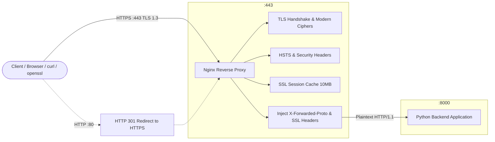

# Mini-Project 03: SSL/TLS Termination Reverse Proxy

> **Domain**: 02. Networking & Traffic Routing  
> **Level**: Beginner to Intermediate  
> **Infrastructure**: Local (Docker Compose / OrbStack) or Cloud (AWS EC2 / Linux VM)  

---

## 🎯 Overview & Context

In production environments, handling encryption and decryption directly within application backend services consumes valuable CPU cycles, complicates certificate rotation, and increases the attack surface across distributed nodes.

An **SSL/TLS Termination Reverse Proxy** offloads cryptographic operations at the network edge:

- It negotiates secure **TLS 1.3** and **TLS 1.2** handshakes with clients using modern, robust cipher suites.
- It enforces strict **HTTP-to-HTTPS redirection** on port 80 to eliminate unencrypted plaintext transmission.
- It injects security headers, notably **HSTS (`Strict-Transport-Security`)**, preventing SSL-stripping and man-in-the-middle (MITM) attacks.
- It accelerates subsequent connections via **SSL Session Caching**.
- It forwards decrypted, clean **HTTP/1.1 traffic** to internal backend services along with essential proxy headers (`X-Forwarded-Proto`, `X-Forwarded-For`, `X-SSL-Protocol`, `X-SSL-Cipher`).



This mini-project provides a complete, production-grade SSL/TLS termination reverse proxy setup that:

1. **Enforces TLS 1.3**: Uses modern RFC 8446 cipher suites (`TLS_AES_256_GCM_SHA384`, `TLS_CHACHA20_POLY1305_SHA256`, `TLS_AES_128_GCM_SHA256`) while rejecting obsolete, insecure protocols (SSLv3, TLS 1.0, TLS 1.1).
2. **Generates Local Certificates with SANs**: Features an automated certificate generation script (`generate_certs.sh`) creating a local Root CA, server certificates with Subject Alternative Names (SAN for `localhost`, `127.0.0.1`, `app.internal`), and Diffie-Hellman 2048-bit parameters (`dhparam.pem`).
3. **Applies Enterprise Security Headers**: Enforces HSTS with a 2-year `max-age`, `includeSubDomains`, and `preload`, alongside `X-Frame-Options`, `X-Content-Type-Options`, and `Content-Security-Policy`.
4. **Propagates Edge TLS Metadata**: Passes client IP, scheme (`https`), and negotiated cryptographic details (`X-SSL-Protocol`, `X-SSL-Cipher`) to the upstream backend.
5. **Includes Interactive Diagnostics UI**: A rich, dark-mode dashboard displaying live TLS handshake metrics and proxy headers.
6. **Features Automated Testing**: A 23-point automated test suite (`test_ssl_termination.sh`) validating redirects, ciphers, session resumption, header injection, and SAN extensions.

---

## 🧠 SSL/TLS Fundamentals for DevOps & SREs

If you are new to networking security, here is a foundational breakdown of how TLS works at the reverse proxy layer.

### 1. What is SSL/TLS Termination

SSL/TLS termination refers to the process where the reverse proxy (acting as the edge server) decrypts incoming HTTPS traffic from the client and forwards the unencrypted (or re-encrypted) request to backend microservices.

```text
+----------------+        HTTPS (Encrypted :443)        +---------------------+
|     Client     | ────────────────────────────────────▶ | Nginx Reverse Proxy |
+----------------+                                      +---------------------+
                                                                   │
                                                        Plaintext  │  HTTP (Internal :8000)
                                                                   ▼
                                                        +---------------------+
                                                        | Python Backend App  |
                                                        +---------------------+
```

#### Key Benefits of Edge Termination

- **Performance**: High-performance C-based reverse proxies (Nginx/HAProxy/Envoy) optimize cryptographic operations with SIMD CPU instructions, offloading backend runtimes (Python, Node.js, Ruby).
- **Simplified Certificate Management**: SSL certificates only need to be installed, renewed, and rotated on the reverse proxy layer rather than across hundreds of backend containers.
- **Centralized Security Policies**: Cipher suites, protocol deprecations, and HSTS headers are managed in a single `nginx.conf` file.
- **Deep Packet Inspection (WAF)**: The proxy can inspect request paths, cookies, and HTTP payloads for malicious traffic before reaching the backend.

---

### 2. TLS 1.2 vs. TLS 1.3: Key Architectural Differences

TLS 1.3 (defined in RFC 8446) is a major leap forward in both speed and cryptographic security compared to TLS 1.2:

| Feature | TLS 1.2 | TLS 1.3 |
| :--- | :--- | :--- |
| **Handshake Round Trips** | 2-RTT (Two network round trips) | 1-RTT (or 0-RTT with Early Data) |
| **Vulnerable Ciphers** | Supported legacy RSA key exchange, CBC ciphers, RC4, MD5, SHA-1 | Removed all insecure algorithms; supports only AEAD ciphers |
| **Forward Secrecy** | Optional (only when using DHE/ECDHE) | **Mandatory** across all supported cipher suites |
| **Handshake Encryption** | Certificate sent in plaintext | Certificate and server extensions are encrypted |
| **Cipher Suites** | Dozens of complex algorithm combinations | Simplified to 5 standardized AEAD suites |

---

### 3. Subject Alternative Names (SAN) in Modern Certificates

In early SSL standards, the **Common Name (`CN`)** field was used to designate the domain name (e.g. `CN=localhost`). Modern browsers and tools (Chrome, Safari, curl, Go) reject certificates that rely solely on `CN` and require **Subject Alternative Names (SAN)** extensions (`subjectAltName`).

This project's `generate_certs.sh` script configures SAN extensions for both DNS hostnames and IP addresses:

```ini
[alt_names]
DNS.1 = localhost
DNS.2 = *.localhost
DNS.3 = app.internal
DNS.4 = *.internal
DNS.5 = app.local
IP.1 = 127.0.0.1
IP.2 = ::1
```

---

### 4. HTTP Strict Transport Security (HSTS)

Even with SSL enabled, a user might accidentally type `http://` in their browser, leaving a small window for an attacker to execute a man-in-the-middle (MITM) downgrade attack (SSL Stripping).

**HSTS** solves this by sending a response header that instructs the browser to automatically convert all future `http://` requests into `https://` locally before sending any network traffic:

```http
Strict-Transport-Security: max-age=63072000; includeSubDomains; preload
```

- **`max-age=63072000`**: Cache this policy in the browser for 2 years ($2 \times 365 \times 24 \times 3600\text{s}$).
- **`includeSubDomains`**: Applies the rule to all subdomains (e.g., `api.example.com`, `auth.example.com`).
- **`preload`**: Submits the domain to Google's hardcoded browser HSTS Preload List.

---

### 5. SSL Session Caching and Resumption

Establishing a new TLS handshake requires CPU-intensive asymmetric key exchange calculations. **SSL Session Caching** allows returning clients to resume an existing session using an abbreviated 1-RTT handshake.

In `nginx.conf`:

```nginx
ssl_session_timeout 1d;
ssl_session_cache shared:SSL_PROXY:10m; # Holds ~40,000 active sessions in RAM
ssl_session_tickets off;               # Enforces Perfect Forward Secrecy
```

---

## 📂 Project Structure

```text
02-networking/03-ssl-tls-termination-reverse-proxy/
├── certs/                      # Generated SSL/TLS certificates and DH parameters
│   ├── ca.crt                  # Local Root CA public certificate
│   ├── ca.key                  # Local Root CA private key
│   ├── server.crt              # Signed server certificate with SAN extensions
│   ├── server.key              # Server private key (RSA 2048-bit)
│   └── dhparam.pem             # Diffie-Hellman 2048-bit parameter file
├── generate_certs.sh           # Certificate generator script
├── nginx.conf                  # Nginx TLS 1.3 reverse proxy configuration
├── backend/
│   └── app.py                  # Python backend server with HTML UI and JSON diagnostics
├── Dockerfile.nginx            # Container definition for Nginx proxy
├── Dockerfile.backend          # Container definition for Python backend
├── docker-compose.yml          # Multi-container orchestration (proxy & backend)
├── Makefile                    # Task runner (up, down, test, certs, clean)
├── test_ssl_termination.sh     # Automated 23-point validation test suite
└── README.md                   # Comprehensive educational documentation
```

---

## ⚙️ Configuration Deep-Dive

### 1. Nginx Reverse Proxy Configuration ([nginx.conf](file:///Users/fabian/Documents/CodeProjects/github.com/fabiankaraben/devops-sre-mini-projects/02-networking/03-ssl-tls-termination-reverse-proxy/nginx.conf))

```nginx
# 1. HTTP Redirection Server Block (Port 80)
server {
    listen 80 default_server;
    server_name _;

    location / {
        return 301 https://$host$request_uri;
    }
}

# 2. HTTPS SSL Termination Server Block (Port 443)
server {
    listen 443 ssl;
    http2 on;
    server_name localhost app.internal app.local 127.0.0.1;

    ssl_certificate /etc/nginx/certs/server.crt;
    ssl_certificate_key /etc/nginx/certs/server.key;
    ssl_dhparam /etc/nginx/certs/dhparam.pem;

    ssl_protocols TLSv1.3 TLSv1.2;
    ssl_prefer_server_ciphers off;
    ssl_conf_command Ciphersuites TLS_AES_256_GCM_SHA384:TLS_CHACHA20_POLY1305_SHA256:TLS_AES_128_GCM_SHA256;
    ssl_ciphers ECDHE-ECDSA-AES128-GCM-SHA256:ECDHE-RSA-AES128-GCM-SHA256:ECDHE-ECDSA-AES256-GCM-SHA384:ECDHE-RSA-AES256-GCM-SHA384:...;

    ssl_session_timeout 1d;
    ssl_session_cache shared:SSL_PROXY:10m;
    ssl_session_tickets off;

    add_header Strict-Transport-Security "max-age=63072000; includeSubDomains; preload" always;
    add_header X-Frame-Options DENY always;
    add_header X-Content-Type-Options nosniff always;
    add_header Referrer-Policy strict-origin-when-cross-origin always;

    location / {
        proxy_pass http://backend_nodes;
        proxy_set_header Host $host;
        proxy_set_header X-Real-IP $remote_addr;
        proxy_set_header X-Forwarded-For $proxy_add_x_forwarded_for;
        proxy_set_header X-Forwarded-Proto $scheme;
        proxy_set_header X-SSL-Protocol $ssl_protocol;
        proxy_set_header X-SSL-Cipher $ssl_cipher;
    }
}
```

---

## 🚀 Quick Start & Execution

### 1. Prerequisites

Ensure Docker is installed and running. For testing commands, `curl` and `openssl` are required:

```bash
# macOS (via Homebrew)
brew install openssl curl

# Ubuntu / Debian
sudo apt-get update && sudo apt-get install -y openssl curl

# Alpine Linux
apk add openssl curl

# RHEL / Fedora
sudo dnf install -y openssl curl
```

### 2. Generate SSL/TLS Certificates

Run the automated certificate generator:

```bash
make certs
# or
./generate_certs.sh
```

### 3. Start the Multi-Container Environment

Build and launch the proxy and backend containers:

```bash
make up
# or
docker compose up -d --build
```

Verify that both containers are running and healthy:

```bash
docker compose ps
```

You should see:

```text
NAME                    IMAGE                                          STATUS                   PORTS
ssl-backend-app         03-ssl-tls-termination-reverse-proxy-backend   Up (healthy)             8000/tcp
ssl-termination-proxy   03-ssl-tls-termination-reverse-proxy-proxy     Up (healthy)             0.0.0.0:80->80/tcp, 0.0.0.0:443->443/tcp
```

---

## 🧪 Automated Testing

Execute the 23-point automated test suite:

```bash
make test
# or
./test_ssl_termination.sh
```

### Sample Output

```text
======================================================================
  🔒 SSL/TLS Termination Reverse Proxy Automated Test Suite
======================================================================

Target Host : 127.0.0.1
HTTP Port   : 80
HTTPS Port  : 443
CA Cert     : ./certs/ca.crt

=== 1. HTTP Port 80 Redirection Enforcement ===
  ✔ PASS [HTTP Status 301 Moved Permanently] (Found 'HTTP/1.1 301')
  ✔ PASS [Redirect Location contains https://] (Found 'Location: https://')

=== 2. HTTPS Port 443 Connectivity ===
  ✔ PASS [HTTPS Port 443 returns HTTP 200] (Found '200')

=== 3. TLS 1.3 Handshake & Modern Cipher Suite ===
  ✔ PASS [TLS 1.3 Protocol Negotiated] (Found 'TLSv1.3')
  ✔ PASS [Modern TLS 1.3 Cipher Negotiated] (Found 'TLS_')

=== 4. TLS 1.2 Fallback Compatibility ===
  ✔ PASS [TLS 1.2 Handshake Supported] (Found 'TLSv1.2')

=== 5. Legacy Insecure Protocols Rejection ===
  ✔ PASS [Insecure TLS 1.0 Rejected]

=== 6. Strict-Transport-Security (HSTS) & Security Headers ===
  ✔ PASS [HSTS Header (max-age=63072000)] (Found 'Strict-Transport-Security: max-age=63072000')
  ✔ PASS [HSTS includeSubDomains directive] (Found 'includeSubDomains')
  ✔ PASS [HSTS preload directive] (Found 'preload')
  ✔ PASS [X-Frame-Options: DENY] (Found 'X-Frame-Options: DENY')
  ✔ PASS [X-Content-Type-Options: nosniff] (Found 'X-Content-Type-Options: nosniff')
  ✔ PASS [Referrer-Policy: strict-origin] (Found 'Referrer-Policy: strict-origin-when-cross-origin')
  ✔ PASS [Content-Security-Policy (CSP) active] (Found 'Content-Security-Policy')

=== 7. Backend Proxy Header Injection & SSL Termination Diagnostics ===
  ✔ PASS [ssl_terminated_at_proxy: true] (Found '"ssl_terminated_at_proxy": true')
  ✔ PASS [X-Forwarded-Proto: https] (Found '"forwarded_proto": "https"')
  ✔ PASS [Injected X-SSL-Protocol present] (Found '"ssl_protocol": "TLSv')
  ✔ PASS [Injected X-SSL-Cipher present] (Found '"ssl_cipher":')

=== 8. Backend Health Endpoint & Interactive Dashboard ===
  ✔ PASS [Backend Health status: healthy] (Found '"status": "healthy"')
  ✔ PASS [Interactive HTML Dashboard served] (Found 'SSL/TLS Termination Reverse Proxy')

=== 9. Certificate SAN Extension Validation ===
  ✔ PASS [SAN contains DNS:localhost] (Found 'DNS:localhost')
  ✔ PASS [SAN contains IP:127.0.0.1] (Found 'IP Address:127.0.0.1')

=== 10. SSL Session Resumption & Caching ===
  ✔ PASS [SSL Session Cache Reconnect / Reuse] (Found 'Reused')

======================================================================
  🎉 ALL TESTS PASSED! (23/23)
======================================================================
```

---

## 🔍 Hands-On Manual Exploration

### 1. Inspect TLS 1.3 Handshake with OpenSSL

Execute a raw TLS 1.3 connection to inspect protocol and cipher negotiation:

```bash
openssl s_client -connect localhost:443 -servername localhost -tls1_3 </dev/null
```

Key output sections to observe:

```text
---
New, TLSv1.3, Cipher is TLS_AES_256_GCM_SHA384
Server public key is 2048 bit
Protocol: TLSv1.3
---
```

---

### 2. Verify HTTP to HTTPS 301 Redirection

```bash
curl -I http://localhost/
```

Output:

```http
HTTP/1.1 301 Moved Permanently
Server: nginx
Location: https://localhost/
```

---

### 3. Verify Security Headers and HSTS

```bash
curl -I -k https://localhost/
```

Output:

```http
HTTP/2 200 
server: nginx
strict-transport-security: max-age=63072000; includeSubDomains; preload
x-frame-options: DENY
x-content-type-options: nosniff
referrer-policy: strict-origin-when-cross-origin
content-security-policy: default-src 'self'; ...
x-proxy-by: Nginx-TLS-Termination
```

---

### 4. Query Backend JSON Diagnostics

Verify that Nginx successfully injected the edge SSL protocol and cipher headers:

```bash
curl -s -k https://localhost/api/tls-info
```

Output:

```json
{
  "ssl_terminated_at_proxy": true,
  "client_ip": "192.168.65.1",
  "forwarded_for": "192.168.65.1",
  "forwarded_proto": "https",
  "forwarded_host": "localhost",
  "forwarded_port": "443",
  "ssl_protocol": "TLSv1.3",
  "ssl_cipher": "TLS_AES_256_GCM_SHA384",
  "internal_connection": "HTTP/1.1 (Plaintext)",
  "timestamp": "2026-08-21T11:51:57+00:00"
}
```

---

### 5. Access Interactive Web Dashboard

Open your web browser and navigate to:

```text
https://localhost
```

*(Accept the local self-signed certificate warning to view the real-time TLS handshake diagnostics and injected header table).*

---

## 🧹 Complete Resource Clean Up

To keep your development workstation clean and prevent port conflicts with subsequent mini-projects, tear down all containers, networks, volumes, images, and generated certificates:

```bash
# Recommended: Using Makefile
make clean
```

Or step-by-step using Docker Compose:

```bash
# 1. Stop and remove containers, custom networks, and images
docker compose down --rmi all --volumes --remove-orphans

# 2. Clean generated certificates
./generate_certs.sh --clean
```

### Verify Environment is Completely Clean

```bash
# Verify no proxy or backend containers remain
docker ps --filter "name=ssl-"

# Verify ports 80 and 443 are free
lsof -i :80 -i :443
```

---

## 🛠️ Troubleshooting

| Issue | Cause | Solution |
| :--- | :--- | :--- |
| `curl: (60) SSL certificate problem: self signed certificate` | Local curl does not trust the self-signed root CA by default. | Pass `--cacert ./certs/ca.crt` or `-k` (`--insecure`) to curl. |
| `bind: address already in use` on port 80 or 443 | Port 80/443 is in use by another local web server or proxy. | 1. Use the pre-configured fallback ports `8088` and `8443`. 2. Run `./test_ssl_termination.sh --http-port 8088 --https-port 8443`. |
| `handshake failure` on TLS 1.0/1.1 | Nginx correctly rejects legacy insecure protocols. | This is intended behavior. The proxy only permits TLS 1.2 and TLS 1.3. |
| Missing `dhparam.pem` | Certificate generator was interrupted before Diffie-Hellman computation finished. | Run `./generate_certs.sh --force` to regenerate all cryptographic assets. |
