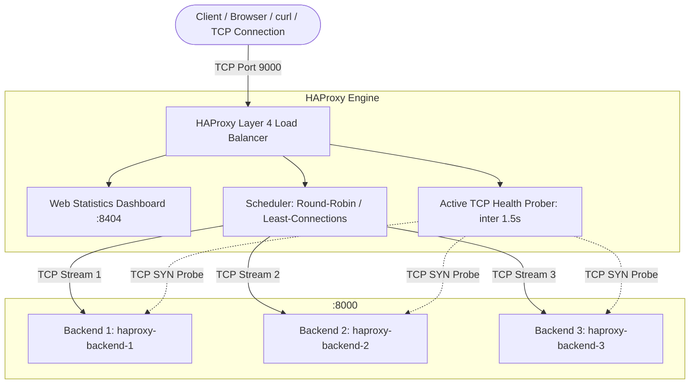

# Mini-Project 04: Layer 4 TCP HAProxy Load Balancer

> **Domain**: 02. Networking & Traffic Routing  
> **Level**: Beginner to Intermediate  
> **Infrastructure**: Local (Docker Compose / OrbStack) or Cloud (AWS EC2 / Linux VM)  

---

## 🎯 Overview & Context

In high-scale distributed systems, database clusters (PostgreSQL, MySQL), message brokers (Kafka, RabbitMQ), caching layers (Redis), and web tiers require load balancers capable of distributing millions of network connections with minimal latency and zero protocol overhead.

A **Layer 4 (Transport Layer) Load Balancer** operates at the TCP/UDP level:

- It forwards raw TCP byte streams directly without inspecting or parsing higher-level application payloads (such as HTTP headers or JSON bodies).
- It executes **Round-Robin** and **Least-Connections** scheduling to evenly distribute connection load across a pool of backend worker instances.
- It actively monitors backend instance health using lightweight **TCP SYN probes** (`check inter 1500ms fall 2 rise 2`), automatically ejecting dead nodes within seconds.
- It guarantees **Zero-Downtime Resilience** via automatic session redispatch (`option redispatch`), ensuring client requests are seamlessly rerouted if a backend server drops during connection establishment.
- It provides live operational telemetry through a built-in **HAProxy Web Statistics Dashboard** on port 8404.



This mini-project deploys a production-grade HAProxy Layer 4 load balancer cluster that:

1. **Balances Raw TCP Streams**: Configured in `mode tcp` on port 9000 to distribute traffic across 3 isolated backend container instances.
2. **Implements Active TCP Health Probing**: Regularly tests backend socket availability, ejecting unhealthy nodes after 2 consecutive failed probes (3s) and recovering them after 2 successful checks.
3. **Features Zero-Downtime Automatic Redispatch**: Implements `option redispatch` and `retries 3` so transient node failures never result in dropped client connections.
4. **Exposes Live Telemetry & Dashboard**: Provides real-time visual metrics, node states (`UP`/`DOWN`), session rates, and byte counters on `http://localhost:8404`.
5. **Includes Visual & API Backends**: 3 Python backend nodes serving real-time identity banners (`backend-1`, `backend-2`, `backend-3`), request counters, and JSON telemetry.
6. **Automated Traffic & Failover Testing**: Features `traffic_simulator.sh` validating round-robin distribution, node failure ejection, and automatic self-healing recovery.

---

## 🧠 Layer 4 vs. Layer 7 Load Balancing Deep-Dive

Understanding the OSI model distinction between Layer 4 and Layer 7 is fundamental for DevOps and SRE engineers:

```text
OSI Layer 7 (Application) : [HTTP / HTTPS / gRPC / WebSockets] ➔ Inspects URLs, Headers, Cookies
OSI Layer 4 (Transport)   : [TCP / UDP]                        ➔ Inspects IP addresses & Ports only
```

### Comparative Breakdown

| Characteristic | Layer 4 (Transport Layer) | Layer 7 (Application Layer) |
| :--- | :--- | :--- |
| **OSI Layer** | Layer 4 (TCP, UDP) | Layer 7 (HTTP, HTTPS, gRPC, WebSocket) |
| **Data Inspection** | Source IP, Source Port, Destination IP, Destination Port | Full HTTP request headers, cookies, URL paths, JSON payloads |
| **Throughput & Latency** | **Extremely high throughput, sub-millisecond latency** (Packet/Stream splicing) | Higher CPU usage (must decrypt TLS, parse HTTP strings, and re-encrypt) |
| **Protocol Support** | **Protocol Agnostic**: Works for HTTP, Redis, Postgres, MySQL, SSH, DNS, MQTT | Specific to supported application protocols (HTTP/1.1, HTTP/2, gRPC) |
| **Routing Decisions** | IP/Port, Round-Robin, Least Connections, Source IP Hash | Path-based routing (`/api` vs `/static`), Host header routing, Cookie sticky sessions |
| **TLS Handling** | Passes TLS through untouched (Pass-Through) or simple TCP proxy | Performs full SSL/TLS termination, certificate decryption, and header injection |

---

## ⚙️ HAProxy Architecture & Configuration

The cluster configuration is defined in [haproxy.cfg](file:///Users/fabian/Documents/CodeProjects/github.com/fabiankaraben/devops-sre-mini-projects/02-networking/04-layer4-haproxy-load-balancer/haproxy.cfg):

```haproxy
# 1. Global and Default Directives
global
    log stdout format raw local0 info
    maxconn 4096

defaults
    log     global
    mode    tcp
    option  tcplog
    option  dontlognull
    option  redispatch
    retries 3
    timeout connect 3000ms
    timeout client  50000ms
    timeout server  50000ms

# 2. HAProxy Web Statistics Dashboard
frontend stats_front
    mode http
    bind *:8404
    stats enable
    stats uri /
    stats refresh 2s
    stats auth admin:admin123

# 3. Layer 4 TCP Frontend
frontend tcp_front
    bind *:9000
    mode tcp
    default_backend tcp_backend_pool

# 4. Backend Pool with Active Health Checking
backend tcp_backend_pool
    mode tcp
    balance roundrobin
    default-server check inter 1500ms fall 2 rise 2 weight 10 maxconn 1000

    server backend-1 backend-1:8000
    server backend-2 backend-2:8000
    server backend-3 backend-3:8000
```

### Key Directives Explained

- **`mode tcp`**: Configures HAProxy to operate at Layer 4, forwarding raw TCP segments without parsing application headers.
- **`balance roundrobin`**: Distributes new TCP connections sequentially across all healthy backend nodes in the pool.
- **`check inter 1500ms fall 2 rise 2`**:
  - `inter 1500ms`: HAProxy initiates a TCP handshake with each backend every 1.5 seconds.
  - `fall 2`: If 2 consecutive checks fail (3 seconds total), the server is marked `DOWN` and immediately removed from routing.
  - `rise 2`: When the server recovers, it must pass 2 consecutive checks (3 seconds) before re-entering the active pool.
- **`option redispatch`**: If a backend server fails during a connection attempt, HAProxy transparently redispatches the connection to another live backend.

---

## 📂 Project Structure

```text
02-networking/04-layer4-haproxy-load-balancer/
├── haproxy.cfg             # HAProxy Layer 4 configuration & stats settings
├── Dockerfile.haproxy      # Container definition for HAProxy load balancer
├── Dockerfile.backend      # Container definition for Python backend node
├── backend/
│   └── server.py           # Backend server with HTML dashboard & JSON telemetry
├── docker-compose.yml      # Orchestration for HAProxy and 3 backend instances
├── Makefile                # Convenient task runner (up, down, test, failover, clean)
├── traffic_simulator.sh    # Automated test suite and traffic generator
└── README.md               # Comprehensive educational documentation
```

---

## 🚀 Quick Start & Execution

### 1. Prerequisites

Ensure Docker and `curl` are installed:

```bash
# macOS (via Homebrew)
brew install curl

# Ubuntu / Debian
sudo apt-get update && sudo apt-get install -y curl

# Alpine Linux
apk add curl
```

### 2. Start the Load Balancer Cluster

Launch HAProxy and the 3 backend instances:

```bash
make up
# or
docker compose up -d --build
```

Verify that all 4 containers are running and healthy:

```bash
docker compose ps
```

You should see:

```text
NAME                  IMAGE                                       STATUS                    PORTS
haproxy-backend-1     04-layer4-haproxy-load-balancer-backend-1   Up (healthy)              8000/tcp
haproxy-backend-2     04-layer4-haproxy-load-balancer-backend-2   Up (healthy)              8000/tcp
haproxy-backend-3     04-layer4-haproxy-load-balancer-backend-3   Up (healthy)              8000/tcp
haproxy-l4-balancer   04-layer4-haproxy-load-balancer-haproxy     Up                        0.0.0.0:8404->8404/tcp, 0.0.0.0:9000->9000/tcp
```

---

## 🧪 Automated Testing & Traffic Simulation

### 1. Run Round-Robin Distribution Test

Send 60 automated requests through HAProxy to verify equal traffic distribution across all 3 backend instances:

```bash
make test
# or
./traffic_simulator.sh
```

#### Distribution Test Output

```text
======================================================================
  ⚖️  HAProxy Layer 4 TCP Load Balancer Test Suite & Traffic Simulator
======================================================================

Target Load Balancer : 127.0.0.1:9000
HAProxy Stats URL    : http://127.0.0.1:8404
Simulated Requests   : 60

=== 1. HAProxy Web Statistics Dashboard Verification ===
  ✔ PASS [HAProxy CSV Metrics Endpoint Accessible] (Found 'tcp_backend_pool')
  ✔ PASS [Backend-1 registered in stats] (Found 'backend-1')
  ✔ PASS [Backend-2 registered in stats] (Found 'backend-2')
  ✔ PASS [Backend-3 registered in stats] (Found 'backend-3')

=== 2. Round-Robin Traffic Distribution (60 Requests) ===
Sending 60 TCP requests through HAProxy (port 9000)...

  ┌──────────────────┬──────────────┬─────────────┐
  │ Backend Instance │ Requests Won │ Distribution│
  ├──────────────────┼──────────────┼─────────────┤
  │ backend-1        │ 20           │ 33%         │
  │ backend-2        │ 20           │ 33%         │
  │ backend-3        │ 20           │ 33%         │
  └──────────────────┴──────────────┴─────────────┘

  ✔ PASS [Round-robin evenly distributed across all 3 nodes with 0 dropped requests]

======================================================================
  🎉 ALL TESTS PASSED! (5/5)
======================================================================
```

---

### 2. Run Failover & Self-Healing Resilience Test

Simulate a real-world outage where a backend node crashes, verify HAProxy health checks eject it without dropping connections, and observe self-healing recovery when the node restarts:

```bash
make test-failover
# or
./traffic_simulator.sh --failover
```

#### Failover and Recovery Output

```text
=== 3. Dynamic Failover & Self-Healing Resilience Test ===
[Step 1/4] Simulating outage: Stopping container 'haproxy-backend-2'...
Waiting 6s for HAProxy active TCP health check (inter 1.5s, fall 2) to mark node DOWN...
Sending 30 requests during outage...
  ✔ PASS [Node backend-2 successfully ejected; 100% traffic routed to healthy nodes (b1=15, b3=15) with 0 dropped requests]
[Step 2/4] Restoring node: Starting container 'haproxy-backend-2'...
Waiting 5s for HAProxy active TCP health check (rise 2) to mark node UP...
Sending 30 requests after recovery...
  ✔ PASS [Self-Healing Verified: Restored node backend-2 rejoined the active pool seamlessly (b1=10, b2=10, b3=10)]

======================================================================
  🎉 ALL TESTS PASSED! (7/7)
======================================================================
```

---

## 🔍 Hands-On Manual Exploration

### 1. Single Request Inspection via curl

Send a request through HAProxy port 9000 to view which node responds:

```bash
curl -s http://localhost:9000/api/info
```

Output:

```json
{
  "node_id": "backend-1",
  "hostname": "96758e56d0b7",
  "requests_served": 1,
  "listening_port": 8000,
  "client_address": "172.20.0.5",
  "client_port": 49210,
  "uptime_seconds": 15.42,
  "timestamp": "2026-08-21T11:55:20+00:00"
}
```

Repeated requests will cycle: `backend-1` $\rightarrow$ `backend-2` $\rightarrow$ `backend-3` $\rightarrow$ `backend-1`.

---

### 2. Access HAProxy Web Statistics Dashboard

Open your web browser and navigate to:

```text
http://localhost:8404
```

- **Username**: `admin`
- **Password**: `admin123`

#### What to observe in the dashboard

- **`tcp_backend_pool`**: Displays all 3 backend servers with green highlights (`UP`).
- **Session Rate / Current Sessions**: Real-time connections per second.
- **Bytes In / Bytes Out**: Network throughput counters.
- **Status Column**: Live health check response times (e.g. `Layer4 check passed in 1ms`).

---

### 3. Interactive Visual UI

Open your browser at:

```text
http://localhost:9000
```

Refresh the page (`⌘R` or `F5`) to visually watch the load balancer rotate between `backend-1` (Blue), `backend-2` (Green), and `backend-3` (Orange).

---

## 🧹 Complete Resource Clean Up

To keep your environment clean and release ports for subsequent mini-projects, tear down all containers, networks, volumes, and images:

```bash
# Recommended: Using Makefile
make clean
```

Or using Docker Compose directly:

```bash
docker compose down --rmi all --volumes --remove-orphans
```

### Verify Environment is Completely Clean

```bash
# Verify no HAProxy or backend containers remain
docker ps --filter "name=haproxy-"

# Verify ports 9000 and 8404 are released
lsof -i :9000 -i :8404
```

---

## 🛠️ Troubleshooting

| Issue | Cause | Solution |
| :--- | :--- | :--- |
| `bind: address already in use` on port 9000 or 8404 | Port 9000 or 8404 is used by another local process. | Stop the conflicting process or change the host port mapping in `docker-compose.yml`. |
| HAProxy marks server `DOWN` unexpectedly | Backend Python service failed to start or crashed. | Check backend logs using `docker compose logs backend-1`. |
| Stats dashboard authentication fails | Incorrect credentials entered in browser. | Use username `admin` and password `admin123` as defined in `haproxy.cfg`. |
| Requests fail during container restart | Health check `rise` timer has not elapsed yet. | Wait 4 seconds for HAProxy to complete 2 successful consecutive health probes before sending traffic. |
