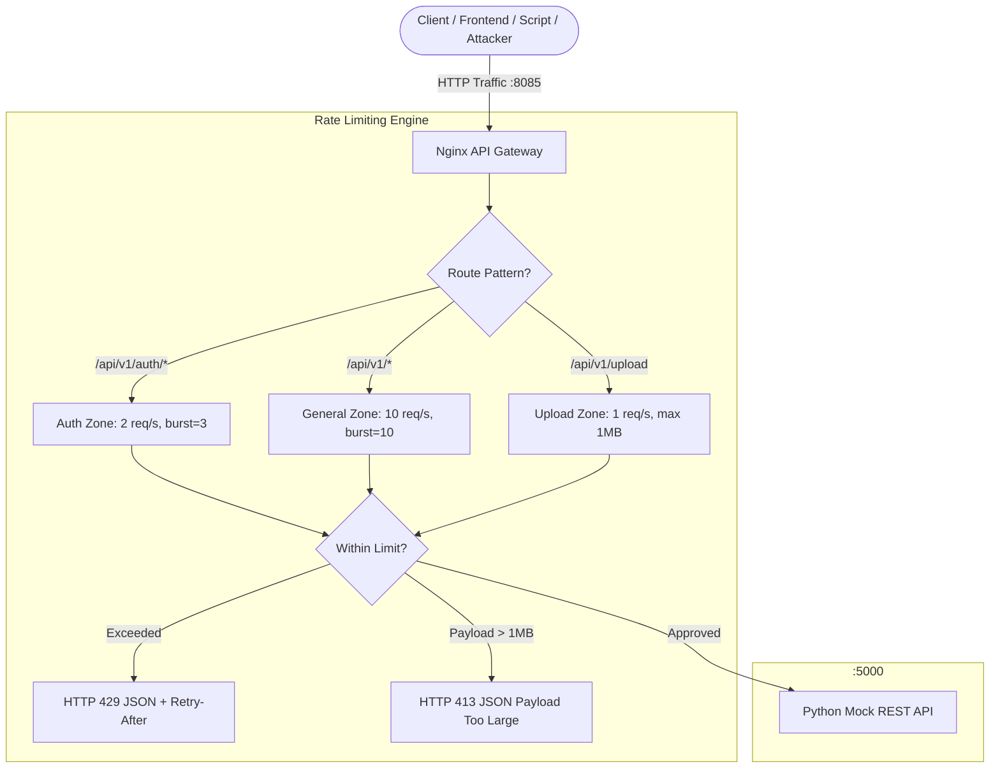

# Mini-Project 05: API Gateway with Leaky-Bucket Rate Limiting

> **Domain**: 02. Networking & Traffic Routing  
> **Level**: Beginner to Intermediate  
> **Infrastructure**: Local (Docker Compose / OrbStack) or Cloud (AWS EC2 / Linux VM)  

---

## 🎯 Overview & Context

In production API architectures, protecting backend microservices and databases from Denial of Service (DoS) attacks, brute-force credential stuffing, API scraping, and sudden traffic spikes is critical for maintaining high availability.

An **API Gateway with Rate Limiting** enforces traffic governance at the network boundary:

- It implements the **Leaky-Bucket algorithm** via shared-memory zones (`limit_req_zone`), regulating incoming client request velocity.
- It provides **Burst allowances with `nodelay`**, allowing legitimate traffic bursts to be served immediately while discarding or throttling abusive sustained traffic.
- It applies **Granular endpoint policies** (strict rate limits for authentication vs standard limits for REST APIs vs upload size limits).
- It intercepts rate-limited requests, returning standard **HTTP 429 (Too Many Requests)** with structured JSON error bodies and `Retry-After` headers.
- It enforces **Request payload restrictions** (`client_max_body_size 1M`), instantly blocking oversized payloads with **HTTP 413 (Payload Too Large)**.



This mini-project provides a complete, production-grade API Gateway rate-limiting architecture that:

1. **Implements Leaky-Bucket Rate Limiting**: Uses Nginx's `limit_req_zone` storing client IP states in shared memory (10MB holding ~160,000 unique IP addresses).
2. **Differentiates Route Policies**:
   - `/api/v1/auth/*`: 2 requests/sec with burst 3 (Brute-force shield).
   - `/api/v1/*`: 10 requests/sec with burst 10 (Standard REST APIs).
   - `/api/v1/upload`: 1 request/sec with burst 2 and 1MB body limit.
3. **Returns Standard HTTP 429 JSON Payloads**: Replaces Nginx's default 503 error with RFC-compliant HTTP 429 responses, `Retry-After: 1` headers, and structured JSON.
4. **Features Automated Concurrency Burst Tester (`burst_tester.py`)**: A multi-threaded concurrency tester validating limits, burst handling, leaky-bucket drainage, and body size limits.
5. **Includes Mock REST API with Live Dashboard**: A Python backend service providing auth, user collections, order collections, upload handlers, and an interactive UI.

---

## 🧠 Rate Limiting Algorithms Deep-Dive

For DevOps and SRE engineers, understanding how rate-limiting algorithms behave under burst conditions is essential.

### 1. Leaky Bucket vs. Token Bucket vs. Fixed Window

```text
+-------------------+-----------------------------------------------------------------+
| Algorithm         | How It Works & Core Tradeoffs                                   |
+-------------------+-----------------------------------------------------------------+
| Fixed Window      | Counts requests per fixed clock window (e.g. 100 req / minute).  |
|                   | Flaw: Susceptible to 2x burst traffic at the window boundary.   |
+-------------------+-----------------------------------------------------------------+
| Leaky Bucket      | Requests enter a bucket of fixed capacity and leak out at a     |
| (Nginx limit_req) | strictly constant rate. Smooths out traffic spikes.             |
+-------------------+-----------------------------------------------------------------+
| Token Bucket      | Tokens accumulate at a fixed rate up to bucket capacity.        |
|                   | Each request consumes a token. Allows bursts up to bucket size. |
+-------------------+-----------------------------------------------------------------+
```

---

### 2. Anatomy of Nginx `limit_req_zone` and `limit_req`

In `nginx.conf`:

```nginx
limit_req_zone $binary_remote_addr zone=api_general_limit:10m rate=10r/s;
```

- **`$binary_remote_addr`**: Uses the binary representation of the client's IP address ($4\text{ bytes}$ for IPv4, $16\text{ bytes}$ for IPv6), saving $4\times$ memory compared to string `$remote_addr`.
- **`zone=api_general_limit:10m`**: Allocates a 10 Megabyte shared memory segment accessible across all Nginx worker processes, storing ~160,000 active IP states.
- **`rate=10r/s`**: Specifies the leak rate ($10\text{ requests per second} = 1\text{ request every } 100\text{ms}$).

---

### 3. Understanding Burst Allowances and the `nodelay` Flag

When a client sends multiple requests simultaneously:

```nginx
location /api/v1/ {
    limit_req zone=api_general_limit burst=10 nodelay;
}
```

- **Without `burst`**: Any request arriving sooner than $100\text{ms}$ after the previous request is immediately rejected with HTTP 429.
- **With `burst=10`**: A bucket of 10 extra slots is created. If 10 requests arrive at once, they enter the bucket.
- **With `nodelay`**: Nginx processes all 10 burst requests **immediately without added latency**. However, the bucket is now full. Any 11th request arriving before the bucket leaks is immediately rejected with **HTTP 429**.
- **Without `nodelay`**: Burst requests are delayed and processed one by one every $100\text{ms}$, artificially slowing down client requests.

---

### 4. Custom Error Overrides (`error_page 429` & `limit_req_status`)

By default, Nginx returns `HTTP 503 Service Temporarily Unavailable` when a rate limit is exceeded. In modern REST API design, clients expect `HTTP 429 Too Many Requests`.

```nginx
limit_req_status 429;
error_page 429 = @rate_limit_exceeded;

location @rate_limit_exceeded {
    default_type application/json;
    add_header Retry-After 1 always;
    return 429 '{"error":"Too Many Requests","status":429,"message":"Rate limit exceeded.","retry_after_seconds":1}\n';
}
```

---

## 📂 Project Structure

```text
02-networking/05-api-gateway-rate-limiting/
├── nginx.conf              # API Gateway configuration with limit_req_zone & error handlers
├── Dockerfile.gateway      # Container definition for Nginx API Gateway
├── Dockerfile.api          # Container definition for Mock REST API
├── backend/
│   └── api.py              # Python Mock API with auth, users, orders, upload & HTML UI
├── docker-compose.yml      # Multi-container orchestration (gateway and api)
├── Makefile                # Convenient task runner (up, down, test, curl-*, clean)
├── burst_tester.py         # Multi-threaded concurrency burst test suite
└── README.md               # Comprehensive educational documentation
```

---

## ⚙️ Configuration Deep-Dive ([nginx.conf](file:///Users/fabian/Documents/CodeProjects/github.com/fabiankaraben/devops-sre-mini-projects/02-networking/05-api-gateway-rate-limiting/nginx.conf))

```nginx
http {
    # 1. Rate Limiting Zones
    limit_req_zone $binary_remote_addr zone=api_general_limit:10m rate=10r/s;
    limit_req_zone $binary_remote_addr zone=api_auth_limit:10m rate=2r/s;
    limit_req_zone $binary_remote_addr zone=api_upload_limit:10m rate=1r/s;

    limit_req_status 429;

    server {
        listen 80;

        # 2. Strict Auth / Login Protection
        location /api/v1/auth/ {
            limit_req zone=api_auth_limit burst=3 nodelay;
            proxy_pass http://downstream_api;
        }

        # 3. Heavy Uploads with 1MB Size Limit
        location /api/v1/upload {
            client_max_body_size 1m;
            limit_req zone=api_upload_limit burst=2 nodelay;
            proxy_pass http://downstream_api;
        }

        # 4. Standard REST API Endpoints
        location /api/v1/ {
            limit_req zone=api_general_limit burst=10 nodelay;
            proxy_pass http://downstream_api;
        }
    }
}
```

---

## 🚀 Quick Start & Execution

### 1. Prerequisites

Ensure Docker is installed and Python 3 is available locally:

```bash
# macOS / Linux
python3 --version
docker --version
```

### 2. Start the API Gateway and Backend

Launch the multi-container environment:

```bash
make up
# or
docker compose up -d --build
```

Verify that both containers are running and healthy:

```bash
docker compose ps
```

You should see:

```text
NAME                 IMAGE                                      STATUS                    PORTS
rate-limit-api       05-api-gateway-rate-limiting-api           Up (healthy)              5000/tcp
rate-limit-gateway   05-api-gateway-rate-limiting-gateway       Up (healthy)              0.0.0.0:8085->80/tcp, 0.0.0.0:8888->80/tcp
```

---

## 🧪 Automated Concurrency & Burst Testing

Run the multi-threaded concurrency tester to validate all rate-limiting zones:

```bash
make test
# or
python3 burst_tester.py --url http://localhost:8085
```

### Test Suite Execution Output

```text
======================================================================
  🛡️  API Gateway Leaky-Bucket Rate Limiter Concurrency Test Suite
======================================================================

Target API Gateway : http://localhost:8085
Burst Concurrency  : 25

=== 1. API Gateway & Downstream Health Verification ===
  ✔ PASS [Gateway Health Check] (HTTP 200)
  ✔ PASS [Downstream Users API Reachable] (HTTP 200)

=== 2. General API Burst Concurrency Test (25 Rapid Requests to /api/v1/users) ===
Policy: 10 requests/sec, burst=10 nodelay (Capacity: 20-21 concurrent requests)
  Results: HTTP 200 OK: 10 | HTTP 429 Rate Limited: 15 | Errors: 0
  ✔ PASS [Burst Requests within capacity accepted (HTTP 200)] (Processed: 10 requests)
  ✔ PASS [Excess Burst requests rate-limited (HTTP 429)] (Rate-limited: 15 requests)
  ✔ PASS [HTTP 429 returns structured JSON payload] 
  ✔ PASS [HTTP 429 includes 'Retry-After' header] 

=== 3. Strict Auth Brute-Force Shield (10 Rapid Logins to /api/v1/auth/login) ===
Policy: 2 requests/sec, burst=3 nodelay (Capacity: ~5 requests)
  Results: Logins Allowed: 4 | Brute-force Blocked: 6
  ✔ PASS [Strict Auth limit triggers quickly (HTTP 429 on burst)] (Blocked 6/10 attempts)

=== 4. Leaky-Bucket Drain & Auto-Recovery Test ===
Waiting 1.5s for the shared-memory token bucket to drain...
  ✔ PASS [Client unblocked after bucket drain (HTTP 200)] (HTTP 200)

=== 5. Payload Size Limit Enforcement (client_max_body_size 1MB) ===
  ✔ PASS [Upload <= 1MB successfully processed (HTTP 200)] (Received: 100KB -> HTTP 200)
  ✔ PASS [Upload > 1MB rejected with HTTP 413 Payload Too Large] (Sent: 2MB -> HTTP 413)
  ✔ PASS [HTTP 413 returns structured JSON error body] 

======================================================================
  🎉 ALL TESTS PASSED! (11/11)
======================================================================
```

---

## 🔍 Hands-On Manual Exploration

### 1. Send Rapid Login Requests (Trigger Brute-Force 429)

Execute a shell loop sending 10 consecutive login attempts:

```bash
for i in {1..8}; do
  curl -s -i -X POST http://localhost:8085/api/v1/auth/login \
    -H "Content-Type: application/json" \
    -d '{"username":"admin","password":"wrongpassword"}'
  echo ""
done
```

Observed HTTP 429 Response:

```http
HTTP/1.1 429 Too Many Requests
Server: nginx
Content-Type: application/json
Retry-After: 1
X-RateLimit-Status: Rate Limit Exceeded
X-Gateway-By: Nginx-Leaky-Bucket

{
  "error": "Too Many Requests",
  "status": 429,
  "message": "Rate limit exceeded. Leaky bucket capacity reached. Please wait before retrying.",
  "retry_after_seconds": 1
}
```

---

### 2. Test Payload Size Limit Enforcement (HTTP 413)

Send a payload exceeding 1MB to `/api/v1/upload`:

```bash
# Generate a 2MB temporary file and upload
dd if=/dev/zero of=/tmp/large_test.bin bs=1M count=2 2>/dev/null
curl -s -i -X POST http://localhost:8085/api/v1/upload \
  --data-binary "@/tmp/large_test.bin"
rm -f /tmp/large_test.bin
```

Observed HTTP 413 Response:

```http
HTTP/1.1 413 Payload Too Large
Server: nginx
Content-Type: application/json
X-Gateway-By: Nginx-Leaky-Bucket

{
  "error": "Payload Too Large",
  "status": 413,
  "message": "Request body exceeds the maximum permitted size limit of 1MB."
}
```

---

### 3. Access Interactive Web Dashboard

Open your web browser and navigate to:

```text
http://localhost:8085
```

View the live visual overview of configured rate-limiting zones, capacity limits, burst allowances, and real-time request counts.

---

## 🧹 Complete Resource Clean Up

To keep your environment clean and release ports for subsequent mini-projects, tear down all containers, networks, volumes, and images:

```bash
# Recommended: Using Makefile
make clean
```

Or using Docker Compose directly:

```bash
docker compose down --rmi all --volumes --remove-orphans
```

### Verify Environment is Completely Clean

```bash
# Verify no gateway or API containers remain
docker ps --filter "name=rate-limit-"

# Verify port 8085 is free
lsof -i :8085
```

---

## 🛠️ Troubleshooting

| Issue | Cause | Solution |
| :--- | :--- | :--- |
| `bind: address already in use` on port 8085 | Port 8085 is in use by another local application. | Use alternative port `8888` mapped in `docker-compose.yml` (`http://localhost:8888`). |
| Requests immediately return 429 on first attempt | Client IP made requests right before test. | Wait 2 seconds for the shared-memory leaky bucket to drain. |
| Upload returns HTTP 413 unexpectedly | Payload size exceeds `client_max_body_size 1m`. | Ensure test payload is under 1MB or increase `client_max_body_size` in `nginx.conf`. |
| Downstream API returns HTTP 502 Bad Gateway | Python API container failed to start or crashed. | Check backend container logs using `docker compose logs api`. |
