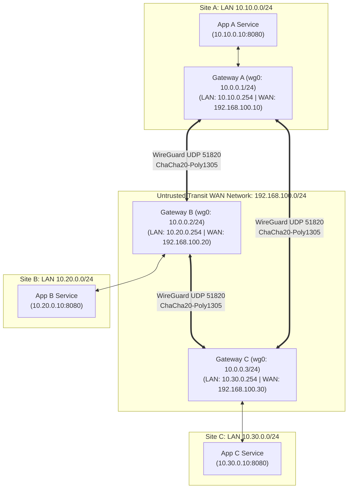

# Mini-Project 06: Site-to-Site WireGuard VPN Mesh

> **Domain**: 02. Networking & Traffic Routing  
> **Level**: Beginner to Intermediate  
> **Infrastructure**: Local (Docker Compose / OrbStack) or Linux VM (`NET_ADMIN` capability)  

---

## 🎯 Overview & Context

In modern Site Reliability Engineering (SRE) and Cloud DevOps, interconnecting geographically distributed data centers, isolated VPC subnets, and edge locations across untrusted transit networks (such as the public Internet) is a fundamental operational requirement.

Traditional VPN solutions like **IPsec (StrongSwan)** and **OpenVPN** often suffer from high configuration complexity, large codebase attack surfaces (OpenVPN has >100,000 lines of code), complex state machines, and significant CPU overhead in userspace packet processing.

**WireGuard** is a next-generation, high-performance, extremely lightweight VPN protocol implemented directly in the Linux kernel (<4,000 lines of code). It replaces traditional cryptographic negotiation with **Cryptokey Routing**, delivering near-line-rate throughput with minimal latency.



### What This Project Delivers

1. **Full 3-Site Mesh Topology**: Gateway A (Site A), Gateway B (Site B), and Gateway C (Site C) are fully interconnected via direct cryptographic tunnels over an untrusted WAN bridge (`192.168.100.0/24`).
2. **True Cross-Subnet End-to-End Routing**: Private backend applications on isolated LAN subnets (`10.10.0.0/24`, `10.20.0.0/24`, `10.30.0.0/24`) communicate transparently across the VPN mesh.
3. **Cryptokey Routing & Kernel Packet Forwarding**: Configured with `AllowedIPs`, Linux kernel IPv4 forwarding (`sysctl net.ipv4.ip_forward=1`), and `iptables` NAT masquerade/forwarding.
4. **Deep Packet Inspection (DPI) & Anti-Leak Validation**: Automated packet sniffing via `tcpdump` on the transit WAN interface confirming 100% ciphertext encryption on UDP port 51820 with zero cleartext payload leakage.
5. **Interactive Web Dashboard & REST APIs**: Built-in visual interface and microservice endpoints (`/api/info`, `/health`, `/api/ping`, `/api/fetch`) for each site.
6. **Automated Test Suite (`vpn_connectivity_test.sh`)**: 29 automated assertions verifying interface states, point-to-point pings, cross-site LAN routing, HTTP REST payloads, cryptographic DPI, and `iperf3` bandwidth throughput.

---

## 🧠 WireGuard Mechanics & Deep-Dive

### 1. Cryptokey Routing

WireGuard's core architectural innovation is **Cryptokey Routing**. In traditional VPNs, routing tables and security associations (SAs) are maintained in separate subsystems. In WireGuard:

- Every peer is identified solely by its **Curve25519 Public Key**.
- Each peer has an associated list of **`AllowedIPs`**.
- When sending an outbound packet into `wg0`:
  1. The kernel inspects the packet's destination IP (e.g., `10.20.0.10`).
  2. WireGuard searches its peer table for a peer whose `AllowedIPs` contains `10.20.0.10`.
  3. The packet is encrypted using that peer's public key and encapsulated in a UDP datagram sent to that peer's `Endpoint` (`192.168.100.20:51820`).
- When receiving an inbound UDP datagram on port 51820:
  1. WireGuard decrypts the payload and verifies cryptographic authentication.
  2. It checks if the internal packet's source IP matches that peer's `AllowedIPs`.
  3. If matched, the decrypted packet enters the local Linux network stack. If not matched, the packet is silently dropped.

```text
+-------------------+-----------------------------------------------------------------+
| WireGuard Element | Purpose & Functionality in Mesh Routing                         |
+-------------------+-----------------------------------------------------------------+
| PrivateKey        | 256-bit base64 Curve25519 secret key used for ECDH exchange.     |
| PublicKey         | Derived Curve25519 public key distributed to peers.             |
| Endpoint          | Public/WAN IP and UDP port where the peer listens (UDP 51820).  |
| AllowedIPs        | IP subnets routed to and accepted from the remote peer.         |
| PersistentKeepalive| Periodic keepalive (e.g. 25s) ensuring stateful NAT stays open. |
+-------------------+-----------------------------------------------------------------+
```

---

### 2. State-of-the-Art Cryptographic Suite

WireGuard avoids cipher agility (which prevents cipher downgrade attacks) and uses modern, high-speed cryptographic primitives:

- **Noise Protocol Framework**: Noise_IK handshake (1-RTT handshake, identity hiding, forward secrecy).
- **Curve25519**: Elliptic-curve Diffie-Hellman (ECDH) key exchange.
- **ChaCha20-Poly1305**: Authenticated Encryption with Associated Data (AEAD).
- **BLAKE2s**: Cryptographic hashing and PRF (faster than SHA-3, secure as SHA-256).
- **SipHash24**: Hash-table lookup keys protecting against hash-flooding DoS.

---

### 3. Packet Encapsulation & MTU Overhead

When an IP packet traverses a WireGuard tunnel, WireGuard adds an outer UDP and IP header:

- IPv4 Header: 20 bytes
- UDP Header: 8 bytes
- WireGuard Encapsulation Header: 32 bytes (Type, Receiver index, Nonce, Poly1305 Auth Tag)
- **Total Overhead**: $20 + 8 + 32 = 60\text{ bytes}$ (or $80\text{ bytes}$ over IPv6).

On a standard Ethernet network with $\text{MTU} = 1500$, the WireGuard interface MTU is set to:

$$\text{MTU}_{\text{wg0}} = 1500 - 60 = 1440\text{ bytes (commonly set to } 1420\text{ bytes for universal safety)}$$

---

## 📂 Project Structure

```text
02-networking/06-wireguard-vpn-mesh/
├── Dockerfile.gateway          # Alpine container for WireGuard Gateway nodes
├── Dockerfile.app              # Alpine/Python container for Site Application services
├── docker-compose.yml          # Multi-network orchestration (4 bridge networks, 6 containers)
├── Makefile                    # Task runner (up, down, status, test, test-encryption, clean)
├── vpn_connectivity_test.sh    # Automated test suite (29 test assertions + DPI + iperf3)
├── .markdownlint.json          # Markdown linting configuration
├── README.md                   # Comprehensive educational documentation
├── app/
│   └── app.py                  # Python REST API & interactive web dashboard
├── config/
│   ├── node-a/
│   │   └── wg0.conf            # WireGuard configuration for Gateway A
│   ├── node-b/
│   │   └── wg0.conf            # WireGuard configuration for Gateway B
│   └── node-c/
│       └── wg0.conf            # WireGuard configuration for Gateway C
└── scripts/
    ├── entrypoint-gateway.sh   # Gateway startup script (wg-quick, sysctl, iptables NAT)
    └── entrypoint-app.sh       # App startup script (static route configuration, app launch)
```

---

## ⚙️ Configuration Walkthrough

### 1. Gateway A Configuration ([config/node-a/wg0.conf](file:///Users/fabian/Documents/CodeProjects/github.com/fabiankaraben/devops-sre-mini-projects/02-networking/06-wireguard-vpn-mesh/config/node-a/wg0.conf))

```ini
[Interface]
Address = 10.0.0.1/24
ListenPort = 51820
PrivateKey = KFoZzaNX8NSSQORZEivU/qAu/SkXU2gDsQuoeAt/qEA=

# Peer 1: Gateway B (Site B)
[Peer]
PublicKey = aoYPrJ8Cgmpabl1dKBZUXPaa/iYXccihkCh+euhOwDQ=
Endpoint = gateway-b:51820
AllowedIPs = 10.0.0.2/32, 10.20.0.0/24
PersistentKeepalive = 25

# Peer 2: Gateway C (Site C)
[Peer]
PublicKey = TLlknGf6Mns0YDZgL6PYDPFXIM6PUDwWL+qG2+D0myc=
Endpoint = gateway-c:51820
AllowedIPs = 10.0.0.3/32, 10.30.0.0/24
PersistentKeepalive = 25
```

- **`Address = 10.0.0.1/24`**: Assigns the IP address of Gateway A on the virtual `wg0` network.
- **`ListenPort = 51820`**: Standard WireGuard UDP listening port on the transit WAN.
- **`AllowedIPs = 10.0.0.2/32, 10.20.0.0/24`**: Directs all traffic destined for Gateway B's tunnel IP (`10.0.0.2`) and Site B's entire LAN subnet (`10.20.0.0/24`) through Peer 1.

---

### 2. Multi-Network Orchestration ([docker-compose.yml](file:///Users/fabian/Documents/CodeProjects/github.com/fabiankaraben/devops-sre-mini-projects/02-networking/06-wireguard-vpn-mesh/docker-compose.yml))

The deployment isolates 4 virtual networks:

```yaml
networks:
  wan-transit:
    name: wg-wan-transit
    driver: bridge
    ipam:
      config:
        - subnet: 192.168.100.0/24

  lan-site-a:
    name: wg-lan-site-a
    driver: bridge
    ipam:
      config:
        - subnet: 10.10.0.0/24

  lan-site-b:
    name: wg-lan-site-b
    driver: bridge
    ipam:
      config:
        - subnet: 10.20.0.0/24

  lan-site-c:
    name: wg-lan-site-c
    driver: bridge
    ipam:
      config:
        - subnet: 10.30.0.0/24
```

---

## 🚀 Execution & Quick Start

### 1. Start the WireGuard VPN Mesh

Build and start all 6 containers across the 4 isolated networks:

```bash
make up
```

*Or using Docker Compose directly:*

```bash
docker compose up -d --build
```

---

### 2. Inspect Active WireGuard Status & Peers

Check the active `wg0` interface and established cryptographic handshakes across all gateways:

```bash
make status
```

Example output:

```text
=== Gateway A (Site A) WireGuard Status ===
interface: wg0
  public key: Rx/VcdTkXGHT1YY04t0aDcDL2/809jHllDWEQ9hSDEQ=
  private key: (hidden)
  listening port: 51820

peer: aoYPrJ8Cgmpabl1dKBZUXPaa/iYXccihkCh+euhOwDQ=
  endpoint: 192.168.100.20:51820
  allowed ips: 10.0.0.2/32, 10.20.0.0/24
  latest handshake: 4 seconds ago
  transfer: 1.24 MiB received, 1.48 MiB sent
  persistent keepalive: every 25 seconds

peer: TLlknGf6Mns0YDZgL6PYDPFXIM6PUDwWL+qG2+D0myc=
  endpoint: 192.168.100.30:51820
  allowed ips: 10.0.0.3/32, 10.30.0.0/24
  latest handshake: 5 seconds ago
  transfer: 890 KiB received, 912 KiB sent
```

---

### 3. Open Interactive Web Dashboards

Each site exposes an interactive status dashboard in your browser:

- **Site A Application**: [http://localhost:8081](http://localhost:8081)
- **Site B Application**: [http://localhost:8082](http://localhost:8082)
- **Site C Application**: [http://localhost:8083](http://localhost:8083)

You can use the built-in UI to trigger real-time cross-site ICMP pings and HTTP fetches directly from your browser.

---

## 🧪 Comprehensive Testing & Validation

### 1. Run Automated Test Suite

Execute the test suite validating handshakes, cross-subnet routing, HTTP REST payloads, encryption DPI, and bandwidth throughput:

```bash
make test
```

For verbose output with diagnostic logs:

```bash
make test-verbose
```

#### Expected Test Suite Output

```text
======================================================================
  🔒 Site-to-Site WireGuard VPN Mesh Automated Test Suite
======================================================================

Topology  : 3-Site Full Mesh (Site A, Site B, Site C)
WAN Bridge: 192.168.100.0/24
Tunnel IPs: 10.0.0.1 (Site A), 10.0.0.2 (Site B), 10.0.0.3 (Site C)
LAN Subnet: 10.10.0.0/24 (A) | 10.20.0.0/24 (B) | 10.30.0.0/24 (C)

▶ 1. Verifying Container Status & Health
----------------------------------------------------------------------
  [ PASS ] Container [wg-gateway-a] is running
  [ PASS ] Container [wg-gateway-b] is running
  [ PASS ] Container [wg-gateway-c] is running
  [ PASS ] Container [wg-app-a] is running
  [ PASS ] Container [wg-app-b] is running
  [ PASS ] Container [wg-app-c] is running

▶ 2. Checking WireGuard Interface Status (wg0) on Gateways
----------------------------------------------------------------------
  [ PASS ] Gateway [wg-gateway-a] wg0 interface active (2 configured peers)
  [ PASS ] Gateway [wg-gateway-b] wg0 interface active (2 configured peers)
  [ PASS ] Gateway [wg-gateway-c] wg0 interface active (2 configured peers)

▶ 3. Point-to-Point Tunnel Ping Across Gateways (10.0.0.X)
----------------------------------------------------------------------
  [ PASS ] Tunnel Ping: Gateway A -> Gateway B (10.0.0.2) (avg RTT: 0.543 ms)
  [ PASS ] Tunnel Ping: Gateway A -> Gateway C (10.0.0.3) (avg RTT: 0.594 ms)
  [ PASS ] Tunnel Ping: Gateway B -> Gateway A (10.0.0.1) (avg RTT: 1.909 ms)
  [ PASS ] Tunnel Ping: Gateway B -> Gateway C (10.0.0.3) (avg RTT: 0.367 ms)
  [ PASS ] Tunnel Ping: Gateway C -> Gateway A (10.0.0.1) (avg RTT: 0.504 ms)
  [ PASS ] Tunnel Ping: Gateway C -> Gateway B (10.0.0.2) (avg RTT: 0.410 ms)

▶ 4. Cross-Subnet End-to-End LAN Ping Across Applications
----------------------------------------------------------------------
  [ PASS ] LAN Ping: App A (10.10.0.10) -> App B (10.20.0.10) (avg RTT: 0.768 ms)
  [ PASS ] LAN Ping: App A (10.10.0.10) -> App C (10.30.0.10) (avg RTT: 1.640 ms)
  [ PASS ] LAN Ping: App B (10.20.0.10) -> App A (10.10.0.10) (avg RTT: 0.510 ms)
  [ PASS ] LAN Ping: App B (10.20.0.10) -> App C (10.30.0.10) (avg RTT: 0.548 ms)
  [ PASS ] LAN Ping: App C (10.30.0.10) -> App A (10.10.0.10) (avg RTT: 0.408 ms)
  [ PASS ] LAN Ping: App C (10.30.0.10) -> App B (10.20.0.10) (avg RTT: 0.481 ms)

▶ 5. Cross-Subnet HTTP REST API Queries via WireGuard Mesh
----------------------------------------------------------------------
  [ PASS ] HTTP Request: App A queries App B metadata
  [ PASS ] HTTP Request: App A queries App C metadata
  [ PASS ] HTTP Request: App B queries App A metadata
  [ PASS ] HTTP Request: App C queries App B metadata
  [ PASS ] HTTP Request: App A queries App B health status

▶ 6. Deep Packet Inspection (DPI) & Anti-Leak Verification on Transit WAN
----------------------------------------------------------------------
Capturing packets on WAN interface (eth1) during cross-site HTTP transfer...
  [ PASS ] Encrypted WireGuard UDP datagrams observed on WAN (13 packets)
  [ PASS ] Zero Plaintext Leakage: No cleartext HTTP or ICMP found on WAN

▶ 7. Encrypted Tunnel Bandwidth Throughput Benchmark (iperf3)
----------------------------------------------------------------------
Running 3-second iperf3 throughput test from App A to App B over WireGuard...
  [ PASS ] WireGuard Tunnel Throughput Benchmark (4156.09 Mbits/sec)

======================================================================
                         TEST SUMMARY REPORT                          
======================================================================
  Total Tests Executed : 29
  Passed Tests         : 29
  Failed Tests         : 0
  Total Duration       : 22s

  🎉 ALL TESTS PASSED! Site-to-Site WireGuard VPN Mesh is healthy.
```

---

### 2. Manual Verification Commands

#### A. Cross-Site End-to-End ICMP Ping

Ping App B (`10.20.0.10`) from App A (`10.10.0.10`):

```bash
docker exec wg-app-a ping -c 3 10.20.0.10
```

#### B. Cross-Site HTTP REST API Query

Query App B metadata from App A:

```bash
docker exec wg-app-a curl -s http://10.20.0.10:8080/api/info
```

Expected JSON response:

```json
{
  "site_name": "Site-B",
  "hostname": "wg-app-b",
  "local_ip": "10.20.0.10",
  "gateway_ip": "10.20.0.254",
  "timestamp": 1724572700.0,
  "uptime_seconds": 120
}
```

---

### 3. Cryptographic Deep Packet Inspection (DPI)

Verify that packets traversing the WAN are 100% WireGuard-encrypted (UDP port 51820):

```bash
make test-encryption
```

---

## 🛠️ SRE Troubleshooting & Diagnostic Playbook

```text
+------------------------------------+---------------------------------------------------------------+
| Symptom                            | Root Cause & Diagnostic / Remediation Steps                   |
+------------------------------------+---------------------------------------------------------------+
| Handshake not establishing         | 1. Run 'docker exec wg-gateway-a wg show'                     |
| ('latest handshake: None')         | 2. Verify Endpoint IP & Port (192.168.100.20:51820).          |
|                                    | 3. Ensure PublicKey on Node A matches PrivateKey on Node B.   |
+------------------------------------+---------------------------------------------------------------+
| Gateway pings succeed, but         | 1. Check 'AllowedIPs' on both sides includes target LAN subnets.|
| App-to-App LAN pings fail          | 2. Verify 'sysctl net.ipv4.ip_forward=1' on both gateways.    |
|                                    | 3. Ensure iptables FORWARD & MASQUERADE rules are active.     |
|                                    | 4. Verify static route in App: 'ip route show'.               |
+------------------------------------+---------------------------------------------------------------+
| Connection hangs on large payloads | MTU mismatch / fragmentation. Reduce wg0 MTU to 1420 or       |
| (SSH / large HTTP responses)       | enable TCP MSS clamping:                                      |
|                                    | 'iptables -t mangle -A FORWARD -p tcp --tcp-flags SYN,RST SYN |
|                                    |  -j TCPMSS --clamp-mss-to-pmtu'                               |
+------------------------------------+---------------------------------------------------------------+
```

---

## 🧹 Teardown & Environment Cleanup

To ensure a completely clean environment for subsequent mini-projects and prevent lingering Docker resources:

### 1. Complete Resource Teardown

Execute the `clean` target in the `Makefile`:

```bash
make clean
```

*Or using Docker Compose directly:*

```bash
docker compose down --rmi all --volumes --remove-orphans
```

### What This Command Removes

- **Containers**: Stops and deletes `wg-gateway-a`, `wg-gateway-b`, `wg-gateway-c`, `wg-app-a`, `wg-app-b`, `wg-app-c`.
- **Networks**: Removes `wg-wan-transit`, `wg-lan-site-a`, `wg-lan-site-b`, `wg-lan-site-c`.
- **Images**: Deletes built images (`06-wireguard-vpn-mesh-gateway-*`, `06-wireguard-vpn-mesh-app-*`).
- **Volumes**: Removes all associated Docker storage volumes and orphaned containers.

### 2. Verify Environment Is Clean

Run these verification commands to ensure zero leftover resources:

```bash
docker ps -a --filter "name=wg-"
docker network ls --filter "name=wg-"
docker images --filter "reference=*wireguard*"
```

All three commands should return empty lists, confirming your workstation is clean.
