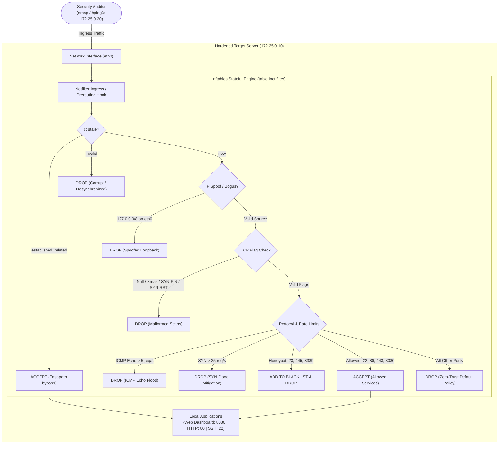

# Mini-Project 07: Linux Firewall Hardening with nftables

> **Domain**: 02. Networking & Traffic Routing  
> **Level**: Beginner to Intermediate  
> **Infrastructure**: Local (Docker Compose / OrbStack) or Linux VM with kernel `NET_ADMIN` capability  

---

## 🎯 Overview & Context

In production Site Reliability Engineering (SRE) and Cloud Infrastructure Security, host-level network defense is the first and last line of defense against network reconnaissance, port scanning, denial-of-service (DoS) attacks, and unauthorized lateral movement.

For decades, Linux relied on legacy tools (`iptables`, `ip6tables`, `arptables`, and `ebtables`). However, these tools suffer from:

- Separate, disjointed codebases and table configurations for IPv4 and IPv6.
- Inefficient linear rule evaluation ($O(N)$ packet lookup overhead).
- Lack of atomic ruleset updates (causing race conditions or packet drops during firewall reloads).

**`nftables`** is the modern Linux kernel packet classification framework that completely supersedes `iptables`:

- It provides a single, unified CLI and configuration syntax for IPv4, IPv6, ARP, and bridge networks via the **`inet` family**.
- It compiles human-readable rules into lightweight **Netfilter Virtual Machine (NVM)** bytecode executed directly in the kernel.
- It provides native support for high-speed **sets**, **dictionaries**, **dynamic meters**, and **named counters**, achieving $O(1)$ lookup performance.
- It enables **atomic, transactional ruleset updates** (`nft -f /etc/nftables.conf`).



### What This Project Delivers

1. **Zero-Trust Default-Drop Policy**: Enforces strict `policy drop` on all ingress (`input`) and routing (`forward`) chains.
2. **Stateful Connection Tracking (`conntrack`)**: Accelerates existing connections (`ct state established,related accept`) and drops desynchronized/corrupted frames (`ct state invalid drop`).
3. **Anti-IP Spoofing & Bogus IP Filtering**: Drops packets arriving on external interfaces claiming loopback (`127.0.0.0/8`), non-routable (`0.0.0.0/8`), or reserved (`240.0.0.0/4`) source IPs.
4. **TCP Flag Anomaly & Port Scan Defenses**: Detects and drops illegal TCP flag combinations used by scanners (TCP Null scans, Xmas Tree scans, SYN-FIN scans, SYN-RST scans).
5. **ICMP Flood & SYN Flood Protection**: Enforces token-bucket rate limiters (`limit rate 5/second burst 10` for ICMP; `limit rate 25/second burst 50` for TCP SYN).
6. **Honeypot Trap with Dynamic IP Blacklisting**: Automatically traps port scanners attempting connections on sensitive honeypot ports (Telnet 23, SMB 445, RDP 3389) and adds their source IP to a dynamic blacklist set with auto-expiry (1-minute timeout).
7. **SRE Named Observability Counters**: Tracks live drop reasons and packet metrics in kernel memory (`cnt_established`, `cnt_bad_flags_drop`, `cnt_icmp_flood_drop`, `cnt_syn_flood_drop`, `cnt_portscan_drop`, `cnt_default_drop`).
8. **Interactive Web Dashboard**: Modern UI with live counter refresh, ruleset viewer, and health indicators.
9. **Automated Security Audit Suite (`firewall_audit.sh`)**: 19 automated assertions executing real-world penetration and scanning tests using `nmap` and `hping3`.

---

## 🧠 Deep-Dive Architecture & nftables Mechanics

### 1. Netfilter Hooks and Packet Traversal Flow

When a network frame arrives at the Linux network interface card (NIC), it traverses the Netfilter kernel subsystem across distinct hook points:

```text
[ Incoming Packet ]
       │
       ▼
 [ Ingress Hook ] (Raw interface filtering before IP defragmentation)
       │
       ▼
[ Prerouting Hook ] (Conntrack & Destination NAT)
       │
       ├──► (Is packet for local host?) ──► [ Input Hook ] (Local Firewall Rules) ──► [ Local Process ]
       │                                                                                     │
       └──► (Is packet for remote host?) ──► [ Forward Hook ] (Routing) ──► [ Postrouting Hook ]
                                                                                   ▲
                                             [ Output Hook ] ──────────────────────┘
                                                    ▲
                                            [ Local Process ]
```

In `nftables`, each chain is explicitly bound to a Netfilter hook with a defined priority (e.g. `type filter hook input priority filter;`).

---

### 2. `nftables` vs Legacy `iptables` Comparison

```text
+---------------------+-----------------------------------+------------------------------------+
| Feature / Concept   | Legacy iptables                   | Modern nftables                    |
+---------------------+-----------------------------------+------------------------------------+
| Protocol Families   | Separate tools (iptables, ip6tables)| Unified 'inet' family (IPv4 + IPv6)|
| Lookup Performance  | Linear evaluation: O(N) rules     | Native Sets & Dictionaries: O(1)   |
| Engine Architecture | Fixed kernel match/target tables  | Netfilter VM executing Bytecode    |
| Ruleset Reloads     | Non-atomic (potential packet loss)| Atomic & Transactional (All or None)|
| Dynamic Blacklists  | Requires ipset daemon/extension   | Native dynamic sets with timeouts  |
| Observability       | Ad-hoc iptables -v -L counters   | Named stateful counters & JSON API |
+---------------------+-----------------------------------+------------------------------------+
```

---

### 3. Stateful Connection Tracking (`conntrack`)

Linux connection tracking assigns a state to every IP packet:

- **`NEW`**: A packet initiating a new connection (e.g., initial TCP SYN).
- **`ESTABLISHED`**: A packet that belongs to an active, two-way connection where traffic has been observed in both directions (e.g., TCP ACK after SYN-ACK).
- **`RELATED`**: A packet that initiates a new connection associated with an existing one (e.g., ICMP error messages, FTP data channels).
- **`INVALID`**: A packet that does not match any known connection state, has corrupted sequence numbers, or violates TCP window scaling.

In `nftables.conf`:

```nftables
# Fast-path: Immediately accept established/related flows without re-evaluating rules
ct state established,related counter name "cnt_established" accept

# Drop invalid packets immediately before wasting CPU on further evaluation
ct state invalid counter name "cnt_invalid_drop" drop
```

---

### 4. TCP Flag Anomaly & Malformed Packet Scanning

Attackers and automated port scanners (like `nmap`) craft non-standard TCP packets to infer firewall policies:

- **TCP Null Scan (`tcp flags == 0x0`)**: Sends packets with no control flags set. Standard RFC 793 states a closed port responds with RST, while an open port silently drops it. Our firewall drops Null packets at the boundary.
- **TCP Xmas Scan (`tcp flags & (fin|psh|urg) == fin|psh|urg`)**: Lights up FIN, PSH, and URG flags like a Christmas tree. Dropped immediately.
- **SYN-FIN Scan (`tcp flags & (syn|fin) == fin|syn`)**: Contains conflicting SYN (open connection) and FIN (close connection) flags. Dropped immediately.
- **SYN-RST Scan (`tcp flags & (syn|rst) == syn|rst`)**: Conflicting SYN and RST flags. Dropped immediately.

---

### 5. Dynamic Port Scan Honeypot & Auto-Blacklisting

Instead of just dropping port scans on unused ports, we trap scanners into an automated dynamic blacklist:

```nftables
set portscan_blacklist {
    type ipv4_addr
    size 65535
    flags dynamic, timeout
    timeout 1m
}

# Trap access to honeypot ports (Telnet 23, SMB 445, RDP 3389)
tcp dport { 23, 445, 3389 } update @portscan_blacklist { ip saddr } counter name "cnt_portscan_drop" drop

# Drop all incoming packets from blacklisted IPs across the entire firewall
ip saddr @portscan_blacklist counter name "cnt_portscan_drop" drop
```

When an attacker probes port 23 (Telnet), their IP address is dynamically added to `@portscan_blacklist` with a 1-minute expiration timer. All subsequent traffic from that IP is dropped instantly at the top of the chain.

---

## 📂 Project Structure

```text
02-networking/07-linux-firewall-nftables-hardening/
├── Dockerfile.server           # Alpine container with nftables, python server, and healthcheck
├── Dockerfile.auditor          # Debian container equipped with nmap, hping3, and security tools
├── docker-compose.yml          # Multi-container orchestration (hardened-server + security-auditor)
├── Makefile                    # Automation task runner (up, down, status, ruleset, audit, clean)
├── firewall_audit.sh           # Automated 19-assertion security testing suite
├── .markdownlint.json          # Markdown linting rules configuration
├── README.md                   # Comprehensive educational guide
├── config/
│   └── nftables.conf           # Production-grade hardened nftables ruleset
├── scripts/
│   ├── entrypoint-server.sh    # Target server startup (applies nftables ruleset and launches app)
│   └── entrypoint-auditor.sh   # Security auditor startup script
└── server/
    └── server.py               # Python HTTP/SSH mock services and live nftables observability API
```

---

## ⚙️ Configuration Walkthrough ([config/nftables.conf](file:///Users/fabian/Documents/CodeProjects/github.com/fabiankaraben/devops-sre-mini-projects/02-networking/07-linux-firewall-nftables-hardening/config/nftables.conf))

```nftables
#!/usr/sbin/nft -f

flush ruleset

table inet filter {
    # Dynamic blacklist for port scanners (1m auto-expiry)
    set portscan_blacklist {
        type ipv4_addr
        size 65535
        flags dynamic, timeout
        timeout 1m
    }

    # Named counters for Prometheus / SRE metrics
    counter cnt_established { }
    counter cnt_invalid_drop { }
    counter cnt_bad_flags_drop { }
    counter cnt_spoofed_drop { }
    counter cnt_icmp_flood_drop { }
    counter cnt_syn_flood_drop { }
    counter cnt_portscan_drop { }
    counter cnt_default_drop { }

    chain input {
        type filter hook input priority filter; policy drop;

        # 1. Allow local loopback traffic
        iifname "lo" accept

        # 2. Block dynamically blacklisted port scanners
        ip saddr @portscan_blacklist counter name "cnt_portscan_drop" drop

        # 3. Rate-limit ICMP echo requests (5/sec, burst 10)
        ip protocol icmp icmp type echo-request limit rate 5/second burst 10 packets accept
        ip protocol icmp icmp type echo-request counter name "cnt_icmp_flood_drop" drop

        # 4. Accept established and related stateful connections
        ct state established,related counter name "cnt_established" accept

        # 5. Drop invalid state packets
        ct state invalid counter name "cnt_invalid_drop" drop

        # 6. Anti-Spoofing: Drop bogus source IPs on external interface
        iifname != "lo" ip saddr { 0.0.0.0/8, 127.0.0.0/8, 240.0.0.0/4 } counter name "cnt_spoofed_drop" drop

        # 7. TCP Flag Anomaly Defenses (Null, Xmas, SYN-FIN, SYN-RST)
        tcp flags == 0x0 counter name "cnt_bad_flags_drop" drop
        tcp flags & (fin | psh | urg) == fin | psh | urg counter name "cnt_bad_flags_drop" drop
        tcp flags & (fin | syn) == fin | syn counter name "cnt_bad_flags_drop" drop
        tcp flags & (syn | rst) == syn | rst counter name "cnt_bad_flags_drop" drop
        tcp flags & (fin | syn | rst | psh | ack | urg) == fin counter name "cnt_bad_flags_drop" drop

        # 8. Honeypot Ports: Trap active port scanners
        tcp dport { 23, 445, 3389 } update @portscan_blacklist { ip saddr } counter name "cnt_portscan_drop" drop

        # 9. Ingress Rate Limiting: SYN Flood Mitigation on Web Ports
        tcp dport { 80, 443, 8080 } tcp flags syn limit rate 25/second burst 50 packets accept
        tcp dport { 80, 443, 8080 } tcp flags syn counter name "cnt_syn_flood_drop" drop

        # 10. Whitelisted Production Service Ports
        tcp dport { 22, 80, 443, 8080 } accept

        # 11. Catch-All Default Drop Counter
        counter name "cnt_default_drop" drop
    }

    chain forward {
        type filter hook forward priority filter; policy drop;
    }

    chain output {
        type filter hook output priority filter; policy accept;
    }
}
```

---

## 🚀 Execution & Quick Start

### 1. Build and Start the Firewall Environment

Spin up the `hardened-server` and `security-auditor` containers on the isolated bridge network (`172.25.0.0/24`):

```bash
make up
```

*Or using Docker Compose directly:*

```bash
docker compose up -d --build
```

---

### 2. Inspect Active Firewall Rules & Counters

View live packet and drop counters tracked by `nftables`:

```bash
make status
```

Example output:

```text
=== Active nftables SRE Observability Counters ===
    counter cnt_established {
        packets 184 bytes 14520
    }
    counter cnt_invalid_drop {
        packets 0 bytes 0
    }
    counter cnt_bad_flags_drop {
        packets 6 bytes 320
    }
    counter cnt_spoofed_drop {
        packets 0 bytes 0
    }
    counter cnt_icmp_flood_drop {
        packets 28 bytes 784
    }
    counter cnt_syn_flood_drop {
        packets 70 bytes 4200
    }
    counter cnt_portscan_drop {
        packets 12 bytes 720
    }
    counter cnt_default_drop {
        packets 6 bytes 360
    }
```

To view the complete active ruleset:

```bash
make ruleset
```

---

### 3. Open Interactive Web Dashboard

Navigate to [http://localhost:8085](http://localhost:8085) in your web browser to open the **Linux Firewall Hardening Dashboard**:

- View live packet drop charts and counter statistics in real time.
- Inspect the active `/etc/nftables.conf` ruleset directly from the browser.
- Monitor real-time status as penetration tests are executed.

---

## 🧪 Comprehensive Security Auditing & Testing

### 1. Run the Automated Audit Suite

Execute the automated test suite (`19 security assertions`) running `nmap` and `hping3` from the auditor container:

```bash
make audit
```

For verbose output with complete diagnostic details:

```bash
make audit-verbose
```

#### Expected Audit Output

```text
======================================================================
  🛡️ Linux Firewall Hardening (nftables) Security Audit Suite
======================================================================

Target Server    : 172.25.0.10 (nftables-server)
Auditor Node     : nftables-auditor
Audit Tools      : nmap, hping3, curl, python3, tcpdump

▶ 1. Target Server & Auditor Health Verification
----------------------------------------------------------------------
  [ PASS ] Container [nftables-server] is running and healthy
  [ PASS ] Container [nftables-auditor] is running and healthy

▶ 2. Whitelisted Ingress Services Verification
----------------------------------------------------------------------
  [ PASS ] HTTP Ingress (:8080/health) accessible
  [ PASS ] HTTP Production Ingress (:80) accessible
  [ PASS ] SSH Ingress (:22) accessible (SSH Banner verified)

▶ 3. Stealth Mode & Closed Ports Port-Scan Audit (nmap -sS)
----------------------------------------------------------------------
Scanning closed ports (21, 25, 3306, 5432, 6379, 8088)...
  [ PASS ] Stealth Mode: Closed ports silently dropped (6/6 filtered, 0 open/closed RST)
  [ PASS ] Port Scan: Legitimate ports (22, 80, 8080) reported as open

▶ 4. Malformed Packet Scan Defenses (Null, FIN, Xmas Trees)
----------------------------------------------------------------------
  [ PASS ] TCP Null Scan (-sN) defense: Malformed packets dropped
  [ PASS ] TCP FIN Scan (-sF) defense: Malformed packets dropped
  [ PASS ] TCP Xmas Scan (-sX) defense: Malformed packets dropped

▶ 5. ICMP Echo Request Rate Limiting Audit
----------------------------------------------------------------------
  [ PASS ] Normal ICMP ping (1 req/s) accepted (0% loss)
Transmitting 40-packet high-frequency ICMP burst to trigger rate limit...
  [ PASS ] ICMP Flood Rate Limiter triggered (73% packet loss)

▶ 6. SYN Flood Attack Defense & Service Availability
----------------------------------------------------------------------
Launching SYN packet burst with hping3 while validating web availability...
  [ PASS ] Service Availability: Web server responded HTTP 200 during SYN flood
  [ PASS ] SYN Flood Ingress Drops registered in firewall counters

▶ 7. Port-Scan Honeypot & Dynamic Blacklist Trap
----------------------------------------------------------------------
Hitting honeypot port (Telnet :23) to trigger dynamic firewall blacklist...
  [ PASS ] Honeypot Trap: Auditor IP (172.25.0.20) dynamically added to blacklist

▶ 8. nftables SRE Observability & Packet Counters Inspection
----------------------------------------------------------------------
  [ PASS ] Named counter [cnt_established] present and tracking packets
  [ PASS ] Named counter [cnt_bad_flags_drop] present and tracking packets
  [ PASS ] Named counter [cnt_icmp_flood_drop] present and tracking packets
  [ PASS ] Named counter [cnt_default_drop] present and tracking packets

======================================================================
                         AUDIT SUMMARY REPORT                         
======================================================================
  Total Tests Executed : 19
  Passed Tests         : 19
  Failed Tests         : 0
  Total Duration       : 13s

  🎉 ALL FIREWALL AUDIT CHECKS PASSED! Ruleset is hardened.
```

---

### 2. Manual Verification Commands

You can execute individual penetration and scanning commands from the `nftables-auditor` container:

#### A. TCP Stealth SYN Scan (Stealth Mode Verification)

```bash
docker exec nftables-auditor nmap -sS -Pn -p 21,22,23,80,3306,8080 172.25.0.10
```

*Expected Result:* Ports 22, 80, 8080 are `open`; ports 21, 23, 3306 are `filtered` (stealthily dropped with zero RST packets).

#### B. TCP Xmas Tree Scan

```bash
docker exec nftables-auditor nmap -sX -Pn -p 80,8080 172.25.0.10
```

*Expected Result:* All scanned ports return `open|filtered` (dropped silently by the bad TCP flags rule).

#### C. ICMP Flood Attack Simulation

```bash
docker exec nftables-auditor hping3 -1 -c 40 -i u10000 172.25.0.10
```

*Expected Result:* >70% packet loss as the rate limiter allows the initial burst and drops sustained flood packets.

#### D. TCP SYN Flood Attack Simulation

```bash
docker exec nftables-auditor hping3 -S -p 8080 -c 100 -i u2000 172.25.0.10
```

*Expected Result:* Web server continues serving legitimate traffic while firewall counters register dropped SYN packets.

---

## 🛠️ SRE Troubleshooting & Diagnostic Playbook

```text
+------------------------------------+---------------------------------------------------------------+
| Issue / Symptom                    | Root Cause & Remediation Steps                                |
+------------------------------------+---------------------------------------------------------------+
| nft command fails:                 | Container requires kernel network administration capability.  |
| 'Could not process rule:           | Ensure 'cap_add: [NET_ADMIN]' is present in docker-compose.   |
|  Operation not permitted'          |                                                               |
+------------------------------------+---------------------------------------------------------------+
| Legitimate SSH / Web client        | Client IP was trapped by a honeypot port (e.g. port 23/445).  |
| gets blocked / drops               | Inspect blacklist:                                            |
|                                    | 'nft list set inet filter portscan_blacklist'                 |
|                                    | Flush blacklist:                                              |
|                                    | 'nft flush set inet filter portscan_blacklist'                |
+------------------------------------+---------------------------------------------------------------+
| High CPU during high traffic       | Ensure 'ct state established,related accept' rule is at the   |
| spikes                             | top of the input chain to bypass full rule evaluation for    |
|                                    | existing connections.                                         |
+------------------------------------+---------------------------------------------------------------+
| Syntax error when testing rules    | Check ruleset without applying:                               |
|                                    | 'nft -c -f /config/nftables.conf'                             |
+------------------------------------+---------------------------------------------------------------+
```

---

## 🧹 Teardown & Environment Cleanup

To ensure a completely clean environment for subsequent mini-projects and prevent lingering Docker resources:

### 1. Complete Resource Teardown

Execute the `clean` target in the `Makefile`:

```bash
make clean
```

*Or using Docker Compose directly:*

```bash
docker compose down --rmi all --volumes --remove-orphans
```

### What This Command Removes

- **Containers**: Stops and deletes `nftables-server` and `nftables-auditor`.
- **Networks**: Removes the virtual bridge network `nftables-firewall-net`.
- **Images**: Deletes built images (`07-linux-firewall-nftables-hardening-hardened-server`, `07-linux-firewall-nftables-hardening-security-auditor`).
- **Volumes**: Removes all associated Docker storage volumes and temporary build artifacts.

### 2. Verify Environment Is Clean

Run these verification commands to ensure zero leftover resources:

```bash
docker ps -a --filter "name=nftables-"
docker network ls --filter "name=nftables-"
docker images --filter "reference=*nftables-hardening*"
```

All three commands should return empty lists, confirming your workstation is clean.
