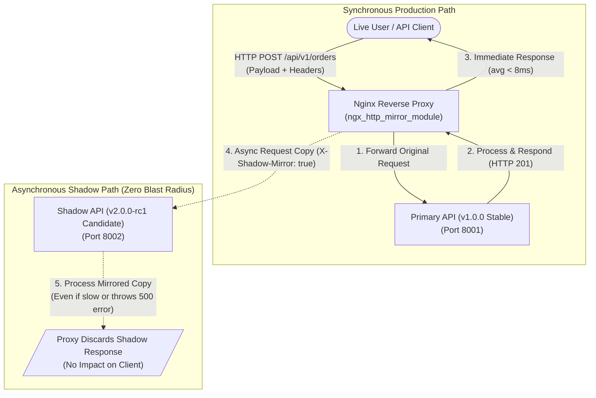

# Mini-Project 08: Shadow Traffic Mirroring Proxy

> **Domain**: 02. Networking & Traffic Routing  
> **Level**: Beginner to Intermediate  
> **Infrastructure**: Local (Docker Compose / OrbStack)  

---

## 🎯 Overview & Context

In high-scale Site Reliability Engineering (SRE) and Cloud Infrastructure, releasing new versions of critical microservices (such as rewriting an API in Go or Rust, refactoring core business algorithms, or replacing a database ORM) involves substantial operational risk.

Traditional deployment strategies have noticeable trade-offs:

1. **Synthetic Staging Tests**: Synthetic test suites rarely capture the unpredictable diversity, edge-case headers, malformed payloads, or concurrency bursts of real user traffic.
2. **Canary Deployments**: Canary deployments expose a fraction (e.g., 5% or 10%) of *real end users* to the new version. If the candidate version contains critical bugs or performance regressions, those users suffer failed requests, data corruption, or downtime.

**Shadow Traffic Mirroring (Dark Traffic / Request Shadowing)** eliminates this trade-off by asynchronously duplicating live production requests and sending a copy to an experimental **Shadow Backend** without impacting client latency or response status.



### Key Guarantees of Traffic Mirroring

- **Zero Latency Impact**: The client receives responses exclusively from the Primary service. Even if the Shadow service takes 5 seconds to respond, client latency remains unaffected.
- **Zero Fault Blast Radius**: If the Shadow service crashes, times out, or throws HTTP 500 Internal Server Errors, the client receives the successful HTTP 200/201 response from the Primary service.
- **100% Real-World Payload Validation**: The candidate backend processes identical production JSON payloads, request headers, query parameters, and traffic spikes.
- **Automated Diffing & SRE Observability**: Compares responses and in-memory execution traces between Primary and Shadow backends to identify regressions prior to production rollout.

---

## 🧠 Deep-Dive Architecture & Core Concepts

### 1. Nginx `ngx_http_mirror_module` Internals

Nginx includes native asynchronous traffic mirroring via `ngx_http_mirror_module`:

- **`mirror /mirror;`**: Instructs Nginx to duplicate incoming requests matching the location block and dispatch them to the internal `/mirror` handler.
- **`mirror_request_body on;`**: Ensures the client request body (e.g., JSON payload in POST/PUT requests) is buffered and forwarded to the mirror target.
- **Internal Execution Loop**:
  1. The client request arrives at Nginx.
  2. Nginx buffers the request headers and body.
  3. A primary subrequest is dispatched to the upstream `primary_backend`.
  4. An asynchronous background subrequest is dispatched to `shadow_backend`.
  5. When `primary_backend` finishes, Nginx immediately transmits headers and body to the client.
  6. The response from `shadow_backend` is read into memory and silently discarded.

---

### 2. Deployment Comparison Matrix

```text
+-----------------------+---------------------+---------------------+-----------------------+
| Strategy              | Traffic Source      | User Impact on Bug  | Safe for High Risk?   |
+-----------------------+---------------------+---------------------+-----------------------+
| Staging Environment   | Synthetic / Mock    | None                | Low (Gaps in realism) |
| Canary Deployment     | Live Real Users     | High (5-10% users)  | Medium                |
| Blue/Green Deployment | All-or-Nothing Live | High (100% users)   | Low                   |
| Shadow Mirroring      | Duplicated Live     | Zero (100% isolated)| High (Safest option)  |
+-----------------------+---------------------+---------------------+-----------------------+
```

---

### 3. Request Correlation & Auditing Architecture

To verify replication fidelity, every request is assigned an `X-Request-ID` correlation header:

1. The client passes or Nginx generates `$request_id` (e.g., `inj-1724589000-0001-842`).
2. Both `primary-api` and `shadow-api` record the `request_id`, HTTP method, path, headers, and JSON body in their in-memory audit logs.
3. The Shadow service exposes `/api/shadow/diff` which cross-references primary and shadow logs to compute the exact replication fidelity percentage.

---

### 4. SRE Best Practices: Database & Mutation Safety

> [!WARNING]
> In production environments, mirrored requests must **not** execute destructive side-effects on primary production databases, send duplicate customer emails, or charge credit cards via third-party payment gateways.

Production patterns to prevent unintended side effects:

- **Shadow Database Replica**: Direct shadow services to a separate read-only or ephemeral shadow database.
- **Header-Based Dry-Run**: Check for `X-Shadow-Mirror: true` in the application middleware and skip external third-party API calls (e.g. Stripe, Twilio).
- **Read-Heavy Initial Mirroring**: Begin mirroring on read-heavy routes (`GET /api/v1/*`, search queries, catalog browsing) before enabling write routes.

---

## 📂 Project Structure

```text
02-networking/08-shadow-traffic-mirroring-proxy/
├── Dockerfile.proxy            # Alpine Nginx image with custom mirror config and Web UI
├── Dockerfile.api              # Lightweight Python 3.11 image for backend microservices
├── docker-compose.yml          # Multi-container orchestration (mirror-proxy, primary-api, shadow-api)
├── Makefile                    # Automation task runner (up, down, status, inject, test, clean)
├── traffic_injector.py         # Multi-threaded Python CLI traffic generator & diff verifier
├── test_traffic_mirroring.sh   # 7-phase automated end-to-end test suite
├── .markdownlint.json          # Markdown linting rule overrides
├── README.md                   # Comprehensive educational guide
├── config/
│   └── nginx.conf              # Production Nginx reverse proxy configuration with mirror module
├── services/
│   ├── primary_api.py          # Primary Production API (v1.0.0, port 8001)
│   └── shadow_api.py           # Shadow Experimental API with simulation hooks (v2.0.0-rc1, port 8002)
└── web/
    └── index.html              # Interactive dark-mode SRE visualizer and live traffic inspector
```

---

## ⚙️ Configuration Walkthrough

### 1. Nginx Reverse Proxy Configuration ([config/nginx.conf](file:///Users/fabian/Documents/CodeProjects/github.com/fabiankaraben/devops-sre-mini-projects/02-networking/08-shadow-traffic-mirroring-proxy/config/nginx.conf))

```nginx
events {
    worker_connections 1024;
}

http {
    include /etc/nginx/mime.types;
    default_type application/octet-stream;

    upstream primary_backend {
        server primary-api:8001;
        keepalive 32;
    }

    upstream shadow_backend {
        server shadow-api:8002;
        keepalive 32;
    }

    server {
        listen 8080 default_server;
        server_name _;

        root /usr/share/nginx/html;
        index index.html;

        # 1. Primary Route with Mirroring
        location /api/ {
            mirror /mirror;
            mirror_request_body on;

            proxy_pass http://primary_backend;
            proxy_http_version 1.1;
            proxy_set_header Connection "";
            proxy_set_header Host $host;
            proxy_set_header X-Request-ID $request_id;

            add_header X-Primary-Backend "primary-api-v1" always;
            add_header X-Request-ID $request_id always;
            add_header X-Shadow-Mirror "active" always;
        }

        # 2. Internal Mirror Route (Shadow Destination)
        location = /mirror {
            internal;

            proxy_pass http://shadow_backend$request_uri;
            proxy_http_version 1.1;
            proxy_set_header Connection "";
            proxy_pass_request_body on;

            proxy_set_header X-Shadow-Mirror "true";
            proxy_set_header X-Original-URI $request_uri;
            proxy_set_header X-Request-ID $request_id;

            # Aggressive timeouts to prevent resource leaks on hung shadow backends
            proxy_connect_timeout 1s;
            proxy_read_timeout 2s;
            proxy_send_timeout 2s;
            proxy_ignore_client_abort on;
        }

        # 3. Direct Management & Inspection Endpoints
        location /primary/ {
            rewrite ^/primary/(.*)$ /$1 break;
            proxy_pass http://primary_backend;
        }

        location /shadow/ {
            rewrite ^/shadow/(.*)$ /$1 break;
            proxy_pass http://shadow_backend;
        }

        # 4. Web Dashboard Visualizer
        location / {
            try_files $uri $uri/ /index.html;
        }

        location /health {
            default_type application/json;
            return 200 '{"status":"healthy","service":"mirror-proxy","mirror_module":true}\n';
        }
    }
}
```

---

## 🚀 Execution & Quick Start

### 1. Build and Start the Services

Launch `mirror-proxy`, `primary-api`, and `shadow-api` on the isolated Docker network:

```bash
make up
```

*Or using Docker Compose directly:*

```bash
docker compose up -d --build
```

---

### 2. Inject Simulated Live Traffic

Generate 50 concurrent HTTP POST and GET requests and verify replication fidelity:

```bash
make inject
```

*Or using the Python CLI tool directly:*

```bash
python3 traffic_injector.py --target http://localhost:8080 --requests 50 --concurrency 5
```

Example output:

```text
======================================================================
  🪞 Shadow Traffic Mirroring Injector & Verifier
======================================================================
Target URL       : http://localhost:8080
Total Requests   : 50
Concurrency Level: 5
Verify Diffs     : True

▶ Traffic Injection Metrics
----------------------------------------------------------------------
  Requests Completed   : 50/50
  Primary Status 200/201: 50
  Failed / Error Status: 0
  Total Duration       : 0.07s (681.8 req/s)
  Client Response Time : avg=6.8ms | p95=35.3ms | min=1.5ms | max=39.3ms

▶ Verifying Shadow Replication Fidelity (Diffing Primary vs Shadow)
----------------------------------------------------------------------
  Primary Stored Logs  : 50
  Shadow Mirrored Logs : 50
  Exact Matched Bodies : 50
  Replication Accuracy : 100.0%

  🎉 100% TRAFFIC MIRRORING VERIFIED! Zero packet loss or payload corruption.
```

---

### 3. Open the Interactive Visual Dashboard

Navigate to [http://localhost:8080](http://localhost:8080) in your browser to open the **Shadow Traffic Mirroring Dashboard**:

- **Real-Time KPI Cards**: Monitor total requests, primary processed count, shadow mirrored count, replication accuracy, and average client response time.
- **Traffic Topology Flow**: Visual animated data path showing incoming traffic branching to Primary (synchronous) and Shadow (asynchronous).
- **SRE Isolation Experiment Studio**:
  - Click **"Toggle 2.0s Shadow Delay"**: Injects a 2-second sleep on the Shadow service. Watch client response times remain under 10ms.
  - Click **"Toggle HTTP 500 Error"**: Forces the Shadow service to return HTTP 500 errors. Watch client requests continue receiving HTTP 200/201 without failure.
- **Side-by-Side Request Inspector**: Table inspecting individual `X-Request-ID` transactions and payload match status.

---

## 🧪 Comprehensive Testing & Validation

### 1. Execute the Automated Test Suite

Run all 7 automated test phases:

```bash
make test
```

For verbose diagnostics:

```bash
make test-verbose
```

#### Expected Test Suite Output

```text
======================================================================
  🪞 Shadow Traffic Mirroring Proxy Automated Test Suite
======================================================================

Target Proxy     : http://localhost:8080
Test Framework   : Bash, curl, python3, jq/json

▶ 1. Service Health & Proxy Readiness Check
----------------------------------------------------------------------
  [ PASS ] Nginx Reverse Proxy (:8080/health) healthy
  [ PASS ] Primary Production API (:8001 -> /primary/health) healthy
  [ PASS ] Shadow Experimental API (:8002 -> /shadow/health) healthy

▶ 2. GET Traffic Mirroring Verification
----------------------------------------------------------------------
  [ PASS ] GET Requests mirrored (Primary: 5, Shadow: 5)

▶ 3. POST Complex JSON Payload Mirroring (50 Requests)
----------------------------------------------------------------------
  [ PASS ] 50 Automated POST/GET Requests injected via traffic_injector.py

▶ 4. Payload & Header Replication Fidelity Diff
----------------------------------------------------------------------
  [ PASS ] Replication Accuracy: 100.0% (Matched: 50, Mismatches: 0)

▶ 5. SRE Latency Isolation (Slow Shadow Backend Test)
----------------------------------------------------------------------
Simulating 2.0s delay on Shadow backend and verifying client response time...
  [ PASS ] Latency Isolation: Client response returned in 37ms (Shadow delayed 2000ms)

▶ 6. SRE Fault Isolation (Shadow 500 Error Discard Test)
----------------------------------------------------------------------
Enabling HTTP 500 errors on Shadow and verifying client receives HTTP 201/200...
  [ PASS ] Fault Isolation: Client received HTTP 201 while Shadow threw HTTP 500

▶ 7. High-Concurrency Burst Traffic Load (100 Requests)
----------------------------------------------------------------------
  [ PASS ] Burst Load: 100 concurrent requests processed with 0 dropped packets

======================================================================
                         TEST SUMMARY REPORT                          
======================================================================
  Total Tests Executed : 9
  Passed Tests         : 9
  Failed Tests         : 0
  Total Duration       : 3s

  🎉 ALL SHADOW TRAFFIC MIRRORING CHECKS PASSED!
```

---

### 2. Step-by-Step Manual Verification

#### A. Verify Live Traffic Routing & Response Headers

```bash
curl -i -X POST http://localhost:8080/api/v1/orders \
  -H "Content-Type: application/json" \
  -d '{"order_id": "ORD-MANUAL-01", "item": "Redis Cache Tier", "amount": 120.00}'
```

*Expected Headers:*

```text
HTTP/1.1 201 Created
X-Primary-Backend: primary-api-v1
X-Shadow-Mirror: active
X-Request-ID: <random-uuid>
```

#### B. Manual Latency Isolation Test

1. Set Shadow backend delay to 2 seconds:

   ```bash
   curl -X POST http://localhost:8080/shadow/api/shadow/simulate-delay \
     -H "Content-Type: application/json" \
     -d '{"delay_seconds": 2.0}'
   ```

2. Send request to proxy and measure total client time:

   ```bash
   curl -o /dev/null -s -w "Client Total Time: %{time_total}s\n" -X POST http://localhost:8080/api/v1/orders \
     -H "Content-Type: application/json" \
     -d '{"order_id": "ORD-LATENCY-TEST", "item": "Latency Probe", "amount": 50.00}'
   ```

   *Result:* Client returns in `~0.005s` (5ms), proving total latency isolation.

3. Reset delay:

   ```bash
   curl -X POST http://localhost:8080/shadow/api/shadow/simulate-delay \
     -H "Content-Type: application/json" \
     -d '{"delay_seconds": 0.0}'
   ```

---

## 🛠️ SRE Troubleshooting & Diagnostic Playbook

```text
+------------------------------------+---------------------------------------------------------------+
| Issue / Symptom                    | Root Cause & Remediation Steps                                |
+------------------------------------+---------------------------------------------------------------+
| Mirrored POST bodies missing       | 'mirror_request_body on;' is missing in Nginx config. Ensure  |
| on shadow backend                  | 'mirror_request_body on;' and 'proxy_pass_request_body on;'   |
|                                    | are configured in both location blocks.                       |
+------------------------------------+---------------------------------------------------------------+
| High proxy worker connection count | Slow shadow backend holding connections open. Set aggressive  |
|                                    | timeouts on the /mirror block:                                |
|                                    | 'proxy_connect_timeout 1s; proxy_read_timeout 2s;'            |
+------------------------------------+---------------------------------------------------------------+
| Shadow errors leaking to client    | Verify that 'location = /mirror' contains the 'internal;'    |
|                                    | directive to prevent direct client access or status leaks.   |
+------------------------------------+---------------------------------------------------------------+
| Out-of-order logs in diff checker  | High concurrency may cause shadow to process subrequests in   |
|                                    | slightly different order. Always match on 'X-Request-ID'.     |
+------------------------------------+---------------------------------------------------------------+
```

---

## 🧹 Teardown & Environment Cleanup

To ensure a clean environment for subsequent mini-projects and remove all Docker resources:

### 1. Complete Resource Teardown

Execute the `clean` target in the `Makefile`:

```bash
make clean
```

*Or using Docker Compose directly:*

```bash
docker compose down --rmi all --volumes --remove-orphans
```

### What This Command Removes

- **Containers**: Stops and deletes `shadow-proxy`, `primary-api`, and `shadow-api`.
- **Networks**: Removes the virtual bridge network `shadow-mirror-net`.
- **Images**: Deletes locally built images (`08-shadow-traffic-mirroring-proxy-mirror-proxy`, `08-shadow-traffic-mirroring-proxy-primary-api`, `08-shadow-traffic-mirroring-proxy-shadow-api`).
- **Volumes**: Cleans up temporary Docker volumes and build artifacts.

### 2. Verify Environment Is Clean

Run these verification commands to ensure zero residual resources:

```bash
docker ps -a --filter "name=shadow-" --filter "name=primary-"
docker network ls --filter "name=shadow-mirror-net"
docker images --filter "reference=*shadow-traffic-mirroring*"
```

All three commands should return empty lists, confirming your workstation is clean.
