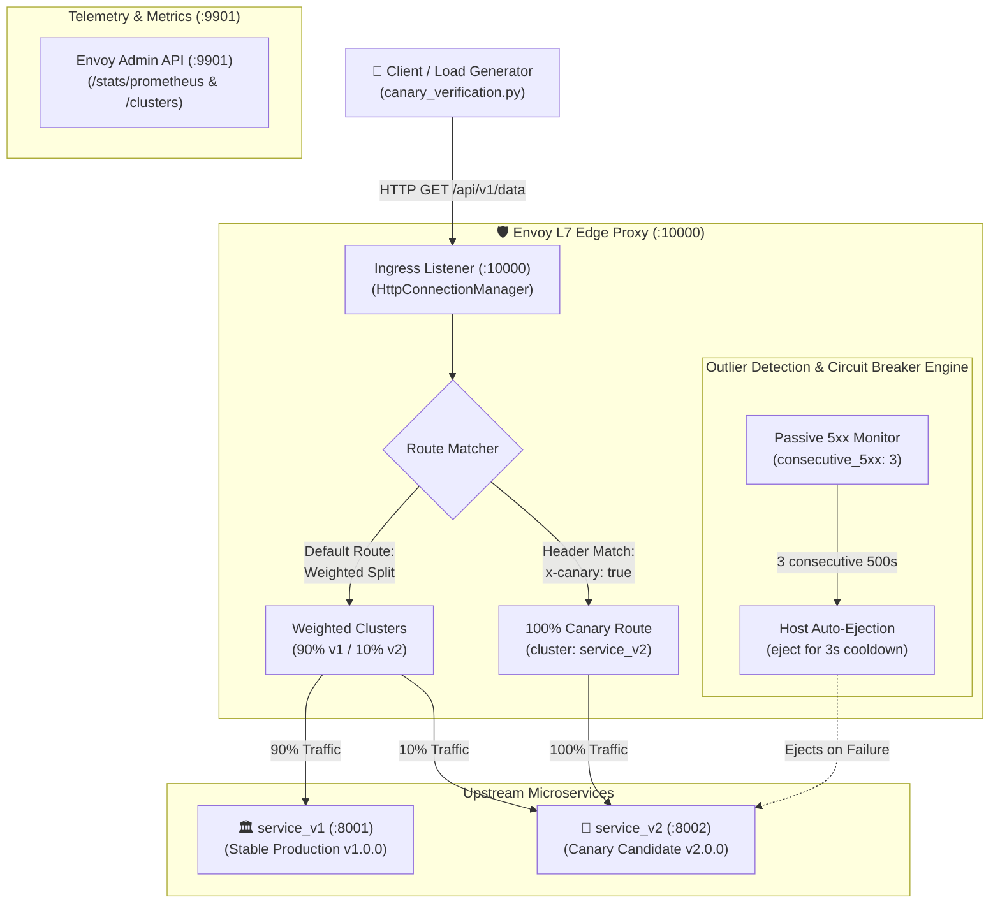

# Mini-Project 10: Envoy L7 Canary Router and Circuit Breaker

> **Domain**: 02. Networking & Traffic Routing  
> **Level**: Beginner to Intermediate  
> **Infrastructure**: Local (Docker Compose / OrbStack) running Envoy v1.31 + Python microservices  

---

## 🎯 Overview & Context

In modern cloud-native architectures (such as Kubernetes, Istio Service Mesh, and Envoy Gateway), deploying software updates directly to 100% of production users presents significant availability risk. If an unhandled regression or performance bottleneck slips through CI/CD, the entire user base experiences downtime.

A **Canary Release** mitigates this blast radius by routing a small percentage of live production traffic (e.g., 10%) to a newly deployed version (`v2.0.0-canary`) while 90% of traffic continues to hit the proven stable version (`v1.0.0`).

Furthermore, an intelligent edge proxy must provide **self-healing resilience**:

1. **Targeted Overrides**: Developers, automated QA tests, and internal beta testers can force routing to the canary version using custom request headers (`x-canary: true`).
2. **Circuit Breaking & Outlier Detection**: If the canary release fails or returns consecutive `5xx` errors, the proxy automatically **ejects** the faulty canary backend from the active load-balancing pool and seamlessly fails over 100% of traffic back to the healthy stable backend.



### What This Project Delivers

1. **Envoy Proxy v1.31 L7 Edge Router**: Configured with weighted clusters, header matches, circuit breaking connection pools, and passive outlier detection.
2. **Weighted Traffic Shifting (90/10)**: Statistically verified 90% distribution to `service_v1` and 10% to `service_v2`.
3. **Header-Based Canary Override**: Requests passing `x-canary: true` route 100% to `service_v2`.
4. **Outlier Detection Circuit Breaking**: Automatically ejects `service_v2` after 3 consecutive `500` errors, protecting clients with zero-downtime failover to `service_v1`.
5. **Interactive Web Dashboard**: Dark-mode dashboard on port 8080 with live traffic split gauges, header injection buttons, and one-click canary outage simulation.
6. **Statistical Load Verification Tool (`canary_verification.py`)**: Multi-threaded load tester dispatching 1,000 requests to measure distribution tolerance and assert circuit breaker ejections.
7. **Automated Test Suite (`test_canary_routing.sh`)**: 9 automated assertions covering health checks, header matching, 90/10 splitting, outlier detection ejections, and Prometheus metrics.

---

## 🧠 Deep-Dive Architecture & Core Concepts

### 1. Layer 7 Weighted Canary Traffic Shifting

Unlike Layer 4 load balancers that distribute raw TCP streams, Envoy operates at Layer 7 (HTTP application layer). It parses HTTP request headers, paths, and methods to apply granular routing policies:

```yaml
- match:
    prefix: "/api/"
  route:
    weighted_clusters:
      clusters:
      - name: service_v1
        weight: 90
      - name: service_v2
        weight: 10
    timeout: 5s
    retry_policy:
      retry_on: "5xx,connect-failure,refused-stream"
      num_retries: 3
```

- **`weight: 90` vs `weight: 10`**: Envoy normalizes cluster weights (`90 + 10 = 100`). Each incoming request without override headers has a 90% mathematical probability of reaching `service_v1` and a 10% probability of reaching `service_v2`.
- **`retry_policy`**: If a selected upstream cluster returns a transient `5xx` or connection error, Envoy automatically retries the request against alternative healthy upstreams.

---

### 2. Header-Based Canary Overrides

For targeted integration testing, internal QA teams need deterministic access to the canary release without relying on random 10% chance.

In Envoy, route evaluation is top-down (first match wins). Placing the header match route *before* the weighted route guarantees deterministic evaluation:

```yaml
- match:
    prefix: "/api/"
    headers:
    - name: "x-canary"
      string_match:
        exact: "true"
  route:
    cluster: service_v2
    timeout: 5s
  response_headers_to_add:
  - header:
      key: "x-envoy-routing-rule"
      value: "header-canary-override"
```

---

### 3. Outlier Detection (Passive Health Checking)

Active health checking (polling `/health` every few seconds) introduces network overhead and can fail to detect errors that only occur during specific real-world user queries.

Envoy's **Outlier Detection** provides passive health checking by monitoring real user traffic:

```yaml
outlier_detection:
  consecutive_5xx: 3
  interval: 1s
  base_ejection_time: 3s
  max_ejection_time: 4s
  max_ejection_percent: 100
  enforcing_consecutive_5xx: 100
```

- **`consecutive_5xx: 3`**: If an upstream host returns 3 consecutive HTTP 500/502/503/504 status codes, Envoy flags the host as unhealthy.
- **`interval: 1s`**: Outlier evaluation sweep occurs once per second.
- **`base_ejection_time: 3s`**: The faulty host is ejected from the load-balancing pool for a minimum of 3 seconds.
- **`max_ejection_percent: 100`**: Allows all hosts in the canary cluster to be ejected so 100% of traffic falls back to the stable cluster.

---

### 4. Panic Threshold & Failover

In standard Envoy configuration, if 100% of hosts in a cluster are ejected, Envoy triggers its panic threshold (default 50%) and sends traffic to unhealthy hosts anyway.

To prevent traffic from reaching broken canary instances:

```yaml
common_lb_config:
  healthy_panic_threshold:
    value: 0.0
```

Setting `healthy_panic_threshold: 0.0` ensures Envoy never sends traffic to an ejected canary host, seamlessly failing over 100% of requests to `service_v1`.

---

## 📂 Project Structure

```text
02-networking/10-envoy-canary-router-circuit-breaker/
├── Dockerfile.envoy            # Envoy Proxy v1.31 image with baked envoy.yaml
├── Dockerfile.backend          # Lightweight Python 3.11 image for service_v1 and service_v2
├── Dockerfile.web              # Lightweight Python image for SRE Web Dashboard
├── docker-compose.yml          # Multi-container orchestration (envoy, v1, v2, dashboard)
├── Makefile                    # Automation task runner (up, down, status, verify, test, clean)
├── canary_verification.py      # Statistical 1000-request load tester and verification tool
├── test_canary_routing.sh      # 6-phase automated end-to-end test suite
├── .markdownlint.json          # Markdown linting configuration
├── README.md                   # Comprehensive educational guide
├── config/
│   └── envoy.yaml              # Advanced Envoy L7 router configuration
├── services/
│   ├── service_v1.py           # Stable Production Backend (v1.0.0, port 8001)
│   └── service_v2.py           # Canary Backend with Fault Simulator (v2.0.0, port 8002)
└── web/
    ├── index.html              # Interactive dark-mode SRE Dashboard
    └── server.py               # Dashboard web server (port 8080)
```

---

## ⚙️ Configuration Walkthrough

### 1. Ingress & Cluster Topology ([config/envoy.yaml](file:///Users/fabian/Documents/CodeProjects/github.com/fabiankaraben/devops-sre-mini-projects/02-networking/10-envoy-canary-router-circuit-breaker/config/envoy.yaml))

Key ports:

- **`10000`**: Public HTTP ingress port. All client requests target `http://localhost:10000/api/v1/data`.
- **`9901`**: Envoy Admin & Prometheus telemetry endpoint (`/stats/prometheus`, `/clusters`, `/ready`).
- **`8001`**: Direct internal port for `service_v1` (Stable).
- **`8002`**: Direct internal port for `service_v2` (Canary).
- **`8080`**: SRE Dashboard port.

---

## 🚀 Execution & Quick Start

### 1. Build and Start the Environment

Launch the Envoy router, microservice backends, and dashboard:

```bash
make up
```

*Or using Docker Compose directly:*

```bash
docker compose up -d --build
```

---

### 2. Inspect Cluster Health & Envoy Stats

Check Envoy's upstream cluster status and active request counters:

```bash
make status
```

Example output:

```text
=== Envoy Ingress Health ===
{"status":"healthy","service":"envoy-canary-router","engine":"envoy-v1.31"}

=== Envoy Cluster Status (Admin :9901) ===
service_v1::192.168.148.4:8001::health_flags::healthy
service_v2::192.168.148.3:8002::health_flags::healthy

=== Service V1 Stats ===
  "service": "service_v1",
  "version": "v1.0.0",
  "total_requests": 0

=== Service V2 Stats ===
  "service": "service_v2",
  "version": "v2.0.0-canary",
  "total_requests": 0
```

---

### 3. Run Statistical Load Verification (1,000 Requests)

Execute the multi-threaded verification tool:

```bash
make verify
```

*Or run the Python tool directly:*

```bash
python3 canary_verification.py --requests 1000 --concurrency 10
```

Example output:

```text
======================================================================
  🔀 Envoy L7 Canary Router & Circuit Breaker Verification
======================================================================
Envoy Ingress    : http://localhost:10000
Sample Size      : 1000 requests
Concurrency      : 10 workers

▶ Phase 1: Statistical 90/10 Weighted Canary Split Test (1000 requests)
----------------------------------------------------------------------
  Total Completed      : 1000/1000 in 0.38s (2649.7 req/s)
  Service V1 (Stable)  : 905 requests (90.5% - Target: 90.0%)
  Service V2 (Canary)  : 95 requests (9.5% - Target: 10.0%)
  Failed / Errors      : 0
  Status               : ✓ STATISTICAL 90/10 SPLIT PASSED

▶ Phase 2: Header-Based Canary Override Test ('x-canary: true' -> 100% V2)
----------------------------------------------------------------------
  Requests Dispatched  : 100 (with header 'x-canary: true')
  Routed to V2 Canary  : 100/100 (100.0%)
  Header Match Rules   : 100/100
  Status               : ✓ 100% HEADER CANARY OVERRIDE PASSED

▶ Phase 3: Outlier Detection & Circuit Breaker Auto-Ejection Test
----------------------------------------------------------------------
  1. Injecting 500 Internal Server Errors on Canary Backend (http://localhost:8002)...
  2. Sending burst traffic to Envoy to trigger Outlier Detection (consecutive_5xx: 3)...
  3. Inspecting Envoy Admin metrics for active host ejections...
  Envoy Ejections Count: 2 enforced ejections on service_v2
  Status               : ✓ OUTLIER DETECTION EJECTION VERIFIED (2 ejections enforced)

======================================================================
  🎉 ALL ENVOY L7 CANARY & CIRCUIT BREAKER TESTS PASSED!
======================================================================
```

---

### 4. Interactive Visual Dashboard

Open [http://localhost:8080](http://localhost:8080) in your web browser:

- **Live Traffic Split**: Real-time KPI cards displaying V1 vs V2 traffic percentages.
- **Header Injection Studio**: Click *Send 20 Header Overrides* to test `x-canary: true`.
- **Fault Injection & Circuit Breaker**: Click *Trigger Canary Outage (500)* to watch Envoy Outlier Detection eject `service_v2` and route 100% of traffic to `service_v1`.
- **Live Stream Inspector**: Real-time table displaying request latency, routing rules, and response headers.

---

## 🧪 Comprehensive Testing & Validation

### 1. Run the Automated Test Suite

Execute the 6-phase test suite:

```bash
make test
```

For verbose diagnostics:

```bash
make test-verbose
```

#### Expected Test Output

```text
======================================================================
  🔀 Envoy L7 Canary Router & Circuit Breaker Automated Test Suite
======================================================================

Envoy Ingress    : http://localhost:10000
Envoy Admin      : http://localhost:9901
Stable Service V1: http://localhost:8001
Canary Service V2: http://localhost:8002

▶ 1. Service Readiness & Health Checks
----------------------------------------------------------------------
  [ PASS ] Envoy L7 Router (:10000/health) healthy
  [ PASS ] Envoy Admin API (:9901/ready) LIVE
  [ PASS ] Stable Service V1 (:8001/health) healthy
  [ PASS ] Canary Service V2 (:8002/health) healthy

▶ 2. Header-Based Canary Override Routing (x-canary: true -> 100% V2)
----------------------------------------------------------------------
  [ PASS ] Header Override: 20/20 requests with 'x-canary: true' routed to V2 Canary

▶ 3. Statistical 90/10 Weighted Canary Traffic Shifting (1000 requests)
----------------------------------------------------------------------
  [ PASS ] Statistical 90/10 Canary Split Verified (1000 requests within tolerance)

▶ 4. Outlier Detection Circuit Breaking on Consecutive 500 Errors
----------------------------------------------------------------------
  [ PASS ] Outlier Detection: Service V2 host ejected after consecutive 500 errors (enforced=2)

▶ 5. Envoy Prometheus Metrics Export Verification
----------------------------------------------------------------------
  [ PASS ] Envoy Prometheus Metrics (:9901/stats/prometheus) active (40 outlier metrics exported)

▶ 6. Envoy Cluster State & Endpoint Inspection
----------------------------------------------------------------------
  [ PASS ] Envoy Cluster Configuration: service_v1 and service_v2 registered in load balancer

======================================================================
                         TEST SUMMARY REPORT                          
======================================================================
  Total Tests Executed : 9
  Passed Tests         : 9
  Failed Tests         : 0
  Total Duration       : 9s

  🎉 ALL ENVOY L7 CANARY & CIRCUIT BREAKER TESTS PASSED!
```

---

### 2. Manual Verification Commands

#### A. Send a Normal Request (90/10 Weighted)

```bash
curl -i http://localhost:10000/api/v1/data
```

Look for the header `x-envoy-routing-rule: weighted-canary-split`.

#### B. Send a Request with Header Override

```bash
curl -i -H "x-canary: true" http://localhost:10000/api/v1/data
```

Response always returns `X-Backend-Version: v2.0.0-canary` and `x-envoy-routing-rule: header-canary-override`.

#### C. Query Envoy Prometheus Metrics

```bash
curl -s http://localhost:9901/stats/prometheus | grep outlier_detection
```

---

## 🛠️ SRE Troubleshooting & Diagnostic Playbook

```text
+------------------------------------+---------------------------------------------------------------+
| Issue / Symptom                    | Root Cause & Remediation Steps                                |
+------------------------------------+---------------------------------------------------------------+
| 503 Service Unavailable on Canary  | Outlier detection ejected the canary host or panic threshold  |
|                                    | is active. Check /stats?filter=outlier_detection.             |
+------------------------------------+---------------------------------------------------------------+
| Header override not matching       | Header name mismatch or case sensitivity. Verify exact header |
|                                    | matcher syntax (string_match.exact) in envoy.yaml.            |
+------------------------------------+---------------------------------------------------------------+
| Traffic split deviates (> ±5%)     | Sample size too small (< 100 requests). Run at least 1,000    |
|                                    | requests with canary_verification.py for statistical accuracy.|
+------------------------------------+---------------------------------------------------------------+
| High latency or connection refused | Circuit breaker connection limit reached. Increase            |
|                                    | max_connections and max_pending_requests thresholds.          |
+------------------------------------+---------------------------------------------------------------+
```

---

## 🧹 Teardown & Environment Cleanup

To ensure a clean environment and remove all Docker containers, networks, and images:

### 1. Complete Resource Teardown

Execute the `clean` target in the `Makefile`:

```bash
make clean
```

*Or using Docker Compose directly:*

```bash
docker compose down --rmi all --volumes --remove-orphans
```

### What This Command Removes

- **Containers**: Stops and deletes `envoy-canary-router`, `service-v1-stable`, `service-v2-canary`, and `canary-dashboard`.
- **Networks**: Removes virtual bridge network `envoy-canary-net`.
- **Images**: Deletes all 4 locally built Docker images.
- **Volumes**: Cleans up temporary Docker volumes and build artifacts.

### 2. Verify Environment Is Clean

Run these verification commands to ensure zero residual resources:

```bash
docker ps -a --filter "name=envoy-canary" --filter "name=service-v" --filter "name=canary-dashboard"
docker network ls --filter "name=envoy-canary-net"
docker images --filter "reference=*10-envoy-canary-router*"
```

All three commands should return empty lists, confirming your workstation is clean.
