<!-- markdownlint-disable MD013 -->
# Mini-Project 01: Multi-Stage Minimal Dockerfile

> **Domain**: 03. Containers & Image Optimization  
> **Level**: Beginner to Intermediate  
> **Infrastructure**: Local (Docker Engine / BuildKit / OrbStack)  

---

## 🎯 Overview & Context

In modern Site Reliability Engineering (SRE) and Cloud-Native DevOps,
container images form the universal unit of software deployment. However,
a widespread anti-pattern in early development is producing **"fat" containers**:
single-stage images that bundle entire compilation toolchains, package managers,
system debuggers, documentation, and debug symbols into production runtime
environments.

```mermaid
flowchart TD
    subgraph SingleStage["❌ Single-Stage Baseline Build (Dockerfile.fat)"]
        F1["FROM golang:1.24 (Debian base ~850MB)"] --> F2["COPY all source code & assets"]
        F2 --> F3["RUN go build (Compiles binary in-place)"]
        F3 --> F4["Final Image (~860MB+)\n• Compilers (gcc, go SDK)\n• Package Managers (apt)\n• Network tools (curl, git)\n• Runs as root (UID 0)"]
    end

    subgraph MultiStage["✅ Optimized Multi-Stage Build (Dockerfile.slim)"]
        S1["Stage 1: Builder (golang:1.24-alpine)"] --> S2["Compile static binary (-s -w -trimpath)"]
        S2 --> S3["Create unprivileged user (UID 10001)"]
        S3 -.->|Copy binary + user info only| S4["Stage 2: Runtime (alpine:3.21 ~7MB)"]
        S4 --> S5["Final Image (<15MB)\n• No compilers / debuggers\n• Zero package managers\n• Runs as appuser (UID 10001)\n• Integrated healthcheck"]
    end
```



### Why Image Size & Footprint Matter

1. **Network Egress & Registry Costs**:
   Transferring multi-gigabyte images across container registries (Amazon ECR,
   Docker Hub, Google Artifact Registry) introduces substantial network egress
   costs and slows down CI/CD pipelines.
2. **Cold-Start Latency & Scaling Agility**:
   When autoscalers (Kubernetes HPA, AWS ECS, Google Cloud Run) schedule new
   workloads during traffic spikes, nodes must pull the image before running
   containers. A 14MB image downloads and boots in milliseconds, whereas an
   860MB image requires tens of seconds of image-pull latency.
3. **Attack Surface & Vulnerability Reduction (CVEs)**:
   Every additional binary (such as `apt`, `dpkg`, `gcc`, `git`, `curl`, `sh`,
   `python`) included in a container introduces potential security
   vulnerabilities (Common Vulnerabilities and Exposures - CVEs). Minimal images
   eliminate unnecessary tools, denying attackers post-exploitation pivot
   utilities.
4. **Least Privilege Execution (Non-Root)**:
   By default, containers execute as `root` (`UID 0`). If an attacker escapes
   the container via a kernel vulnerability, they immediately gain host-level
   root privileges. Running as an unprivileged user (`UID 10001`) enforces the
   principle of least privilege.

---

## 🧠 Container Internals & Optimization Deep-Dive

### 1. The Anatomy of Docker Layers & OverlayFS

Docker images consist of a series of read-only layers stacked on top of each
other using an **OverlayFS (Overlay Filesystem)**.

```text
Container Runtime Layer (Read/Write)
▲
├── Layer N: /bin/server (Read-Only)
├── Layer 2: /etc/passwd & /etc/group (Read-Only)
└── Layer 1: Base OS Alpine Runtime (~7.5MB) (Read-Only)
```

- Each instruction in a Dockerfile (`RUN`, `COPY`, `ADD`) creates a new immutable
  layer.
- Deleting a file in a later layer (`RUN rm -rf ...`) **does not** shrink the
  image size; the file remains stored in the underlying layer history.
- **Multi-stage builds** solve this by creating distinct build environments and
  copying *only the final artifacts* into a fresh, pristine base stage.

### 2. Go Static Binary Compilation Mechanics

To run Go applications in ultra-minimal Alpine or Distroless containers, we
compile a standalone, statically linked executable:

```bash
CGO_ENABLED=0 GOOS=linux go build \
    -ldflags="-s -w -extldflags '-static'" \
    -trimpath \
    -o /bin/server .
```

| Flag | Purpose & Technical Impact |
| :--- | :--- |
| **`CGO_ENABLED=0`** | Disables dynamic C-library linking (`glibc`/`musl`), producing a 100% self-contained static binary with zero external `.so` dependencies. |
| **`-ldflags="-s -w"`** | Strips DWARF symbol tables and debug information from the binary, reducing executable size by 30% to 40%. |
| **`-trimpath`** | Removes absolute host filesystem paths from stack traces, improving security and build reproducibility. |

### 3. Non-Root Security Model (`UID 10001`)

Linux containers share the host operating system kernel. Inside a default
container, `UID 0` maps directly to `UID 0` (root) on the host system unless
user namespaces (`userns-remap`) are explicitly enabled.

In `Dockerfile.slim`, we define an explicit unprivileged user:

```dockerfile
# Stage 1: Define user in builder
RUN addgroup -g 10001 -S appgroup && \
    adduser -u 10001 -S -G appgroup -s /sbin/nologin -H -D appuser

# Stage 2: Switch execution context
COPY --from=builder /etc/passwd /etc/passwd
COPY --from=builder /etc/group /etc/group
USER 10001:10001
```

- `UID 10001` is well outside the system user range (`0-999`), preventing ID
  collisions.
- If the application process is compromised, the attacker cannot modify system
  binaries or escalate privileges.

### 4. Build Context Optimization (`.dockerignore`)

When `docker build` runs, the CLI creates a tar archive of the current directory
(the **Build Context**) and sends it to the Docker daemon.

An unoptimized build context sends local `.git` directories, test scripts, local
binaries, and temporary logs, which:

- Slows down initial build transfer time.
- Inadvertently invalidates Docker layer cache when non-source files change.
- Risks leaking sensitive tokens or local secrets into container layers.

---

## 📂 Project Structure

```text
03-containers/01-multi-stage-minimal-dockerfile/
├── main.go               # Standalone Go HTTP microservice with health probes
├── go.mod                # Go module definition
├── Dockerfile.fat        # Baseline unoptimized single-stage build (~860MB)
├── Dockerfile.slim       # Production-ready multi-stage minimal build (<15MB)
├── .dockerignore         # Build context filtering rules
├── compare_images.sh     # Image size, layer, and security audit CLI tool
├── test_dockerfile.sh    # Automated 14-point verification test suite
└── README.md             # Pedagogical guide, internals & cleanup instructions
```

---

## 🚀 Quickstart & Execution

### 1. Compare Images Automatically

The project includes an interactive CLI auditing script (`compare_images.sh`)
that automatically builds both images, analyzes their layers, audits security
privileges, and verifies runtime functionality.

Run the comparison tool:

```bash
./compare_images.sh
```

### Sample Output Comparison

```text
================================================================================
          🐳 CONTAINER IMAGE OPTIMIZATION & SECURITY AUDIT
================================================================================

  METRIC                           | BASELINE (FAT)       | OPTIMIZED (SLIM)    
  ------------------------------------------------------------------------------
  Image Tag                        | mini-proj-03-01:fat  | mini-proj-03-01:slim
  Total Disk Size                  | 862.14 MB            | 13.82 MB            
  Raw Size (Bytes)                 | 904021504 B          | 14491648 B          
  Total Layers                     | 11                   | 5 (6 fewer)         
  Execution User                   | root (UID 0)         | appuser (UID 10001) 
  Runtime Healthcheck              | HEALTHY (HTTP 200)   | HEALTHY (HTTP 200)  
  ------------------------------------------------------------------------------

  📊 Optimization Results:
     • Total Space Saved:    848.32 MB (889529856 bytes)
     • Image Size Reduction: 98.40%
     • Size Goal (<25MB):    ✔ PASS (13.82 MB is well under 25MB threshold)

  🛡️ Attack Surface & Security Tool Audit:
     Binary / Tool                | Fat Image    | Slim Image  
     ----------------------------------------------------------
     Package Manager (apt/dpkg)   | yes          | no          
     Package Manager (apk)        | no           | no          
     C Compiler (gcc)             | yes          | no          
     Go SDK & Toolchain           | yes          | no          
     Git Version Control          | yes          | no          
     Interactive Shell (bash)     | yes          | no          
     Download Client (curl)       | yes          | no          
     ----------------------------------------------------------
```

---

### 2. Manual Build & Step-by-Step Testing

#### A. Build the Images

```bash
# Build baseline fat image
docker build -f Dockerfile.fat -t mini-proj-03-01:fat .

# Build optimized slim image
docker build -f Dockerfile.slim -t mini-proj-03-01:slim .
```

#### B. Run and Test the Slim Container

Start the optimized container in the background:

```bash
docker run -d --name demo-slim -p 8080:8080 mini-proj-03-01:slim
```

Query the microservice endpoints:

```bash
# 1. Root welcome and metadata
curl -s http://localhost:8080/ | jq .

# 2. Health status probe
curl -s http://localhost:8080/health | jq .

# 3. Security context & identity audit (verifies UID 10001)
curl -s http://localhost:8080/info | jq .

# 4. Runtime memory & goroutine metrics
curl -s http://localhost:8080/metrics | jq .
```

Expected response from `/info` confirming unprivileged execution:

```json
{
  "application": "minimal-container-demo",
  "security_context": {
    "gid": 10001,
    "is_root": false,
    "uid": 10001,
    "username": "appuser"
  },
  "system": {
    "go_version": "go1.24.0",
    "hostname": "9d8e6e11cbdb",
    "num_cpu": 8,
    "num_goroutine": 4,
    "uptime_seconds": 12.34
  },
  "version": "1.0.0"
}
```

Stop the test container:

```bash
docker rm -f demo-slim
```

---

## 🧪 Automated Testing Suite

To validate compliance against all educational and functional criteria, run
the automated test suite:

```bash
./test_dockerfile.sh
```

### What the Test Suite Verifies

| Test # | Validation Scope | Target Metric / Assertion |
| :---: | :--- | :--- |
| **01** | Docker Daemon Connectivity | Verifies Docker engine responsiveness. |
| **02** | Baseline Build (`Dockerfile.fat`) | Asserts single-stage container builds. |
| **03** | Multi-Stage Build (`Dockerfile.slim`) | Asserts multi-stage container builds. |
| **04** | Size Constraint (< 25MB) | Asserts final image is strictly < 25MB. |
| **05** | Image Footprint Reduction | Asserts size reduction is greater than 90%. |
| **06** | Layer Count Optimization | Asserts fewer image layers in slim build. |
| **07** | Baseline Privilege Audit | Asserts fat image runs as default `root`. |
| **08** | Non-Root Enforcement | Asserts slim image specifies `UID 10001`. |
| **09** | Build Toolchain Elimination | Asserts `apt`, `gcc`, and `go` are absent. |
| **10** | Baseline Runtime Parity | Asserts HTTP 200 on `/health` for fat image. |
| **11** | Slim Runtime Parity | Asserts HTTP 200 on `/health` for slim image. |
| **12** | Security API Verification | Asserts `/info` reports `is_root: false`. |
| **13** | Context Filtering (`.dockerignore`) | Asserts docs and scripts are excluded. |
| **14** | Complete Teardown & Cleanup | Verifies zero leftover test images/containers. |

---

## 🧹 Complete Resource Teardown & Cleanup Guide

To maintain a clean system and ensure zero leftover containers, images, or
volumes after completing your experiments, follow these cleanup steps.

### Method 1: Automated Cleanup (Recommended)

Run the built-in cleanup flag:

```bash
./compare_images.sh --clean
```

This automatically terminates any containers based on `mini-proj-03-01:fat` or
`mini-proj-03-01:slim` and removes both image tags from your local Docker engine.

---

### Method 2: Manual Step-by-Step Cleanup

#### 1. Stop and Remove All Running Test Containers

```bash
# Find and remove any containers running the project images
docker ps -a --filter "ancestor=mini-proj-03-01:fat" --filter "ancestor=mini-proj-03-01:slim" -q | xargs -r docker rm -f
```

#### 2. Remove Docker Images

```bash
# Remove both the fat baseline and slim optimized images
docker rmi -f mini-proj-03-01:fat mini-proj-03-01:slim
```

#### 3. Prune Dangling Build Cache & Untagged Layers (Optional)

```bash
# Remove dangling builder caches created during multi-stage compilation
docker builder prune -f

# Remove any anonymous dangling images
docker image prune -f
```

#### 4. Verify System is Pristine

Confirm that no project resources remain:

```bash
docker images | grep "mini-proj-03-01"
docker ps -a | grep "mini-proj-03-01"
```

If the commands return empty output, your environment is 100% clean and ready
for the next mini-project!
