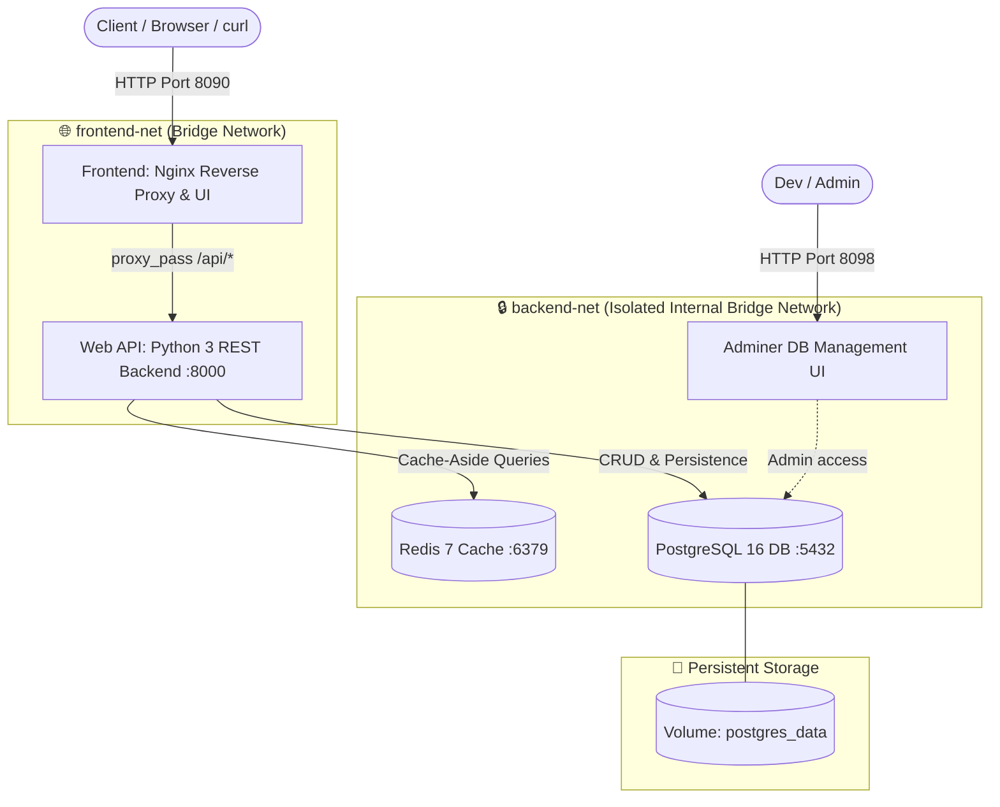
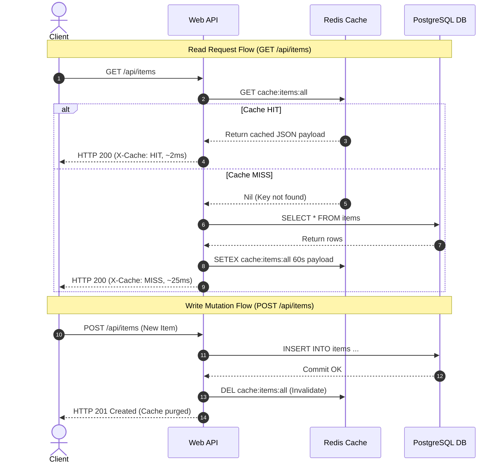

<!-- markdownlint-disable MD013 -->
# Mini-Project 02: Multi-Service Docker Compose Stack

> **Domain**: 03. Containers & Image Optimization  
> **Level**: Beginner to Intermediate  
> **Infrastructure**: Local (Docker Compose / OrbStack)  

---

## 🎯 Overview & Context

In real-world Site Reliability Engineering (SRE) and Microservice Architectures,
systems are divided into specialized, decoupled components: edge reverse proxies,
stateless application servers, in-memory caches, and persistent relational
databases.

Managing these services with ad-hoc `docker run` commands leads to fragile
deployments, race conditions during startup, and dangerous security misconfigurations
(such as exposing databases to the public internet).



This mini-project demonstrates how to orchestrate a production-ready multi-tier
stack using **Docker Compose**, implementing:

1. **Custom Bridge Network Segmentation**: Isolates the database and caching
   layers from the edge reverse proxy.
2. **Healthcheck-Driven Startup Ordering**: Uses `depends_on` with
   `condition: service_healthy` to eliminate startup race conditions.
3. **Cache-Aside In-Memory Pattern**: Accelerates repetitive queries with
   Redis and automatically invalidates stale keys upon data mutations.
4. **Volume Data Persistence**: Mounts a Docker named volume (`postgres_data`)
   ensuring data survives container restarts and upgrades.
5. **Interactive Dashboard & Database Console**: Provides a live web UI and
   an Adminer database interface for inspection.
6. **Automated E2E Integration Suite**: Validates healthchecks, network
   isolation, CRUD flows, and volume persistence.

---

## 🧠 Docker Compose Internals Deep-Dive

### 1. Network Segmentation & Internal DNS Discovery

Docker Compose creates user-defined bridge networks with built-in DNS resolution.
Containers on the same network reach each other using their service name (e.g.
`http://api:8000` or `db:5432`).

In this project, we implement strict **two-tier network segmentation**:

| Network Name | Connected Services | Security & Isolation Purpose |
| :--- | :--- | :--- |
| **`frontend-net`** | `frontend`, `api` | Public-facing edge layer. Only the Nginx reverse proxy accepts external traffic. |
| **`backend-net`** | `api`, `cache`, `db`, `adminer` | Private internal tier. Redis and PostgreSQL have **no direct route** to `frontend` or the public network. |

```text
[Internet] ──▶ (Port 8090) ──▶ [Frontend: Nginx]
                                      │ (frontend-net)
                                      ▼
                                [Web API: Python]
                                      │ (backend-net)
                                ┌─────┴─────┐
                                ▼           ▼
                        [Redis Cache]  [PostgreSQL DB]
```

If an attacker compromises the Frontend container, they cannot communicate
directly with the database on port 5432 because Docker's bridge network rules
isolate the namespaces.

### 2. Startup Ordering (`condition: service_healthy`)

A common mistake in Docker Compose is using simple `depends_on`:

```yaml
# ❌ Anti-Pattern: Only waits for container creation, NOT readiness
depends_on:
  - db
```

PostgreSQL takes several seconds to initialize its cluster and start listening
on port 5432. If the API starts immediately, its first database connection
fails and causes container crashes.

To solve this, we define native container healthchecks and link startup
readiness:

```yaml
# ✅ Production Pattern: Waits for healthcheck convergence
api:
  depends_on:
    db:
      condition: service_healthy
    cache:
      condition: service_healthy
```

- PostgreSQL runs `pg_isready -U postgres -d appdb`.
- Redis runs `redis-cli ping`.
- The `api` container will not start until both return status `healthy`.

### 3. The Cache-Aside Pattern with Redis

The **Cache-Aside (Lazy Loading)** pattern optimizes read-heavy workloads:



1. **Read Request**: The application probes Redis first. If found (`HIT`), it
   returns immediately. If missing (`MISS`), it queries PostgreSQL, writes the
   result to Redis with a 60-second TTL, and returns.
2. **Mutation Request (POST / DELETE)**: When records change, the API immediately
   purges `cache:items:all`, ensuring subsequent reads fetch fresh data.

### 4. Named Volume Persistence (`postgres_data`)

Container filesystems are ephemeral by default. To preserve database state
across restarts:

```yaml
volumes:
  postgres_data:
    name: compose-stack-postgres-data
```

The database data is stored in the Docker engine's managed storage directory
independent of container lifecycles.

---

## 📂 Project Structure

```text
03-containers/02-multi-service-docker-compose-stack/
├── docker-compose.yml        # Multi-service stack definition (5 services)
├── .dockerignore             # Build context optimization rules
├── api/                      # Application Layer: Python REST Microservice
│   ├── Dockerfile            # Multi-stage minimal Python container (non-root UID 10001)
│   ├── requirements.txt      # Python dependencies (psycopg2-binary, redis)
│   └── app.py                # REST controller & Cache-Aside manager
├── db/                       # Persistence Layer: PostgreSQL
│   └── init.sql              # Database schema & initial seed data
├── frontend/                 # Edge Layer: Nginx Reverse Proxy & UI
│   ├── Dockerfile            # Alpine Nginx container with healthcheck
│   ├── nginx.conf            # Reverse proxy configuration (/api/ -> api:8000)
│   └── public/               # Static Web Dashboard
│       ├── index.html        # Interactive single-page monitoring dashboard
│       ├── style.css         # Modern dark-theme styling with glassmorphism
│       └── app.js            # Live health polling and CRUD client
├── e2e_compose_test.sh       # Automated 13-point end-to-end test suite
└── README.md                 # Educational guide, architecture & cleanup instructions
```

---

## 🚀 Quickstart & Execution

### 1. Launch the Multi-Service Stack

Run Docker Compose to build and start all 5 services in the background:

```bash
docker compose up -d --build
```

### 2. Verify Service Health Status

Inspect the status of each container:

```bash
docker compose ps
```

Expected output showing all services in a `healthy` state:

```text
NAME                     IMAGE                      STATUS                   PORTS
compose-stack-adminer    adminer:4                  Up (healthy)             0.0.0.0:8098->8080/tcp
compose-stack-api        devops-mini-proj-03-02-api Up (healthy)             8000/tcp
compose-stack-cache      redis:7-alpine             Up (healthy)             6379/tcp
compose-stack-db         postgres:16-alpine         Up (healthy)             5432/tcp
compose-stack-frontend   ...-frontend               Up (healthy)             0.0.0.0:8090->80/tcp
```

---

### 3. Access Interactive Interfaces

- **🌐 Frontend Dashboard**: Open [http://localhost:8090](http://localhost:8090)
  in your browser to view the live topology, monitor Redis cache hits/misses,
  and manage database items.
- **🗄️ Adminer Database UI**: Open [http://localhost:8098](http://localhost:8098)
  to manage PostgreSQL tables directly.
  - **System**: `PostgreSQL`
  - **Server**: `db`
  - **Username**: `postgres`
  - **Password**: `postgrespassword`
  - **Database**: `appdb`

---

### 4. CLI API Testing & Cache Verification

#### A. Health Probe

```bash
curl -s http://localhost:8090/api/health | jq .
```

Response confirms active connectivity to both PostgreSQL and Redis:

```json
{
  "dependencies": {
    "postgres": {
      "host": "db:5432",
      "latency_ms": 1.25,
      "status": "connected"
    },
    "redis": {
      "host": "cache:6379",
      "latency_ms": 0.85,
      "status": "connected"
    }
  },
  "status": "healthy",
  "uptime_seconds": 24.5
}
```

#### B. Cache-Aside Demonstration

```bash
# First request (Cache MISS -> Database query)
curl -i http://localhost:8090/api/items

# Second request (Cache HIT -> In-memory Redis response)
curl -i http://localhost:8090/api/items
```

Notice the `X-Cache: HIT` response header on the second call.

#### C. Create New Workload Item (Cache Invalidation)

```bash
curl -s -X POST -H "Content-Type: application/json" \
  -d '{"title": "Deploy Envoy Canary", "description": "Configure canary router", "priority": "HIGH"}' \
  http://localhost:8090/api/items | jq .
```

---

## 🧪 Automated Testing Suite

To execute the automated end-to-end test suite:

```bash
./e2e_compose_test.sh
```

To run tests and leave the stack running for manual dashboard inspection:

```bash
./e2e_compose_test.sh --keep
```

### What the Test Suite Verifies

| Test # | Scope | Assertion / Validation |
| :---: | :--- | :--- |
| **01** | Environment Check | Verifies Docker & Docker Compose availability. |
| **02** | Multi-Tier Orchestration | Asserts clean build and startup of 5 services. |
| **03** | Healthcheck Convergence | Validates `condition: service_healthy` ordering. |
| **04** | Edge Frontend Gateway | Asserts HTTP 200 from Nginx reverse proxy. |
| **05** | Web API Health Endpoint | Asserts DB and Redis connectivity from API. |
| **06** | Database Management UI | Asserts Adminer console is accessible on 8088. |
| **07** | Network Segmentation | Asserts `frontend` cannot reach `db:5432` directly. |
| **08** | Cache-Aside Read 1 | Asserts initial query triggers `X-Cache: MISS`. |
| **09** | Cache-Aside Read 2 | Asserts repeated query triggers `X-Cache: HIT`. |
| **10** | Item Mutation | Asserts `POST /api/items` invalidates Redis cache. |
| **11** | Cache Refreshed | Asserts new item is served on subsequent read. |
| **12** | Item Deletion | Asserts `DELETE /api/items/<id>` purges record. |
| **13** | Volume Persistence | Asserts data survives PostgreSQL container restart. |

---

## 🧹 Complete Resource Teardown & Cleanup Guide

To ensure zero leftover containers, bridge networks, named volumes, or images,
follow these cleanup instructions.

### Method 1: Automated Cleanup (Recommended)

Run the built-in cleanup flag:

```bash
./e2e_compose_test.sh --clean
```

---

### Method 2: Manual Docker Compose Teardown

#### 1. Stop and Remove Containers, Networks, and Volumes

The `-v` (or `--volumes`) flag removes named volumes (such as `postgres_data`),
and `--rmi local` removes the images built for `api` and `frontend`:

```bash
docker compose down -v --rmi local
```

#### 2. Prune Dangling Build Caches (Optional)

```bash
docker builder prune -f
docker network prune -f
```

#### 3. Verify Clean System State

Confirm that all project resources have been removed:

```bash
docker compose ps
docker volume ls | grep "compose-stack"
docker network ls | grep "compose-stack"
```

If the outputs are empty, your environment is 100% clean and ready for the next
mini-project!
