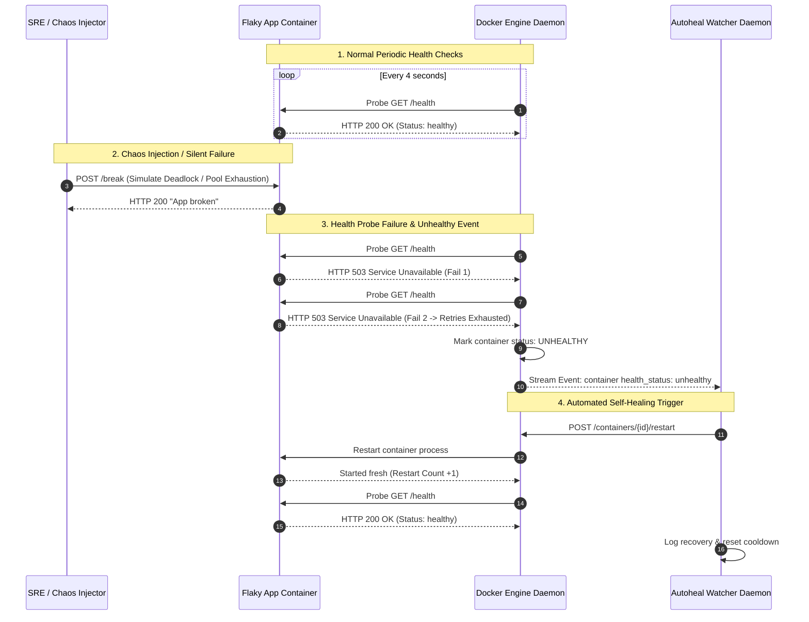

<!-- markdownlint-disable MD013 -->
# Mini-Project 03: Container Healthchecks and Autoheal Engine

> **Domain**: 03. Containers & Image Optimization  
> **Level**: Beginner to Intermediate  
> **Infrastructure**: Local (Docker Compose / OrbStack)  

---

## 🎯 Overview & Context

In production Site Reliability Engineering (SRE), containers frequently encounter
**silent failures**: situations where the container process is technically running
(PID is active), but the application is non-functional (e.g. deadlocked threads,
exhausted database connection pools, memory leaks, or unhandled exceptions).

A basic `docker run` or simple `restart: always` policy **cannot detect silent hangs**
because the operating system process has not crashed.



This mini-project demonstrates how to implement application-level healthchecks
and build an event-driven **Auto-Healing Engine** that:

1. Probes container endpoints with customizable thresholds (`interval`, `timeout`,
   `retries`, `start-period`).
2. Listens to real-time Docker socket events (`/var/run/docker.sock`).
3. Intercepts `health_status: unhealthy` events.
4. Executes automated graceful restarts with rate-limiting cooldown protection.
5. Provides an interactive chaos injection endpoint (`POST /break`) to simulate
   workload failures on demand.

---

## 🧠 Container Healthchecks & Docker Socket Deep-Dive

### 1. Docker `HEALTHCHECK` Directive Anatomy

The `HEALTHCHECK` instruction instructs the Docker engine how to test whether
a container is functioning correctly:

```dockerfile
HEALTHCHECK --interval=4s --timeout=2s --start-period=3s --retries=2 \
    CMD wget --no-verbose --tries=1 --spider http://127.0.0.1:8080/health || exit 1
```

| Parameter | Purpose & SRE Best Practice |
| :--- | :--- |
| **`--interval`** | Time between consecutive health probes (default: 30s). In production, set between 10s and 30s to balance detection speed against CPU overhead. |
| **`--timeout`** | Maximum time allowed for a single probe execution before treating it as a failure (default: 30s). Set tightly (e.g. 2s to 5s) to detect hangs. |
| **`--start-period`** | Grace period during container initialization (JVM boot, cache warm-up, DB migrations). Probe failures during this window do not count toward retries. |
| **`--retries`** | Number of consecutive probe failures required before Docker transitions the container from `healthy` to `unhealthy`. |

### 2. Exit Code Conventions for Probes

When Docker runs the `CMD` probe inside the container, it evaluates the process
exit code:

- `0` (`EXIT_SUCCESS`): Container is healthy and ready to receive traffic.
- `1` (`EXIT_FAILURE`): Container probe failed.
- `2` (Reserved): Do not use.

### 3. Docker Socket Event Streaming (`/events`)

The Docker engine exposes a Unix domain socket (`/var/run/docker.sock`).
The `autoheal_daemon.py` streams events using HTTP chunked transfer over the
socket:

```http
GET /events?filters={"type":["container"],"event":["health_status: unhealthy"]} HTTP/1.1
Host: localhost
```

When a container's retries are exhausted, Docker broadcasts an event:

```json
{
  "status": "health_status: unhealthy",
  "id": "7df3db28f823a...",
  "Type": "container",
  "Action": "health_status: unhealthy",
  "Actor": {
    "ID": "7df3db28f823a...",
    "Attributes": {
      "name": "autoheal-flaky-service",
      "image": "devops-mini-proj-03-03-flaky-service"
    }
  },
  "time": 1724239200
}
```

### 4. Cooldown Rate-Limiting & Anti-Flapping

If a container has a permanent bug (e.g. invalid configuration or missing
credentials), restarting it repeatedly causes a **CrashLoopBackOff / restart storm**
that exhausts CPU resources.

`autoheal_daemon.py` tracks the restart timestamp of each container:

```python
time_since_restart = now - last_restart_timestamp
if time_since_restart < COOLDOWN_SECONDS:
    logger.warning("Cooldown active. Throttling restart.")
```

---

## 📂 Project Structure

```text
03-containers/03-container-healthchecks-autoheal/
├── docker-compose.yml            # Orchestrates flaky app and autoheal daemon
├── .dockerignore                 # Build context filtering rules
├── autoheal_daemon.py            # Event-driven watcher daemon (Docker socket client)
├── autoheal_daemon/
│   └── Dockerfile                # Sidecar container definition for autoheal daemon
├── flaky_app/
│   ├── Dockerfile                # Multi-stage container with native HEALTHCHECK probe
│   └── app.py                    # Microservice with /health and /break chaos endpoints
├── test_autoheal.sh              # Automated verification test suite
└── README.md                     # Educational guide, architecture & cleanup instructions
```

---

## 🚀 Quickstart & Execution

### 1. Launch the Stack

Start the target microservice and autoheal daemon sidecar:

```bash
docker compose up -d --build
```

### 2. Verify Initial Healthy Status

Inspect container statuses:

```bash
docker compose ps
```

Expected output showing `autoheal-flaky-service` as `healthy`:

```text
NAME                      IMAGE                                  STATUS
autoheal-daemon-watcher   devops-mini-proj-03-03-autoheal-daemon Up
autoheal-flaky-service    devops-mini-proj-03-03-flaky-service   Up (healthy)
```

---

### 3. Step-by-Step Chaos Simulation

#### A. Query Initial Health

```bash
curl -s http://localhost:8091/health | jq .
```

Response:

```json
{
  "healthcheck_probes": 12,
  "state": "HEALTHY",
  "status": "UP",
  "uptime_seconds": 48.2
}
```

#### B. Inject Failure (`POST /break`)

Simulate an application hang or internal breakdown:

```bash
curl -s -X POST http://localhost:8091/break | jq .
```

Response:

```json
{
  "action": "Docker daemon will mark this container as UNHEALTHY on next probe cycle.",
  "message": "Chaos injected successfully. Application is now corrupted.",
  "state": "UNHEALTHY"
}
```

#### C. Observe Docker Status Transition to `UNHEALTHY`

Check container status immediately after failure injection:

```bash
docker compose ps
```

Within 8 seconds (2 failed probes $\times$ 4s interval), Docker marks the
container as `unhealthy`:

```text
NAME                     STATUS
autoheal-flaky-service   Up 52 seconds (unhealthy)
```

#### D. Observe Autoheal Daemon Event Logs

Inspect the sidecar logs to observe the event capture and recovery command:

```bash
docker compose logs autoheal-daemon
```

Log trace:

```text
12:20:15 [INFO] 🚨 UNHEALTHY CONTAINER DETECTED: autoheal-flaky-service (ID: 7df3db28f823)
12:20:15 [INFO] ⚡ [AUTO-HEAL] Initiating graceful restart for autoheal-flaky-service...
12:20:17 [INFO] ✔ [RECOVERED] Container autoheal-flaky-service restarted successfully! Probing initial health...
12:20:21 [INFO] ✨ Container autoheal-flaky-service is now HEALTHY.
```

#### E. Verify Automatic Recovery

Query the endpoint again:

```bash
curl -s http://localhost:8091/health | jq .
```

The service responds with `HTTP 200 OK` and `status: "UP"`, confirming zero-touch
self-healing!

---

### 4. Running Autoheal Daemon Standalone on Host

You can also run `autoheal_daemon.py` directly on your host machine:

```bash
# Run continuous daemon
python3 autoheal_daemon.py --cooldown 10

# Single inspection sweep
python3 autoheal_daemon.py --once

# Machine-readable JSON output
python3 autoheal_daemon.py --json
```

---

## 🧪 Automated Testing Suite

Run the automated test suite to validate the entire lifecycle:

```bash
./test_autoheal.sh
```

To run tests and leave the stack active for manual experimentation:

```bash
./test_autoheal.sh --keep
```

### What the Test Suite Verifies

| Test # | Validation Scope | Target Metric / Assertion |
| :---: | :--- | :--- |
| **01** | Docker Prerequisites | Asserts Docker CLI and daemon are operational. |
| **02** | Stack Launch | Asserts clean build and launch of target and watcher. |
| **03** | Baseline Health | Asserts container converges to `healthy` state. |
| **04** | Metadata API | Asserts root endpoint reports `is_healthy: true`. |
| **05** | Health Probe | Asserts GET `/health` responds with HTTP 200. |
| **06** | Chaos Injection | Triggers `POST /break` and asserts state update. |
| **07** | Probe Degradation | Asserts GET `/health` immediately returns HTTP 503. |
| **08** | Docker Detection | Asserts Docker engine marks status as `unhealthy`. |
| **09** | Automated Recovery | Asserts Autoheal daemon restarts container. |
| **10** | Post-Heal Health | Asserts GET `/health` returns HTTP 200 after heal. |

---

## 🧹 Complete Resource Teardown & Cleanup Guide

To maintain a clean workstation and remove all containers, images, and socket
bindings created during testing:

### Method 1: Automated Cleanup (Recommended)

```bash
./test_autoheal.sh --clean
```

---

### Method 2: Manual Docker Compose Teardown

```bash
# Stop and remove all project containers, networks, and built images
docker compose down -v --rmi local
```

#### Verify System is Pristine

Confirm that no containers or images remain:

```bash
docker ps -a --filter "name=autoheal"
docker images | grep "autoheal"
```

If the outputs are empty, your environment is 100% clean and ready for the next
mini-project!
