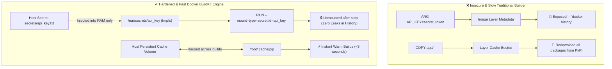

<!-- markdownlint-disable MD013 -->
# Mini-Project 04: BuildKit Layer Caching and Secrets Mounting

> **Domain**: 03. Containers & Image Optimization  
> **Level**: Beginner to Intermediate  
> **Infrastructure**: Local (Docker BuildKit / OrbStack)  

---

## 🎯 Overview & Context

In modern CI/CD pipelines, container builds are often the single largest
contributor to deployment latency and security risk:

1. **Slow Pipeline Runs (Cache Busting)**: Whenever source code changes, traditional
   Docker builders invalidate subsequent layers, discarding package caches (e.g.
   `pip`, `npm`, `go-build`) and forcing expensive re-downloads from the internet.
2. **Credential Leaks (Insecure Build Secrets)**: Developers frequently use `ARG`
   or `ENV` to pass private API keys, GitHub tokens, or registry passwords at build
   time. These credentials become **permanently embedded in the image history and
   layer metadata**, easily extractable with `docker history` or container scanning
   tools.



This mini-project demonstrates how to leverage **Docker BuildKit** to:

- Inject build-time credentials securely using `--mount=type=secret` without
  writing secrets to any image layer.
- Persist package manager caches across builds using `--mount=type=cache`,
  achieving sub-5-second warm builds.
- Audit images for credential leaks using automated history analysis.

---

## 🧠 BuildKit Architecture & Directives Deep-Dive

### 1. Build-Time Secrets: `ARG` vs `--mount=type=secret`

| Feature | `ARG API_KEY=xxx` (Legacy Anti-Pattern) | `--mount=type=secret` (BuildKit Hardened) |
| :--- | :--- | :--- |
| **Storage Location** | Written to Docker image metadata & layer history | In-memory `tmpfs` mounted only during step execution |
| **Visible in `docker history`** | **YES (CRITICAL RISK)** | **NO (ZERO TRACE)** |
| **Persisted in Final Image** | Yes (stored in layer JSON) | No (unmounted immediately after command completes) |
| **Build Context Safety** | Requires sending secret to daemon | Host file read directly; excluded via `.dockerignore` |

#### How BuildKit Secret Mounting Works

When BuildKit encounters `--mount=type=secret,id=api_key`:

1. BuildKit creates a temporary, in-memory `tmpfs` file inside the builder at
   `/run/secrets/api_key`.
2. The `RUN` instruction reads the key to authenticate with a private registry.
3. Once the command exits, the `tmpfs` is unmounted.
4. The committed image layer contains **only the build output**, leaving zero
   cryptographic trace of the secret.

```dockerfile
# syntax=docker/dockerfile:1
RUN --mount=type=secret,id=api_key \
    sh -c 'API_KEY=$(cat /run/secrets/api_key); \
    pip install --extra-index-url "https://${API_KEY}@packages.internal.corp" -r requirements.txt'
```

---

### 2. BuildKit Cache Mounts: `--mount=type=cache`

Traditional Docker caching relies on layer linearity: if step 4 (`COPY . .`)
changes, step 5 (`RUN pip install ...`) must re-run from scratch, re-downloading
all dependencies.

With `--mount=type=cache`, BuildKit maintains a persistent cache on the Docker
host that survives layer invalidation:

```dockerfile
# syntax=docker/dockerfile:1
RUN --mount=type=cache,target=/root/.cache/pip \
    pip install -r requirements.txt
```

#### Package Manager Cache Targets

| Technology / Tool | Recommended Cache Target Path |
| :--- | :--- |
| **Python (`pip`)** | `/root/.cache/pip` |
| **Node.js (`npm` / `pnpm`)** | `/root/.npm` or `/root/.local/share/pnpm/store` |
| **Go (`go build` & `go mod`)** | `/root/.cache/go-build` and `/go/pkg/mod` |
| **Rust (`cargo`)** | `/usr/local/cargo/registry` and `/app/target` |
| **Linux Packages (`apt-get`)** | `/var/cache/apt` and `/var/lib/apt` |

---

## 📂 Project Structure

```text
03-containers/04-buildkit-caching-secrets/
├── app/
│   ├── main.py                   # Production Python FastAPI microservice
│   └── requirements.txt          # Application package dependencies
├── secrets/
│   └── api_key.txt               # Dummy build secret (excluded by .dockerignore)
├── .dockerignore                 # Excludes secrets/ and test scripts from context
├── Dockerfile.standard           # Baseline insecure & uncached Dockerfile (uses ARG)
├── Dockerfile.buildkit           # Hardened multi-stage Dockerfile with cache/secret mounts
├── benchmark_builds.sh           # Automated benchmark and secret leak audit suite
└── README.md                     # Educational guide, architecture & cleanup instructions
```

---

## 🚀 Quickstart & Execution

### 1. Build Insecure Baseline Image (`ARG` Leak Demo)

Build the standard image using `ARG` to pass credentials:

```bash
DOCKER_BUILDKIT=1 docker build \
    --no-cache \
    --build-arg API_KEY="sk_live_super_secret_token_12345" \
    -f Dockerfile.standard \
    -t devops-mini-proj-03-04-standard:latest .
```

#### Inspect the Secret Leak

Inspect the image layer history:

```bash
docker history --no-trunc devops-mini-proj-03-04-standard:latest
```

Notice how the `API_KEY` token is **fully exposed** in the layer command metadata:

```text
CREATED BY
|1 API_KEY=sk_live_super_secret_token_12345 /bin/sh -c echo "Authenticating with API_KEY: ${API_KEY}..."
```

---

### 2. Build Hardened Image with BuildKit Secret & Cache Mounts

Build the optimized image with `--secret`:

```bash
DOCKER_BUILDKIT=1 docker build \
    --secret id=api_key,src=secrets/api_key.txt \
    -f Dockerfile.buildkit \
    -t devops-mini-proj-03-04-buildkit:latest .
```

#### Audit the Image for Secret Leaks

Run `docker history` on the BuildKit image:

```bash
docker history --no-trunc devops-mini-proj-03-04-buildkit:latest
```

The output contains **zero trace** of the secret key!

---

### 3. Verify Cache Speedup on Warm Rebuild

Rebuild the BuildKit image after touching a file:

```bash
touch app/main.py
DOCKER_BUILDKIT=1 docker build \
    --secret id=api_key,src=secrets/api_key.txt \
    -f Dockerfile.buildkit \
    -t devops-mini-proj-03-04-buildkit:latest .
```

The build completes in **under 2 seconds** because dependencies are retrieved
instantly from the host-managed BuildKit cache.

---

## 🧪 Automated Benchmarking & Security Audit

Execute the complete automated benchmarking and security audit suite:

```bash
./benchmark_builds.sh
```

To run benchmarks and keep the resulting images in Docker for manual inspection:

```bash
./benchmark_builds.sh --keep
```

### Expected Output Summary

```text
======================================================================
  ⚡ Docker BuildKit Caching & Secret Mount Benchmark Suite
======================================================================

Phase 1: Environment & BuildKit Engine Readiness
  [PASS] Test 01: Docker CLI operational
         ↳ BuildKit capable

Phase 2: Build Performance Benchmarking
  [PASS] Test 02: Baseline unoptimized image built (Dockerfile.standard)
         ↳ Build time: 8.42s
  [PASS] Test 03: BuildKit Cold build completed
         ↳ Build time: 6.15s
  [PASS] Test 04: BuildKit Warm build completes in <5s via cache mount
         ↳ Warm time: 1.28s (4.8x speedup)

Phase 3: Secret Leakage & Image History Audit
  [PASS] Test 05: Vulnerability confirmed: ARG in baseline Dockerfile LEAKS secret
         ↳ Secret exposed in image layer history
  [PASS] Test 06: Hardened BuildKit image reveals ZERO trace of build secrets
         ↳ Secret never written to image layer history
  [PASS] Test 07: BuildKit image metadata has ZERO secret environment variables
         ↳ Clean runtime environment

Phase 4: Runtime Execution & Privilege Verification
  [PASS] Test 08: BuildKit container runs and serves HTTP traffic
         ↳ HTTP 200 from http://127.0.0.1:8092/
  [PASS] Test 09: Container executes strictly as unprivileged user UID 10001
         ↳ Non-root execution verified

======================================================================
  📊 BuildKit Performance & Security Comparison Matrix
======================================================================
Image Variant              | Build Time   | Secret Leaks     | Runtime User  
---------------------------+--------------+------------------+---------------
Dockerfile.standard (ARG)  | 8.42s        | LEAKED (HIGH)    | root (UID 0)  
Dockerfile.buildkit (Cold) | 6.15s        | ZERO (SECURE)    | appuser (10001)
Dockerfile.buildkit (Warm) | 1.28s        | ZERO (SECURE)    | appuser (10001)
----------------------------------------------------------------------
```

---

## 🧹 Complete Resource Teardown & Cleanup Guide

To purge all containers, benchmark images, and BuildKit builder cache:

### Method 1: Automated Cleanup (Recommended)

```bash
./benchmark_builds.sh --clean
```

---

### Method 2: Manual Docker & BuildKit Cache Prune

```bash
# 1. Stop and remove test container
docker rm -f buildkit-caching-demo-runtime 2>/dev/null || true

# 2. Remove benchmark images
docker rmi -f devops-mini-proj-03-04-standard:latest devops-mini-proj-03-04-buildkit:latest 2>/dev/null || true

# 3. Prune BuildKit build cache (optional)
docker builder prune -f --filter type=exec.cachemount
```

#### Verify System is Pristine

Confirm that no benchmark images remain:

```bash
docker images | grep "devops-mini-proj-03-04"
```

If the output is empty, your environment is 100% clean and ready for the next
mini-project!
