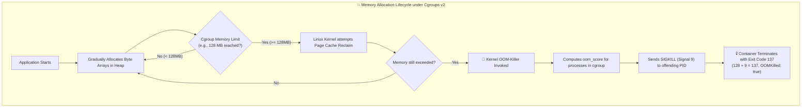
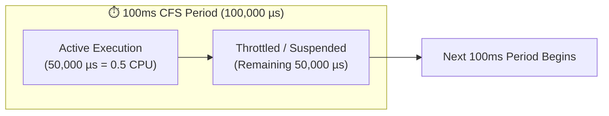

<!-- markdownlint-disable MD013 -->
# Mini-Project 06: Container Resource Constraints & OOM Profiler

> **Domain**: 03. Containers & Image Optimization  
> **Level**: Beginner to Intermediate  
> **Infrastructure**: Local (Docker Engine / OrbStack / Linux cgroups v2)  

---

## 🎯 Overview & Context

In containerized production environments (Docker, Kubernetes, ECS), containers share
the underlying host's physical CPU and RAM. Without strict resource boundaries, a single
misbehaving container with a memory leak or an unconstrained CPU loop can consume all host
resources. This phenomenon, known as the **"Noisy Neighbor" problem**, can starve critical
host daemons (like `systemd`, `dockerd`, or `kubelet`) and trigger cascading cluster outages.

To prevent this, the Linux kernel provides **Control Groups (cgroups)**. When a container
exceeds its configured memory limit, the Linux kernel's **Out-Of-Memory (OOM) Killer**
intervenes, immediately terminating the offending process with `SIGKILL` (Signal 9) to protect
the rest of the operating system.



This mini-project provides an interactive laboratory to:

- Configure strict **CPU quotas** (`cpus: 0.5`) and **Memory limits** (`mem_limit: 128m`, `memswap_limit: 128m`) using Docker Compose and Docker CLI.
- Explore Linux **cgroups v2** interfaces directly (`/sys/fs/cgroup/memory.*` and `/sys/fs/cgroup/cpu.*`).
- Trigger controlled memory exhaustion and observe the Linux kernel **OOM-Killer** in real time.
- Understand the exact arithmetic and semantics of **Exit Code 137**.
- Monitor Docker daemon socket events (`oom`, `die`, `kill`) with a real-time event listener.
- Observe Completely Fair Scheduler (CFS) **CPU throttling** without process crashes.

---

## 🧠 Deep-Dive: Linux Cgroups & Kernel Mechanics

### 1. What are Linux Control Groups (Cgroups)?

Control Groups (**cgroups**) are a Linux kernel feature that isolates, limits, and accounts
for resource usage (CPU, Memory, Disk I/O, Network) of a collection of processes.

- **Cgroups v1**: Managed resources through independent, separate directory hierarchies
  (`/sys/fs/cgroup/memory`, `/sys/fs/cgroup/cpu`). This caused synchronization issues between controllers.
- **Cgroups v2**: Introduces a **unified, single-hierarchy tree** (`/sys/fs/cgroup/`). All controllers
  (memory, cpu, io, pids) are coordinated under the same hierarchy, providing consistent resource accounting.

#### Key Cgroups v2 Files

| File Path | Description | Example Value |
| :--- | :--- | :--- |
| `/sys/fs/cgroup/memory.current` | Current memory usage (in bytes) of the cgroup. | `67108864` (64 MB) |
| `/sys/fs/cgroup/memory.max` | Hard memory ceiling. Exceeding triggers OOM-killer. | `134217728` (128 MB) |
| `/sys/fs/cgroup/memory.high` | Throttle threshold before hard limit (soft throttle). | `115343360` (110 MB) |
| `/sys/fs/cgroup/memory.events` | Counters for memory pressure events (`oom`, `oom_kill`). | `oom_kill 1` |
| `/sys/fs/cgroup/memory.swap.max` | Hard swap ceiling for the cgroup. | `0` (Swap disabled) |
| `/sys/fs/cgroup/cpu.max` | CFS quota and period (`<quota_us> <period_us>`). | `50000 100000` (0.5 CPUs) |
| `/sys/fs/cgroup/cpu.stat` | Throttling statistics (`nr_periods`, `nr_throttled`, `throttled_usec`). | `nr_throttled 132` |

---

### 2. The Linux Kernel Out-Of-Memory (OOM) Killer

When the cgroup memory limit (`memory.max`) is reached, the kernel performs the following steps:

1. **Page Reclaim Attempt**: The kernel attempts to free page cache (file-backed clean memory).
2. **Swap Offloading**: If swap is enabled (`memory.swap.max > 0`), anonymous pages are swapped out.
3. **OOM Invocation**: If usage remains above the hard limit, the kernel invokes `mem_cgroup_out_of_memory()`.
4. **Victim Selection (`oom_score`)**: The kernel calculates a "badness score" for every process in the cgroup based on:
   - Percentage of memory consumed.
   - `oom_score_adj` adjustment knob (ranges from `-1000` [never kill] to `+1000` [kill first]).
5. **Termination**: The process with the highest score is sent `SIGKILL` (Signal 9).

---

### 3. The Mathematics Behind Docker Exit Code 137

When inspecting a container after a crash (`docker inspect`), you will frequently encounter
**Exit Code 137**. Why 137?

In Unix and POSIX operating systems, when a process is terminated by a signal rather than
exiting voluntarily, the shell or runtime sets the exit code according to the formula:

$$\text{Exit Code} = 128 + \text{Signal Number}$$

| Signal Name | Signal # | Calculation | Exit Code | Common Root Cause |
| :--- | :---: | :---: | :---: | :--- |
| **`SIGKILL`** | **9** | **$128 + 9$** | **`137`** | **Kernel OOM-Killer** or forced `docker kill` / `docker stop` timeout |
| **`SIGTERM`** | **15** | **$128 + 15$** | **`143`** | Graceful shutdown requested (`docker stop`) |
| **`SIGINT`** | **2** | **$128 + 2$** | **`130`** | User interrupted process via `Ctrl+C` |
| **`SIGSEGV`** | **11** | **$128 + 11$** | **`139`** | Segmentation fault (invalid memory pointer) |

> [!IMPORTANT]
> `SIGKILL` (signal 9) **cannot be caught, blocked, or handled** by application code.
> Unlike `SIGTERM`, an application terminated by the OOM-killer has no opportunity to run
> cleanup handlers, flush caches, or close database connections.

---

### 4. CPU CFS (Completely Fair Scheduler) Quotas & Throttling

Unlike memory (which is a **non-compressible** resource: once full, a process must be killed),
CPU is a **compressible** resource: when a process demands more CPU than permitted, the kernel
**throttles** execution without killing the process.



- **CFS Period (`cpu.cfs_period_us`)**: Default is typically $100{,}000\ \mu\text{s}$ (100ms).
- **CFS Quota (`cpu.cfs_quota_us`)**: The amount of CPU time the container is allowed per period.
- For `cpus: "0.5"`, quota is $50{,}000\ \mu\text{s}$. Once the container exhausts 50ms of CPU time,
  all threads in the container are suspended until the 100ms period resets.
- Throttling metrics are recorded in `/sys/fs/cgroup/cpu.stat` as `nr_throttled` and `throttled_usec`.

---

## 📂 Project Structure

```text
03-containers/06-container-resource-constraints-oom-profiler/
├── .dockerignore                 # Excludes local artifacts and caches from Docker context
├── Dockerfile                    # Unprivileged Python 3.12 container running the profiler
├── docker-compose.yml            # Declarative scenarios with memory limits & CPU quotas
├── memory_hog.py                 # Core allocation & CPU stress engine with cgroup stats
├── oom_monitor.sh                # Live Docker event listener & post-mortem diagnostic tool
├── test_oom_profiler.sh          # Automated end-to-end test suite and teardown runner
└── README.md                     # Comprehensive educational guide & architecture reference
```

---

## 🚀 Hands-On Laboratory Scenarios

### Scenario 1: Memory Exhaustion & OOM Killer Trigger

In this scenario, we launch a container strictly constrained to **128 MB RAM** (`mem_limit: 128m`)
and **0.5 CPU**. The Python engine allocates memory in 10 MB chunks and touches every page to
guarantee physical allocation.

```bash
docker compose up oom-victim
```

#### Expected Terminal Output (OOM Trigger)

```text
===========================================================================
  🧪 Container Resource Constraints & OOM Profiling Engine
===========================================================================
  PID:             1
  UID / GID:       10001 / 10001
  Host / Hostname: c04df8e7151a
  Cgroup Version:  v2
  Execution Mode:  OOM
---------------------------------------------------------------------------
⚙️  Discovered Resource Constraints:
  • Memory Limit:      128.0 MB
  • CPU CFS Quota:     50000 µs / 100000 µs (0.50 CPUs)
  • Initial RSS:       17.93 MB
  • Initial Cgroup:    12.83 MB
---------------------------------------------------------------------------
🚀 Starting memory allocation workflow...
  Target: Intentionally trigger Kernel OOM-Killer when exceeding limit (128.0 MB)
Iter   Allocated    Process RSS    Cgroup Usage    Cgroup Limit   Bar / Status
---------------------------------------------------------------------------
1         10 MB       28.1 MB       22.9 MB       128.0 MB       [##.............]  17.9%
2         20 MB       47.9 MB       42.5 MB       128.0 MB       [####...........]  33.2%
3         30 MB       57.9 MB       52.5 MB       128.0 MB       [######.........]  41.0%
...
10       100 MB      127.9 MB      122.5 MB       128.0 MB       [##############.]  95.7%
devops-oom-victim exited with code 137
```

Observe that right as cgroup usage reached ~128 MB, the process was immediately killed with
**`exit code 137`**.

---

### Scenario 2: Post-Mortem OOM Diagnostics with `oom_monitor.sh`

Run the diagnostic analyzer to inspect the terminated container:

```bash
./oom_monitor.sh --inspect devops-oom-victim
```

#### Diagnostic Report (OOM Inspection)

```text
======================================================================
  🔍 Docker OOM Profiler & Kernel Event Diagnostic Utility
======================================================================

📦 Container Inspection: devops-oom-victim
  • State Status:        exited
  • Configured Memory:   128 MB
  • Configured CPU:      0.50 CPUs
  • OOMKilled Flag:      true (KILLED BY LINUX KERNEL OOM)
  • Process Exit Code:   137

🧠 Exit Code 137 Breakdown:
    Standard Unix Exit Formula: 128 + Signal Number
    Exit Code 137 = 128 + 9 (SIGKILL)
    When a container exceeds its cgroup memory limit, the Linux Kernel
    OOM-Killer sends an uncatchable SIGKILL (signal 9) to immediately
    reclaim memory and prevent host kernel starvation.
----------------------------------------------------------------------
```

Notice `OOMKilled: true` and `ExitCode: 137`.

---

### Scenario 3: Predictable In-Bounds Memory Execution (`memory-safe`)

Launch a container with the same 128 MB limit that operates within safe thresholds (allocating 60 MB):

```bash
docker compose up memory-safe
```

#### Expected Output (Safe Memory Execution)

```text
Iter   Allocated    Process RSS    Cgroup Usage    Cgroup Limit   Bar / Status
---------------------------------------------------------------------------
1         10 MB       28.1 MB       26.2 MB       128.0 MB       [###............]  20.5%
2         20 MB       47.9 MB       45.9 MB       128.0 MB       [#####..........]  35.8%
...
6         60 MB       87.9 MB       85.9 MB       128.0 MB       [##########.....]  67.1%
✔ Target allocation of 60 MB reached safely.
✨ Workflow finished successfully without triggering OOM.
devops-oom-safe exited with code 0
```

The container completes cleanly with **Exit Code 0** and `OOMKilled: false`.

---

### Scenario 4: CPU CFS Quota Throttling (`cpu-throttled`)

Launch the CPU stress service constrained to 0.5 CPU (`cpus: 0.5`):

```bash
docker compose up cpu-throttled
```

#### Expected Output (CFS Throttling)

```text
⚡ Launching 4 CPU worker threads for 12 seconds...
  CFS Quota: 50000 µs per 100000 µs period (0.50 CPUs)
Elapsed    Throttled Periods    Throttled Time (ms)    Throttle Rate
---------------------------------------------------------------------------
 1s            18 / 19            1094.61 ms              94.7% throttled
 2s            33 / 34            1904.03 ms              97.1% throttled
...
12s           131 / 132           7805.47 ms              99.2% throttled
---------------------------------------------------------------------------
✔ CPU Stress completed.
  Total Periods Sampled:  133
  Throttled Periods:      132 (99.2%)
  Total Throttled Time:   7861.37 ms
devops-cpu-throttled exited with code 0
```

Notice that the threads demanded 400% CPU (4 cores), but the kernel CFS scheduler strictly
suspended them for 50% of every period, resulting in ~99% throttled periods without crashing!

---

### Scenario 5: Live Docker Event Streaming (`--stream`)

In one terminal window, start the real-time event monitor:

```bash
./oom_monitor.sh --stream
```

In another terminal window, trigger an OOM event:

```bash
docker run --rm --memory=64m --memory-swap=64m devops-oom-profiler:latest --mode=oom --chunk-size-mb=10
```

Watch the event stream capture the exact moment the kernel triggers OOM and Docker records the death:

#### Live Event Stream Output

```text
2026-08-25 23:00:12 [🚨 OOM EVENT] Container: compassionate_curie (devops-oom-profiler:latest)
           ↳ Kernel Out-Of-Memory Killer triggered for this cgroup!
2026-08-25 23:00:12 [💀 DIE EVENT] Container: compassionate_curie ExitCode: 137 (SIGKILL / OOM)
```

---

### Scenario 6: Auditing Container Status Across Host (`--summary`)

Run a quick summary audit of all containers:

```bash
./oom_monitor.sh --summary
```

```text
======================================================================
  🔍 Docker OOM Profiler & Kernel Event Diagnostic Utility
======================================================================

📋 Active and Stopped Containers Resource Audit:

CONTAINER NAME            STATUS       EXIT CODE    OOM KILLED?    MEMORY LIMIT  
-------------------------------------------------------------------------------
devops-oom-victim         exited       137          TRUE (OOM)     128 MB        
devops-oom-safe           exited       0            false          128 MB        
devops-cpu-throttled      exited       0            false          256 MB        
-------------------------------------------------------------------------------
```

---

## 🧪 Automated Testing Suite

To validate all scenarios automatically, execute `test_oom_profiler.sh`:

```bash
./test_oom_profiler.sh
```

To run the tests and keep the containers active for manual inspection:

```bash
./test_oom_profiler.sh --keep
```

### Test Assertions & Matrix

| Test # | Test Scope | Verification Assertion |
| :---: | :--- | :--- |
| **01** | Docker & Cgroup v2 Engine | Validates Docker CLI connectivity and cgroups v2 kernel support. |
| **02** | Profiler Image Build | Asserts error-free build of `devops-oom-profiler:latest`. |
| **03** | Safe Memory Execution | Asserts 60MB allocation under 128MB constraint exits with code 0. |
| **04** | OOM-Killer Trigger | Asserts 128MB ceiling breach produces `ExitCode=137` and `OOMKilled=true`. |
| **05** | Docker Event Stream | Asserts Docker daemon emits real-time `oom` and `die` socket events. |
| **06** | CFS CPU Throttling | Asserts multi-threaded workload is throttled to 0.5 CPU quota. |
| **07** | CLI Flags Equivalence | Verifies `docker run --memory=64m` triggers identical OOM behavior. |

---

## 🧹 Complete Resource Teardown & Cleanup Guide

To maintain a clean workstation and leave your environment completely pristine for the next
mini-project, use one of the following cleanup methods:

### Method 1: Automated One-Command Cleanup (Recommended)

```bash
./test_oom_profiler.sh --clean
```

---

### Method 2: Manual Docker Compose Teardown

```bash
# 1. Stop and remove all project containers, networks, and volumes
docker compose down -v --remove-orphans

# 2. Remove any standalone test containers
docker rm -f devops-oom-victim devops-oom-safe devops-cpu-throttled devops-oom-cli-test 2>/dev/null || true

# 3. Remove the built profiler container image
docker rmi -f devops-oom-profiler:latest 2>/dev/null || true
```

---

### Verification: Confirming Zero Leftover Artifacts

Run the following commands to confirm that no residual containers, images, or volumes remain:

```bash
# Check for any remaining project containers
docker ps -a --filter "name=devops-oom" --filter "name=devops-cpu"

# Check for any remaining project images
docker images | grep "devops-oom-profiler"
```

If both commands return empty outputs, your Docker environment is **100% clean** and ready for the next project!
