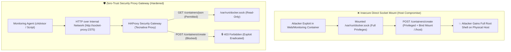
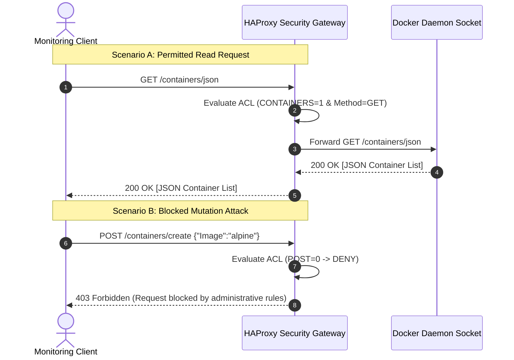

<!-- markdownlint-disable MD013 -->
# Mini-Project 07: Docker Socket Security Proxy Gateway

> **Domain**: 03. Containers & Image Optimization  
> **Level**: Beginner to Intermediate  
> **Infrastructure**: Local (Docker Compose / HAProxy / OrbStack)  

---

## 🎯 Overview & Context

In containerized architectures, monitoring agents (such as Prometheus cAdvisor, Datadog Agent,
or Portainer) and reverse proxies (like Traefik) require access to Docker metadata to discover
running services and collect resource metrics.

To achieve this, developers frequently mount the Docker daemon UNIX socket directly into containers:

```yaml
# ⚠️ HIGH SECURITY RISK ANTI-PATTERN
volumes:
  - /var/run/docker.sock:/var/run/docker.sock
```

### Why is Mounting `/var/run/docker.sock` Dangerous?

The Docker daemon socket (`/var/run/docker.sock`) is the **management control plane** of the entire
Docker engine. Giving a container access to this socket is mathematically equivalent to **granting
unrestricted root access to the host operating system**.

If an attacker compromises a container with socket access (e.g., through an application vulnerability
or supply-chain dependency exploit), they can simply send an API call to spawn a new privileged
container that mounts the entire host root filesystem:

```bash
# 💥 Attacker payload via Docker Socket to take over host root filesystem
curl -X POST -H "Content-Type: application/json" \
  -d '{"Image":"alpine","Cmd":["sh","-c","cat /host/etc/shadow"],"HostConfig":{"Privileged":true,"Binds":["/:/host"]}}' \
  http://localhost:2375/containers/create
```



### The Solution: Granular API Security Proxy

This mini-project demonstrates how to deploy an **HAProxy-based Security Gateway** (`tecnativa/docker-socket-proxy`)
that sits between untrusted/monitoring containers and `/var/run/docker.sock`.

- Exposes only safe, read-only telemetry endpoints (`GET /containers/json`, `GET /version`, `GET /info`).
- Strictly rejects all mutate requests (`POST`, `DELETE`), remote execution (`EXEC=0`), and volume tampering (`VOLUMES=0`) with **`HTTP 403 Forbidden`**.
- Eliminates the need to mount `/var/run/docker.sock` into third-party containers.

---

## 🧠 Security Mechanics & RBAC Configuration

### 1. Architectural Flow

The security proxy intercepts incoming HTTP requests on TCP port 2375, evaluates each request
against an internal Access Control List (ACL), and forwards permitted requests to the local UNIX socket.



---

### 2. Granular RBAC Permissions Reference

The gateway is configured using granular environment variables:

| Variable | Recommended Value | Permitted Endpoints | Security Risk if Enabled |
| :--- | :---: | :--- | :--- |
| **`CONTAINERS`** | `1` | `GET /containers/*` | Low (Allows reading container metadata). |
| **`INFO`** | `1` | `GET /info` | Low (Provides host system information). |
| **`VERSION`** | `1` | `GET /version` | Low (Provides Docker Engine version). |
| **`PING`** | `1` | `GET /_ping` | None (Health check heartbeat probe). |
| **`EVENTS`** | `1` | `GET /events` | Low (Real-time lifecycle event stream). |
| **`POST`** | **`0`** | **BLOCKED** | **CRITICAL**: Allows creating, starting, stopping, and killing containers. |
| **`DELETE`** | **`0`** | **BLOCKED** | **HIGH**: Allows deleting containers, images, and volumes. |
| **`VOLUMES`** | **`0`** | **BLOCKED** | **HIGH**: Allows inspecting and manipulating persistent disk storage. |
| **`NETWORKS`** | **`0`** | **BLOCKED** | **MEDIUM**: Allows creating and modifying Docker software networks. |
| **`EXEC`** | **`0`** | **BLOCKED** | **CRITICAL**: Allows interactive shell command execution (`docker exec`). |
| **`BUILD`** | **`0`** | **BLOCKED** | **HIGH**: Allows building arbitrary container images on the daemon. |
| **`AUTH`** | **`0`** | **BLOCKED** | **HIGH**: Access to registry credentials. |
| **`SECRETS`** | **`0`** | **BLOCKED** | **CRITICAL**: Access to Swarm secrets and encrypted tokens. |

---

## 📂 Project Structure

```text
03-containers/07-docker-socket-security-proxy/
├── docker-compose.yml            # Declarative stack deploying HAProxy gateway & test agent
├── audit_proxy.py                # Python penetration tester & policy validation matrix
├── test_proxy_permissions.sh     # Automated verification suite with full cleanup
└── README.md                     # Educational guide, security architecture & lab guide
```

---

## 🚀 Hands-On Laboratory Scenarios

### Scenario 1: Deploying the Security Proxy Gateway

Start the security gateway container using Docker Compose:

```bash
docker compose up -d socket-proxy
```

Verify that the gateway is operational and listening on localhost port 2375:

```bash
curl -s http://127.0.0.1:2375/_ping
```

Response:

```text
OK
```

---

### Scenario 2: Testing Permitted Read Operations

Query engine version and active containers through the proxy:

#### A. Query Docker Version (`GET /version`)

```bash
curl -s http://127.0.0.1:2375/version | jq .
```

#### B. Query Container Inventory (`GET /containers/json`)

```bash
curl -s http://127.0.0.1:2375/containers/json | jq .
```

Notice that both endpoints respond with **`HTTP 200 OK`** and complete JSON payloads.

---

### Scenario 3: Simulating a Container Creation Attack (`POST /containers/create`)

Attempt to send a mutating payload requesting the creation of a new container:

```bash
curl -i -X POST http://127.0.0.1:2375/containers/create \
  -H "Content-Type: application/json" \
  -d '{"Image":"alpine:latest","Cmd":["echo","HACKED"]}'
```

#### Response from Security Gateway

```text
HTTP/1.0 403 Forbidden
cache-control: no-cache
content-type: text/html

<html><body><h1>403 Forbidden</h1>
Request forbidden by administrative rules.
</body></html>
```

The HAProxy security gateway immediately intercepted and rejected the mutation with **`403 Forbidden`**!
The Docker daemon never even received the request.

---

### Scenario 4: Simulating Remote Code Execution (`POST /exec`)

Attempt to inject an interactive command execution into a running container:

```bash
curl -i -X POST http://127.0.0.1:2375/containers/devops-socket-proxy/exec \
  -H "Content-Type: application/json" \
  -d '{"Cmd":["whoami"]}'
```

#### Response for Exec Attack

```text
HTTP/1.0 403 Forbidden
```

Execution is blocked because `EXEC=0` and `POST=0`.

---

### Scenario 5: Simulating Volume Data Snooping (`GET /volumes`)

Attempt to list storage volumes to look for sensitive database files:

```bash
curl -i http://127.0.0.1:2375/volumes
```

#### Response for Volume Snooping

```text
HTTP/1.0 403 Forbidden
```

Blocked because `VOLUMES=0`.

---

### Scenario 6: Running the Interactive Python Security Audit Tool

Execute the built-in Python audit tool to run a 12-point penetration audit against the proxy:

```bash
python3 audit_proxy.py
```

#### Expected Audit Output Matrix

```text
================================================================================
  🛡️  Docker Socket Security Proxy Gateway - Security Audit Suite
================================================================================
  Target Security Proxy: http://127.0.0.1:2375
  Raw Socket Reference: /var/run/docker.sock
--------------------------------------------------------------------------------
ID       Method  API Endpoint                 Proxy Status    Audit Verdict      Threat Class
--------------------------------------------------------------------------------
SEC-01   GET     /_ping                       200 OK        ✔ PERMITTED (200) Read-Only / Monitoring
SEC-02   GET     /version                     200 OK        ✔ PERMITTED (200) Read-Only / Monitoring
SEC-03   GET     /info                        200 OK        ✔ PERMITTED (200) Read-Only / Monitoring
SEC-04   GET     /containers/json             200 OK        ✔ PERMITTED (200) Read-Only / Monitoring
SEC-05   POST    /containers/create           403 Forbidden 🔒 BLOCKED (403)  Host Escape / Privilege Escalation
SEC-06   POST    /containers/devops-sock...   403 Forbidden 🔒 BLOCKED (403)  Remote Code Execution (RCE)
SEC-07   POST    /containers/devops-sock...   403 Forbidden 🔒 BLOCKED (403)  Denial of Service (DoS)
SEC-08   POST    /containers/devops-sock...   403 Forbidden 🔒 BLOCKED (403)  Denial of Service (DoS)
SEC-09   GET     /volumes                     403 Forbidden 🔒 BLOCKED (403)  Data Exfiltration
SEC-10   POST    /volumes/create              403 Forbidden 🔒 BLOCKED (403)  Storage Mutation
SEC-11   DELETE  /containers/dummy-target     403 Forbidden 🔒 BLOCKED (403)  Destructive Operation
SEC-12   GET     /secrets                     403 Forbidden 🔒 BLOCKED (403)  Credential Theft
================================================================================
📊 Audit Summary: 12/12 Security Policies Verified
✨ Zero-Trust Gateway is operating optimally! All mutation and breakout attempts blocked.
```

---

### Scenario 7: Inter-Container Monitoring Agent Integration

Run the simulated unprivileged monitoring client container over the internal Docker network:

```bash
docker compose run --rm monitoring-agent
```

#### Output from Isolated Monitoring Agent

```text
=== [Monitoring Agent] Querying Docker API via Security Proxy ===
--> Probing /_ping:
OK [OK]
--> Querying /version:
{"Platform":{"Name":"Docker Engine - Community"},"Components":[{"Name":"Engine","Version":"29.4.0"...
--> Querying /containers/json (Active Containers Count):
[{"Id":"...","Names":["/devops-socket-proxy"],"Image":"tecnativa/docker-socket-proxy:latest"...
--> Attempting Malicious POST /containers/create (Should be 403 Forbidden):
HTTP Response Code: 403
=== [Monitoring Agent] Verification completed successfully ===
```

Notice that the monitoring agent container operates smoothly over HTTP without needing
`/var/run/docker.sock` mounted into its filesystem!

---

## 🧪 Automated Verification Suite

Run the automated test suite to validate all 11 security controls in sequence:

```bash
./test_proxy_permissions.sh
```

To run the suite and leave the proxy running for manual exploration:

```bash
./test_proxy_permissions.sh --keep
```

### Security Assertion Matrix

| Test # | Security Control | Target Endpoint | Assertion |
| :---: | :--- | :--- | :--- |
| **01** | Docker Prerequisites | `/var/run/docker.sock` | Asserts daemon socket accessibility. |
| **02** | Gateway Deployment | `http://127.0.0.1:2375` | Asserts HAProxy initializes and responds. |
| **03** | Permitted Metadata | `GET /_ping`, `/version`, `/info` | Asserts `HTTP 200 OK`. |
| **04** | Permitted Inventory | `GET /containers/json` | Asserts `HTTP 200 OK`. |
| **05** | Exploit Mitigation | `POST /containers/create` | Asserts `HTTP 403 Forbidden`. |
| **06** | RCE Mitigation | `POST /containers/.../exec` | Asserts `HTTP 403 Forbidden`. |
| **07** | DoS Mitigation | `POST /containers/.../kill` | Asserts `HTTP 403 Forbidden`. |
| **08** | Storage Leak Mitigation | `GET/POST /volumes` | Asserts `HTTP 403 Forbidden`. |
| **09** | Deletion Prevention | `DELETE /containers/...` | Asserts `HTTP 403 Forbidden`. |
| **10** | Isolated Client Agent | `http://socket-proxy:2375` | Asserts internal network communication. |
| **11** | Full Policy Matrix | 12 policy rules | Asserts 100% pass rate in Python auditor. |

---

## 🧹 Complete Resource Teardown & Cleanup Guide

To maintain a clean workstation and remove all containers and networks created during testing:

### Method 1: Automated Cleanup (Recommended)

```bash
./test_proxy_permissions.sh --clean
```

---

### Method 2: Manual Docker Compose Teardown

```bash
# 1. Stop and remove all project containers and networks
docker compose down -v --remove-orphans

# 2. Remove any standalone test containers
docker rm -f devops-socket-proxy devops-monitoring-agent 2>/dev/null || true
```

---

### Verification: Confirming Zero Residual Resources

Run the following commands to confirm that no residual containers or networks remain:

```bash
# Verify no proxy containers remain
docker ps -a --filter "name=devops-socket-proxy" --filter "name=devops-monitoring-agent"

# Verify no custom project networks remain
docker network ls --filter "name=devops-proxy-net"
```

If both commands return empty results, your environment is **100% clean** and ready for the next mini-project!
