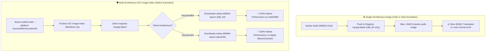
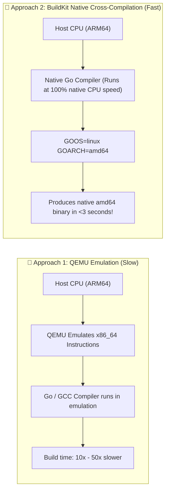

<!-- markdownlint-disable MD013 -->
# Mini-Project 08: Multi-Architecture Image Builder with Buildx

> **Domain**: 03. Containers & Image Optimization  
> **Level**: Beginner to Intermediate  
> **Infrastructure**: Local (Docker Buildx / QEMU / OrbStack)  

---

## 🎯 Overview & Context

In modern cloud computing and DevOps, heterogeneous hardware architectures have become
the industry standard:

- **Apple Silicon (M1/M2/M3/M4)**: Developer workstations run on **ARM64** (`linux/arm64`).
- **Cloud Hyperscalers (AWS Graviton, Google Tau T2A, Azure Cobalt)**: High-performance, cost-effective servers run on **ARM64**.
- **Legacy & High-Compute Servers**: Production Kubernetes clusters continue to run on **x86_64** (**AMD64**) (`linux/amd64`).

If you build a container image exclusively for `amd64` and attempt to run it on an `arm64` host
(like a Mac or AWS Graviton EC2 instance), one of two problems occurs:

1. **Failure to execute**: The kernel throws an `exec format error` because the CPU cannot execute foreign machine instructions.
2. **Severe CPU degradation**: The runtime falls back to software emulation via QEMU, incurring a **5x to 30x performance penalty**.



### The Solution: Docker Buildx & OCI Image Index

This mini-project demonstrates how to use **Docker Buildx** (powered by Moby BuildKit) and
native Go cross-compilation to:

- Create and manage a dedicated **Buildx builder node** using the `docker-container` driver.
- Compile dual-architecture binaries (`linux/amd64` and `linux/arm64`) using high-speed native cross-compilation (`BUILDPLATFORM` + `TARGETARCH`).
- Assemble and push an **OCI Image Index (Manifest List)** to a local registry.
- Inspect manifest lists using `docker buildx imagetools inspect`.
- Execute and verify both architecture variants locally.

---

## 🧠 Multi-Architecture Architecture & Mechanics

### 1. What is an OCI Image Index (Manifest List)?

An **OCI Image Index** (historically called a **Manifest List** in Docker Schema 2) is a
lightweight JSON descriptor that points to multiple platform-specific container image manifests.

When a client runs `docker pull myapp:latest`:

1. The Docker daemon queries the registry for the image tag `myapp:latest`.
2. The registry returns the **Image Index JSON**.
3. The Docker daemon checks its local host architecture (e.g., `os: linux`, `architecture: arm64`).
4. The daemon matches the platform and downloads **only the specific image layers** matching its CPU architecture!

```json
{
  "schemaVersion": 2,
  "mediaType": "application/vnd.oci.image.index.v1+json",
  "manifests": [
    {
      "mediaType": "application/vnd.oci.image.manifest.v1+json",
      "size": 714,
      "digest": "sha256:de2c66949223ab...",
      "platform": { "architecture": "amd64", "os": "linux" }
    },
    {
      "mediaType": "application/vnd.oci.image.manifest.v1+json",
      "size": 714,
      "digest": "sha256:51f16bc531e8aab...",
      "platform": { "architecture": "arm64", "os": "linux" }
    }
  ]
}
```

---

### 2. QEMU Emulation vs Native Cross-Compilation

There are two primary approaches to building multi-architecture container images:



| Technique | How it Works | Pros | Cons |
| :--- | :--- | :--- | :--- |
| **QEMU Emulation (`binfmt_misc`)** | The host uses QEMU software emulation to execute foreign CPU instructions during `docker build`. | Works for any language, interpreted runtimes, and complex shell scripts. | Very slow (up to 50x slowdown during compilation). |
| **Native Cross-Compilation (`TARGETARCH`)** | The compiler runs natively on the builder's host CPU (`$BUILDPLATFORM`), targeting the desired `$TARGETARCH`. | Ultra-fast (runs at 100% native host CPU speed). | Requires a compiler that supports cross-compilation (Go, Rust, Zig, C cross-compilers). |

In our [`Dockerfile`](file:///Users/fabian/Documents/CodeProjects/github.com/fabiankaraben/devops-sre-mini-projects/03-containers/08-multi-arch-builder-buildx/Dockerfile),
we leverage **Native Cross-Compilation** using Go's built-in `GOARCH` capabilities:

```dockerfile
# Runs the compiler natively on the builder CPU
FROM --platform=$BUILDPLATFORM golang:1.24-alpine AS builder

ARG TARGETOS
ARG TARGETARCH

# Directly cross-compiles without QEMU lag
RUN CGO_ENABLED=0 GOOS=${TARGETOS} GOARCH=${TARGETARCH} go build -o /app/server .
```

---

### 3. BuildKit Platform Arguments Reference

When you build with `docker buildx build --platform linux/amd64,linux/arm64`, BuildKit
automatically injects the following build arguments:

| Build Argument | Description | Example Value on Apple Silicon targeting AMD64 |
| :--- | :--- | :--- |
| **`TARGETPLATFORM`** | The complete target platform descriptor. | `linux/amd64` |
| **`TARGETOS`** | Target operating system. | `linux` |
| **`TARGETARCH`** | Target CPU architecture. | `amd64` |
| **`BUILDPLATFORM`** | The platform where the build is actually executing. | `linux/arm64` |
| **`BUILDOS`** | Host operating system. | `linux` |
| **`BUILDARCH`** | Host CPU architecture. | `arm64` |

---

## 📂 Project Structure

```text
03-containers/08-multi-arch-builder-buildx/
├── app/
│   ├── go.mod                    # Go module definition
│   └── main.go                   # HTTP microservice & CLI exposing runtime CPU architecture
├── .dockerignore                 # Excludes local artifacts from build context
├── Dockerfile                    # High-performance multi-stage cross-compilation Dockerfile
├── build_multiarch.sh            # Automated Buildx builder setup & dual-arch compiler
├── verify_architectures.sh       # Manifest list inspector & cross-platform tester
├── test_multiarch.sh             # End-to-end automated verification & teardown runner
└── README.md                     # Educational guide, architecture reference & cleanup
```

---

## 🚀 Hands-On Laboratory Scenarios

### Scenario 1: Provisioning a Buildx Builder Node & Building Images

Execute `build_multiarch.sh` to initialize a dedicated `docker-container` Buildx builder and compile
both `linux/amd64` and `linux/arm64` variants:

```bash
./build_multiarch.sh
```

#### Expected Build Execution Output

```text
======================================================================
  🏗️  Docker Buildx Multi-Architecture Image Builder
======================================================================
⚙️  Configuring Docker Buildx Builder Node...
  Creating dedicated BuildKit builder 'devops-multiarch-builder' with docker-container driver...
  ✔ Buildx builder 'devops-multiarch-builder' active and ready.

🔨 Building and loading individual platform images into Docker daemon...
  --> Compiling linux/amd64 image (devops-multiarch-app:amd64)...
  --> Compiling linux/arm64 image (devops-multiarch-app:arm64)...
✔ Both architecture images loaded successfully into local Docker daemon!

🚀 Building Multi-Architecture Manifest List (linux/amd64 + linux/arm64)...
📦 Ensuring Local Ephemeral OCI Registry (:5001)...
  ✔ Local registry running at http://localhost:5001
  --> Executing multi-platform build and pushing OCI Image Index to localhost:5001/devops-multiarch-app:latest...
✔ Multi-arch image index successfully built and pushed to localhost:5001/devops-multiarch-app:latest!
```

---

### Scenario 2: Inspecting the OCI Image Index Manifest List

Use `docker buildx imagetools inspect` to inspect the published manifest list:

```bash
docker buildx imagetools inspect localhost:5001/devops-multiarch-app:latest
```

#### Manifest Inspector Output

```text
Name:      localhost:5001/devops-multiarch-app:latest
MediaType: application/vnd.oci.image.index.v1+json
Digest:    sha256:8ac8b1dcbb6717282f718dec957afdd304acc3c7ceb9f48d3b2f682fc2716fd1
           
Manifests: 
  Name:        localhost:5001/devops-multiarch-app:latest@sha256:de2c669492...
  MediaType:   application/vnd.oci.image.manifest.v1+json
  Platform:    linux/amd64
               
  Name:        localhost:5001/devops-multiarch-app:latest@sha256:51f16bc531...
  MediaType:   application/vnd.oci.image.manifest.v1+json
  Platform:    linux/arm64
```

Notice that the single image tag references two distinct image manifests, each with its own
SHA256 layer digest for `linux/amd64` and `linux/arm64`.

---

### Scenario 3: Testing Standalone Binary Execution on Both Architectures

Run the container in CLI mode, explicitly specifying the target architecture platform:

#### A. Test `linux/amd64` Container Execution

```bash
docker run --rm --platform linux/amd64 devops-multiarch-app:amd64 --cli
```

Response:

```json
{
  "status": "UP",
  "architecture": "amd64",
  "operating_system": "linux",
  "num_cpu": 8,
  "go_version": "go1.24.13",
  "hostname": "05697e26efc0",
  "uptime_seconds": 0.000576423
}
```

Notice `"architecture": "amd64"`.

#### B. Test `linux/arm64` Container Execution

```bash
docker run --rm --platform linux/arm64 devops-multiarch-app:arm64 --cli
```

Response:

```json
{
  "status": "UP",
  "architecture": "arm64",
  "operating_system": "linux",
  "num_cpu": 8,
  "go_version": "go1.24.13",
  "hostname": "d4f2828d3e5b",
  "uptime_seconds": 0.000005708
}
```

Notice `"architecture": "arm64"`.

---

### Scenario 4: Running the Comprehensive Verification Suite (`verify_architectures.sh`)

Execute `verify_architectures.sh` to run manifest inspection, CLI validation, and HTTP server testing:

```bash
./verify_architectures.sh
```

#### Expected Verification Output

```text
======================================================================
  🔍 Docker Multi-Architecture Verifier & Manifest Inspector
======================================================================

📋 Inspecting OCI Image Index Manifest List...
✔ Manifest list contains both linux/amd64 and linux/arm64 targets!

🧪 Testing Container Execution on linux/amd64...
  ✔ ASSERTION PASSED: Detected architecture 'amd64' matches target 'linux/amd64'!

🧪 Testing Container Execution on linux/arm64...
  ✔ ASSERTION PASSED: Detected architecture 'arm64' matches target 'linux/arm64'!

🌐 Verifying HTTP Microservice Endpoints Across Architectures...
  --> Starting temporary linux/amd64 server on :8081...
      Header:   X-Architecture: amd64
  --> Starting temporary linux/arm64 server on :8082...
      Header:   X-Architecture: arm64
✔ Both HTTP microservices responded with correct architecture headers!
```

---

## 🧪 Automated Testing Suite

To execute the complete automated test suite in one command:

```bash
./test_multiarch.sh
```

To run the test suite and keep the images and local registry active for manual experimentation:

```bash
./test_multiarch.sh --keep
```

### Test Scope & Assertions

| Test # | Validation Scope | Target Metric / Assertion |
| :---: | :--- | :--- |
| **01** | Docker Buildx Engine | Asserts Buildx plugin is installed and operational. |
| **02** | Builder Node Provisioning | Asserts `devops-multiarch-builder` initialized with `docker-container` driver. |
| **03** | AMD64 Compilation | Compiles and loads `devops-multiarch-app:amd64` into local Docker daemon. |
| **04** | ARM64 Compilation | Compiles and loads `devops-multiarch-app:arm64` into local Docker daemon. |
| **05** | Multi-Arch Manifest Creation | Pushes dual-architecture OCI Image Index to local registry. |
| **06** | Manifest List Inspection | Asserts presence of `linux/amd64` and `linux/arm64` descriptors. |
| **07** | AMD64 Runtime Execution | Asserts container runtime outputs `GOARCH=amd64`. |
| **08** | ARM64 Runtime Execution | Asserts container runtime outputs `GOARCH=arm64`. |
| **09** | HTTP Telemetry Headers | Asserts `X-Architecture` header matches respective CPU target. |

---

## 🧹 Complete Resource Teardown & Cleanup Guide

To maintain a clean workstation and remove all test images, registry containers, and custom
Buildx builder instances:

### Method 1: Automated Cleanup (Recommended)

```bash
./test_multiarch.sh --clean
```

---

### Method 2: Manual Teardown Commands

```bash
# 1. Stop and remove the local registry container
docker rm -f devops-local-registry 2>/dev/null || true

# 2. Remove the dedicated Buildx builder node
docker buildx rm devops-multiarch-builder 2>/dev/null || true

# 3. Remove all built test images
docker rmi -f devops-multiarch-app:amd64 devops-multiarch-app:arm64 localhost:5001/devops-multiarch-app:latest 2>/dev/null || true
```

---

### Verification: Confirming Zero Leftover Resources

Run the following commands to confirm your Docker environment is pristine:

```bash
# Verify no builder node remains
docker buildx ls | grep "devops-multiarch-builder"

# Verify no registry container remains
docker ps -a --filter "name=devops-local-registry"

# Verify no test images remain
docker images | grep "devops-multiarch"
```

If the outputs are empty, your environment is **100% clean** and ready for the next mini-project!
