<!-- markdownlint-disable MD013 -->
# Mini-Project 09: Rootless Container Execution Environment

> **Domain**: 03. Containers & Image Optimization  
> **Level**: Beginner to Intermediate  
> **Infrastructure**: Local (Docker / Linux User Namespaces / OrbStack)  

---

## 🎯 Overview & Context

In traditional container runtimes (standard Docker Engine / Kubernetes), the container
daemon and the containers themselves execute under the **host's physical root user (UID 0)**.

This presents a catastrophic security vulnerability:

If an attacker achieves a **Container Breakout** (e.g., via a kernel vulnerability like
Dirty COW / Dirty Pipe, misconfigured `--privileged` flags, or mounted host volumes),
they immediately inherit **unrestricted root access to the physical host machine**.

```mermaid
flowchart TD
    subgraph TraditionalRootful ["❌ Traditional Rootful Container (Severe Risk)"]
        Attacker1["Attacker finds Remote Code Execution (RCE)"] --> RootInside["UID 0 (root) inside container"]
        RootInside --> Breakout1["Container Breakout Exploit (CVE / Mount / Privileged)"]
        Breakout1 --> HostRoot["💥 Attacker is UID 0 (root) on Physical Host! Full Takeover."]
    end

    subgraph RootlessUserNS ["🛡️ Rootless Container with User Namespaces (Hardened)"]
        Attacker2["Attacker finds Remote Code Execution (RCE)"] --> FakeRoot["UID 0 (root) inside User Namespace"]
        FakeRoot --> UserNS["Kernel User Namespace Translation (/etc/subuid)"]
        UserNS --> Breakout2["Attacker attempts Host Breakout"]
        Breakout2 --> HostUnpriv["🔒 Attacker maps to UID 1000 / UID > 100000 on Host.<br/>Access Denied. Zero Host Damage."]
    end
```



### The Solution: Linux User Namespaces & Rootless Containers

**Rootless Containers** (available in Podman and Rootless Docker) completely eliminate
the host-root attack surface.

By leveraging the Linux kernel's **User Namespaces (`CLONE_NEWUSER`)** and subordinate user
ID mappings (`/etc/subuid` and `/etc/subgid`):

1. **Inside the container**: The application runs as `root` (UID 0), allowing package managers
   (`apt`, `apk`) and system services to operate normally.
2. **On the host operating system**: The process runs as an unprivileged user (UID 1000 or
   subordinate UID range 100000–165535).
3. **Exploit Eradication**: Even if an attacker escapes the container, they have zero root privileges
   on the host and cannot modify system files, access raw storage disks, or install kernel rootkits.

---

## 🧠 Deep-Dive: User Namespaces & Subordinate ID Mechanics

### 1. What is a Linux User Namespace (`CLONE_NEWUSER`)?

A **User Namespace** isolates security-related identifiers and attributes, in particular
User IDs (UID) and Group IDs (GID).

When a process creates a user namespace:

- The process receives a complete set of capabilities (`CAP_NET_BIND_SERVICE`, `CAP_CHOWN`,
  `CAP_DAC_OVERRIDE`) **strictly confined within that user namespace**.
- The process has **zero capabilities** in the parent (host) user namespace.

---

### 2. Subordinate UIDs & GIDs (`/etc/subuid` and `/etc/subgid`)

In standard Linux, an unprivileged user (e.g., `developer` with UID 1000) is only permitted
to run processes as UID 1000.

To allow rootless container engines (Podman, Docker Rootless, RootlessKit) to allocate multiple
simulated UIDs inside containers (e.g. `root`, `nobody`, `daemon`), the host defines a range of
**Subordinate UIDs** in `/etc/subuid`:

```text
developer:100000:65536
```

#### Breakdown of `/etc/subuid`

| Field | Value in Example | Meaning |
| :--- | :--- | :--- |
| **Username** | `developer` | The host user permitted to utilize this subordinate range. |
| **Start UID** | `100000` | The beginning of the host UID allocation block. |
| **Count** | `65536` | The number of consecutive UIDs assigned to this user (100000 to 165535). |

---

### 3. Understanding the UID Mapping Table (`/proc/self/uid_map`)

Every user namespace exposes its translation table via `/proc/self/uid_map`:

```text
         0       1000          1
```

```text
Column 1 (Inside NS):   0    -> The process is UID 0 (root) inside the container
Column 2 (Host Outside): 1000 -> The process is UID 1000 (developer) on the host
Column 3 (Length):       1    -> Exactly 1 UID is mapped in this entry
```

#### Comparison Matrix: Rootful vs Rootless

| Security Property | Traditional Rootful Container | Rootless User Namespace Container |
| :--- | :--- | :--- |
| **Daemon UID on Host** | `root` (UID 0) | `unprivileged` (UID 1000) |
| **Inside Container UID** | `root` (UID 0) | `root` (UID 0) |
| **Host Process Table UID** | `root` (UID 0) | **`developer` (UID 1000 / 100000)** |
| **Host `/etc/shadow` Access** | Allowed on breakout | **BLOCKED (Permission Denied)** |
| **Raw Block Device (`mknod`)** | Allowed (if privileged) | **BLOCKED (Operation not permitted)** |
| **Kernel Module Load (`modprobe`)** | Allowed (with `CAP_SYS_MODULE`) | **BLOCKED (Operation not permitted)** |
| **Kernel Sysctl (`/proc/sys`)** | Writeable (if privileged) | **BLOCKED (Read-only / Access Denied)** |

---

## 📂 Project Structure

```text
03-containers/09-rootless-container-environment/
├── .dockerignore                 # Excludes local artifacts from build context
├── Dockerfile                    # Container lab environment with shadow & user namespace tools
├── docker-compose.yml            # Declarative lab deployment with unprivileged developer user
├── setup_rootless.sh             # Configuration script inspecting /etc/subuid and spawning namespaces
├── verify_isolation.sh           # Security penetration & privilege boundary audit suite
├── test_rootless.sh              # Automated verification runner and environment cleanup
└── README.md                     # Comprehensive educational guide & architecture reference
```

---

## 🚀 Hands-On Laboratory Scenarios

### Scenario 1: Inspecting Parent Environment & Subordinate IDs

Run `setup_rootless.sh` inside the lab environment to inspect the parent identity and subordinate mappings:

```bash
docker run --rm --cap-add=SYS_ADMIN --security-opt seccomp=unconfined devops-rootless-lab:latest /home/developer/setup_rootless.sh
```

#### Expected Configuration Output

```text
======================================================================
  🛡️  Rootless Container Execution & User Namespace Configurator
======================================================================
👤 Current Host/Parent Identity Context:
  • User:               developer (UID: 1000, GID: 1000)
  • Groups:             developer
  • PID:                1
----------------------------------------------------------------------
📄 Subordinate ID Mappings Configuration:
  • /etc/subuid:        developer:100000:65536
  • /etc/subgid:        developer:100000:65536
----------------------------------------------------------------------
🔬 Kernel User Namespace Capability:
  • unshare(CLONE_NEWUSER): Supported & Enabled
----------------------------------------------------------------------
```

---

### Scenario 2: Spawning an Interactive Rootless User Namespace

Spawn an isolated rootless user namespace session using `setup_rootless.sh --run`:

```bash
docker run --rm --cap-add=SYS_ADMIN --security-opt seccomp=unconfined devops-rootless-lab:latest /home/developer/setup_rootless.sh --run
```

#### Inside the Rootless Namespace

```text
=== [INSIDE ROOTLESS NAMESPACE] ===
Inside Identity: root (UID: 0, GID: 0)
UID Mapping Table (/proc/self/uid_map):
         0       1000          1
===================================
```

Notice that inside the namespace, the command `whoami` returns **`root`** (`UID 0`),
yet `/proc/self/uid_map` confirms that this virtual root maps directly to host user **`UID 1000`**!

---

### Scenario 3: Running the Security Isolation Audit (`verify_isolation.sh`)

Execute the 8-point privilege boundary penetration audit:

```bash
docker run --rm --cap-add=SYS_ADMIN --security-opt seccomp=unconfined devops-rootless-lab:latest /home/developer/verify_isolation.sh
```

#### Security Audit Report

```text
======================================================================
  🔍 Rootless Container Security & User Namespace Isolation Audit
======================================================================

👤 Parent Process Context:
  • Outside User:        developer (UID: 1000, GID: 1000)
----------------------------------------------------------------------
  [PASS] Test 01: User Namespace UID Mapping
         ↳ Mapped Inside UID 0 -> Host UID 1000 (Length: 1)
  [PASS] Test 02: User Namespace GID Mapping
         ↳ Mapped Inside GID 0 -> Host GID 1000 (Length: 1)
  [PASS] Test 03: PID Namespace Segregation
         ↳ Process converged as PID 1 inside new namespace
  [PASS] Test 04: Host Root File Read Protection
         ↳ cat /root/secret/flag.txt blocked: Permission Denied
  [PASS] Test 05: Host Root File Write Protection
         ↳ touch /root/secret/hacked.txt blocked: Permission Denied
  [PASS] Test 06: Kernel Sysctl Modification Protection
         ↳ Write to /proc/sys/ blocked (Read-only / Permission Denied)
  [PASS] Test 07: Raw Block Device Creation Restriction
         ↳ mknod b 8 0 blocked: Operation not permitted
  [PASS] Test 08: Kernel Module Loading Restriction
         ↳ modprobe correctly restricted inside unprivileged user namespace

======================================================================
  📊 Security Audit Summary: 8/8 Checks Passed
======================================================================
✨ Rootless container isolation verified! Host privilege escalation is completely mitigated.
```

---

### Scenario 4: Running via Docker Compose

You can also run the verification service through Docker Compose:

```bash
docker compose run --rm rootless-verifier
```

---

## 🧪 Automated Testing Suite

Execute the automated test suite to build the lab image and validate all security assertions:

```bash
./test_rootless.sh
```

To run tests and preserve the container image for interactive debugging:

```bash
./test_rootless.sh --keep
```

### Security Assertion Matrix

| Test # | Scope | Target Verification |
| :---: | :--- | :--- |
| **01** | Docker Prerequisites | Asserts Docker daemon availability. |
| **02** | Lab Image Compilation | Builds `devops-rootless-lab:latest` with shadow toolchain. |
| **03** | Subordinate ID Config | Asserts `/etc/subuid` setup and `unshare(CLONE_NEWUSER)` execution. |
| **04** | Security Isolation Audit | Executes 8 privilege boundary tests (UID mapping, root files, sysctl). |
| **05** | Docker Compose Runner | Asserts declarative execution via `rootless-verifier` service. |

---

## 🧹 Complete Resource Teardown & Cleanup Guide

To maintain a clean workstation and remove all test containers and images:

### Method 1: Automated Cleanup (Recommended)

```bash
./test_rootless.sh --clean
```

---

### Method 2: Manual Docker Teardown Commands

```bash
# 1. Stop and remove all Compose stack containers
docker compose down -v --remove-orphans

# 2. Remove test containers
docker rm -f devops-rootless-lab devops-rootless-verifier devops-rootless-test 2>/dev/null || true

# 3. Remove the built lab image
docker rmi -f devops-rootless-lab:latest 2>/dev/null || true
```

---

### Verification: Confirming Zero Leftover Artifacts

Run the following commands to confirm your Docker environment is completely pristine:

```bash
# Verify no rootless lab containers remain
docker ps -a --filter "name=devops-rootless"

# Verify no rootless lab images remain
docker images | grep "devops-rootless"
```

If both commands return empty results, your environment is **100% clean** and ready for the next mini-project!
