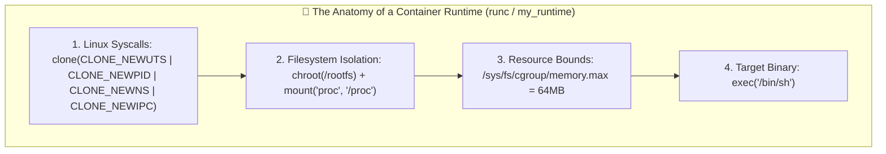
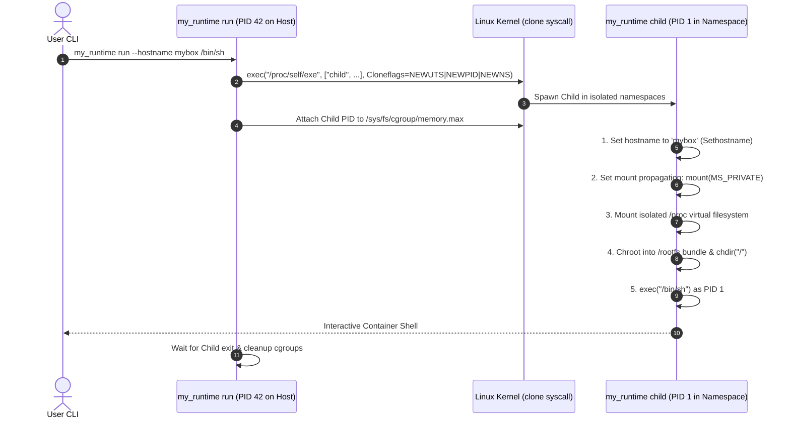

<!-- markdownlint-disable MD013 -->
# Mini-Project 10: Custom Container Runtime from Scratch

> **Domain**: 03. Containers & Image Optimization  
> **Level**: Intermediate to Advanced  
> **Infrastructure**: Local (Docker / Linux Kernel Namespaces / Pure Go)  

---

## 🎯 Overview & Context

One of the most profound realizations in systems engineering is that **"containers are not real"**.
Unlike virtual machines (which use a hypervisor like KVM/QEMU to emulate physical CPU, RAM,
and motherboards), a container has **no separate kernel** and **no virtual hardware**.

A container is simply **a standard Linux process** isolated by three fundamental kernel primitives:

1. **Linux Kernel Namespaces**: Control **what a process can SEE** (Hostname, Process table, Filesystem mounts, Network interfaces, IPC).
2. **Control Groups (Cgroups)**: Control **what a process can USE** (RAM limits, CPU quotas, I/O bandwidth).
3. **Chroot / Pivot_Root**: Control **WHERE a process can LOOK** on disk (jailing it inside an isolated root filesystem bundle).



### What We Build

In this mini-project, we demystify container engines (Docker, containerd, `runc`, Podman) by
implementing a **custom container runtime from scratch** in pure Go standard library ([`my_runtime.go`](file:///Users/fabian/Documents/CodeProjects/github.com/fabiankaraben/devops-sre-mini-projects/03-containers/10-custom-container-runtime-from-scratch/my_runtime.go)).

- Implements the **Re-Execution Pattern** via `/proc/self/exe child`.
- Isolates UTS (hostname), PID (processes), Mounts (`MS_PRIVATE`), and IPC namespaces.
- Prepares an isolated Alpine Linux rootfs bundle and mounts a dedicated `/proc` filesystem.
- Enforces real-time memory limits via Linux Cgroups.
- Provides a comprehensive verification suite auditing all container isolation boundaries.

---

## 🧠 Deep-Dive: Kernel Namespaces & Runtime Architecture

### 1. The Linux Kernel Namespaces Explained

| Namespace | Clone Flag | What it Isolates | Verification in Container |
| :--- | :--- | :--- | :--- |
| **UTS** | `CLONE_NEWUTS` | Hostname & NIS domain name. | Setting hostname in container does not change host. |
| **PID** | `CLONE_NEWPID` | Process IDs. Container process becomes PID 1. | `ps aux` only lists container processes; host is hidden. |
| **Mount** | `CLONE_NEWNS` | Filesystem mount points (`MS_PRIVATE`). | Mounting `/proc` does not alter host `/proc`. |
| **IPC** | `CLONE_NEWIPC` | System V IPC & POSIX message queues. | Shared memory segments are private to the container. |
| **Network** | `CLONE_NEWNET` | Network devices, routing tables, iptables. | Container receives dedicated loopback/veth interfaces. |
| **User** | `CLONE_NEWUSER` | User and Group IDs (UID/GID translation). | Root inside container maps to unprivileged UID on host. |

---

### 2. The Re-Execution Architecture Pattern (`/proc/self/exe`)

In Go and C runtimes (including `runc`), you cannot simply call `syscall.Unshare(CLONE_NEWPID)`
inside a running thread and expect the current process to become PID 1.

The Linux kernel rule dictates that **`CLONE_NEWPID` only takes effect for the children**
of the calling process. Furthermore, the Go runtime initializes multi-threaded OS threads
before `main()` executes.

To solve this, container runtimes utilize the **Two-Phase Re-Exec Pattern**:



---

### 3. Filesystem Isolation: `chroot` & Virtualizing `/proc`

Why does `ps` show host processes if you only use `chroot`?

Tools like `ps`, `top`, and `kill` do not ask the kernel directly for process lists;
they read the **/proc virtual filesystem** (`/proc/[pid]/status`).

If a runtime changes rootfs but fails to mount a fresh instance of `/proc`, `ps` will read
the host's `/proc` and display all host processes!

In [`my_runtime.go`](file:///Users/fabian/Documents/CodeProjects/github.com/fabiankaraben/devops-sre-mini-projects/03-containers/10-custom-container-runtime-from-scratch/my_runtime.go),
we explicitly isolate the mount tree:

```go
// 1. Make all parent mounts private
syscall.Mount("", "/", "", syscall.MS_PRIVATE|syscall.MS_REC, "")

// 2. Mount fresh proc filesystem inside rootfs
syscall.Mount("proc", filepath.Join(rootfs, "proc"), "proc", 0, "")

// 3. Jail process into rootfs
syscall.Chroot(rootfs)
os.Chdir("/")
```

---

## 📂 Project Structure

```text
03-containers/10-custom-container-runtime-from-scratch/
├── .dockerignore                 # Excludes binaries and bundle caches from Docker build
├── go.mod                        # Go module definition
├── my_runtime.go                 # Pure Go container runtime implementation
├── setup_rootfs.sh               # Provisions and extracts minimal Alpine rootfs bundle
├── Dockerfile                    # Privileged Linux container laboratory image
├── docker-compose.yml            # Declarative lab stack deployment
├── runtime_test_suite.sh         # 7-point isolation & namespace verification suite
├── test_runtime.sh               # Automated test runner and environment cleanup
└── README.md                     # Comprehensive educational guide & runtime reference
```

---

## 🚀 Hands-On Laboratory Scenarios

### Scenario 1: Host Environment Inspection

Inspect the parent host namespace and cgroup configuration:

```bash
docker run --rm --privileged devops-runtime-lab:latest /usr/local/bin/my_runtime info
```

#### Expected Host Inspection Output

```text
======================================================================
  ℹ️  Custom Container Runtime - Host Environment Inspection
======================================================================
  • Hostname:       907d42a2f7a2
  • Parent PID:     1
  • Current User:   UID 0 / GID 0
  • Active Namespaces:
      - cgroup   -> cgroup:[4026531835]
      - ipc      -> ipc:[4026531839]
      - mnt      -> mnt:[4026531841]
      - net      -> net:[4026531840]
      - pid      -> pid:[4026531836]
      - user     -> user:[4026531837]
      - uts      -> uts:[4026531838]
  • Cgroups:        v2
======================================================================
```

---

### Scenario 2: UTS Hostname Isolation

Launch a container with a custom hostname and verify that the host's hostname remains unchanged:

```bash
docker run --rm --privileged devops-runtime-lab:latest /usr/local/bin/my_runtime run --hostname isolated-box /bin/hostname
```

Response:

```text
isolated-box
```

---

### Scenario 3: PID Namespace & Process Invisibility

Run `ps` inside the custom container runtime:

```bash
docker run --rm --privileged devops-runtime-lab:latest /usr/local/bin/my_runtime run --rootfs /rootfs /bin/ps
```

#### Expected Process Table Output

```text
PID   USER     TIME  COMMAND
    1 root      0:00 /bin/ps
```

Notice that the container process is **PID 1**, and all host daemons (`dockerd`, `systemd`, `bash`)
are completely invisible!

---

### Scenario 4: Filesystem Boundary Verification

Verify that the container process can see its rootfs marker, but **cannot see host files**:

```bash
# 1. Read container rootfs marker (Allowed)
docker run --rm --privileged devops-runtime-lab:latest /usr/local/bin/my_runtime run --rootfs /rootfs /bin/cat /CONTAINER_ID

# 2. Attempt to read host secret /HOST_SYSTEM_FLAG.txt (Blocked / Invisible)
docker run --rm --privileged devops-runtime-lab:latest /usr/local/bin/my_runtime run --rootfs /rootfs /bin/cat /HOST_SYSTEM_FLAG.txt
```

Response:

```text
CONTAINER_ROOTFS_ISOLATED_FS
/bin/cat: can't open '/HOST_SYSTEM_FLAG.txt': No such file or directory
```

---

### Scenario 5: Applying Cgroups Memory Constraints

Execute a command with an explicit 64MB memory boundary:

```bash
docker run --rm --privileged devops-runtime-lab:latest /usr/local/bin/my_runtime run --mem 64M --rootfs /rootfs /bin/echo "CGROUP_MEMORY_BOUNDED"
```

Response:

```text
CGROUP_MEMORY_BOUNDED
```

---

## 🧪 Automated Verification Suite

Run the automated test runner to validate all 7 runtime isolation checks:

```bash
./test_runtime.sh
```

To run tests and preserve the container image for interactive experimentation:

```bash
./test_runtime.sh --keep
```

### Verification Assertions

| Test # | Scope | Target Verification |
| :---: | :--- | :--- |
| **01** | Binary Availability | Confirms `my_runtime` executable exists and responds. |
| **02** | UTS Namespace | Asserts container hostname change does not mutate host hostname. |
| **03** | PID Namespace | Asserts container process converges as PID 1; host processes hidden. |
| **04** | Mount Namespace | Asserts Alpine rootfs isolation and host flag invisibility. |
| **05** | I/O Forwarding | Asserts standard in/out/err pipes and binary execution. |
| **06** | Cgroups Memory Limit | Asserts cgroup memory limit provisioning and automatic teardown. |
| **07** | IPC Namespace | Asserts inter-process communication segregation in kernel tables. |

---

## 🧹 Complete Resource Teardown & Cleanup Guide

To maintain a clean workstation and remove all test containers and images:

### Method 1: Automated Cleanup (Recommended)

```bash
./test_runtime.sh --clean
```

---

### Method 2: Manual Docker Teardown Commands

```bash
# 1. Stop and remove all Compose stack containers
docker compose down -v --remove-orphans

# 2. Remove test containers
docker rm -f devops-runtime-lab devops-runtime-runner devops-runtime-test 2>/dev/null || true

# 3. Remove the built runtime lab image
docker rmi -f devops-runtime-lab:latest 2>/dev/null || true
```

---

### Verification: Confirming Zero Leftover Artifacts

Run the following commands to confirm your environment is completely pristine:

```bash
# Verify no runtime lab containers remain
docker ps -a --filter "name=devops-runtime"

# Verify no runtime lab images remain
docker images | grep "devops-runtime-lab"
```

If both commands return empty results, your environment is **100% clean** and ready for the next category!
