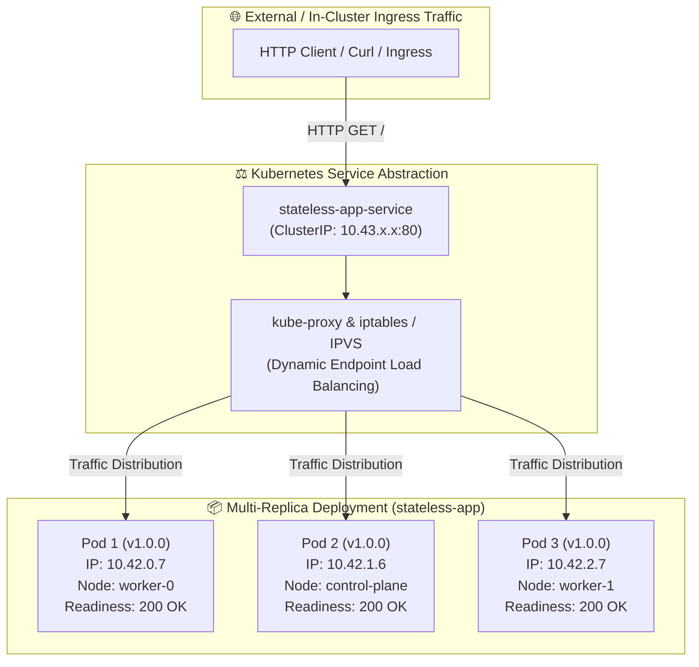
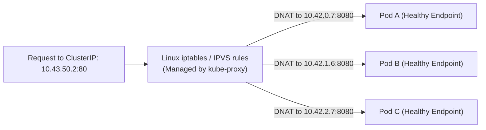
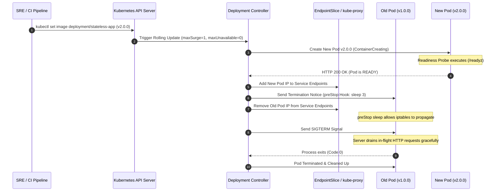

<!-- markdownlint-disable MD013 -->
# Mini-Project 01: Stateless Application Deployment and Service

> **Domain**: 04. Kubernetes & Orchestration  
> **Level**: Beginner to Intermediate  
> **Infrastructure**: Local (K3d / K3s / OrbStack / Minikube / Kind)  

---

## 🎯 Overview & Context

In modern Cloud-Native Engineering and Site Reliability Engineering (SRE),
**stateless applications** represent the foundational building blocks of scalable,
resilient distributed systems. A stateless service does not store client session
state, persistent files, or transaction databases on its local disk. Instead, any
incoming HTTP request can be fulfilled by any healthy replica running across
any worker node in the Kubernetes cluster.



### Core Problems Solved by Kubernetes Orchestration

1. **Self-Healing & Auto-Recovery**:
   If a container process crashes, runs out of memory (OOMKilled), or deadlocks,
   the Kubernetes `kubelet` agent automatically restarts the container according
   to its `restartPolicy` and `livenessProbe`.
2. **Horizontal Scalability**:
   Scaling from 3 to 100 replicas is a declarative configuration change
   (`replicas: 100`). Kubernetes automatically distributes pods across worker
   nodes.
3. **Decoupled Service Discovery**:
   Pods are ephemeral: they get created, destroyed, rescheduled, and receive dynamic
   IP addresses (`10.42.x.x`). A Kubernetes `ClusterIP` Service provides a stable
   virtual IP and internal DNS name (`stateless-app-service.stateless-app-demo.svc.cluster.local`)
   that tracks healthy pod IPs automatically via `EndpointSlices`.
4. **Zero-Downtime Rolling Updates**:
   Deploying a new software version (`v2.0.0`) must never drop live user traffic.
   By pairing a `RollingUpdate` strategy (`maxSurge: 1`, `maxUnavailable: 0`) with
   HTTP `readinessProbe` and `preStop` connection draining hooks, Kubernetes guarantees
   that new pods are 100% healthy before old pods are decommissioned.

---

## 🧠 Kubernetes Orchestration Internals Deep-Dive

### 1. The Controller Pattern & Desired State Reconciliation

Kubernetes operates on a declarative reconciliation model governed by the
**Controller Loop**:

```text
               ┌───────────────────────────────┐
               │    Observe (Current State)    │
               └──────────────┬────────────────┘
                              │
                              ▼
               ┌───────────────────────────────┐
               │   Compare with Desired State  │
               └──────────────┬────────────────┘
                              │
                              ▼
               ┌───────────────────────────────┐
               │    Act (Reconcile / Heal)     │
               └──────────────┬────────────────┘
                              │
                              └─────────── Loop Continuously
```

1. **Deployment Controller**: Manages the rollout and version history of `ReplicaSets`.
2. **ReplicaSet Controller**: Ensures that exactly `N` identical pod instances match
   the specified label selector (`app: stateless-app`).
3. **Kubelet**: Node-level agent that starts containers via the Container Runtime
   Interface (CRI), executes health probes, and streams status back to the API Server.

---

### 2. Service Discovery & `kube-proxy` Packet Routing

A Kubernetes `Service` is not a container or physical process; it is an abstract
firewall and routing configuration managed by `kube-proxy` across all cluster nodes.



- When a Service is created, the Kubernetes control plane allocates a virtual
  `ClusterIP` from the service CIDR block.
- `kube-proxy` programs Linux kernel `iptables` NAT chains or `IPVS` load balancing
  tables on every node.
- When packets target the `ClusterIP:Port`, kernel-level Destination Network Address
  Translation (DNAT) transparently rewrites the destination IP to a healthy pod IP.

---

### 3. Health Probes: Liveness vs. Readiness vs. Startup

Kubernetes provides three distinct HTTP health probe mechanisms:

| Probe Type | Purpose | Failure Consequence | Ideal Use Case |
| :--- | :--- | :--- | :--- |
| **`livenessProbe`** | Detects if the application is deadlocked or permanently broken. | Kubelet **kills and restarts** the container. | Catching unhandled thread deadlocks, fatal memory leaks, or hung event loops. |
| **`readinessProbe`** | Detects if the pod is initialized and ready to accept live HTTP traffic. | Pod IP is **removed from Service endpoints** (no traffic routed). | Warming up database caches, loading ML models, or graceful load shedding. |
| **`startupProbe`** | Disables liveness/readiness checks until initial boot completes. | Kubelet kills container only if `failureThreshold * periodSeconds` expires. | Legacy slow-starting Java/Spring workloads requiring >60s boot time. |

---

### 4. Downward API: Pod Metadata Injection

The Kubernetes **Downward API** allows containers to consume information about
themselves or the cluster environment without coupling the application code to
the Kubernetes API client libraries:

```yaml
env:
  - name: POD_NAME
    valueFrom:
      fieldRef:
        fieldPath: metadata.name
  - name: POD_NAMESPACE
    valueFrom:
      fieldRef:
        fieldPath: metadata.namespace
  - name: POD_IP
    valueFrom:
      fieldRef:
        fieldPath: status.podIP
  - name: NODE_NAME
    valueFrom:
      fieldRef:
        fieldPath: spec.nodeName
```

Inside the Go application, `main.go` reads `os.Getenv("POD_NAME")` and returns
the exact pod identity and hosting node in response headers and JSON payloads.

---

### 5. Zero-Downtime Rolling Update Mechanics

To achieve true zero-downtime during rolling updates, two Kubernetes configurations
must work in unison:



#### Why `maxSurge: 1` and `maxUnavailable: 0`

- `maxSurge: 1`: Allows Kubernetes to create **1 additional pod** above the desired
  replica count (e.g., 4 total pods during rollout).
- `maxUnavailable: 0`: Guarantees that **zero pods are terminated** before a new
  replacement pod has passed its `readinessProbe` and is ready to accept traffic.

#### Why the `preStop` Hook is Essential in Production

When a pod is deleted:

1. The API Server marks the pod as `Terminating` and informs `kube-proxy` to remove
   its IP from endpoint lists.
2. Simultaneously, `kubelet` sends `SIGTERM` to the container process.

Because endpoint removal propagation across all cluster nodes takes 1–2 seconds,
in-flight requests might still reach the pod after it receives `SIGTERM`. The
`lifecycle.preStop` hook (`sleep 3`) forces `kubelet` to pause before delivering
`SIGTERM`, ensuring all cluster nodes have removed the pod IP from their routing
tables before the server begins its shutdown sequence.

---

## 📂 Project Structure

```text
04-orchestration/01-stateless-app-deployment-service/
├── app/
│   ├── main.go               # Standalone Go HTTP microservice with health probes & Downward API
│   ├── go.mod                # Go module definition
│   ├── Dockerfile            # Production-grade multi-stage container build (<20MB Alpine base)
│   └── .dockerignore         # Container build context filtering rules
├── namespace.yaml            # Dedicated Kubernetes Namespace manifest (stateless-app-demo)
├── deployment.yaml           # Multi-replica Deployment with rolling update strategy & probes
├── service.yaml              # ClusterIP Service routing traffic across healthy pods
├── rollout_test.sh           # Interactive zero-downtime rolling update verification script
├── test_stateless_app.sh     # Automated 13-point end-to-end verification test suite
├── cleanup.sh                # Complete resource teardown and environment purge script
└── README.md                 # Pedagogical guide, architecture deep-dive & operations manual
```

---

## 🚀 Quickstart: Build, Deploy & Verify

### Prerequisites

Ensure you have a local Kubernetes cluster and Docker installed:

- **Docker Engine / OrbStack**: Running and accessible (`docker info`).
- **Kubernetes CLI (`kubectl`)**: Installed and configured (`kubectl version --client`).
- **Local Kubernetes Engine**: Any of the following:
  - **K3d** (Recommended for local testing): `k3d cluster create stateless-test --servers 1 --agents 2`
  - **OrbStack / Docker Desktop**: Enable Kubernetes in Settings.
  - **Minikube**: `minikube start`
  - **Kind**: `kind create cluster`

---

### Step 1: Build the Multi-Stage Container Images

Build both version `v1.0.0` and `v2.0.0` container images:

```bash
# Build baseline version v1.0.0
docker build -t stateless-app:v1.0.0 --build-arg VERSION=v1.0.0 app/

# Build update version v2.0.0
docker build -t stateless-app:v2.0.0 --build-arg VERSION=v2.0.0 app/
```

> **Note for K3d / Minikube / Kind users**:  
> If using a multi-node local cluster, import the built images into your cluster runtime:
>
> ```bash
> # For k3d:
> k3d image import stateless-app:v1.0.0 stateless-app:v2.0.0 -c <cluster-name>
>
> # For minikube:
> minikube image load stateless-app:v1.0.0 stateless-app:v2.0.0
>
> # For kind:
> kind load docker-image stateless-app:v1.0.0 stateless-app:v2.0.0
> ```

---

### Step 2: Deploy Declarative Kubernetes Manifests

Apply the manifests in order (Namespace -> Deployment -> Service):

```bash
kubectl apply -f namespace.yaml
kubectl apply -f deployment.yaml
kubectl apply -f service.yaml
```

Wait for all 3 replicas to reach `Ready` status:

```bash
kubectl rollout status deployment/stateless-app -n stateless-app-demo
```

---

### Step 3: Inspect the Running Workload

Check the status of pods, services, and endpoints:

```bash
# List pods with node placement and IP addresses
kubectl get pods -n stateless-app-demo -o wide

# Inspect ClusterIP service
kubectl get svc -n stateless-app-demo

# Inspect endpoint slice bindings
kubectl get endpointslices -n stateless-app-demo
```

Expected output:

```text
NAME                             READY   STATUS    RESTARTS   AGE   IP          NODE
stateless-app-685897c58b-44xpd   1/1     Running   0          25s   10.42.0.7   k3d-agent-1
stateless-app-685897c58b-9wrhm   1/1     Running   0          25s   10.42.1.6   k3d-server-0
stateless-app-685897c58b-p25pq   1/1     Running   0          25s   10.42.2.7   k3d-agent-0
```

---

### Step 4: Test Service Endpoints via Port-Forwarding

Forward local port `18080` to the Kubernetes Service:

```bash
kubectl port-forward -n stateless-app-demo svc/stateless-app-service 18080:80
```

In a separate terminal, query the application endpoints:

```bash
# Query root API endpoint (returns pod hostname, pod IP, node name, version)
curl -s http://localhost:18080/ | jq .

# Query liveness probe endpoint
curl -s http://localhost:18080/healthz | jq .

# Query readiness probe endpoint
curl -s http://localhost:18080/readyz | jq .

# Query diagnostic runtime metadata
curl -s http://localhost:18080/info | jq .
```

Sample JSON response:

```json
{
  "message": "Stateless microservice is running successfully on Kubernetes!",
  "version": "v1.0.0",
  "hostname": "stateless-app-685897c58b-44xpd",
  "pod_name": "stateless-app-685897c58b-44xpd",
  "pod_namespace": "stateless-app-demo",
  "pod_ip": "10.42.0.7",
  "node_name": "k3d-agent-1",
  "environment": "production",
  "timestamp": "2026-08-21T12:45:00.000000000Z",
  "uptime_seconds": 34.5,
  "request_count": 1
}
```

---

## 🧪 Testing Zero-Downtime Rolling Updates

The project includes an automated zero-downtime verification script: `rollout_test.sh`.

```bash
./rollout_test.sh
```

### What `rollout_test.sh` Does

1. Launches an in-cluster continuous HTTP traffic generator pod sending ~20 requests/second to `http://stateless-app-service/`.
2. Triggers a live rolling update: `kubectl set image deployment/stateless-app stateless-app=stateless-app:v2.0.0`.
3. Monitors the rolling replacement in real-time as new pods boot and pass readiness probes.
4. Collects and parses all HTTP responses, verifying:
   - **0 dropped requests** (100.00% HTTP 200 success rate).
   - Seamless traffic handover from `v1.0.0` to `v2.0.0`.
   - Multi-pod load distribution across all 3 active replicas.

Sample output:

```text
======================================================================
  ☸️  Kubernetes Zero-Downtime Rolling Update Test Suite
======================================================================
▶ Step 1: Inspecting Current Deployment State...
  Namespace: stateless-app-demo
  Deployment: stateless-app
  Active Image: stateless-app:v1.0.0
  Rollout Target: stateless-app:v2.0.0

▶ Step 2: Spawning In-Cluster Continuous Traffic Tester Pod...
  Waiting for traffic generator pod to initialize...
  [OK] High-frequency continuous traffic stream active (~20 req/sec).

▶ Step 3: Triggering Kubernetes Rolling Update -> stateless-app:v2.0.0...
deployment.apps/stateless-app image updated
  Watching rollout status in real-time...
deployment "stateless-app" successfully rolled out

▶ Step 4: Collecting & Aggregating Traffic Metrics...

📊 ZERO-DOWNTIME ROLLOUT VERIFICATION REPORT
======================================================================
  Total Requests Dispatched        : 211
  Successful Requests (HTTP 200)   : 211 (100.00%)
  Dropped / Failed Requests        : 0
  Requests Handled by v1.0.0       : 124
  Requests Handled by v2.0.0       : 87
  Active Backend Pods Involved     : stateless-app-685897c58b-xxx stateless-app-7b886d679-yyy
======================================================================
✅ ZERO-DOWNTIME VERIFICATION PASSED: 100.00% availability observed!
```

---

## ⚡ Automated End-to-End Test Suite

Run the full 13-point automated verification suite:

```bash
./test_stateless_app.sh
```

### Verification Matrix

| # | Test Case Description | Scope & Verification Method |
| :--- | :--- | :--- |
| **01** | Docker Engine Availability | Validates Docker daemon is responsive. |
| **02** | Kubernetes Cluster Connectivity | Validates active context and API server communication. |
| **03** | Baseline Image Build (`v1.0.0`) | Builds multi-stage Docker image and verifies size (<20MB). |
| **04** | Target Image Build (`v2.0.0`) | Validates dynamic build arguments and version propagation. |
| **05** | Declarative YAML Syntax Validation | Executes `kubectl apply --dry-run=client` across all manifests. |
| **06** | Deployment Replica Readiness | Applies manifests and validates `3/3` healthy pods scheduled. |
| **07** | ClusterIP Service Connectivity | Validates HTTP reachability through Service endpoint. |
| **08** | Health Probes Responsiveness | Tests HTTP 200 responses on `/healthz` and `/readyz`. |
| **09** | Downward API Metadata Injection | Verifies Pod Name, Namespace, IP, and Node inside `/info`. |
| **10** | Multi-Replica Load Distribution | Confirms requests are balanced across distinct pod IPs. |
| **11** | Zero-Downtime Rolling Update | Verifies 100% request success rate during live image upgrade. |
| **12** | Rollback Verification | Tests `kubectl rollout undo` and confirms restoration of `v1.0.0`. |
| **13** | Resource Teardown & Cleanliness | Confirms all pods, services, and namespaces are purged. |

---

## 🧹 Complete Resource Teardown & Cleanup

To leave your local environment completely clean for subsequent mini-projects, execute the provided cleanup script:

```bash
./cleanup.sh
```

### Manual Teardown Commands

If you prefer executing cleanup steps manually:

```bash
# 1. Terminate any active port-forward tunnels
pkill -f "port-forward.*stateless-app" || true

# 2. Delete the Kubernetes namespace (cascades deletion of Deployment, Pods, and Service)
kubectl delete namespace stateless-app-demo --ignore-not-found=true

# 3. Remove local Docker images
docker rmi -f stateless-app:v1.0.0 stateless-app:v2.0.0

# 4. (Optional) Delete temporary K3d test cluster if one was created
k3d cluster delete stateless-test
```

---

## 📚 SRE Best Practices Summary

1. **Explicit Resource Governance**: Always declare CPU and memory `requests` and
   `limits` to establish Quality of Service (QoS) classes (Burstable/Guaranteed)
   and prevent noisy-neighbor memory exhaustion.
2. **Readiness Probe Isolation**: Never expose an application to traffic until
   internal caches and database connections are established.
3. **Graceful Connection Draining**: Always combine `lifecycle.preStop` sleep with
   application-level `SIGTERM` connection draining to guarantee zero dropped
   connections during rolling updates and pod autoscaling.
4. **Least-Privilege Security**: Run containers as unprivileged users (`UID 10001`),
   drop all Linux capabilities (`drop: ["ALL"]`), and prevent privilege escalation.
