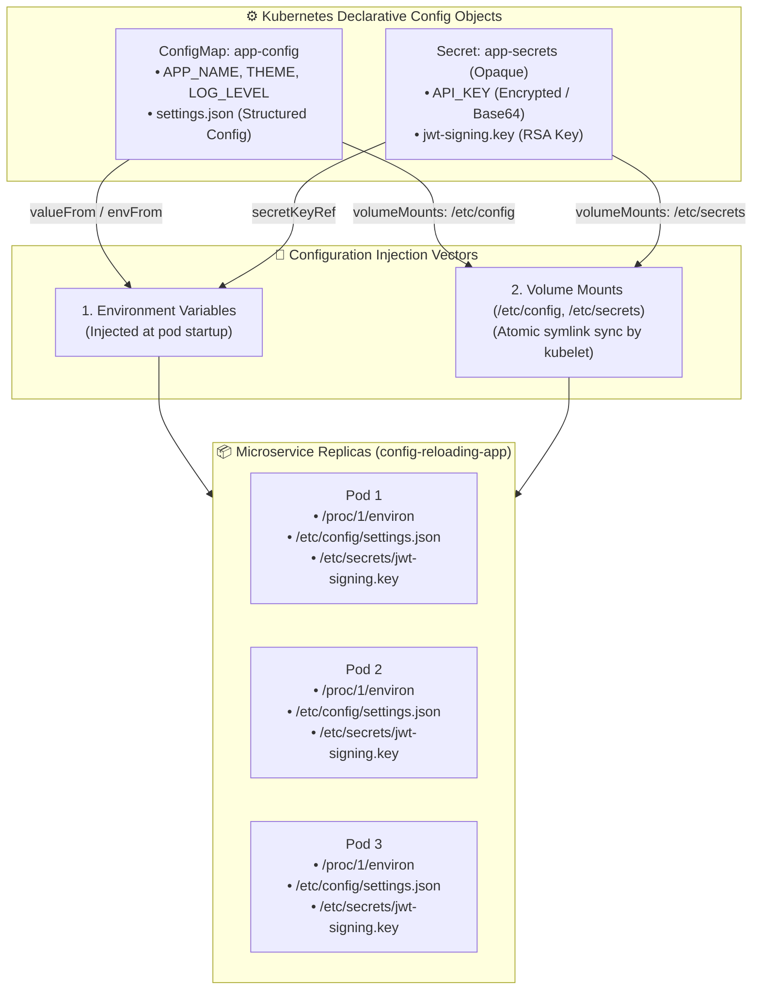
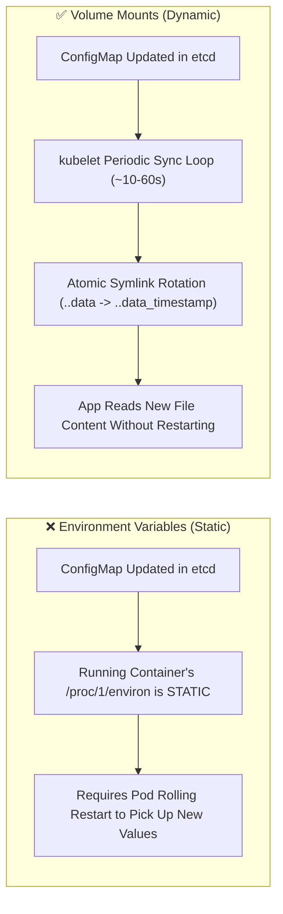
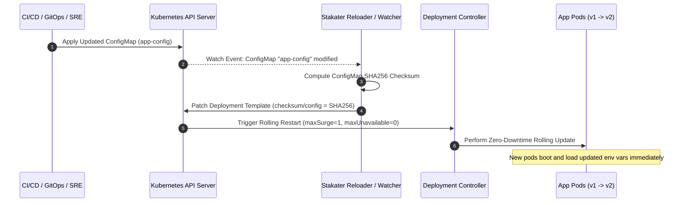

<!-- markdownlint-disable MD013 -->
# Mini-Project 02: ConfigMaps, Secrets, and Dynamic Reloading

> **Domain**: 04. Kubernetes & Orchestration  
> **Level**: Beginner to Intermediate  
> **Infrastructure**: Local (K3d / K3s / OrbStack / Minikube / Kind)  

---

## 🎯 Overview & Context

In modern cloud-native architectures and Site Reliability Engineering (SRE),
adhering to the **Twelve-Factor App methodology (Principle III: Config)** requires
strict separation of configuration and secrets from application code and container
images. Building database passwords, API keys, or environment-specific flags
directly into Docker images creates severe security liabilities and prevents
deploying the exact same immutable container artifact across development, staging,
and production environments.



### Core Problems Solved by ConfigMaps, Secrets & Dynamic Reloading

1. **Immutable Container Images**:
   Build the application binary once and promote the exact same container image
   through all environments simply by binding different ConfigMaps and Secrets.
2. **Decoupled Security & Least Privilege**:
   Sensitive API credentials and private keys are stored in encrypted Kubernetes
   Secrets with restricted RBAC access and mounted via in-memory `tmpfs` volumes
   with strict read-only permissions (`0444` / `0400`).
3. **Configuration Mutation Strategies**:
   - **Environment Variable Updates**: When scalar values change, trigger an automated,
     zero-downtime rolling restart using the GitOps/Helm checksum annotation pattern
     (`checksum/config: $(sha256sum configmap)`) or Stakater Reloader.
   - **Live Volume Hot-Reloading**: When configuration files mounted as volumes
     are modified, Kubernetes `kubelet` automatically updates the file contents inside
     running containers via atomic symlinks without requiring a pod restart.

---

## 🧠 Kubernetes Configuration Mechanics Deep-Dive

### 1. ConfigMaps vs. Secrets Comparison Matrix

| Property | Kubernetes ConfigMap | Kubernetes Secret (`type: Opaque`) |
| :--- | :--- | :--- |
| **Primary Purpose** | Non-confidential application configuration, feature flags, config files. | Confidential credentials, API tokens, database passwords, TLS/RSA keys. |
| **Storage in API Server** | Stored as plaintext UTF-8 in etcd. | Stored as Base64-encoded bytes in etcd (supports KMS encryption at rest). |
| **Size Limit** | 1 MiB per object. | 1 MiB per object. |
| **Volume Mount Backing** | Regular node filesystem projection. | **In-Memory `tmpfs`** (never written to node swap/disk storage). |
| **Access Control** | Standard RBAC permissions. | Restricted RBAC (separate `secrets` API group for principle of least privilege). |

---

### 2. Environment Variables vs. Volume Mounts: Update Behavior

Understanding how Kubernetes injects configuration is vital for designing reliable applications:



#### Why Environment Variables Require Pod Restarts

When a container process spawns, Linux initializes its environment variables in
`/proc/1/environ`. Operating systems do not allow external processes to modify the
environment of a running process. Therefore, updates to a ConfigMap are **never
reflected in existing environment variables** until the pod is deleted and a new
pod is created.

#### How Atomic Volume Symlinks Work

When Kubernetes mounts a ConfigMap or Secret as a volume at `/etc/config`, it creates
a directory structure using atomic symbolic links:

```text
/etc/config/
├── ..2026_08_21_12_00_00.123456789/   # Concrete timestamped data directory
│   └── settings.json
├── ..data -> ..2026_08_21_12_00_00.123456789/  # Intermediate symlink
└── settings.json -> ..data/settings.json         # Exposed user-facing file
```

When you update the ConfigMap, `kubelet`:

1. Writes a new timestamped directory (e.g. `..2026_08_21_12_05_00.987654321/`).
2. Atomically rotates the `..data` symlink to point to the new directory using the
   Linux `rename()` syscall.
3. Deletes the old timestamped directory.

Because `rename()` is atomic at the filesystem level, application processes never
experience torn reads or corrupt partial file contents while the configuration updates.

---

### 3. Dynamic Reloading Strategies in Production

To automate pod reloads upon configuration mutations, production clusters leverage:



1. **GitOps Checksum Annotation Pattern (`checksum/config`)**:
   In Helm charts and Kustomize overlays, the SHA256 checksum of the ConfigMap is
   injected into `spec.template.metadata.annotations`:

   ```yaml
   spec:
     template:
       metadata:
         annotations:
           checksum/config: "f39fb45bc230de0c..."
   ```

   When the configuration changes, the pod template metadata changes, prompting
   Kubernetes to trigger an automatic rolling restart.

2. **Stakater Reloader Controller**:
   A lightweight Kubernetes controller that watches ConfigMaps and Secrets. When
   it detects mutations, it automatically triggers rolling upgrades on Deployments
   annotated with `reloader.stakater.com/auto: "true"`.

---

## 📂 Project Structure

```text
04-orchestration/02-configmaps-secrets-reloading/
├── app/
│   ├── main.go               # Go HTTP REST service reading env vars, secrets & volume files
│   ├── go.mod                # Go module definition
│   ├── Dockerfile            # Multi-stage minimal container build (<20MB Alpine base)
│   └── .dockerignore         # Docker build context exclusions
├── namespace.yaml            # Dedicated Kubernetes Namespace manifest (config-reloading-demo)
├── configmap.yaml            # ConfigMap with scalar env vars and structured settings.json
├── secret.yaml               # Secret with API keys, DB passwords, and RSA private key
├── deployment.yaml           # Deployment binding env vars, mounting volumes, and checksum annotations
├── service.yaml              # ClusterIP Service routing traffic across healthy pods
├── config_reload_test.sh     # Interactive script testing rolling reload with live traffic
├── test_config_reloading.sh  # Automated 12-point end-to-end verification test suite
├── cleanup.sh                # Complete environment teardown script
└── README.md                 # Pedagogical guide, internals deep-dive & operations manual
```

---

## 🚀 Quickstart: Build, Deploy & Verify

### Prerequisites

Ensure you have a local Kubernetes cluster and Docker running:

- **Docker Engine / OrbStack**: Running and accessible (`docker info`).
- **Kubernetes CLI (`kubectl`)**: Installed and configured (`kubectl version --client`).
- **Local Cluster**: Any active Kubernetes cluster (e.g. K3d, OrbStack, Minikube, Kind).

---

### Step 1: Build the Multi-Stage Container Image

Build the Go microservice image:

```bash
docker build -t config-reloading-app:v1.0.0 app/
```

> **Note for K3d / Minikube / Kind users**:  
> Import the built image into your cluster runtime:
>
> ```bash
> # For k3d:
> k3d image import config-reloading-app:v1.0.0 -c <cluster-name>
>
> # For minikube:
> minikube image load config-reloading-app:v1.0.0
>
> # For kind:
> kind load docker-image config-reloading-app:v1.0.0
> ```

---

### Step 2: Deploy Declarative Kubernetes Manifests

Apply the manifests into the cluster:

```bash
kubectl apply -f namespace.yaml
kubectl apply -f configmap.yaml
kubectl apply -f secret.yaml
kubectl apply -f deployment.yaml
kubectl apply -f service.yaml
```

Wait for all 3 replicas to reach `Ready` status:

```bash
kubectl rollout status deployment/config-reloading-app -n config-reloading-demo
```

---

### Step 3: Inspect Configuration & Secret Injection

Examine the deployed objects and verify secrets are protected:

```bash
# Inspect ConfigMap data
kubectl get configmap app-config -n config-reloading-demo -o yaml

# Inspect Secret (observe Base64 encoding)
kubectl get secret app-secrets -n config-reloading-demo -o yaml

# Inspect running pods
kubectl get pods -n config-reloading-demo -o wide
```

---

### Step 4: Access Endpoints via Port-Forwarding

Forward local port `18081` to the Kubernetes service:

```bash
kubectl port-forward -n config-reloading-demo svc/config-reloading-service 18081:80
```

In another terminal, query the API endpoints:

```bash
# 1. Query root API payload (returns environment, volume config & masked secrets)
curl -s http://localhost:18081/ | jq .

# 2. Query detailed configuration inspection endpoint
curl -s http://localhost:18081/config | jq .

# 3. Query health probes
curl -s http://localhost:18081/healthz
```

Sample output:

```json
{
  "message": "ConfigMap & Secret Dynamic Reloading Demo",
  "pod": {
    "pod_name": "config-reloading-app-59bb85d459-jwlzq",
    "pod_namespace": "config-reloading-demo",
    "pod_ip": "10.42.0.8",
    "node_name": "k3d-agent-0"
  },
  "env_config": {
    "app_name": "Microservice-Alpha",
    "environment": "staging",
    "log_level": "INFO",
    "theme": "dark-mode",
    "feature_flag_analytics": true
  },
  "volume_config_json": {
    "database": {
      "pool_size": 25,
      "read_replica_enabled": true,
      "timeout_seconds": 5
    },
    "cache": {
      "cluster_mode": false,
      "provider": "redis",
      "ttl_seconds": 3600
    },
    "rate_limiting": {
      "enabled": true,
      "max_requests_per_minute": 1200
    }
  },
  "secret_metadata": {
    "api_key_masked": "sk_************************************c",
    "db_password_length": 42,
    "jwt_key_present": true,
    "jwt_key_sha256": "a8889dd265cf1bd62b56a7a17918a5afd1ecc7cab63840ba8e980e098b11e905"
  },
  "timestamp": "2026-08-21T13:05:44.187385261Z",
  "uptime_seconds": 45.2,
  "request_count": 1
}
```

---

## 🧪 Testing Dynamic Reloading

The project includes an interactive verification script: `config_reload_test.sh`.

```bash
./config_reload_test.sh
```

### What `config_reload_test.sh` Does

1. Samples the current baseline configuration (`THEME=dark-mode`).
2. Mutates the ConfigMap key (`THEME=cyberpunk-neon`, `LOG_LEVEL=DEBUG`).
3. Starts continuous in-cluster background traffic (~20 req/sec) querying `http://config-reloading-service/`.
4. Computes the SHA256 checksum of the updated ConfigMap and patches `checksum/config` in the deployment template.
5. Monitors the rolling restart in real-time as new pods boot and pass health probes.
6. Analyzes all responses and asserts:
   - **0 dropped requests** (100.00% HTTP 200 availability).
   - Seamless transition from `dark-mode` to `cyberpunk-neon`.
   - Traffic handled across multiple distinct pod replicas.

Sample test output:

```text
======================================================================
  ☸️  Kubernetes ConfigMap, Secret & Dynamic Reloading Test Suite
======================================================================
▶ Step 1: Inspecting Current Baseline Configuration...
  Current Environment THEME : dark-mode

▶ Step 2: Mutating ConfigMap Environment Variable -> THEME=cyberpunk-neon...
configmap/app-config patched
  Updated ConfigMap SHA256 Checksum: cfebd3fe208ea971...

▶ Step 3: Spawning In-Cluster Continuous Traffic Stream...
  [OK] High-frequency continuous traffic stream active (~20 req/sec).

▶ Step 4: Applying Checksum Annotation to Trigger Zero-Downtime Reload...
deployment.apps/config-reloading-app patched
  Watching rollout transition in real-time...
deployment "config-reloading-app" successfully rolled out

▶ Step 5: Collecting & Analyzing Traffic & Configuration Metrics...

📊 DYNAMIC RELOAD VERIFICATION REPORT
======================================================================
  Total Requests Dispatched        : 217
  Successful Requests (HTTP 200)   : 217 (100.00%)
  Dropped / Failed Requests        : 0
  Requests with Initial Theme (dark-mode) : 152
  Requests with Updated Theme (cyberpunk-neon) : 65
  Active Pod Replicas Involved     : 6 distinct pods (3 old + 3 new)
======================================================================
✅ DYNAMIC RELOAD VERIFICATION PASSED: 100.0% availability observed!
```

---

## ⚡ Automated End-to-End Test Suite

Run the full 12-point automated verification suite:

```bash
./test_config_reloading.sh
```

### Verification Matrix

| # | Test Case Description | Scope & Verification Method |
| :--- | :--- | :--- |
| **01** | Docker Engine Availability | Validates Docker daemon is responsive. |
| **02** | Kubernetes Cluster Reachability | Validates active context and API server communication. |
| **03** | Microservice Image Build | Builds multi-stage Docker image and verifies size (<20MB). |
| **04** | Declarative Manifest Dry-Run | Runs `kubectl apply --dry-run=client` across all YAML files. |
| **05** | Deployment Replica Readiness | Applies manifests and validates `3/3` healthy pods scheduled. |
| **06** | ClusterIP Service Connectivity | Validates HTTP reachability through port-forward endpoint. |
| **07** | ConfigMap Env Var Injection | Confirms `APP_NAME` and `THEME` environment variables match ConfigMap. |
| **08** | Secret Injection & Masking | Confirms credentials are injected and masked in API outputs. |
| **09** | Volume-Mounted Config File | Parses `/etc/config/settings.json` and verifies `pool_size: 25`. |
| **10** | Volume-Mounted Secret Key | Verifies `/etc/secrets/jwt-signing.key` exists and matches SHA256 hash. |
| **11** | Zero-Downtime Config Reload | Mutates ConfigMap and validates zero dropped requests during reload. |
| **12** | Resource Teardown Verification | Validates `cleanup.sh` purges namespace, pods, and Docker images. |

---

## 🧹 Complete Resource Teardown & Cleanup

To leave your local environment completely clean for subsequent mini-projects, execute the cleanup script:

```bash
./cleanup.sh
```

### Manual Cleanup Commands

```bash
# 1. Terminate active port-forward tunnels
pkill -f "port-forward.*config-reloading" || true

# 2. Delete the Kubernetes namespace (cascades deletion of Deployments, Services, ConfigMaps, Secrets)
kubectl delete namespace config-reloading-demo --ignore-not-found=true

# 3. Remove local Docker images
docker rmi -f config-reloading-app:v1.0.0

# 4. (Optional) Delete temporary K3d test cluster if created
k3d cluster delete config-test
```

---

## 📚 SRE Best Practices for Config & Secret Governance

1. **Never Commit Secrets to Git**: Keep raw secrets out of source control. Use external
   secret managers (HashiCorp Vault, AWS Secrets Manager, Google Secret Manager) paired
   with the **External Secrets Operator (ESO)**.
2. **Restrict Secret Permissions**: Always configure `defaultMode: 292` (`0444` octal)
   or `fsGroup` so unprivileged processes (`runAsNonRoot: true`) can read secret files
   without requiring `root` permissions.
3. **Decouple Config Lifecycles**: Use Volume Mounts when application components
   support hot-reloading file watchers. Use Config Checksum Annotations (`checksum/config`)
   when environment variables require graceful rolling restarts.
4. **Audit API Responses**: Never return unmasked raw secret strings in HTTP response
   payloads or debug logs.
