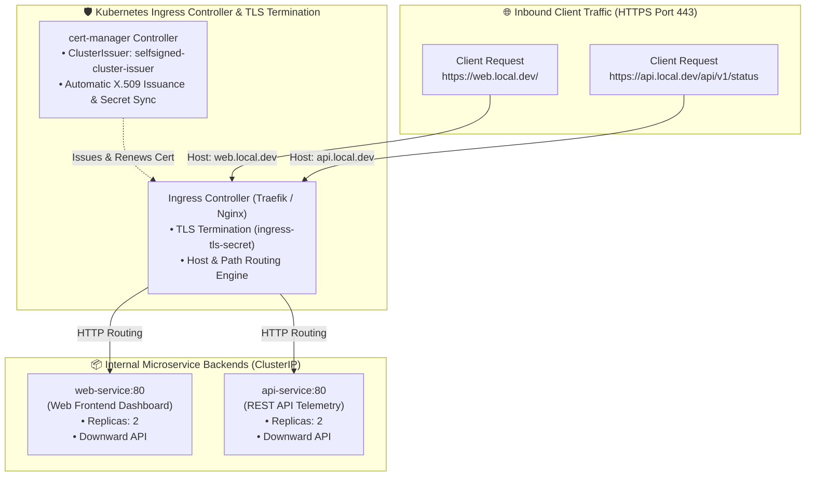
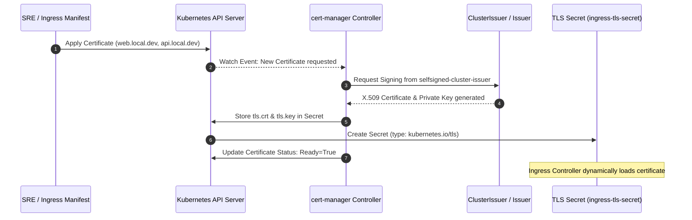

<!-- markdownlint-disable MD013 -->
# Mini-Project 03: Ingress Routing with Automated TLS via cert-manager

> **Domain**: 04. Kubernetes & Orchestration  
> **Level**: Beginner to Intermediate  
> **Infrastructure**: Local (K3d / K3s / OrbStack / Minikube / Kind with Ingress Controller)  

---

## 🎯 Overview & Context

In production Kubernetes clusters, exposing dozens of internal microservices
directly via dedicated cloud load balancers (`type: LoadBalancer`) creates excessive
cloud infrastructure costs, operational complexity, and fragmented security policies.
Instead, modern cloud-native architectures deploy a centralized **Ingress Controller**
(such as Nginx, Traefik, or Envoy) paired with **cert-manager** to provide:

1. **Centralized Layer 7 Routing**: Route HTTP/HTTPS traffic based on request hostnames
   (`web.local.dev`, `api.local.dev`) and URI paths (`/api/v1`, `/web`) to distinct
   backend services using a single entrypoint.
2. **Automated X.509 TLS Certificate Lifecycle**: Automatically issue, configure, and
   renew TLS certificates before expiration without manual SRE intervention or service outages.
3. **Decoupled TLS Termination**: Decouple encryption overhead from backend application
   code by terminating SSL/TLS at the Ingress perimeter.



---

## 🧠 Ingress & cert-manager Architecture Deep-Dive

### 1. North-South vs. East-West Kubernetes Networking

- **East-West Traffic**: Internal, inter-service communication occurring between pods
  across the cluster network (managed via standard `ClusterIP` Services and DNS).
- **North-South Traffic**: Traffic entering the cluster from external clients outside
  the cluster perimeter (managed via `Ingress` and `LoadBalancer` resources).

```text
       ┌───────────────────────────────┐
       │   External Internet Client    │
       └──────────────┬────────────────┘
                      │ (North-South Traffic)
                      ▼
       ┌───────────────────────────────┐
       │      Ingress Controller       │ ◄── TLS Termination & Routing
       └───────┬───────────────┬───────┘
               │               │
      (East-West)             (East-West)
               ▼               ▼
       ┌──────────────┐ ┌──────────────┐
       │ web-service  │ │ api-service  │
       └──────────────┘ └──────────────┘
```

---

### 2. What is cert-manager?

**cert-manager** is the industry-standard Kubernetes native certificate management
controller. It introduces declarative Custom Resource Definitions (CRDs) that automate
requesting, issuing, and renewing X.509 certificates from various public and private
issuers (Let's Encrypt, HashiCorp Vault, Venafi, or local SelfSigned/CA issuers).



### Key cert-manager CRDs

1. **`ClusterIssuer` / `Issuer`**: Defines the certificate authority (CA) or ACME
   endpoint responsible for signing certificate requests across the cluster.
2. **`Certificate`**: Declarative definition of the required X.509 certificate,
   including Common Name (`CN`), Subject Alternative Names (`dnsNames`), validity
   duration (`2160h`), and target Secret name.
3. **`CertificateRequest`**: Ephemeral resource generated by cert-manager to handle
   the signing request lifecycle.
4. **`Secret` (`type: kubernetes.io/tls`)**: Standard Kubernetes secret containing
   the public certificate (`tls.crt`) and private RSA key (`tls.key`).

---

### 3. Host-Based Ingress Routing Rules

In `ingress.yaml`, we define distinct host-based rules that map domain names to
separate internal `ClusterIP` Services:

```yaml
spec:
  tls:
    - hosts:
        - web.local.dev
        - api.local.dev
      secretName: ingress-tls-secret
  rules:
    - host: web.local.dev
      http:
        paths:
          - path: /
            pathType: Prefix
            backend:
              service:
                name: web-service
                port:
                  number: 80
    - host: api.local.dev
      http:
        paths:
          - path: /
            pathType: Prefix
            backend:
              service:
                name: api-service
                port:
                  number: 80
```

When an HTTPS request arrives:

1. **TLS Handshake**: Ingress inspects the Server Name Indication (SNI) extension,
   selects the certificate stored in `ingress-tls-secret`, and completes the TLS
   handshake.
2. **L7 Routing**: Ingress inspects the HTTP `Host` header (`web.local.dev` vs
   `api.local.dev`) and proxies traffic to the corresponding backend pods.

---

## 📂 Project Structure

```text
04-orchestration/03-ingress-routing-tls-cert-manager/
├── app/
│   ├── main.go               # Unified Go HTTP microservice serving Web dashboard and REST API
│   ├── go.mod                # Go module definition
│   ├── Dockerfile            # Multi-stage minimal container build (<20MB Alpine base)
│   └── .dockerignore         # Docker build context exclusions
├── namespace.yaml            # Dedicated Kubernetes Namespace (ingress-tls-demo)
├── web-backend.yaml          # Deployment & Service for web-service (HTML frontend)
├── api-backend.yaml          # Deployment & Service for api-service (REST JSON API)
├── issuer.yaml               # cert-manager ClusterIssuer manifest (SelfSigned CA)
├── certificate.yaml          # cert-manager Certificate manifest requesting SANs
├── ingress.yaml              # Ingress manifest with host-based rules and TLS termination
├── test_ingress_tls.sh       # Interactive verification script testing TLS & host routing
├── test_project.sh           # Automated 8-point end-to-end verification test suite
├── cleanup.sh                # Complete environment teardown script
└── README.md                 # Pedagogical guide, architecture deep-dive & operations manual
```

---

## 🚀 Quickstart: Build, Deploy & Verify

### Prerequisites

Ensure you have Docker and a local Kubernetes cluster with an Ingress Controller running:

- **Docker Engine / OrbStack**: Running and responsive (`docker info`).
- **Kubernetes CLI (`kubectl`)**: Installed and configured (`kubectl version --client`).
- **Local Kubernetes Cluster with Ingress Support**:
  - **K3d / K3s** (Recommended): Comes with Traefik ingress controller enabled out-of-the-box:

    ```bash
    k3d cluster create ingress-demo --servers 1 --agents 2 --port "8080:80@loadbalancer" --port "8443:443@loadbalancer"
    ```

  - **Minikube**: Enable ingress addon (`minikube addons enable ingress`).
  - **Kind**: Install Nginx Ingress Controller.

---

### Step 1: Build the Container Image

Build the unified backend application image:

```bash
docker build -t ingress-tls-app:v1.0.0 app/
```

> **Note for K3d / Minikube / Kind users**:  
> Import the built image into your cluster runtime:
>
> ```bash
> # For k3d:
> k3d image import ingress-tls-app:v1.0.0 -c <cluster-name>
>
> # For minikube:
> minikube image load ingress-tls-app:v1.0.0
>
> # For kind:
> kind load docker-image ingress-tls-app:v1.0.0
> ```

---

### Step 2: Install cert-manager

Install cert-manager CRDs and controller components:

```bash
kubectl apply -f https://github.com/cert-manager/cert-manager/releases/download/v1.17.1/cert-manager.yaml
```

Wait for cert-manager deployments to become ready:

```bash
kubectl rollout status deployment/cert-manager-webhook -n cert-manager --timeout=120s
```

---

### Step 3: Deploy Declarative Manifests

Apply the project manifests in order:

```bash
kubectl apply -f namespace.yaml
kubectl apply -f web-backend.yaml
kubectl apply -f api-backend.yaml
kubectl apply -f issuer.yaml
kubectl apply -f certificate.yaml
kubectl apply -f ingress.yaml
```

Wait for backend deployments to become healthy:

```bash
kubectl rollout status deployment/web-service -n ingress-tls-demo
kubectl rollout status deployment/api-service -n ingress-tls-demo
```

---

### Step 4: Verify Certificate Issuance

Verify that cert-manager reconciled the `Certificate` resource into a valid Secret:

```bash
# Check Certificate status (should show READY: True)
kubectl get certificate ingress-tls-certificate -n ingress-tls-demo

# Check generated TLS Secret
kubectl get secret ingress-tls-secret -n ingress-tls-demo
```

Expected output:

```text
NAME                      READY   SECRET               AGE
ingress-tls-certificate   True    ingress-tls-secret   20s
```

---

### Step 5: Audit X.509 Certificate SAN Extensions

Inspect the generated X.509 certificate using `openssl`:

```bash
kubectl get secret ingress-tls-secret -n ingress-tls-demo -o jsonpath='{.data.tls\.crt}' | base64 -d | openssl x509 -text -noout | grep -A 1 "Subject Alternative Name"
```

Expected output:

```text
X509v3 Subject Alternative Name: 
    DNS:web.local.dev, DNS:api.local.dev, DNS:localhost
```

---

### Step 6: Test Ingress Routing & TLS Handshake

Send HTTPS requests with custom Host headers to verify host-based routing:

```bash
# Test Web Frontend routing
curl -k -H "Host: web.local.dev" https://localhost:8443/

# Test REST API routing
curl -k -H "Host: api.local.dev" https://localhost:8443/api/v1/status | jq .
```

Sample JSON response from `api.local.dev`:

```json
{
  "status": "operational",
  "service_type": "api",
  "pod": {
    "pod_name": "api-service-75cfb6d857-4xk9p",
    "pod_namespace": "ingress-tls-demo",
    "pod_ip": "10.42.1.8",
    "node_name": "k3d-agent-0"
  },
  "request": {
    "host": "api.local.dev",
    "method": "GET",
    "protocol": "https",
    "url": "/api/v1/status"
  },
  "request_count": 1,
  "timestamp": "2026-08-21T13:12:00.000000000Z"
}
```

---

## 🧪 Testing Ingress & TLS Automation

The project includes an automated verification script: `test_ingress_tls.sh`.

```bash
./test_ingress_tls.sh
```

### What `test_ingress_tls.sh` Validates

1. Asserts that cert-manager reconciled `Certificate` to `Ready=True`.
2. Asserts that `ingress-tls-secret` was generated with valid `tls.crt` and `tls.key`.
3. Verifies X.509 Subject Alternative Names (`DNS:web.local.dev, DNS:api.local.dev`).
4. Verifies `web-service` backend responds with Web frontend payload.
5. Verifies `api-service` backend responds with REST API payload.
6. Validates host routing rules and TLS secret bindings in `Ingress` specification.

Sample test output:

```text
======================================================================
  ☸️  Kubernetes Ingress Routing & cert-manager TLS Test Suite
======================================================================
Phase 1: cert-manager Certificate & Secret Validation
  [PASS] Test 01: cert-manager Certificate reached Ready condition
         ↳ Certificate: ingress-tls-certificate
  [PASS] Test 02: TLS Secret generated by cert-manager controller
         ↳ Secret: ingress-tls-secret
  [PASS] Test 03: X.509 Subject Alternative Names (SAN) valid
         ↳ SANs: DNS:web.local.dev,DNS:api.local.dev,DNS:localhost

Phase 2: Ingress Host-Based Routing & Backend Isolation
  [PASS] Test 04: Web backend service responds successfully
         ↳ Payload: web-backend
  [PASS] Test 05: API backend service responds successfully
         ↳ Payload: api-backend

Phase 3: Ingress Rules & TLS Termination Configuration
  [PASS] Test 06: Ingress defines host routing rules for web.local.dev and api.local.dev
         ↳ Hosts: web.local.dev api.local.dev
  [PASS] Test 07: Ingress binds TLS termination secret correctly
         ↳ TLS Secret: ingress-tls-secret

======================================================================
  Ingress & TLS Verification Summary: 7 Passed, 0 Failed (Total: 7)
======================================================================
🎉 ALL INGRESS & TLS TESTS PASSED SUCCESSFULLY!
```

---

## ⚡ Automated End-to-End Test Suite

Run the full 8-point automated verification suite:

```bash
./test_project.sh
```

### Verification Matrix

| # | Test Case Description | Scope & Verification Method |
| :--- | :--- | :--- |
| **01** | Docker Engine Availability | Validates Docker daemon is responsive. |
| **02** | Kubernetes Cluster Connectivity | Validates active context and API server communication. |
| **03** | Microservice Image Build | Builds multi-stage Docker image and verifies size (<20MB). |
| **04** | cert-manager Bootstrap | Bootstraps cert-manager CRDs and controller if missing. |
| **05** | Declarative Manifest Dry-Run | Runs `kubectl apply --dry-run=client` across all YAML files. |
| **06** | Backend Deployment Readiness | Applies manifests and validates `2/2` healthy replicas for web and api. |
| **07** | Ingress & TLS Verification | Executes `test_ingress_tls.sh` asserting routing, SANs, and certs. |
| **08** | Resource Teardown Verification | Validates `cleanup.sh` purges namespace, issuer, and Docker images. |

---

## 🧹 Complete Resource Teardown & Cleanup

To leave your local environment completely clean for subsequent mini-projects, execute the provided cleanup script:

```bash
./cleanup.sh
```

### Manual Cleanup Commands

```bash
# 1. Terminate active port-forward tunnels
pkill -f "port-forward.*ingress" || true

# 2. Delete cert-manager ClusterIssuer
kubectl delete clusterissuer selfsigned-cluster-issuer --ignore-not-found=true

# 3. Delete Kubernetes namespace (cascades Ingress, Certificate, Secret, and Deployments)
kubectl delete namespace ingress-tls-demo --ignore-not-found=true

# 4. Remove local Docker image
docker rmi -f ingress-tls-app:v1.0.0

# 5. (Optional) Delete temporary K3d test cluster if created
k3d cluster delete ingress-demo
```

---

## 📚 SRE Best Practices for Ingress & Certificate Governance

1. **Automated Expiration Alerting**: Configure Prometheus alerts on cert-manager metrics
   (`certmanager_certificate_expiration_timestamp_seconds`) to alert SRE teams if a certificate
   fails to renew within 15 days of expiration.
2. **Let's Encrypt Rate Limit Protection**: Always test ACME automation in staging using
   Let's Encrypt Staging (`https://acme-staging-v02.api.letsencrypt.org/directory`) before
   switching to production to avoid hitting rate limits.
3. **Strict SNI & TLS 1.3**: Configure Ingress Controller settings to enforce modern
   TLS protocols (TLS 1.2 minimum, TLS 1.3 preferred) and strong cipher suites.
4. **Principle of Least Privilege**: Restrict cert-manager `ClusterIssuer` permissions
   to cluster administrators, allowing development teams to only create namespace-scoped
   `Issuer` resources.
