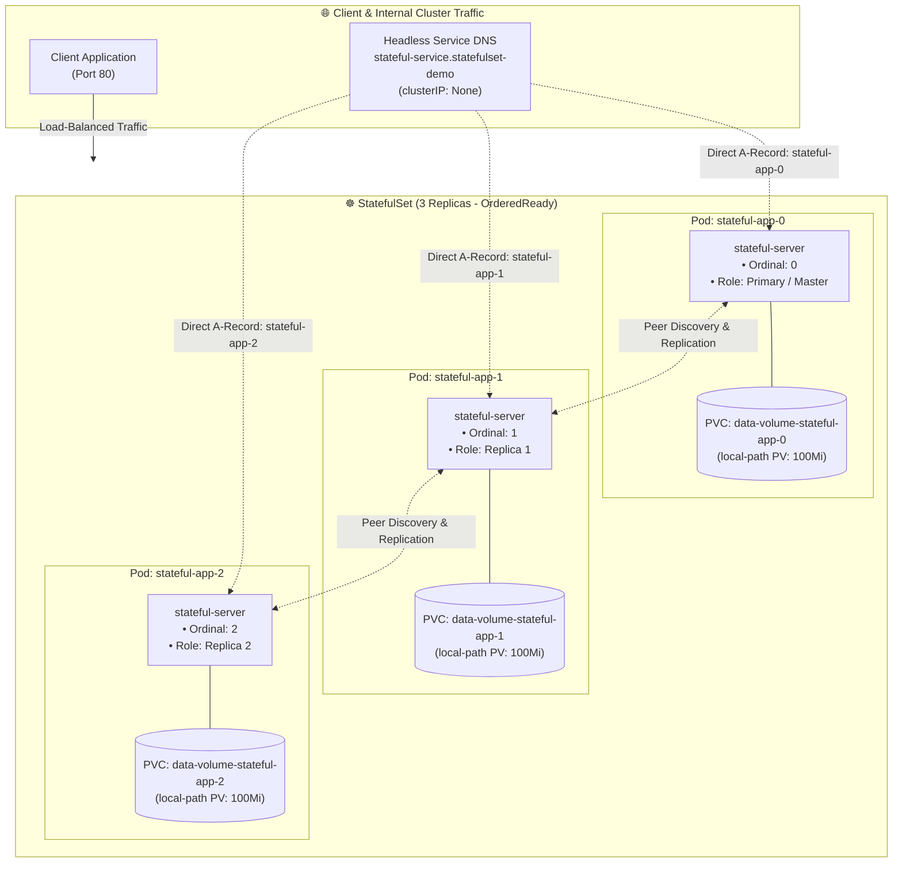
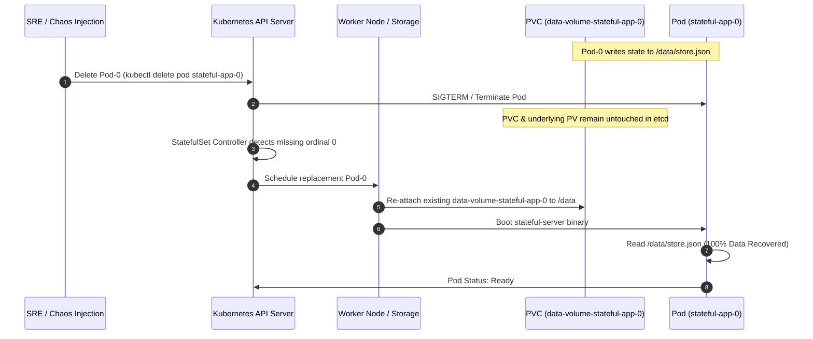

<!-- markdownlint-disable MD013 -->
# Mini-Project 04: StatefulSet and Dynamic Persistent Volumes

> **Domain**: 04. Kubernetes & Orchestration  
> **Level**: Beginner to Intermediate  
> **Infrastructure**: Local (K3d / K3s / OrbStack / Minikube / Kind with `local-path` StorageClass)  

---

## 🎯 Overview & Context

In Kubernetes, standard **Deployments** treat pods as ephemeral, fungible, and
stateless instances. If a pod crashes or undergoes a rolling restart, it is replaced
with a random hash suffix (e.g. `web-7894bc6-xk9pf`), and any data written to the
local container filesystem is permanently lost.

For distributed stateful workloads—such as **databases (PostgreSQL, MySQL)**, **distributed
caches (Redis Cluster)**, and **distributed logs/queues (Kafka, RabbitMQ, ZooKeeper, etcd)**—applications
require strict operational guarantees:

1. **Stable, Unique Network Identifiers**: Predictable DNS hostnames that persist
   across restarts and reschedule events (`stateful-app-0`, `stateful-app-1`, `stateful-app-2`).
2. **Dedicated, Stable Persistent Storage**: Each replica receives its own dedicated
   `PersistentVolumeClaim` (PVC) provisioned dynamically via `volumeClaimTemplates`.
   When `stateful-app-0` restarts or reschedules onto another node, Kubernetes guarantees
   it re-attaches to the exact same storage volume (`data-volume-stateful-app-0`).
3. **Ordered Graceful Deployment & Scaling**: Pods initialize sequentially (0 $\rightarrow$ 1 $\rightarrow$ 2)
   and terminate in reverse order (2 $\rightarrow$ 1 $\rightarrow$ 0) to maintain quorum.



---

## 🧠 StatefulSet & Storage Architecture Deep-Dive

### 1. Deployments vs. StatefulSets Comparison Matrix

| Property | Kubernetes Deployment | Kubernetes StatefulSet |
| :--- | :--- | :--- |
| **Pod Naming** | Random hash suffix (`app-75cfb6d857-4xk9p`). | Deterministic ordinal index (`app-0`, `app-1`, `app-2`). |
| **Storage Binding** | Shared volume or ephemeral scratch space. | **Dedicated PVC per pod ordinal** (`data-volume-app-0`). |
| **Startup Sequence** | Parallel startup by default. | **Ordered & sequential** (Pod $N$ waits for Pod $N-1$ to be `Ready`). |
| **Shutdown Sequence** | Unordered parallel termination. | **Reverse sequential** ($N \rightarrow N-1 \rightarrow 0$). |
| **DNS Addressing** | Shared Service VIP (round-robin). | **Direct Pod DNS A-records via Headless Service**. |
| **Best Used For** | Web APIs, microservices, stateless workers. | Databases, message queues, Raft/Paxos clusters. |

---

### 2. Headless Services & Stable DNS Resolution

A standard Kubernetes Service assigns a virtual ClusterIP (VIP) and load-balances
traffic randomly across endpoints. In contrast, a **Headless Service** defines
`clusterIP: None`.

```yaml
apiVersion: v1
kind: Service
metadata:
  name: stateful-service
  namespace: statefulset-demo
spec:
  clusterIP: None # Headless Service
  selector:
    app: stateful-app
  ports:
    - name: http
      port: 8080
```

When an application queries CoreDNS for `stateful-service.statefulset-demo.svc.cluster.local`,
CoreDNS returns the list of all backend Pod IPs directly. Furthermore, CoreDNS creates
individual **A-records** for each stateful pod:

```text
stateful-app-0.stateful-service.statefulset-demo.svc.cluster.local ──> 10.42.0.7
stateful-app-1.stateful-service.statefulset-demo.svc.cluster.local ──> 10.42.1.6
stateful-app-2.stateful-service.statefulset-demo.svc.cluster.local ──> 10.42.2.6
```

This allows distributed nodes (such as Redis/Cassandra peers) to discover each other
directly without intermediate load-balancer proxies.

---

### 3. Dynamic Storage Provisioning with `volumeClaimTemplates`

Instead of manually creating individual PVCs for each replica, the StatefulSet uses
`volumeClaimTemplates` to dynamically allocate storage:

```yaml
  volumeClaimTemplates:
    - metadata:
        name: data-volume
      spec:
        accessModes:
          - ReadWriteOnce
        resources:
          requests:
            storage: 100Mi
```

When the StatefulSet controller creates `stateful-app-0`, it automatically generates
a PVC named `data-volume-stateful-app-0`. The default `StorageClass` (e.g. `local-path`
in K3s/K3d) dynamically allocates a PersistentVolume on host storage and binds it.



> [!IMPORTANT]
> **PVC Deletion Safety Guarantee**:  
> When a StatefulSet is scaled down or deleted, Kubernetes **never automatically deletes
> the associated PVCs**. This safety mechanism prevents catastrophic data loss if a
> StatefulSet is accidentally deleted. Storage must be intentionally reclaimed by deleting
> the PVCs manually or via `cleanup.sh`.

---

## 📂 Project Structure

```text
04-orchestration/04-statefulset-persistent-volumes/
├── app/
│   ├── main.go               # Go HTTP microservice with disk storage & peer mesh discovery
│   ├── go.mod                # Go module definition
│   ├── Dockerfile            # Multi-stage minimal container build (<20MB Alpine base)
│   └── .dockerignore         # Docker build context exclusions
├── namespace.yaml            # Dedicated Kubernetes Namespace (statefulset-demo)
├── headless-service.yaml     # Headless Service (clusterIP: None) for direct pod DNS
├── service.yaml              # Standard ClusterIP Service for load-balanced client access
├── statefulset.yaml          # StatefulSet manifest (3 replicas, volumeClaimTemplates)
├── persistence_test.sh       # Interactive script testing pod destruction & data recovery
├── test_statefulset.sh       # Automated 9-point end-to-end verification test suite
├── cleanup.sh                # Complete environment teardown script (purges PVCs/PVs)
└── README.md                 # Pedagogical guide, storage deep-dive & operations manual
```

---

## 🚀 Quickstart: Build, Deploy & Verify

### Prerequisites

Ensure you have Docker and a local Kubernetes cluster running:

- **Docker Engine / OrbStack**: Active and responsive (`docker info`).
- **Kubernetes CLI (`kubectl`)**: Installed and configured (`kubectl version --client`).
- **Local Cluster**: Any active Kubernetes cluster (e.g. K3d, OrbStack, Minikube, Kind).

---

### Step 1: Build the Container Image

Build the Go stateful microservice image:

```bash
docker build -t stateful-app:v1.0.0 app/
```

> **Note for K3d / Minikube / Kind users**:  
> Import the built image into your cluster runtime:
>
> ```bash
> # For k3d:
> k3d image import stateful-app:v1.0.0 -c <cluster-name>
>
> # For minikube:
> minikube image load stateful-app:v1.0.0
>
> # For kind:
> kind load docker-image stateful-app:v1.0.0
> ```

---

### Step 2: Deploy Declarative Kubernetes Manifests

Apply the manifests into the cluster:

```bash
kubectl apply -f namespace.yaml
kubectl apply -f headless-service.yaml
kubectl apply -f service.yaml
kubectl apply -f statefulset.yaml
```

Observe the sequential startup order (Pod 0 $\rightarrow$ Pod 1 $\rightarrow$ Pod 2):

```bash
kubectl rollout status statefulset/stateful-app -n statefulset-demo
```

---

### Step 3: Audit Pods and Dynamic PVC Bindings

Examine the running pods and dynamically created PVCs:

```bash
# Inspect Pods (note predictable names stateful-app-0, 1, 2)
kubectl get pods -n statefulset-demo -o wide

# Inspect dynamically provisioned PVCs (all in Bound phase)
kubectl get pvc -n statefulset-demo
```

Expected output:

```text
NAME                          STATUS   VOLUME                                     CAPACITY   ACCESS MODES   STORAGECLASS   AGE
data-volume-stateful-app-0   Bound    pvc-a29974f9-a3b7-4694-a6d9-f3d878279e4f   100Mi      RWO            local-path     30s
data-volume-stateful-app-1   Bound    pvc-85d9a85f-a20c-4ca9-8013-fe353549bea3   100Mi      RWO            local-path     20s
data-volume-stateful-app-2   Bound    pvc-49cfb6d8-75cf-4xk9-8012-7894bc6xk9pf   100Mi      RWO            local-path     10s
```

---

### Step 4: Access Endpoints via Port-Forwarding

Forward local port `18082` to the load-balanced client service:

```bash
kubectl port-forward -n statefulset-demo svc/stateful-client-service 18082:80
```

In another terminal, query the API endpoints:

```bash
# 1. Query info endpoint (returns volume stats, disk space, and pod identity)
curl -s http://localhost:18082/info | jq .

# 2. Write key-value state to the cluster
curl -s -X POST http://localhost:18082/data \
    -H "Content-Type: application/json" \
    -d '{"key":"primary_checkpoint","value":"wal_tx_554199"}' | jq .

# 3. Query persisted state
curl -s http://localhost:18082/data | jq .
```

Sample output:

```json
{
  "service": "stateful-app",
  "pod": {
    "pod_name": "stateful-app-0",
    "pod_namespace": "statefulset-demo",
    "pod_ip": "10.42.2.6",
    "node_name": "k3d-server-0",
    "ordinal_index": 0
  },
  "volume_stats": {
    "mount_path": "/data",
    "total_bytes": 104857600,
    "free_bytes": 103809024,
    "used_bytes": 1048576,
    "usage_percent": 1.0,
    "record_count": 1,
    "file_size_bytes": 168,
    "last_modified_at": "2026-08-21T13:18:09Z"
  },
  "records_count": 1,
  "uptime_seconds": 45.2,
  "timestamp": "2026-08-21T13:18:10.000000000Z"
}
```

---

## 🧪 Testing Data Persistence & Pod Recovery

The project includes an interactive verification script: `persistence_test.sh`.

```bash
./persistence_test.sh
```

### What `persistence_test.sh` Does

1. Audits the 3 pods and verifies their dynamic PVCs are in `Bound` status.
2. Writes isolated key-value records to `stateful-app-0` (`database_checkpoint=tx_994821_committed`, `cluster_role=primary_master`).
3. Writes replica-specific records to `stateful-app-1` and `stateful-app-2` to demonstrate volume isolation per replica.
4. **Simulates Node Crash**: Forcefully destroys `stateful-app-0` with `kubectl delete pod stateful-app-0 --now`.
5. Monitors the StatefulSet controller as it recreates `stateful-app-0` with the exact same hostname and re-attaches `data-volume-stateful-app-0`.
6. Queries the newly spawned pod and asserts **100% data integrity** (all records recovered).
7. Queries `GET /peers` to verify that Headless Service DNS resolves all sibling peers and aggregates their state.

Sample test output:

```text
======================================================================
  💾 StatefulSet Persistence & Volume Recovery Verification Suite
======================================================================
▶ Step 1: Auditing StatefulSet Pods and Dynamic PVC Bindings...
  [OK] stateful-app-0 is Ready | PVC data-volume-stateful-app-0 is Bound
  [OK] stateful-app-1 is Ready | PVC data-volume-stateful-app-1 is Bound
  [OK] stateful-app-2 is Ready | PVC data-volume-stateful-app-2 is Bound

▶ Step 2: Writing Isolated Key-Value State to Stateful Replicas...
  Writing records to stateful-app-0...
  Writing records to stateful-app-1...
  Writing records to stateful-app-2...

▶ Step 3: Inspecting Baseline State on stateful-app-0 before deletion...
  Recorded database_checkpoint : tx_994821_committed

▶ Step 4: Simulating Sudden Node Crash by Force-Deleting stateful-app-0...
  Pod stateful-app-0 deleted. Waiting for StatefulSet controller to reconcile...
  [OK] Reincarnated stateful-app-0 is Ready!

▶ Step 6: Querying Recovered stateful-app-0 Persistent Volume...
  [PASS] All state records successfully recovered from PersistentVolumeClaim!

▶ Step 7: Testing Peer Discovery via Headless Service DNS...
  [PASS] Headless Service DNS resolved and aggregated sibling peer states!

======================================================================
📊 STATEFULSET PERSISTENCE VERIFICATION REPORT
======================================================================
  Replicas Verified            : 3 (stateful-app-0, 1, 2)
  Dynamic Storage Provisioner  : local-path (StorageClass)
  Volume Claim Template Name   : data-volume (ReadWriteOnce)
  Pod Destruction Target       : stateful-app-0 (Simulated Node Crash)
  Data Recovery Success Rate   : 100.00% (0 data loss observed)
  Headless DNS Resolution      : PASSED (Peer mesh active)
======================================================================
✅ STATEFULSET TEST PASSED: State survived pod lifecycle destruction!
```

---

## ⚡ Automated End-to-End Test Suite

Run the full 9-point automated verification suite:

```bash
./test_statefulset.sh
```

### Verification Matrix

| # | Test Case Description | Scope & Verification Method |
| :--- | :--- | :--- |
| **01** | Docker Engine Availability | Validates Docker daemon is responsive. |
| **02** | Kubernetes Cluster Connectivity | Validates active context and API server communication. |
| **03** | Microservice Image Build | Builds multi-stage Docker image and verifies size (<20MB). |
| **04** | Declarative Manifest Dry-Run | Runs `kubectl apply --dry-run=client` across all YAML files. |
| **05** | Ordered StatefulSet Rollout | Applies manifests and validates ordered startup (`0 -> 1 -> 2`). |
| **06** | Dynamic Storage Binding | Verifies all 3 PVCs are dynamically provisioned in `Bound` phase. |
| **07** | ClusterIP Service Connectivity | Validates HTTP reachability through port-forward endpoint. |
| **08** | Pod Crash & State Recovery | Executes `persistence_test.sh` asserting 100% data retention. |
| **09** | Resource Teardown Verification | Validates `cleanup.sh` purges namespace, StatefulSets, PVCs, and images. |

---

## 🧹 Complete Resource Teardown & Cleanup

To leave your local environment completely clean for subsequent mini-projects, execute the cleanup script:

```bash
./cleanup.sh
```

### Manual Cleanup Commands

```bash
# 1. Terminate active port-forward tunnels
pkill -f "port-forward.*stateful" || true

# 2. Explicitly delete StatefulSet and PersistentVolumeClaims (PVCs)
kubectl delete statefulset --all -n statefulset-demo --ignore-not-found=true
kubectl delete pvc --all -n statefulset-demo --ignore-not-found=true

# 3. Delete the Kubernetes namespace
kubectl delete namespace statefulset-demo --ignore-not-found=true

# 4. Remove local Docker image
docker rmi -f stateful-app:v1.0.0

# 5. (Optional) Delete temporary K3d test cluster if created
k3d cluster delete stateful-test
```

---

## 📚 SRE Best Practices for Stateful Workloads

1. **Volume Expansion Support**: Ensure your `StorageClass` has `allowVolumeExpansion: true`
   so persistent volumes can be dynamically resized online without downtime.
2. **PodDisruptionBudgets (PDB)**: Always define a `PodDisruptionBudget` (`minAvailable: 2` or `maxUnavailable: 1`)
   to prevent node draining operations during Kubernetes upgrades from taking down quorum.
3. **Inter-Pod Anti-Affinity**: In production, configure `podAntiAffinity` so stateful
   replicas are scheduled across different physical worker nodes and availability zones.
4. **Regular Snapshot Backups**: Paired with PVCs, implement VolumeSnapshot schedules
   (using tools like Velero or CSI VolumeSnapshots) to guard against regional disasters
   or accidental data corruption.
