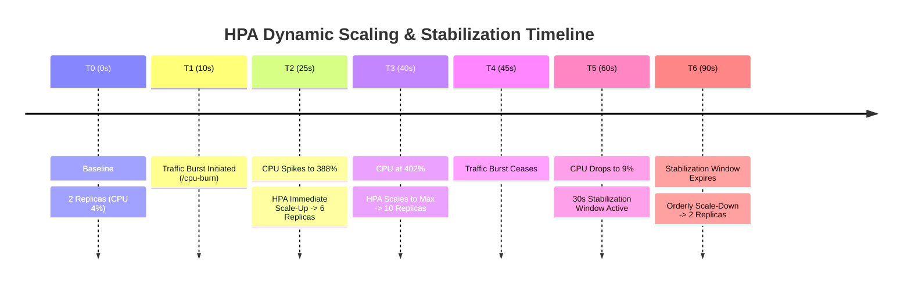

<!-- markdownlint-disable MD013 -->
# Mini-Project 05: Horizontal Pod Autoscaler with Custom Metrics

> **Domain**: 04. Kubernetes & Orchestration  
> **Level**: Intermediate  
> **Infrastructure**: Local (K3d / K3s / OrbStack / Minikube / Kind with Metrics Server)  

---

## 🎯 Overview & Context

In production cloud environments, static replica sizing forces engineering teams
into an inefficient compromise: either **over-provision** expensive idle compute to
survive peak traffic bursts, or **under-provision** and suffer latency degradation,
5xx HTTP errors, and cascading service outages during traffic spikes.

The **Horizontal Pod Autoscaler (HPA v2)** provides closed-loop, dynamic horizontal
scaling by continuously querying resource telemetry from the Kubernetes Metrics API
(`metrics.k8s.io`) and automatically adjusting deployment replicas between configured
minimum and maximum boundaries.

```mermaid
flowchart TD
    subgraph ControlLoop ["🔄 Kubernetes HPA Closed-Loop Control Architecture"]
        Kubelet["cAdvisor (kubelet)\n• Pod CPU & Memory Usage"]
        MetricsServer["Metrics Server / Prometheus\n• Aggregates Node & Pod Telemetry\n• Serves metrics.k8s.io"]
        HPAController["HPA Controller (kube-controller-manager)\n• Evaluates Autoscaling Algorithm every 15s\n• Target: 50% CPU Utilization"]
        Deployment["Deployment: autoscale-app\n• Min: 2 Replicas | Max: 10 Replicas\n• Scale-Up Stabilization: 0s\n• Scale-Down Stabilization: 30s"]

        Kubelet -->|Scraped by| MetricsServer
        MetricsServer -->|Queried via metrics.k8s.io| HPAController
        HPAController -->|Scales Replicas (2 -> 4 -> 8 -> 10)| Deployment
    end

    subgraph WorkloadPods ["📦 Microservice Replicas (autoscale-app)"]
        Pod1["Pod 1 (CPU Request: 50m)"]
        Pod2["Pod 2 (CPU Request: 50m)"]
        PodN["Pod N (Dynamically Added under Load)"]
    end

    Deployment --> WorkloadPods
    TrafficSource["⚡ Traffic Generator (load_generator.sh)\n• High-concurrency /cpu-burn requests"] --> WorkloadPods
```

---

## 🧠 HPA Mechanics & Autoscaling Math Deep-Dive

### 1. The Core Autoscaling Algorithm

Every 15 seconds (configured by `--horizontal-pod-autoscaler-sync-period`), the
HPA controller executes the following mathematical reconciliation algorithm:

$$\text{desiredReplicas} = \left\lceil \text{currentReplicas} \times \left( \frac{\text{currentMetricValue}}{\text{desiredMetricValue}} \right) \right\rceil$$

#### Real-World Scaling Calculation Example

Suppose we deploy `autoscale-app` with:

- **Initial Replicas**: 2
- **CPU Resource Request**: `50m` (0.05 CPU core) per pod
- **Target Average CPU Utilization**: `50%` (`25m` target per pod)

```text
1. Baseline Idle State:
   - 2 pods consuming ~2m each (4m total / 100m total requested) = 4% Utilization
   - Desired Replicas: ceil(2 * (4 / 50)) = ceil(0.16) = 1 -> Clamped to minReplicas (2)

2. Under High-Concurrency Load (/cpu-burn):
   - 2 pods consuming 200m each (400m total / 100m total requested) = 400% Utilization
   - Desired Replicas: ceil(2 * (400 / 50)) = ceil(16) -> Clamped to maxReplicas (10)
   - The HPA Controller scales the deployment from 2 to 10 replicas.
```

---

### 2. The Critical Role of Resource Requests

> [!IMPORTANT]
> **Why Resource Requests Matter**:  
> Kubernetes calculates percentage utilization strictly against the container's
> `resources.requests`, **not** against `resources.limits` or the host node's CPU capacity.
> If `requests.cpu` is omitted, the HPA controller cannot calculate percentage utilization
> and will remain in an `<unknown>` error state.

```yaml
resources:
  requests:
    cpu: 50m       # 0.05 cores (Base denominator for HPA calculations)
    memory: 64Mi
  limits:
    cpu: 200m      # 0.2 cores (Throttling ceiling)
    memory: 128Mi
```

---

### 3. Stabilization Windows & Anti-Flapping Policies

In volatile production environments, rapid scaling fluctuations (known as **flapping**
or **thrashing**) waste compute cycles and degrade cluster stability. HPA v2 allows
fine-grained control over scale-up and scale-down velocity:



```yaml
behavior:
  scaleUp:
    stabilizationWindowSeconds: 0 # Immediate scale-up to absorb traffic spikes
    policies:
      - type: Percent
        value: 100               # Double replicas every 15 seconds
        periodSeconds: 15
      - type: Pods
        value: 4                 # Or add 4 pods, whichever is greater
        periodSeconds: 15
    selectPolicy: Max
  scaleDown:
    stabilizationWindowSeconds: 30 # Cooldown buffer before removing pods
    policies:
      - type: Percent
        value: 50
        periodSeconds: 15
      - type: Pods
        value: 2
        periodSeconds: 15
    selectPolicy: Min
```

---

## 📂 Project Structure

```text
04-orchestration/05-horizontal-pod-autoscaler/
├── app/
│   ├── main.go               # Go HTTP service with synthetic CPU burner & Prometheus metrics
│   ├── go.mod                # Go module definition
│   ├── Dockerfile            # Multi-stage minimal container build (<20MB Alpine base)
│   └── .dockerignore         # Docker build context exclusions
├── namespace.yaml            # Dedicated Kubernetes Namespace (hpa-demo)
├── deployment.yaml           # Deployment with CPU/memory requests, limits, and probes
├── service.yaml              # ClusterIP Service routing traffic to autoscaling replicas
├── hpa.yaml                  # HPA v2 manifest with CPU/memory metrics & stabilization windows
├── load_generator.sh         # Interactive load burst generator and real-time HPA monitor
├── test_hpa.sh               # Automated 10-point end-to-end verification test suite
├── cleanup.sh                # Complete environment teardown script
└── README.md                 # Pedagogical guide, autoscaling math & operations manual
```

---

## 🚀 Quickstart: Build, Deploy & Verify

### Prerequisites

Ensure you have Docker and a local Kubernetes cluster with Metrics Server enabled:

- **Docker Engine / OrbStack**: Running and accessible (`docker info`).
- **Kubernetes CLI (`kubectl`)**: Installed and configured (`kubectl version --client`).
- **Local Cluster**: Any active Kubernetes cluster (e.g. K3d, OrbStack, Minikube, Kind).
  - *Note*: In K3s/K3d, `metrics-server` is built-in and enabled automatically.

---

### Step 1: Build the Container Image

Build the Go autoscaling microservice image:

```bash
docker build -t autoscale-app:v1.0.0 app/
```

> **Note for K3d / Minikube / Kind users**:  
> Import the built image into your cluster runtime:
>
> ```bash
> # For k3d:
> k3d image import autoscale-app:v1.0.0 -c <cluster-name>
>
> # For minikube:
> minikube image load autoscale-app:v1.0.0
>
> # For kind:
> kind load docker-image autoscale-app:v1.0.0
> ```

---

### Step 2: Deploy Declarative Kubernetes Manifests

Apply the manifests into the cluster:

```bash
kubectl apply -f namespace.yaml
kubectl apply -f deployment.yaml
kubectl apply -f service.yaml
kubectl apply -f hpa.yaml
```

Wait for the deployment to initialize with 2 healthy replicas:

```bash
kubectl rollout status deployment/autoscale-app -n hpa-demo
```

---

### Step 3: Inspect HPA Status & Metrics API

Verify that the HPA controller binds to the deployment and starts collecting metrics:

```bash
# Check HPA status (Wait ~15s for the first metric collection cycle)
kubectl get hpa autoscale-hpa -n hpa-demo

# Check current pod CPU/Memory metrics
kubectl top pods -n hpa-demo
```

Expected output:

```text
NAME            REFERENCE                  TARGETS                     MINPODS   MAXPODS   REPLICAS   AGE
autoscale-hpa   Deployment/autoscale-app   cpu: 4%/50%, memory: 9%/75% 2         10        2          30s
```

---

### Step 4: Access Endpoints via Port-Forwarding

Forward local port `18083` to the service:

```bash
kubectl port-forward -n hpa-demo svc/autoscale-service 18083:80
```

In another terminal, test the application endpoints:

```bash
# 1. Query baseline metadata
curl -s http://localhost:18083/ | jq .

# 2. Trigger single synthetic CPU burn calculation
curl -s "http://localhost:18083/cpu-burn?duration=200ms" | jq .

# 3. Query Prometheus metrics
curl -s http://localhost:18083/metrics
```

---

## 🧪 Testing Autoscaling & Load Generation

The project includes an interactive verification script: `load_generator.sh`.

```bash
./load_generator.sh
```

### What `load_generator.sh` Does

1. Verifies the baseline deployment has 2 ready replicas.
2. Spawns an in-cluster load generator pod launching **25 parallel concurrent workers** hitting `http://autoscale-service/cpu-burn?duration=200ms`.
3. Monitors the HPA metrics table in real-time as CPU surges to $>350\%$.
4. Observes immediate scale-up from **2 $\rightarrow$ 6 $\rightarrow$ 10 replicas**.
5. Terminates the load generator pod.
6. Observes the **30-second cooldown stabilization window** as CPU drops to $2\%$ and replicas gracefully scale back down to **2 replicas**.

Sample output:

```text
======================================================================
  ⚡ Horizontal Pod Autoscaler (HPA v2) Load & Scaling Test
======================================================================
▶ Step 1: Auditing Baseline Deployment & HPA Status...
  Current Ready Replicas : 2

▶ Step 2: Spawning In-Cluster High-Concurrency Load Generator Pod...
  [OK] High-concurrency traffic active (25 parallel workers).

▶ Step 3: Monitoring HPA CPU Metric Spike & Replica Scale-Up...
  Timestamp            CPU Utilization   Current Replicas   Target Replicas
  10:25:49             0% / 50%          2                  0              
  10:26:09             38% / 50%         2                  2              
  10:26:25             388% / 50%        2                  6              
  10:26:37             402% / 50%        6                  10             
  10:26:42             402% / 50%        10                 10             

  [OK] Scale-up detected! Max replicas observed: 10

▶ Step 4: Stopping Traffic & Observing Cooldown Stabilization Window...
  Monitoring scale-down behavior (stabilization window: 30s)...
  10:26:53             81% / 50%         10                 10             
  10:27:08             9% / 50%          10                 10             
  10:27:24             2% / 50%          8                  8              
  10:27:39             2% / 50%          6                  6              
  10:27:55             2% / 50%          4                  4              
  10:28:00             2% / 50%          2                  2              

  [OK] Deployment successfully scaled down to minReplicas (2).

======================================================================
📊 HORIZONTAL POD AUTOSCALER (HPA v2) VERIFICATION REPORT
======================================================================
  Scale Target Deployment      : autoscale-app (Initial: 2 Replicas)
  Autoscaling Metric Target    : CPU 50% AverageUtilization
  Max Replicas Observed (Peak) : 10 / 10 Max
  Scale-Up Trigger             : PASSED
  Scale-Down Stabilization     : PASSED (Returned to minReplicas: 2)
======================================================================
✅ HPA TEST PASSED: Dynamic horizontal autoscaling verified!
```

---

## ⚡ Automated End-to-End Test Suite

Run the full 10-point automated verification suite:

```bash
./test_hpa.sh
```

### Verification Matrix

| # | Test Case Description | Scope & Verification Method |
| :--- | :--- | :--- |
| **01** | Docker Engine Availability | Validates Docker daemon is responsive. |
| **02** | Kubernetes Cluster Connectivity | Validates active context and API server communication. |
| **03** | Metrics Server & API Check | Validates `v1beta1.metrics.k8s.io` APIService is `Available`. |
| **04** | Microservice Image Build | Builds multi-stage Docker image and verifies size (<20MB). |
| **05** | Declarative Manifest Dry-Run | Runs `kubectl apply --dry-run=client` across all YAML files. |
| **06** | Initial Deployment Readiness | Deploys manifests and validates `2/2` healthy replicas. |
| **07** | HPA Metric Target Binding | Verifies HPA targets `autoscale-app` with 50% CPU metric. |
| **08** | ClusterIP Service Connectivity | Validates HTTP reachability through port-forward endpoint. |
| **09** | Dynamic Autoscaling & Cooldown | Runs `load_generator.sh` asserting scale-up and scale-down. |
| **10** | Resource Teardown Verification | Validates `cleanup.sh` purges namespace, HPA, and Docker images. |

---

## 🧹 Complete Resource Teardown & Cleanup

To leave your local environment completely clean for subsequent mini-projects, execute the cleanup script:

```bash
./cleanup.sh
```

### Manual Cleanup Commands

```bash
# 1. Terminate active port-forward tunnels
pkill -f "port-forward.*autoscale" || true

# 2. Delete the Kubernetes namespace (cascades HPA, Deployment, Service, and Pods)
kubectl delete namespace hpa-demo --ignore-not-found=true

# 3. Remove local Docker image
docker rmi -f autoscale-app:v1.0.0

# 4. (Optional) Delete temporary K3d test cluster if created
k3d cluster delete hpa-test
```

---

## 📚 SRE Best Practices for Horizontal Autoscaling

1. **Always Set CPU Requests**: Never deploy an HPA without explicit container `requests.cpu`.
   Without requests, the denominator is undefined and HPA will fail.
2. **Tune Scale-Down Stabilization Windows**: Set `scaleDown.stabilizationWindowSeconds`
   between 60s and 300s in production to prevent premature pod termination during temporary
   traffic lulls between burst cycles.
3. **Combine HPA with Cluster Autoscaler (CA / Karpenter)**: Pod autoscaling must be
   paired with node autoscaling so new pods have underlying compute capacity when
   the cluster runs out of allocatable CPU cores.
4. **Use KEDA for Event-Driven Autoscaling**: For non-CPU metrics (e.g. SQS queue length,
   Kafka lag, Redis list length), use **KEDA (Kubernetes Event-Driven Autoscaling)**
   to scale workloads to and from 0 based on real business queues.
