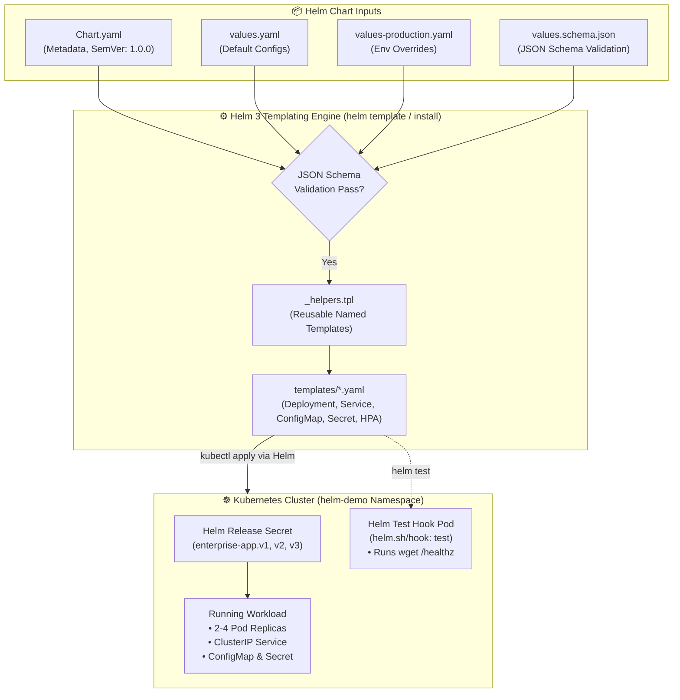
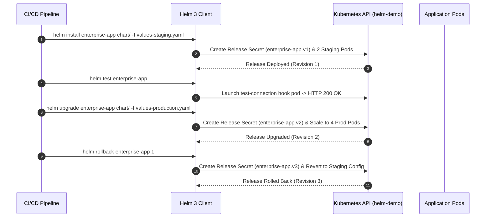

<!-- markdownlint-disable MD013 -->
# Mini-Project 06: Production-Grade Helm Chart Packaging

> **Domain**: 04. Kubernetes & Orchestration  
> **Level**: Intermediate  
> **Infrastructure**: Local (K3d / K3s / OrbStack / Minikube / Kind + Helm 3/4)  

---

## 🎯 Overview & Context

In enterprise Kubernetes environments, managing raw, hardcoded YAML manifests across
dozens of microservices and diverse deployment environments (development, staging,
production) quickly causes **configuration drift**, duplication, and error-prone
deployments.

**Helm 3** serves as the standard package manager for Kubernetes. It transforms static
manifests into parameterized, reusable, and version-controlled application blueprints
(called **Charts**). This project demonstrates how to build a production-grade Helm 3
chart adhering to enterprise SRE best practices:

1. **Parameter-Driven Templating**: Centralize all environment-specific configurations
   into `values.yaml` and environment overlays (`values-staging.yaml`, `values-production.yaml`).
2. **Template Helpers & Standard Labels**: Implement standard Kubernetes recommended
   labels (`helm.sh/chart`, `app.kubernetes.io/name`, `app.kubernetes.io/managed-by`)
   using Go templating helpers (`_helpers.tpl`).
3. **Type Safety & CI/CD Guardrails**: Enforce strict JSON Schema validation via
   `values.schema.json` to block typos and invalid types before manifests reach the API server.
4. **Automated Integration Testing**: Package smoke/health test pods using Helm test hooks
   (`helm.sh/hook: test`) executed natively via `helm test`.
5. **Release Lifecycle Management**: Execute atomic rollouts, zero-downtime upgrades,
   and instant rollbacks across release revisions.



---

## 🧠 Helm 3 Architecture & Production Packaging Deep-Dive

### 1. The Anatomy of a Production Helm Chart

```text
chart/
├── Chart.yaml             # Package metadata, chart version, and appVersion
├── values.yaml            # Default parameter values with extensive documentation
├── values.schema.json     # JSON Schema enforcing types, bounds, and required keys
├── templates/             # Kubernetes YAML templates with Go template expressions
│   ├── _helpers.tpl       # Partial templates and reusable naming/label helper functions
│   ├── deployment.yaml    # Parameterized Deployment with checksum annotations
│   ├── service.yaml       # Parameterized Service
│   ├── serviceaccount.yaml# Conditional ServiceAccount creation
│   ├── configmap.yaml     # Application configuration
│   ├── secret.yaml        # Application credentials
│   ├── ingress.yaml       # Conditional Ingress
│   ├── hpa.yaml           # Conditional HorizontalPodAutoscaler
│   └── tests/
│       └── test-connection.yaml # Integration test hook pod (helm test)
```

---

### 2. Go Template Functions & Helper Macros (`_helpers.tpl`)

Writing standard labels and names across all manifests prevents duplication and
ensures consistency. Helm partials defined in `_helpers.tpl` are invoked using
`{{ include "template.name" . }}`:

```yaml
{{/*
Common labels adhering to Kubernetes Recommended Labels
*/}}
{{- define "enterprise-app.labels" -}}
helm.sh/chart: {{ include "enterprise-app.chart" . }}
{{ include "enterprise-app.selectorLabels" . }}
{{- if .Chart.AppVersion }}
app.kubernetes.io/version: {{ .Chart.AppVersion | quote }}
{{- end }}
app.kubernetes.io/managed-by: {{ .Release.Service }}
{{- end }}
```

#### Whitespace Control (`{{-` and `-}}`)

In Go templates, whitespace before and after template tags is preserved unless
explicitly trimmed:

- `{{-`: Trims all whitespace characters (spaces, tabs, newlines) immediately **preceding** the tag.
- `-}}`: Trims all whitespace characters immediately **following** the tag.
- `nindent 4`: Indents the rendered content by 4 spaces preceded by a fresh newline,
  guaranteeing clean YAML alignment.

---

### 3. JSON Schema Validation Guardrails (`values.schema.json`)

Without schema validation, a developer could pass `replicaCount: "three"` (string instead
of integer) or `service.port: 999999` (invalid port range), causing errors at runtime.
Helm 3 validates `values.yaml` and CLI `--set` flags against `values.schema.json`
prior to rendering:

```json
{
  "$schema": "https://json-schema.org/draft-07/schema#",
  "properties": {
    "replicaCount": {
      "type": "integer",
      "minimum": 1,
      "maximum": 50
    },
    "service": {
      "type": "object",
      "required": ["type", "port"],
      "properties": {
        "type": { "type": "string", "enum": ["ClusterIP", "NodePort", "LoadBalancer"] },
        "port": { "type": "integer", "minimum": 1, "maximum": 65535 }
      }
    }
  }
}
```

If an invalid parameter is provided, Helm halts immediately:

```text
Error: values don't meet the specifications of the schema(s) in the following chart(s):
enterprise-app:
- replicaCount: Must be greater than or equal to 1
```

---

### 4. Helm Hooks & Integration Testing (`helm test`)

Helm Hooks allow running custom actions at specific points in a release lifecycle
(e.g. `pre-install`, `post-upgrade`, `test`). A test hook defines `"helm.sh/hook": test`:

```yaml
apiVersion: v1
kind: Pod
metadata:
  name: "{{ include "enterprise-app.fullname" . }}-test-connection"
  annotations:
    "helm.sh/hook": test
    "helm.sh/hook-delete-policy": before-hook-creation,hook-succeeded
spec:
  containers:
    - name: wget
      image: busybox:1.37
      command: ['wget']
      args: ['{{ include "enterprise-app.fullname" . }}:{{ .Values.service.port }}/healthz', '-O', '-']
  restartPolicy: Never
```

When you execute `helm test <release-name>`, Helm creates the test pod, waits for
it to exit with code 0 (success), and automatically cleans it up.

---

### 5. Release Lifecycle Management: Upgrade & Rollback



---

## 📂 Project Structure

```text
04-orchestration/06-production-helm-chart-packaging/
├── app/
│   ├── main.go               # Go HTTP microservice reading Helm-injected configs & secrets
│   ├── go.mod                # Go module definition
│   ├── Dockerfile            # Multi-stage minimal container build (<20MB Alpine base)
│   └── .dockerignore         # Docker build context exclusions
├── chart/                    # Complete Helm 3 Production Chart
│   ├── Chart.yaml            # Chart metadata & SemVer definitions
│   ├── values.yaml           # Documented default configuration values
│   ├── values.schema.json    # JSON Schema validation rules
│   └── templates/
│       ├── _helpers.tpl      # Standard template helpers & label macros
│       ├── deployment.yaml   # Parameterized Deployment manifest
│       ├── service.yaml      # Parameterized Service manifest
│       ├── serviceaccount.yaml# Conditional ServiceAccount manifest
│       ├── configmap.yaml    # Parameterized ConfigMap manifest
│       ├── secret.yaml       # Parameterized Secret manifest
│       ├── ingress.yaml      # Conditional Ingress manifest
│       ├── hpa.yaml          # Conditional HorizontalPodAutoscaler manifest
│       └── tests/
│           └── test-connection.yaml # Helm integration test hook
├── values-staging.yaml       # Staging environment value overrides
├── values-production.yaml    # Production environment value overrides
├── helm_test_pipeline.sh     # Interactive CI/CD validation pipeline script
├── test_helm_chart.sh        # Automated 10-point end-to-end verification test suite
├── cleanup.sh                # Complete environment teardown script
└── README.md                 # Pedagogical guide, templating deep-dive & operations manual
```

---

## 🚀 Quickstart: Build, Package & Deploy

### Prerequisites

Ensure you have Docker, Helm 3+, and a Kubernetes cluster running:

- **Docker Engine / OrbStack**: Running and accessible (`docker info`).
- **Helm 3 CLI**: Installed (`helm version`).
- **Kubernetes CLI (`kubectl`)**: Configured and connected (`kubectl cluster-info`).
- **Local Cluster**: Any active Kubernetes cluster (e.g. K3d, OrbStack, Minikube, Kind).

---

### Step 1: Build the Container Image

Build the Go microservice image:

```bash
docker build -t enterprise-app:v1.0.0 app/
```

> **Note for K3d / Minikube / Kind users**:  
> Import the built image into your cluster runtime:
>
> ```bash
> # For k3d:
> k3d image import enterprise-app:v1.0.0 -c <cluster-name>
>
> # For minikube:
> minikube image load enterprise-app:v1.0.0
>
> # For kind:
> kind load docker-image enterprise-app:v1.0.0
> ```

---

### Step 2: Lint and Template the Chart

Run static analysis and render manifests locally:

```bash
# 1. Lint chart syntax and best practices
helm lint chart/

# 2. Render templates with default values
helm template my-release chart/

# 3. Test JSON Schema enforcement with invalid values (should fail)
helm template my-release chart/ --set replicaCount=-5
```

---

### Step 3: Install Helm Release in Staging Mode

Deploy the application using staging value overrides:

```bash
helm install enterprise-app chart/ \
    -f values-staging.yaml \
    -n helm-demo \
    --create-namespace \
    --wait
```

Verify release status:

```bash
helm list -n helm-demo
kubectl get pods,svc,configmap -n helm-demo
```

---

### Step 4: Run In-Cluster Integration Test

Execute the packaged Helm test hook pod:

```bash
helm test enterprise-app -n helm-demo
```

Expected output:

```text
NAME: enterprise-app
LAST DEPLOYED: Fri Aug 21 13:36:00 2026
NAMESPACE: helm-demo
STATUS: deployed
REVISION: 1
TEST SUITE:     enterprise-app-test-connection
Notes:
POD LOGS: enterprise-app-test-connection
Connecting to enterprise-app:80 (10.43.0.120:80)
writing to stdout
{"app":"Enterprise-Core-Staging","pod":"enterprise-app-74b4898b84-qj6r8","status":"alive"}
-                    100% |********************************|    92  0:00:00 ETA
written to stdout
```

---

### Step 5: Upgrade Release to Production Mode

Perform a zero-downtime upgrade to production configuration (scaling to 4 replicas):

```bash
helm upgrade enterprise-app chart/ \
    -f values-production.yaml \
    -n helm-demo \
    --wait
```

Verify the new revision:

```bash
helm history enterprise-app -n helm-demo
```

Expected output:

```text
REVISION    UPDATED                     STATUS        CHART                   APP VERSION    DESCRIPTION     
1           Fri Aug 21 13:36:00 2026    superseded    enterprise-app-1.0.0    1.0.0          Install complete
2           Fri Aug 21 13:36:20 2026    deployed      enterprise-app-1.0.0    1.0.0          Upgrade complete
```

---

### Step 6: Roll Back to Previous Revision

Simulate a production incident and perform an immediate rollback to Revision 1:

```bash
helm rollback enterprise-app 1 -n helm-demo --wait
```

---

## 🧪 Testing Helm CI/CD Automation

The project includes an interactive verification pipeline script: `helm_test_pipeline.sh`.

```bash
./helm_test_pipeline.sh
```

### What `helm_test_pipeline.sh` Validates

1. Runs `helm lint chart/` to ensure zero syntax or naming warnings.
2. Runs `helm template` validating manifest generation.
3. Tests `values.schema.json` to confirm invalid values are blocked.
4. Performs `helm install` in `helm-demo` namespace with staging values.
5. Executes `helm test` verifying in-cluster network connectivity.
6. Performs `helm upgrade` with production values (4 replicas).
7. Performs `helm rollback` returning to revision 1.

Sample pipeline output:

```text
======================================================================
  ⎈ Helm 3 Production Chart CI/CD Test Pipeline
======================================================================
▶ Step 1: Linting Helm Chart (helm lint)...
  [PASS] Helm chart passed linting with zero errors.

▶ Step 2: Testing Manifest Rendering (helm template)...
  [PASS] All templates rendered cleanly.

▶ Step 3: Testing JSON Schema Validation Guardrails (values.schema.json)...
  [PASS] Schema correctly blocked invalid negative replicaCount (minimum: 1).
  [PASS] Schema correctly blocked invalid environment enum.

▶ Step 4: Installing Helm Release in Staging Mode (helm install)...
  [PASS] Helm release 'enterprise-app' successfully installed (Revision 1 - Staging).

▶ Step 5: Executing Integration Test Hook (helm test)...
  [PASS] Helm test hook passed! Service connectivity verified.

▶ Step 6: Upgrading Helm Release to Production Mode (helm upgrade)...
  [PASS] Helm release successfully upgraded to Revision 2 (Production).

▶ Step 7: Testing Release Rollback to Revision 1 (helm rollback)...
  [PASS] Helm release successfully rolled back (Current Revision: 3).

======================================================================
📊 HELM 3 CI/CD PIPELINE VERIFICATION REPORT
======================================================================
  Chart Name & Version         : enterprise-app (v1.0.0)
  Static Analysis (helm lint)  : PASSED
  JSON Schema Enforcement      : PASSED (Type guardrails active)
  Integration Hook (helm test) : PASSED
  Release Upgrade & Rollback   : PASSED (Full lifecycle verified)
======================================================================
✅ ALL HELM PIPELINE STAGES COMPLETED SUCCESSFULLY!
```

---

## ⚡ Automated End-to-End Test Suite

Run the full 10-point automated verification suite:

```bash
./test_helm_chart.sh
```

### Verification Matrix

| # | Test Case Description | Scope & Verification Method |
| :--- | :--- | :--- |
| **01** | Docker Engine Availability | Validates Docker daemon is responsive. |
| **02** | Kubernetes Cluster Connectivity | Validates active context and API server communication. |
| **03** | Helm 3 CLI Availability | Validates `helm` command is available. |
| **04** | Microservice Image Build | Builds multi-stage Docker image and verifies size (<20MB). |
| **05** | Helm Chart Static Analysis | Runs `helm lint` on chart directory. |
| **06** | Template Rendering | Runs `helm template` testing Go template logic. |
| **07** | JSON Schema Guardrails | Asserts `values.schema.json` rejects invalid parameters. |
| **08** | CI/CD Pipeline Execution | Runs `helm_test_pipeline.sh` (install, test, upgrade, rollback). |
| **09** | ClusterIP Service Connectivity | Validates HTTP reachability through port-forward endpoint. |
| **10** | Resource Teardown Verification | Validates `cleanup.sh` uninstalls release and purges namespace. |

---

## 🧹 Complete Resource Teardown & Cleanup

To leave your local environment completely clean for subsequent mini-projects, execute the cleanup script:

```bash
./cleanup.sh
```

### Manual Cleanup Commands

```bash
# 1. Terminate active port-forward tunnels
pkill -f "port-forward.*enterprise" || true

# 2. Uninstall the Helm release
helm uninstall enterprise-app -n helm-demo --ignore-not-found=true

# 3. Delete the Kubernetes namespace
kubectl delete namespace helm-demo --ignore-not-found=true

# 4. Remove local Docker image
docker rmi -f enterprise-app:v1.0.0

# 5. (Optional) Delete temporary K3d test cluster if created
k3d cluster delete helm-test
```

---

## 📚 SRE Best Practices for Helm Chart Governance

1. **Strict Semantic Versioning (SemVer 2)**:
   - Increment `version` for any change to the chart templates or metadata.
   - Increment `appVersion` when changing the underlying application container image.
2. **Publish to Immutable OCI Registries**: Store packaged Helm charts (`helm package`)
   in OCI-compliant registries (GitHub Packages `ghcr.io`, AWS ECR, GCP Artifact Registry, Harbor)
   for signed, immutable artifact distribution.
3. **Use GitOps Controllers (ArgoCD / Flux)**: In production environments, avoid running
   ad-hoc `helm install` commands manually. Store Helm values files in Git repositories
   and let ArgoCD or Flux synchronize releases declaratively.
4. **Always Define Schema Validation**: Include `values.schema.json` in every production
   chart to catch configuration defects in pull request CI checks before deployment.
