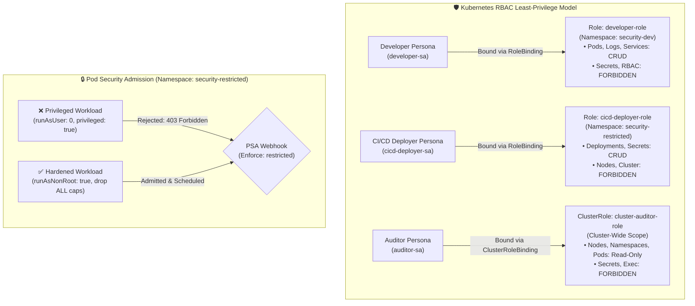

<!-- markdownlint-disable MD013 -->
# Mini-Project 07: RBAC Least-Privilege Policies and Pod Security

> **Domain**: 04. Kubernetes & Orchestration  
> **Level**: Intermediate  
> **Infrastructure**: Local (K3d / K3s / OrbStack / Minikube / Kind)  

---

## 🎯 Overview & Context

In multi-tenant Kubernetes clusters, granting excessive permissions or running containers
with root privileges represents one of the most critical attack vectors in cloud-native
security. If a compromised microservice runs as `root` with `cluster-admin` privileges,
an attacker can escape container isolation, access confidential cluster secrets, manipulate
worker nodes, and compromise the entire infrastructure.

This project implements enterprise **DevSecOps** hardening using two core Kubernetes
security mechanisms:

1. **Role-Based Access Control (RBAC)**: Enforces the **Principle of Least Privilege**
   by scoping permissions across distinct organizational personas (`Developer`,
   `CI/CD Deployer`, and `Auditor`).
2. **Pod Security Admission (PSA)**: Implements native **Pod Security Standards (PSS)**
   at the namespace level (`pod-security.kubernetes.io/enforce: restricted`), actively
   rejecting privileged, root, or privilege-escalating container workloads at admission time.



---

## 🧠 RBAC & Pod Security Standards (PSS) Deep-Dive

### 1. The RBAC Triad: Subject $\rightarrow$ Binding $\rightarrow$ Role

Kubernetes RBAC evaluates authorization by matching incoming API requests against
defined rules using three core building blocks:

- **Subject**: An entity requesting access (e.g. `User`, `Group`, or in-cluster `ServiceAccount`).
- **Role / ClusterRole**: A collection of additive permission rules specifying
  `apiGroups`, `resources` (e.g. `pods`, `deployments`, `secrets`), and `verbs`
  (e.g. `get`, `list`, `create`, `delete`).
  - **`Role`**: Scoped strictly to a single Kubernetes namespace.
  - **`ClusterRole`**: Cluster-scoped (applies to all namespaces and cluster-wide
    resources like `nodes` and `namespaces`).
- **RoleBinding / ClusterRoleBinding**: The bridge that grants the permissions
  defined in a `Role` or `ClusterRole` to one or more `Subjects`.

---

### 2. DevSecOps Personas & Authorization Matrix

This project configures three strictly segregated personas:

| Capability / API Resource | Developer (`developer-sa`) | CI/CD Deployer (`cicd-deployer-sa`) | Auditor (`auditor-sa`) |
| :--- | :---: | :---: | :---: |
| **Namespace Scope** | `security-dev` | `security-restricted` | Cluster-Wide (`*`) |
| **Pods / Deployments (CRUD)** | ✅ **ALLOW** | ✅ **ALLOW** | ❌ **DENY** (Read-Only) |
| **Container Logs (`pods/log`)** | ✅ **ALLOW** | ✅ **ALLOW** | ✅ **ALLOW** |
| **Port-Forward (`pods/portforward`)** | ✅ **ALLOW** | ❌ **DENY** | ❌ **DENY** |
| **Read Secrets (`get secrets`)** | ❌ **DENY** | ✅ **ALLOW** (Prod secrets) | ❌ **DENY** |
| **Execute in Pods (`pods/exec`)** | ❌ **DENY** | ❌ **DENY** | ❌ **DENY** |
| **Cluster Nodes (`nodes`)** | ❌ **DENY** | ❌ **DENY** | ✅ **ALLOW** (Read-Only) |
| **Modify RBAC Roles / Bindings** | ❌ **DENY** | ❌ **DENY** | ❌ **DENY** |
| **Delete Namespaces** | ❌ **DENY** | ❌ **DENY** | ❌ **DENY** |

---

### 3. Pod Security Standards (PSS) & Admission (PSA)

Kubernetes defines three progressive **Pod Security Standards (PSS)**:

1. **Privileged**: Unrestricted execution. Workloads can run as root, mount host devices,
   and access host namespaces.
2. **Baseline**: Minimally restrictive policy that prevents known privilege escalations
   (e.g. forbids `hostNetwork`, `privileged: true`, host path volumes).
3. **Restricted**: Hardened policy enforcing comprehensive container isolation best practices.

#### PSA Namespace Labels

Namespaces enforce policies through standard metadata labels:

```yaml
apiVersion: v1
kind: Namespace
metadata:
  name: security-restricted
  labels:
    pod-security.kubernetes.io/enforce: restricted
    pod-security.kubernetes.io/enforce-version: latest
    pod-security.kubernetes.io/warn: restricted
    pod-security.kubernetes.io/audit: restricted
```

#### What It Takes to Pass `restricted` PSA

Workloads deployed into a `restricted` namespace must define a fully hardened
`securityContext`:

```yaml
spec:
  securityContext:
    runAsNonRoot: true              # Pod cannot run as UID 0 (root)
    runAsUser: 10001                # Explicit unprivileged user UID
    runAsGroup: 10001
    fsGroup: 10001
    seccompProfile:
      type: RuntimeDefault          # Enables Linux kernel seccomp syscall filtering
  containers:
    - name: hardened-worker
      image: alpine:3.21
      securityContext:
        allowPrivilegeEscalation: false # Prevents SUID binary privilege escalation
        readOnlyRootFilesystem: true   # Container root filesystem is immutable
        runAsNonRoot: true
        capabilities:
          drop:
            - ALL                   # Drops all Linux kernel capabilities (CAP_SYS_ADMIN, etc.)
```

---

## 📂 Project Structure

```text
04-orchestration/07-rbac-pod-security-policies/
├── namespaces.yaml           # Namespace manifests with Pod Security Admission (PSA) labels
├── rbac-personas.yaml        # ServiceAccounts, Roles, RoleBindings, and ClusterRoles
├── workloads/
│   ├── compliant-pod.yaml    # Hardened pod passing PSA restricted standards
│   └── privileged-pod.yaml   # Privileged root pod designed to test PSA rejection
├── rbac_audit_test.sh        # Interactive audit tool verifying RBAC boundaries & PSA admission
├── test_rbac_psa.sh          # Automated 12-point end-to-end verification test suite
├── cleanup.sh                # Complete environment teardown script
└── README.md                 # Pedagogical guide, authorization matrix & operations manual
```

---

## 🚀 Quickstart: Deploy & Audit Security Policies

### Prerequisites

Ensure you have Docker and a Kubernetes cluster running:

- **Docker Engine / OrbStack**: Running and accessible (`docker info`).
- **Kubernetes CLI (`kubectl`)**: Configured and connected (`kubectl cluster-info`).
- **Local Cluster**: Any active Kubernetes cluster (e.g. K3d, OrbStack, Minikube, Kind).

---

### Step 1: Deploy Namespaces with PSA Labels

Apply the namespaces to configure security boundaries:

```bash
kubectl apply -f namespaces.yaml
```

Verify that PSA labels are active on `security-restricted`:

```bash
kubectl get namespace security-restricted --show-labels
```

---

### Step 2: Apply RBAC Personas & Bindings

Create the ServiceAccounts, Roles, and RoleBindings:

```bash
kubectl apply -f rbac-personas.yaml
```

Verify the deployed RBAC objects:

```bash
# Check ServiceAccounts
kubectl get sa -n security-dev
kubectl get sa -n security-restricted

# Check ClusterRoleBinding
kubectl get clusterrolebinding cluster-auditor-binding
```

---

### Step 3: Audit Permissions Using `kubectl auth can-i` & Impersonation

Test authorization boundaries as distinct personas using Kubernetes API impersonation
(`--as=system:serviceaccount:<namespace>:<sa-name>`):

```bash
# 1. Developer can create pods in security-dev (Allowed)
kubectl auth can-i create pods -n security-dev \
    --as=system:serviceaccount:security-dev:developer-sa

# 2. Developer CANNOT read secrets in security-dev (Forbidden)
kubectl auth can-i get secrets -n security-dev \
    --as=system:serviceaccount:security-dev:developer-sa

# 3. Developer CANNOT delete namespaces (Forbidden)
kubectl auth can-i delete namespaces \
    --as=system:serviceaccount:security-dev:developer-sa

# 4. CI/CD Deployer can read secrets in production (Allowed)
kubectl auth can-i get secrets -n security-restricted \
    --as=system:serviceaccount:security-restricted:cicd-deployer-sa

# 5. Auditor can view cluster nodes (Allowed)
kubectl auth can-i get nodes \
    --as=system:serviceaccount:security-dev:auditor-sa

# 6. Auditor CANNOT execute commands in pods (Forbidden)
kubectl auth can-i create pods/exec -n security-dev \
    --as=system:serviceaccount:security-dev:auditor-sa
```

---

### Step 4: Test Pod Security Admission (PSA) Enforcement

#### A. Attempt Deploying a Privileged Pod (Must Be Rejected)

Attempt to run a privileged root pod in `security-restricted`:

```bash
kubectl apply -f workloads/privileged-pod.yaml -n security-restricted
```

Expected output:

```text
Error from server (Forbidden): error when creating "workloads/privileged-pod.yaml":
pods "non-compliant-privileged-pod" is forbidden: violates PodSecurity "restricted:latest":
allowPrivilegeEscalation != false, privileged, runAsNonRoot != true, hostNetwork
```

#### B. Deploy a Hardened Compliant Pod (Must Succeed)

Deploy the fully compliant workload:

```bash
kubectl apply -f workloads/compliant-pod.yaml -n security-restricted
```

Verify the pod runs cleanly:

```bash
kubectl get pods -n security-restricted
```

---

## 🧪 Testing RBAC & PSA Automation

The project includes an interactive auditing script: `rbac_audit_test.sh`.

```bash
./rbac_audit_test.sh
```

### What `rbac_audit_test.sh` Validates

1. **Developer Scope**: Asserts pod creation/logs are permitted and secret reads, role creation, and node inspection are denied.
2. **CI/CD Scope**: Asserts deployment and secret access in production are permitted while node modifications are denied.
3. **Auditor Scope**: Asserts cluster-wide topology reads are permitted while secret data and pod exec are denied.
4. **PSA Enforcement**: Tests that `workloads/privileged-pod.yaml` is blocked and `workloads/compliant-pod.yaml` is admitted.

Sample audit output:

```text
======================================================================
  🛡️ Kubernetes RBAC & Pod Security Admission (PSA) Audit
======================================================================
▶ Phase 1: Auditing Developer Persona (Namespace: security-dev)...
  [ALLOW/DENY MATCH] Developer -> create pods (Expected: YES, Got: YES) : Allowed to create application pods in dev namespace
  [ALLOW/DENY MATCH] Developer -> get deployments (Expected: YES, Got: YES) : Allowed to inspect deployments in dev namespace
  [ALLOW/DENY MATCH] Developer -> get pods/log (Expected: YES, Got: YES) : Allowed to read application container logs
  [ALLOW/DENY MATCH] Developer -> get secrets (Expected: NO, Got: NO) : Strictly FORBIDDEN from reading secret payloads
  [ALLOW/DENY MATCH] Developer -> delete namespaces (Expected: NO, Got: NO) : Strictly FORBIDDEN from deleting namespaces
  [ALLOW/DENY MATCH] Developer -> get nodes (Expected: NO, Got: NO) : Strictly FORBIDDEN from viewing cluster nodes
  [ALLOW/DENY MATCH] Developer -> create roles (Expected: NO, Got: NO) : Strictly FORBIDDEN from creating or escalating RBAC roles

▶ Phase 2: Auditing CI/CD Deployer Persona (Namespace: security-restricted)...
  [ALLOW/DENY MATCH] CI/CD Deployer -> create deployments (Expected: YES, Got: YES) : Allowed to deploy applications in prod
  [ALLOW/DENY MATCH] CI/CD Deployer -> get secrets (Expected: YES, Got: YES) : Allowed to read deployment secrets in prod
  [ALLOW/DENY MATCH] CI/CD Deployer -> delete nodes (Expected: NO, Got: NO) : Strictly FORBIDDEN from deleting cluster nodes
  [ALLOW/DENY MATCH] CI/CD Deployer -> create clusterroles (Expected: NO, Got: NO) : Strictly FORBIDDEN from creating cluster roles

▶ Phase 3: Auditing Cluster-Wide Auditor Persona...
  [ALLOW/DENY MATCH] Auditor -> get nodes (Expected: YES, Got: YES) : Allowed cluster-wide read of node topology
  [ALLOW/DENY MATCH] Auditor -> list namespaces (Expected: YES, Got: YES) : Allowed cluster-wide listing of namespaces
  [ALLOW/DENY MATCH] Auditor -> list pods (Expected: YES, Got: YES) : Allowed read-only listing of pods across namespaces
  [ALLOW/DENY MATCH] Auditor -> get secrets (Expected: NO, Got: NO) : Strictly FORBIDDEN from reading confidential secrets
  [ALLOW/DENY MATCH] Auditor -> create pods (Expected: NO, Got: NO) : Strictly FORBIDDEN from creating workloads
  [ALLOW/DENY MATCH] Auditor -> create pods/exec (Expected: NO, Got: NO) : Strictly FORBIDDEN from executing commands inside pods

▶ Phase 4: Validating Pod Security Admission (PSA: Restricted)...
  Testing privileged pod deployment in 'security-restricted'...
  [PASS] Pod Security Admission correctly BLOCKED privileged pod.
  Testing compliant hardened pod deployment in 'security-restricted'...
  [PASS] Compliant hardened pod successfully admitted and scheduled.

======================================================================
📊 DEVSECOPS RBAC & PSA AUDIT REPORT
======================================================================
  Developer Persona (Least Privilege)   : PASSED
  CI/CD Persona (Scoped Deployment)     : PASSED
  Auditor Persona (Cluster Read-Only)   : PASSED
  Pod Security Admission (PSA) Block    : PASSED (Privileged pods rejected)
  Pod Security Admission (PSA) Allow    : PASSED (Hardened pods accepted)
======================================================================
  Audit Checks Summary: 19 Passed, 0 Failed (Total: 19)
======================================================================
```

---

## ⚡ Automated End-to-End Test Suite

Run the full 12-point automated verification suite:

```bash
./test_rbac_psa.sh
```

### Verification Matrix

| # | Test Case Description | Scope & Verification Method |
| :--- | :--- | :--- |
| **01** | Docker Engine Availability | Validates Docker daemon is responsive. |
| **02** | Kubernetes Cluster Connectivity | Validates active context and API server communication. |
| **03** | Declarative Manifest Dry-Run | Runs `kubectl apply --dry-run=client` across all YAML files. |
| **04** | PSA Namespace Labels Deployment | Validates `pod-security.kubernetes.io/enforce: restricted`. |
| **05** | RBAC Personas & Bindings | Deploys ServiceAccounts, Roles, and ClusterRoleBindings. |
| **06** | Developer Least-Privilege Checks | Asserts pod creation is allowed and secret reads are blocked. |
| **07** | CI/CD Deployment Checks | Asserts prod deployments are allowed and node deletes blocked. |
| **08** | Auditor Read-Only Checks | Asserts node topology reads allowed and pod exec blocked. |
| **09** | PSA Privileged Workload Rejection | Asserts admission controller rejects non-compliant root pod. |
| **10** | PSA Compliant Workload Scheduling | Asserts admission controller admits hardened non-root pod. |
| **11** | Comprehensive RBAC Audit Runner | Executes `rbac_audit_test.sh` verifying all 19 matrix points. |
| **12** | Resource Teardown Verification | Validates `cleanup.sh` purges ClusterRoles and namespaces. |

---

## 🧹 Complete Resource Teardown & Cleanup

To leave your local environment completely clean for subsequent mini-projects, execute the cleanup script:

```bash
./cleanup.sh
```

### Manual Cleanup Commands

```bash
# 1. Delete ClusterRole and ClusterRoleBinding objects
kubectl delete clusterrolebinding cluster-auditor-binding --ignore-not-found=true
kubectl delete clusterrole cluster-auditor-role --ignore-not-found=true

# 2. Delete test namespaces (cascades all pods, roles, and bindings)
kubectl delete namespace security-dev --ignore-not-found=true
kubectl delete namespace security-restricted --ignore-not-found=true
kubectl delete namespace security-baseline --ignore-not-found=true

# 3. (Optional) Delete temporary K3d test cluster if created
k3d cluster delete rbac-test
```

---

## 📚 SRE & DevSecOps Best Practices for Kubernetes Hardening

1. **Never Use Wildcard Permissions (`*`)**: Avoid rules with `verbs: ["*"]` or
   `resources: ["*"]`. Explicitly enumerate the minimum required verbs and API groups.
2. **Eliminate Long-Lived Static ServiceAccount Tokens**: In Kubernetes 1.24+,
   ServiceAccount tokens are dynamically projected via the `TokenRequest` API with
   short TTLs, mitigating credential exfiltration risks.
3. **Automate Continuous Policy Auditing**: Incorporate policy-as-code engines
   (such as **Kyverno** or **OPA Gatekeeper**) in CI/CD pipelines to validate
   manifests before they reach production clusters.
4. **Combine PSA with Network Policies**: Pair Pod Security Admission with default-deny
   Kubernetes Network Policies to enforce defense-in-depth across both compute and network layers.
