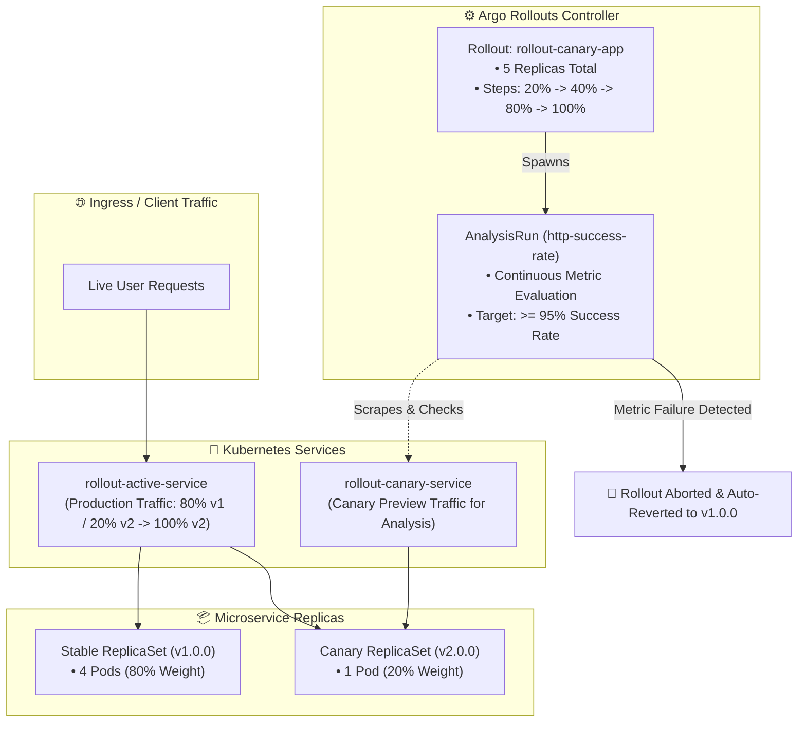
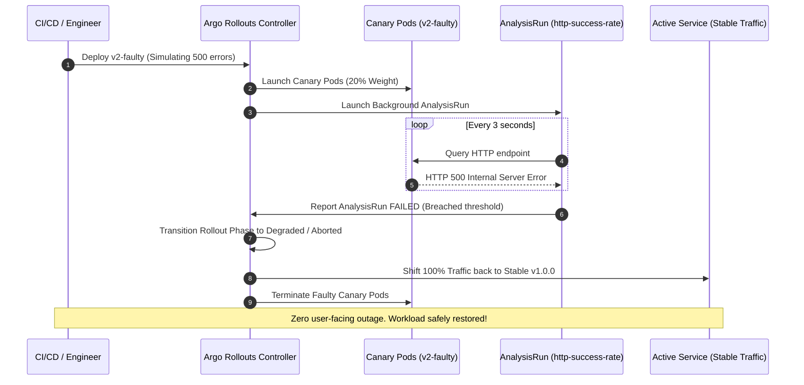

<!-- markdownlint-disable MD013 -->
# Mini-Project 08: Canary and Blue-Green Deployments with Argo Rollouts

> **Domain**: 04. Kubernetes & Orchestration  
> **Level**: Advanced  
> **Infrastructure**: Local (K3d / K3s / OrbStack / Minikube / Kind + Argo Rollouts Controller)  

---

## 🎯 Overview & Context

In high-availability production environments, standard Kubernetes `RollingUpdate`
deployments present critical operational limitations:

- **All-or-Nothing Risk**: New container versions are progressively swapped without
  fine-grained traffic control (e.g. directing only 5% of traffic to verify safety).
- **No Automated Metric Analysis**: Standard deployments cannot evaluate real-time
  application health, error rates, or latency before completing the rollout.
- **Manual Incident Response**: If a defect is introduced in production, engineers
  must manually detect the SLO breach and issue a manual rollback (`kubectl rollout undo`),
  resulting in user-facing downtime.

**Argo Rollouts** solves these challenges by implementing **Progressive Delivery**
through a custom controller and the `Rollout` Custom Resource Definition (CRD).
It enables advanced deployment strategies like **Canary** (with automated metric analysis
and instant rollback on SLO breaches) and **Blue-Green** (with preview environments
and instant traffic cutover).



---

## 🧠 Progressive Delivery & Argo Rollouts Mechanics Deep-Dive

### 1. Canary Strategy vs Blue-Green Strategy

| Feature / Dimension | Standard `RollingUpdate` | Argo Rollouts `Canary` | Argo Rollouts `Blue-Green` |
| :--- | :--- | :--- | :--- |
| **Traffic Weighting** | Uncontrolled (pod count ratio) | Controlled (e.g. 20% $\rightarrow$ 40% $\rightarrow$ 80%) | 0% or 100% (Instant switch) |
| **Preview Environment** | ❌ None | ✅ `canaryService` | ✅ `previewService` |
| **Metric Analysis** | ❌ None (only basic probes) | ✅ Background `AnalysisRun` | ✅ Pre-promotion `AnalysisRun` |
| **Automated Rollback** | ❌ Manual intervention required | ✅ Automatic on metric breach | ✅ Instant revert of Active Service |
| **Resource Overhead** | Low (maxSurge pods) | Low (proportional to weight) | Double compute during cutover |

---

### 2. Automated Metric Analysis (`AnalysisTemplate` & `AnalysisRun`)

An `AnalysisTemplate` defines what metrics to evaluate, how frequently to query them,
and what constitutes success or failure:

```yaml
apiVersion: argoproj.io/v1alpha1
kind: AnalysisTemplate
metadata:
  name: http-success-rate
  namespace: argo-rollouts-demo
spec:
  metrics:
    - name: http-health-check
      interval: 3s
      count: 3
      failureLimit: 1
      provider:
        job:
          spec:
            template:
              spec:
                containers:
                  - name: health-checker
                    image: alpine:3.21
                    command: ["/bin/sh", "-c"]
                    args:
                      - |
                        code=$(curl -s -o /dev/null -w "%{http_code}" http://rollout-canary-service:80/ || echo "500")
                        if [ "$code" = "200" ]; then exit 0; else exit 1; fi
                restartPolicy: Never
            backoffLimit: 0
```

#### Supported Metric Providers

Argo Rollouts natively integrates with:

- **Prometheus**: PromQL queries (e.g. `sum(rate(http_requests_total{status=~"2.*"}[1m])) / sum(rate(http_requests_total[1m])) >= 0.99`).
- **Datadog / New Relic / Wavefront / CloudWatch**: Cloud APM query APIs.
- **Web / Webhooks**: HTTP POST/GET endpoints returning JSON telemetry.
- **Job**: Kubernetes Pods executing custom validation scripts or synthetic smoke tests.

---

### 3. Automated Failure Detection & Rollback Flow



---

## 📂 Project Structure

```text
04-orchestration/08-canary-blue-green-argo-rollouts/
├── app/
│   ├── main.go               # Go HTTP microservice with version reporting & fault injection
│   ├── go.mod                # Go module definition
│   ├── Dockerfile            # Multi-stage minimal container build (<20MB Alpine base)
│   └── .dockerignore         # Docker build context exclusions
├── install/
│   └── argo-rollouts-install.yaml # Bundled official Argo Rollouts CRD & Controller manifest
├── namespace.yaml            # Dedicated Kubernetes Namespace (argo-rollouts-demo)
├── services.yaml             # Active (stable) and Canary (preview) ClusterIP Services
├── analysis-template.yaml    # AnalysisTemplate for automated HTTP success rate evaluation
├── rollout-canary.yaml       # Rollout manifest with Canary strategy & progressive weight steps
├── rollout-bluegreen.yaml    # Rollout manifest with Blue-Green strategy & preview promotion gate
├── setup_argo_rollouts.sh    # Controller setup and readiness validation script
├── canary_test_runner.sh     # Interactive canary rollout & fault-triggered rollback driver
├── test_argo_rollouts.sh     # Automated 12-point end-to-end verification test suite
├── cleanup.sh                # Complete environment teardown script
└── README.md                 # Pedagogical guide, progressive delivery deep-dive & manual
```

---

## 🚀 Quickstart: Deploy, Rollout & Test

### Prerequisites

Ensure you have Docker and a local Kubernetes cluster running:

- **Docker Engine / OrbStack**: Running and accessible (`docker info`).
- **Kubernetes CLI (`kubectl`)**: Configured and connected (`kubectl cluster-info`).
- **Local Cluster**: Any active Kubernetes cluster (e.g. K3d, OrbStack, Minikube, Kind).

---

### Step 1: Install the Argo Rollouts Controller

Install the custom controller and Custom Resource Definitions (CRDs):

```bash
./setup_argo_rollouts.sh
```

Verify that the controller deployment is available:

```bash
kubectl get pods -n argo-rollouts
```

---

### Step 2: Build the Container Images

Build the baseline and canary test images:

```bash
# 1. Build v1.0.0 (Stable baseline)
docker build -t rollout-app:v1.0.0 --build-arg VERSION=v1.0.0 app/

# 2. Build v2.0.0 (Healthy new release)
docker build -t rollout-app:v2.0.0 --build-arg VERSION=v2.0.0 app/

# 3. Build v2-faulty (Synthetic HTTP 500 error injection)
docker build -t rollout-app:v2-faulty --build-arg VERSION=v2.0.0-faulty --build-arg DEFAULT_ERROR_RATE=1.0 app/
```

> **Note for K3d / Minikube / Kind users**:  
> Import the built images into your cluster runtime:
>
> ```bash
> # For k3d:
> k3d image import rollout-app:v1.0.0 rollout-app:v2.0.0 rollout-app:v2-faulty -c <cluster-name>
>
> # For minikube:
> minikube image load rollout-app:v1.0.0 rollout-app:v2.0.0 rollout-app:v2-faulty
>
> # For kind:
> kind load docker-image rollout-app:v1.0.0 rollout-app:v2.0.0 rollout-app:v2-faulty
> ```

---

### Step 3: Deploy Baseline Rollout & Services

Apply the declarative manifests to create the baseline release:

```bash
kubectl apply -f namespace.yaml
kubectl apply -f services.yaml
kubectl apply -f analysis-template.yaml
kubectl apply -f rollout-canary.yaml
```

Wait for the rollout to reach `Healthy` status on `v1.0.0`:

```bash
kubectl get rollout rollout-canary-app -n argo-rollouts-demo
```

Expected output:

```text
NAME                 DESIRED   CURRENT   UP-TO-DATE   AVAILABLE   AGE
rollout-canary-app   5         5         5            5           30s
```

---

### Step 4: Test Progressive Canary Rollout to v2.0.0

Trigger a progressive canary rollout by updating the container image to `rollout-app:v2.0.0`:

```bash
kubectl patch rollout rollout-canary-app -n argo-rollouts-demo --type='merge' \
    -p '{"spec": {"template": {"spec": {"containers": [{"name": "rollout-app", "image": "rollout-app:v2.0.0"}]}}}}'
```

Watch the progressive weight steps (`20% -> 40% -> 80% -> 100%`) and background analysis:

```bash
kubectl get rollout rollout-canary-app -n argo-rollouts-demo -w
```

---

### Step 5: Test Automated Rollback on Fault Injection

Trigger a deployment with the faulty container image (`rollout-app:v2-faulty`):

```bash
kubectl patch rollout rollout-canary-app -n argo-rollouts-demo --type='merge' \
    -p '{"spec": {"template": {"spec": {"containers": [{"name": "rollout-app", "image": "rollout-app:v2-faulty"}]}}}}'
```

Observe how the `AnalysisRun` detects HTTP 500 errors, fails, and automatically aborts
the rollout:

```bash
# Check AnalysisRuns
kubectl get analysisrun -n argo-rollouts-demo

# Check Rollout status (Transitioned to Degraded / Aborted)
kubectl get rollout rollout-canary-app -n argo-rollouts-demo
```

---

## 🧪 Testing with Automated Canary Runner

The project includes an interactive verification driver: `canary_test_runner.sh`.

```bash
./canary_test_runner.sh
```

### What `canary_test_runner.sh` Demonstrates

1. Validates baseline rollout status with 5 healthy pods serving `v1.0.0`.
2. Triggers progressive canary delivery to `v2.0.0`, monitoring weight shifting (`20% -> 40% -> 80% -> 100%`).
3. Executes background `AnalysisRun` confirming 100% HTTP 200 responses.
4. Triggers deployment of `v2-faulty` injecting synthetic 500 errors.
5. Observes `AnalysisRun` failure, automated abort, and restoration of stable traffic.

Sample output:

```text
======================================================================
  🚀 Argo Rollouts: Canary Delivery & Automated Rollback Runner
======================================================================
▶ Step 1: Validating Argo Rollouts Controller...
▶ Step 2: Deploying Baseline Rollout (v1.0.0) with 5 Replicas...
  [OK] Baseline rollout active (Phase: Healthy, Image: rollout-app:v1.0.0).

▶ Step 3: Triggering Progressive Canary Rollout to v2.0.0...
  Monitoring progressive weight shifting (20% -> 40% -> 80% -> 100%)...
  [12:37:05] Canary Weight: 20% | Rollout Phase: Progressing
  [12:37:11] Canary Weight: 40% | Rollout Phase: Progressing
  [12:37:17] Canary Weight: 80% | Rollout Phase: Progressing
  [12:37:23] Canary Weight: 0% | Rollout Phase: Healthy
  [OK] Canary rollout to v2.0.0 successfully completed and promoted to 100% stable!

▶ Step 4: Triggering Faulty Canary Rollout (v2-faulty: 100% HTTP 500s)...
  Monitoring automated failure detection and instant rollback...
  [12:37:29] Status Phase: Progressing | Completed Reason: Evaluating
  [12:37:35] Status Phase: Degraded | Completed Reason: AnalysisRunFailed
  [AUTOMATED ROLLBACK TRIGGERED] AnalysisRun failed! Rollout aborted by controller.

▶ Step 5: Verifying Active Service Reverted to Stable Workload...
  [OK] Active stable workload preserved with zero outage.

======================================================================
📊 ARGO ROLLOUTS PROGRESSIVE DELIVERY REPORT
======================================================================
  Rollout Name                 : rollout-canary-app (5 Replicas)
  Strategy                     : Canary (20% -> 40% -> 80% -> 100%)
  Analysis Metric Provider     : http-success-rate (Job Provider)
  Progressive Rollout (v2)     : PASSED (Promoted to 100%)
  Fault Injection Detection    : PASSED (Metric breach caught)
  Automated Rollback Trigger   : PASSED (Stable traffic preserved)
======================================================================
✅ ALL ARGO ROLLOUTS VERIFICATIONS PASSED!
```

---

## ⚡ Automated End-to-End Test Suite

Run the full 12-point automated verification suite:

```bash
./test_argo_rollouts.sh
```

### Verification Matrix

| # | Test Case Description | Scope & Verification Method |
| :--- | :--- | :--- |
| **01** | Docker Engine Availability | Validates Docker daemon is responsive. |
| **02** | Kubernetes Cluster Connectivity | Validates active context and API server communication. |
| **03** | Argo Rollouts Controller Setup | Installs CRDs and verifies `argo-rollouts` pod readiness. |
| **04** | Container Image Builds | Builds `v1.0.0`, `v2.0.0`, and `v2-faulty` images (<20MB). |
| **05** | Declarative Manifest Dry-Run | Runs `kubectl apply --dry-run=client` across all YAML files. |
| **06** | Baseline Rollout Initialization | Verifies 5/5 healthy ready replicas on `v1.0.0`. |
| **07** | Active Service Connectivity | Validates HTTP response routing to active stable workload. |
| **08** | Progressive Canary Weight Shifts | Validates weight progression (`20% -> 40% -> 80% -> 100%`). |
| **09** | Automated AnalysisRun Evaluation | Validates `http-success-rate` metric execution. |
| **10** | Fault-Triggered Auto-Rollback | Asserts controller aborts rollout on HTTP 500 fault injection. |
| **11** | Blue-Green Strategy Validation | Validates `rollout-bluegreen.yaml` Active/Preview bindings. |
| **12** | Resource Teardown Verification | Validates `cleanup.sh` uninstalls rollouts and namespaces. |

---

## 🧹 Complete Resource Teardown & Cleanup

To leave your local environment completely clean for subsequent mini-projects, execute the cleanup script:

```bash
./cleanup.sh
```

### Manual Cleanup Commands

```bash
# 1. Terminate active port-forward tunnels
pkill -f "port-forward.*rollout" || true

# 2. Delete the demo namespace (cascades Rollouts, AnalysisRuns, Services, and Pods)
kubectl delete namespace argo-rollouts-demo --ignore-not-found=true

# 3. Delete the Argo Rollouts controller namespace
kubectl delete namespace argo-rollouts --ignore-not-found=true

# 4. Remove local Docker images
docker rmi -f rollout-app:v1.0.0 rollout-app:v2.0.0 rollout-app:v2-faulty

# 5. (Optional) Delete temporary K3d test cluster if created
k3d cluster delete argo-test
```

---

## 📚 SRE Best Practices for Progressive Delivery

1. **Align Analysis Interval with Traffic Cadence**: Ensure `interval` and `count`
   allow sufficient traffic sample collection to avoid false positive aborts caused
   by transient network blips.
2. **Combine with Service Mesh / Ingress for L7 Routing**: For advanced canary use cases,
   pair Argo Rollouts with **Istio**, **Linkerd**, or **Nginx Ingress** to route canary
   traffic based on HTTP headers (e.g. `X-Beta-Tester: true`) or cookies.
3. **Always Retain Revision History**: Set `spec.revisionHistoryLimit` to at least 3
   to ensure previous stable ReplicaSets remain warm for instantaneous zero-delay rollbacks.
4. **Automate Smoke Tests in CI/CD**: Run pre-promotion automated integration tests
   against `previewService` before approving blue-green cutovers.
