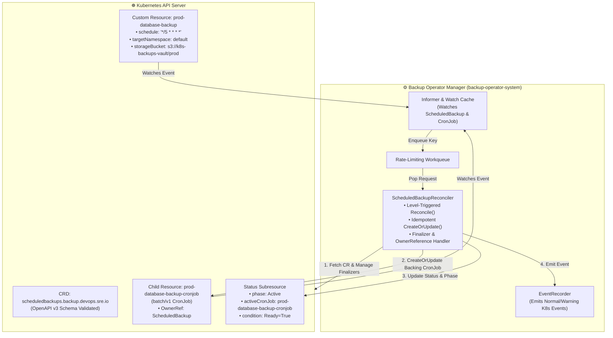
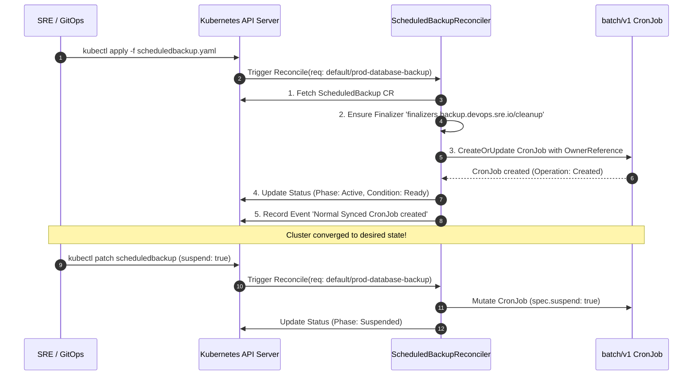

<!-- markdownlint-disable MD013 -->
# Mini-Project 10: Custom Kubernetes Operator with Kubebuilder

> **Domain**: 04. Kubernetes & Orchestration  
> **Level**: Advanced  
> **Infrastructure**: Local (K3d / K3s / OrbStack / Minikube / Kind + Controller-Runtime / Go 1.24+)  

---

## 🎯 Overview & Context

In cloud-native engineering, declarative primitives like `Deployments` and `StatefulSets`
automate basic workload lifecycle management. However, complex operational tasks—such
as automated database backups, failover orchestration, schema migrations, and custom
backup retention policies—traditionally required manual Site Reliability Engineering (SRE)
intervention.

The **Kubernetes Operator Pattern** solves this by codifying human operational domain
knowledge into software. An Operator consists of two core components:

1. **Custom Resource Definition (CRD)**: Extends the Kubernetes API schema with custom,
   domain-specific objects (e.g. `ScheduledBackup`).
2. **Custom Controller (Reconciler)**: Continuously executes a control loop comparing the
   **Desired State** (declared in `spec`) with the **Actual State** of the cluster,
   taking corrective actions until both states converge.

This mini-project implements a production-grade Kubernetes Operator in **Go** using the
canonical **Controller-Runtime** and **Kubebuilder** architecture. It manages the full
lifecycle of `ScheduledBackup` resources, automatically orchestrating backing `batch/v1`
`CronJob` workloads, handling dynamic schedule mutations, managing finalizers, and updating
Kubernetes status subresources.



---

## 🧠 Operator Architecture & Controller-Runtime Mechanics Deep-Dive

### 1. The Reconciliation Loop (Level-Triggered vs Edge-Triggered)

Standard scripts are often **edge-triggered**: they run only when a specific event fires.
If a network blip occurs or the process restarts, state is lost.

Kubernetes Controllers are **level-triggered**: the reconciler receives only the
`NamespacedName` (key) of the resource and must inspect the current state on every execution.



---

### 2. Custom Resource Definition Anatomy (`ScheduledBackup`)

```yaml
apiVersion: backup.devops.sre.io/v1alpha1
kind: ScheduledBackup
metadata:
  name: prod-database-backup
  namespace: default
spec:
  schedule: "*/5 * * * *"
  targetNamespace: default
  storageBucket: "s3://k8s-backups-vault/prod-database"
  retentionDays: 30
  suspend: false
  backupImage: "alpine:3.21"
status:
  phase: Active
  activeCronJob: prod-database-backup-cronjob
  lastBackupTime: "2026-08-21T16:00:00Z"
  conditions:
    - type: Ready
      status: "True"
      reason: CronJobSynced
      message: "Backing CronJob prod-database-backup-cronjob is synced (Created)"
```

#### Key API Schema Fields

| Field | Type | Description | Validation / Default |
| :--- | :--- | :--- | :--- |
| `spec.schedule` | string | Cron expression for backup execution | Regex: `^(\S+\s+){4}\S+$` (Required) |
| `spec.targetNamespace` | string | Namespace to snapshot | MinLength: 1 (Required) |
| `spec.storageBucket` | string | Destination storage URI | Required |
| `spec.retentionDays` | int32 | Snapshot retention period | Minimum: 1, Default: `7` |
| `spec.suspend` | bool | Pauses execution schedule | Default: `false` |
| `spec.backupImage` | string | Container image for job runner | Default: `alpine:3.21` |
| `status.phase` | string | High-level lifecycle phase | Enum: `Pending`, `Active`, `Suspended`, `Failed` |

---

### 3. OwnerReferences & Finalizers

- **`OwnerReference`**: Links the generated `batchv1.CronJob` directly to the parent
  `ScheduledBackup`. When the `ScheduledBackup` CR is deleted, Kubernetes automatically
  garbage-collects the child `CronJob`.
- **`Finalizer` (`finalizers.backup.devops.sre.io/cleanup`)**: Guarantees that the
  operator has an opportunity to execute pre-deletion cleanup routines (such as flushing
  in-flight backups and emitting audit events) before Kubernetes purges the resource from etcd.

---

## 📂 Project Structure

```text
04-orchestration/10-custom-kubernetes-operator-kubebuilder/
├── api/
│   └── v1alpha1/
│       ├── groupversion_info.go       # Scheme builder & API group metadata
│       └── scheduledbackup_types.go   # Go structs for ScheduledBackup Spec & Status
├── controllers/
│   └── scheduledbackup_controller.go  # Core reconciliation loop & finalizer handler
├── config/
│   ├── crd/bases/
│   │   └── backup.devops.sre.io_scheduledbackups.yaml # OpenAPI v3 CRD manifest
│   ├── rbac/
│   │   ├── service_account.yaml       # ServiceAccount for manager
│   │   ├── role.yaml                  # ClusterRole with least-privilege permissions
│   │   └── role_binding.yaml          # ClusterRoleBinding
│   ├── manager/
│   │   ├── namespace.yaml             # Dedicated namespace (backup-operator-system)
│   │   └── deployment.yaml            # Operator manager deployment manifest
│   └── samples/
│       ├── backup_v1alpha1_scheduledbackup.yaml           # Active sample CR
│       └── backup_v1alpha1_scheduledbackup_suspended.yaml # Suspended sample CR
├── main.go                            # Operator manager entrypoint
├── go.mod                             # Go module definition (Controller-Runtime v0.19+)
├── go.sum                             # Go cryptographic module checksums
├── Dockerfile                         # Hardened multi-stage container build (<25MB Alpine)
├── .dockerignore                      # Build context exclusion filter
├── operator_test_suite.sh             # Integration test driving CR reconciliation & updates
├── test_operator.sh                   # Automated 12-point end-to-end verification test suite
├── cleanup.sh                         # Complete environment teardown script
└── README.md                          # Pedagogical guide, operator architecture & manual
```

---

## 🚀 Quickstart: Build, Deploy & Reconcile

### Prerequisites

- **Docker Engine / OrbStack**: Running and accessible (`docker info`).
- **Kubernetes CLI (`kubectl`)**: Configured and connected (`kubectl cluster-info`).
- **Go 1.24+**: Installed for local static analysis (`go version`).
- **Active Cluster**: Any local Kubernetes cluster (K3d, K3s, OrbStack, Minikube, Kind).

---

### Step 1: Build and Import the Operator Container Image

Build the operator binary and container image:

```bash
docker build -t backup-operator:latest .
```

> **Note for K3d / Minikube / Kind users**:  
> Import the built image into your cluster runtime:
>
> ```bash
> # For k3d:
> k3d image import backup-operator:latest -c <cluster-name>
>
> # For minikube:
> minikube image load backup-operator:latest
>
> # For kind:
> kind load docker-image backup-operator:latest
> ```

---

### Step 2: Register the Custom Resource Definition (CRD)

Register `scheduledbackups.backup.devops.sre.io` in the cluster API server:

```bash
kubectl apply -f config/crd/bases/backup.devops.sre.io_scheduledbackups.yaml
```

Verify that the CRD is established:

```bash
kubectl get crd scheduledbackups.backup.devops.sre.io
```

---

### Step 3: Deploy the Operator Controller Manager

Deploy the namespace, RBAC permissions, and controller deployment:

```bash
kubectl apply -f config/manager/namespace.yaml
kubectl apply -f config/rbac/service_account.yaml
kubectl apply -f config/rbac/role.yaml
kubectl apply -f config/rbac/role_binding.yaml
kubectl apply -f config/manager/deployment.yaml
```

Wait for the operator manager pod to become ready:

```bash
kubectl rollout status deployment/backup-operator-controller-manager -n backup-operator-system
```

---

### Step 4: Create a `ScheduledBackup` Custom Resource

Deploy a sample `ScheduledBackup` targeting the `default` namespace:

```bash
kubectl apply -f config/samples/backup_v1alpha1_scheduledbackup.yaml
```

Inspect the custom resource using custom printer columns:

```bash
kubectl get scheduledbackups
```

Expected output:

```text
NAME                   SCHEDULE      TARGET-NS   PHASE    CRONJOB                        AGE
prod-database-backup   */5 * * * *   default     Active   prod-database-backup-cronjob   10s
```

Verify that the operator automatically created the backing `CronJob`:

```bash
kubectl get cronjob prod-database-backup-cronjob
```

---

### Step 5: Test Dynamic Re-Reconciliation (Schedule Suspension)

Update the CR to suspend backup executions:

```bash
kubectl patch scheduledbackup prod-database-backup --type=merge -p '{"spec":{"suspend":true}}'
```

Verify that the controller re-reconciled the change:

```bash
kubectl get scheduledbackup prod-database-backup
kubectl get cronjob prod-database-backup-cronjob -o jsonpath='{.spec.suspend}'
```

---

## 🧪 Testing with Operator Integration Suite

The project includes an end-to-end integration driver: `operator_test_suite.sh`.

```bash
./operator_test_suite.sh
```

### What `operator_test_suite.sh` Verifies

1. Validates CRD registration in the cluster.
2. Checks controller manager pod readiness in `backup-operator-system`.
3. Creates `prod-database-backup` and verifies backing `CronJob` creation.
4. Asserts status progression to `Phase: Active` and condition `Ready=True`.
5. Verifies `OwnerReference` linkage between parent CR and child `CronJob`.
6. Patches CR to `suspend: true` and verifies dynamic re-reconciliation to `Phase: Suspended`.
7. Deletes CR and verifies clean garbage collection and finalizer removal.

Sample output:

```text
======================================================================
  ⚙️  Custom Kubernetes Operator Integration & Reconciliation Suite
======================================================================
▶ Step 1: Verifying ScheduledBackup CRD in Kubernetes API...
  [PASS] Step 01: ScheduledBackup CRD is registered in apiserver
         ↳ API: backup.devops.sre.io/v1alpha1

▶ Step 2: Checking Operator Controller Manager pod health...
  [PASS] Step 02: Backup Operator manager is running and healthy
         ↳ Namespace: backup-operator-system

▶ Step 3: Deploying ScheduledBackup Custom Resource (prod-database-backup)...
  Waiting for operator reconciliation loop to create backing CronJob...
  [PASS] Step 03: Operator created child batch/v1 CronJob (prod-database-backup-cronjob)

▶ Step 4: Validating Custom Resource Status & Conditions...
  [PASS] Step 04: Custom Resource Status reached Phase: Active (Ready: True)

▶ Step 5: Verifying Controller OwnerReference on child CronJob...
  [PASS] Step 05: Child CronJob has OwnerReference pointing to ScheduledBackup
         ↳ Owner: ScheduledBackup/prod-database-backup

▶ Step 6: Testing Dynamic Re-Reconciliation (Updating CR to suspend: true)...
  [PASS] Step 06: Operator re-reconciled CR update: CronJob suspended and Phase: Suspended

▶ Step 7: Testing Lifecycle Deletion & Finalizer Execution...
  [PASS] Step 07: ScheduledBackup and child CronJob cleanly deleted via OwnerReference

======================================================================
📊 KUBERNETES OPERATOR INTEGRATION REPORT
======================================================================
  CRD API Group                : backup.devops.sre.io/v1alpha1
  Custom Resource              : ScheduledBackup
  Controller Framework         : Controller-Runtime (Go 1.24+)
  Child Workload Managed       : batch/v1 CronJob
  Level-Triggered Reconcile    : PASSED
  Status Subresource & Events  : PASSED
  OwnerRef Garbage Collection  : PASSED
======================================================================
  Integration Steps Summary: 7 Passed, 0 Failed (Total: 7)
======================================================================
✅ OPERATOR INTEGRATION SUITE PASSED SUCCESSFULLY!
```

---

## ⚡ Automated End-to-End Test Suite

Run the full 12-point automated verification suite:

```bash
./test_operator.sh
```

### Verification Matrix

| # | Test Case Description | Scope & Verification Method |
| :--- | :--- | :--- |
| **01** | Docker Engine Availability | Validates Docker daemon is responsive. |
| **02** | Kubernetes Cluster Connectivity | Validates API server reachability. |
| **03** | Go Static Analysis (`go vet`) | Validates Go source code syntax and type correctness. |
| **04** | Container Image Build | Builds `<25MB` Alpine image (`backup-operator:latest`). |
| **05** | Declarative Manifest Dry-Run | Runs `kubectl apply --dry-run=client` across all YAMLs. |
| **06** | CRD Registration | Verifies `scheduledbackups.backup.devops.sre.io` API setup. |
| **07** | Operator Manager Readiness | Deploys controller and checks readiness probe (`/readyz`). |
| **08** | Backing Workload Creation | Asserts operator provisions `batch/v1` `CronJob`. |
| **09** | Status & Condition Updates | Asserts CR transitions to `Phase: Active` with `Ready=True`. |
| **10** | Dynamic Re-Reconciliation | Asserts schedule suspension propagates to child `CronJob`. |
| **11** | Suspended CR Validation | Validates suspended sample CR initializes directly in `Suspended`. |
| **12** | Complete Resource Teardown | Validates `cleanup.sh` removes all CRDs, RBAC, and images. |

---

## 🧹 Complete Resource Teardown & Cleanup

To leave your local environment completely clean for subsequent mini-projects, execute:

```bash
./cleanup.sh
```

### Manual Cleanup Commands

```bash
# 1. Delete all ScheduledBackup custom resources
kubectl delete scheduledbackups --all -A --ignore-not-found=true

# 2. Delete the operator namespace (cascades deployment and pod)
kubectl delete namespace backup-operator-system --ignore-not-found=true

# 3. Delete cluster-wide RBAC and CRD
kubectl delete clusterrolebinding backup-operator-manager-rolebinding --ignore-not-found=true
kubectl delete clusterrole backup-operator-manager-role --ignore-not-found=true
kubectl delete crd scheduledbackups.backup.devops.sre.io --ignore-not-found=true

# 4. Remove local Docker image
docker rmi -f backup-operator:latest

# 5. (Optional) Delete temporary test cluster if created
k3d cluster delete operator-test
```

---

## 📚 SRE Best Practices for Building Kubernetes Operators

1. **Ensure Reconcile Loop Idempotency**: The `Reconcile` function can be called multiple
   times with the same request. Always write logic such that repeated executions produce
   the exact same result without duplicate child objects.
2. **Always Use `controllerutil.CreateOrUpdate`**: Avoid manual `Get` followed by `Create`
   or `Update`. The `CreateOrUpdate` helper safely handles resource version conflicts
   and optimistic concurrency control.
3. **Use Status Subresources**: Always isolate status mutations to `r.Status().Update()`
   to prevent triggering infinite reconciliation loops on spec changes.
4. **Set `OwnerReferences` for Child Objects**: Always link generated workloads to the
   parent Custom Resource via `ctrl.SetControllerReference` to leverage native Kubernetes
   garbage collection.
5. **Emit Meaningful Kubernetes Events**: Use `record.EventRecorder` to record `Normal`
   and `Warning` events so platform engineers can debug issues using `kubectl describe`.
