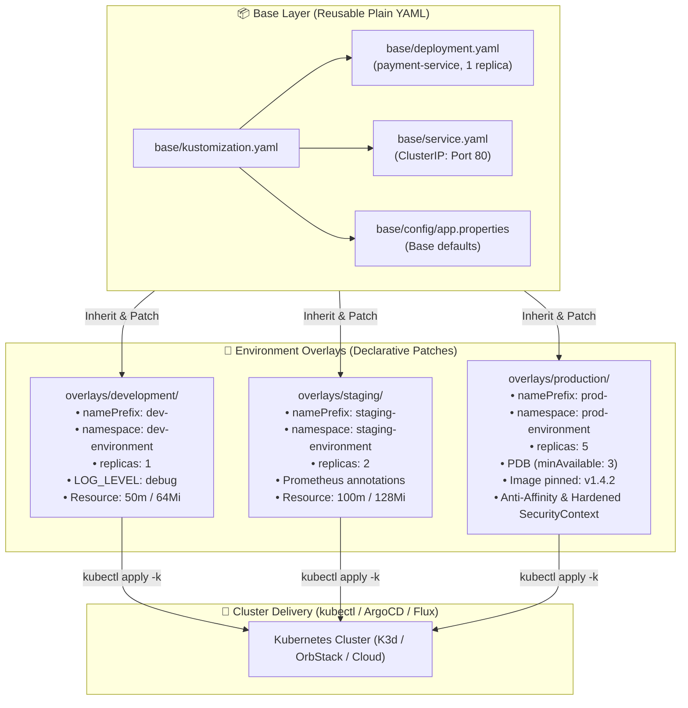

<!-- markdownlint-disable MD013 -->
# Mini-Project 11: Multi-Environment Manifest Management with Kustomize

> **Domain**: 04. Kubernetes & Orchestration  
> **Level**: Beginner to Intermediate  
> **Infrastructure**: Local (K3d / K3s / OrbStack / Kind / Minikube / Kubectl)  

---

## 🎯 Overview & Context

In modern Cloud-Native Engineering and Site Reliability Engineering (SRE), managing Kubernetes application manifests across multiple environments (**Development**, **Staging**, and **Production**) is one of the most critical operational challenges.

Historically, teams faced two extremes:

1. **Copy-Pasting YAML Manifests**: Creating duplicate YAML files per environment leads to configuration drift, high maintenance overhead, and dangerous production bugs caused by forgotten updates.
2. **Complex Template Engines**: Introducing complex templating languages (e.g., Jinja2, heavy Helm charts) often obscures the underlying Kubernetes YAML schema and introduces syntax errors that can only be caught at runtime.

**Kustomize** solves this problem by providing a **declarative, template-free configuration customization engine** built directly into `kubectl` (`kubectl apply -k` and `kubectl kustomize`). Kustomize introduces the **Base and Overlay pattern**: you define a single, standard **Base** of plain Kubernetes YAML manifests and create lightweight **Overlays** that patch, prefix, configure, and augment resources specifically for each target environment.



---

## 🧠 Core Kustomize Architectural Concepts

### 1. The Base and Overlay Hierarchy

- **Base**: Contains the common, vanilla Kubernetes manifests (`Deployment`, `Service`, etc.) that represent the canonical definition of the application without environment-specific assumptions.
- **Overlay**: Points to one or more bases (via `resources: [../../base]`) and specifies delta modifications:
  - **`namePrefix` / `nameSuffix`**: Prepends or appends a prefix to all generated resource names (e.g., `dev-payment-service`).
  - **`namespace`**: Automatically assigns all resources in the overlay to a designated namespace.
  - **`labels`**: Propagates metadata labels across all resources and selector match labels.
  - **`replicas`**: Declaratively overrides replica counts without full YAML duplication.
  - **`images`**: Overrides container image registries, repository names, and tags/digests without touching the base deployment manifest.

```text
04-orchestration/11-multi-environment-kustomize-overlays/
├── base/                              # Canonical vanilla manifests
│   ├── config/
│   │   └── app.properties             # Baseline configuration
│   ├── deployment.yaml                # Standard single-replica deployment
│   ├── kustomization.yaml             # Base composition rules
│   └── service.yaml                   # ClusterIP Service
└── overlays/                          # Environment-specific customizations
    ├── development/                   # Fast feedback, low resource quota, debug logs
    │   ├── config/
    │   │   ├── dev.properties
    │   │   └── secret.env
    │   ├── deployment-patch.yaml
    │   └── kustomization.yaml
    ├── staging/                       # Pre-production validation, metrics enabled
    │   ├── config/
    │   │   ├── staging.properties
    │   │   └── secret.env
    │   ├── deployment-patch.yaml
    │   └── kustomization.yaml
    └── production/                    # Hardened, high-availability, pinned image
        ├── config/
        │   ├── prod.properties
        │   └── secret.env
        ├── deployment-patch.yaml
        ├── json6902-patch.yaml
        ├── kustomization.yaml
        └── pdb.yaml
```

---

### 2. ConfigMap and Secret Generators with Hash Suffix Invalidation

A classic failure in Kubernetes application lifecycle management occurs when a `ConfigMap` or `Secret` is updated in-place: Kubernetes updates the resource object, but running pods mounting that config do not automatically restart or reload environment variables.

Kustomize solves this natively using **Generators** (`configMapGenerator` and `secretGenerator`):

```mermaid
sequenceDiagram
    autonumber
    participant Dev as DevOps Engineer
    participant Kust as Kustomize Engine
    participant K8s as Kubernetes API Server
    participant Dep as Deployment Controller
    participant Pod as Pods (v1 -> v2)

    Dev->>Kust: Edit dev.properties (LOG_LEVEL=debug)
    Kust->>Kust: Calculate SHA-256 hash of file content
    Note over Kust: Generates: dev-payment-config-fhm9th4m2h
    Kust->>K8s: Apply Deployment with updated configMapRef
    K8s->>Dep: Detects Pod Template Spec Change (new ConfigMap name)
    Dep->>Pod: Triggers Zero-Downtime Rolling Update
    Note over Pod: New pods start with fresh config;<br/>Old pods gracefully decommissioned!
```

- When the configuration file content changes, Kustomize calculates a deterministic content hash and appends it to the resource name (`dev-payment-config-fhm9th4m2h`).
- Kustomize automatically updates all `configMapRef` and `volume` references in the generated `Deployment` to match the new hashed name.
- Kubernetes detects a change in the `PodTemplateSpec`, triggering an immediate, safe **zero-downtime rolling update**.

---

### 3. Patching Strategies: Strategic Merge vs. JSON 6902 Patches

Kustomize provides multiple methods to patch resources:

| Patching Method | Syntax Style | Ideal Use Case | Example in this Project |
| :--- | :--- | :--- | :--- |
| **Strategic Merge Patch** | Standard Kubernetes YAML snippet | Modifying container resources, adding affinity rules, overriding probe parameters. | `deployment-patch.yaml` altering CPU/memory limits and anti-affinity. |
| **JSON 6902 Patch** | RFC 6902 operations (`add`, `replace`, `remove`) | Targeting specific array indexes, adding custom annotations, modifying integer limits. | `json6902-patch.yaml` setting `revisionHistoryLimit: 10` and `security.ops/sla: 99.99`. |

#### Example Strategic Merge Patch (`overlays/production/deployment-patch.yaml`)

```yaml
apiVersion: apps/v1
kind: Deployment
metadata:
  name: payment-service
spec:
  template:
    spec:
      affinity:
        podAntiAffinity:
          preferredDuringSchedulingIgnoredDuringExecution:
            - weight: 100
              podAffinityTerm:
                labelSelector:
                  matchExpressions:
                    - key: app.kubernetes.io/name
                      operator: In
                      values:
                        - payment-service
                topologyKey: kubernetes.io/hostname
      containers:
        - name: payment-service
          securityContext:
            allowPrivilegeEscalation: false
            readOnlyRootFilesystem: true
            capabilities:
              drop:
                - ALL
          resources:
            requests:
              cpu: 250m
              memory: 256Mi
            limits:
              cpu: 500m
              memory: 512Mi
```

#### Example RFC 6902 JSON Patch (`overlays/production/json6902-patch.yaml`)

```yaml
- op: add
  path: /metadata/annotations
  value:
    deployment.kubernetes.io/revision-history: "10"
    security.ops/sla: "99.99"
- op: replace
  path: /spec/revisionHistoryLimit
  value: 10
```

---

## 📊 Multi-Environment Comparison Matrix

| Environment Attribute | Base | Development (`dev`) | Staging (`staging`) | Production (`prod`) |
| :--- | :--- | :--- | :--- | :--- |
| **Target Namespace** | `default` | `dev-environment` | `staging-environment` | `prod-environment` |
| **Name Prefix** | *(none)* | `dev-` | `staging-` | `prod-` |
| **Replica Count** | `1` | `1` | `2` | `5` |
| **Container Image** | `payment-service:latest` | `payment-service:latest` | `payment-service:latest` | `payment-service:v1.4.2` |
| **Log Level** | `info` | `debug` | `info` | `warn` |
| **CPU Requests / Limits** | `100m` / `200m` | `50m` / `100m` | `100m` / `250m` | `250m` / `500m` |
| **Memory Requests / Limits** | `128Mi` / `256Mi` | `64Mi` / `128Mi` | `128Mi` / `256Mi` | `256Mi` / `512Mi` |
| **Pod Disruption Budget** | ❌ No | ❌ No | ❌ No | ✅ Yes (`minAvailable: 3`) |
| **Pod Anti-Affinity** | ❌ No | ❌ No | ❌ No | ✅ Yes (`kubernetes.io/hostname`) |
| **Security Context Hardening** | Standard non-root | Standard non-root | Standard non-root | ✅ Read-only rootfs + Drop ALL |

---

## 🛠️ Step-by-Step Execution Guide

### Prerequisites

Ensure you have installed the following tools:

- `kubectl` (v1.24+) or standalone `kustomize` (v5.0+)
- `docker` (for building the microservice container image)
- *(Optional for live cluster testing)* `k3d`, `k3s`, `orbstack`, `kind`, or `minikube`

---

### Step 1: Inspect and Build Declarative Manifests

You can inspect the compiled output for any environment using `kubectl kustomize` or `kustomize build`:

```bash
# 1. Inspect Base manifest
kubectl kustomize base/

# 2. Inspect Development overlay
kubectl kustomize overlays/development/

# 3. Inspect Staging overlay
kubectl kustomize overlays/staging/

# 4. Inspect Production overlay
kubectl kustomize overlays/production/
```

---

### Step 2: Run the Automated Validation Suite

Execute the built-in validator script to perform 27 automated assertions across all environments:

```bash
./validate_kustomize.sh
```

**Expected Output**:

```text
======================================================================
  🛠️  Kustomize Multi-Environment Manifest Validator
======================================================================

▶ Step 1: Checking Required Tools...
  [PASS] kustomize CLI is available
  [PASS] kubectl CLI is available

▶ Step 2: Building Declarative Manifests...
  [PASS] kustomize build base
  [PASS] kubectl kustomize base syntax validation
  [PASS] kustomize build overlays/development
  [PASS] kubectl kustomize overlays/development syntax validation
  [PASS] kustomize build overlays/staging
  [PASS] kubectl kustomize overlays/staging syntax validation
  [PASS] kustomize build overlays/production
  [PASS] kubectl kustomize overlays/production syntax validation

▶ Step 3: Asserting Environment-Specific Kustomize Transformations...
  [Development Environment Checks]
  [PASS] Dev namespace set to dev-environment
  [PASS] Dev namePrefix 'dev-' applied to deployment and service
  [PASS] Dev deployment replica count equals 1
  [PASS] Dev ConfigMap contains LOG_LEVEL: debug
  [PASS] Dev Deployment patched with minimal resource requests (50m / 64Mi)
  [PASS] Dev ConfigMap and Secret generated with dynamic SHA-hash suffixes

  [Staging Environment Checks]
  [PASS] Staging namespace set to staging-environment
  [PASS] Staging deployment replica count equals 2
  [PASS] Staging Deployment includes prometheus.io/scrape annotation
  [PASS] Staging Deployment configured with intermediate resource requests (100m / 128Mi)

  [Production Environment Checks]
  [PASS] Prod namespace set to prod-environment
  [PASS] Prod deployment replica count equals 5
  [PASS] Prod container image pinned to immutable version (payment-service:v1.4.2)
  [PASS] RFC 6902 JSON patch applied (revisionHistoryLimit: 10 & SLA annotation)
  [PASS] Prod includes PodDisruptionBudget with minAvailable: 3
  [PASS] Prod container includes hardened securityContext (readOnlyRootFilesystem & drop ALL)
  [PASS] Prod Deployment includes high-availability podAntiAffinity rule

======================================================================
  ✅ ALL VALIDATION CHECKS PASSED (27/27)
======================================================================
```

---

### Step 3: Build the Container Image

Build the lightweight Go microservice container image locally:

```bash
docker build -t payment-service:latest -t payment-service:v1.4.2 ./app
```

Verify that the image is ultra-lightweight (<25MB) and configured with non-root security:

```bash
docker images payment-service
docker inspect payment-service:latest --format 'User: {{.Config.User}}'
```

---

### Step 4: Deploy and Test in a Live Cluster (Optional)

If you have a local Kubernetes cluster running (e.g. K3d or OrbStack):

```bash
# 1. Create target namespaces
kubectl create namespace dev-environment
kubectl create namespace staging-environment
kubectl create namespace prod-environment

# 2. Deploy Development Overlay
kubectl apply -k overlays/development/

# 3. Deploy Staging Overlay
kubectl apply -k overlays/staging/

# 4. Deploy Production Overlay
kubectl apply -k overlays/production/

# 5. Check Pods across all namespaces
kubectl get pods -n dev-environment
kubectl get pods -n staging-environment
kubectl get pods -n prod-environment
```

You can port-forward and query the application:

```bash
kubectl port-forward svc/dev-payment-service -n dev-environment 18080:80 &
curl -s http://127.0.0.1:18080 | jq .
```

---

### Step 5: Run the End-to-End Automated Test Suite

Run the full end-to-end verification script:

```bash
./test_kustomize_environments.sh
```

---

## 🧹 Teardown & Environment Cleanup

To ensure a clean environment for subsequent mini-projects and avoid resource leakage, execute the provided teardown script:

```bash
./cleanup.sh
```

### What `cleanup.sh` Automatically Purges

1. **Active Port-Forward Tunnels**: Terminates any background `kubectl port-forward` processes associated with `payment-service`.
2. **Kubernetes Namespaces & Resources**: Deletes `dev-environment`, `staging-environment`, and `prod-environment` namespaces, which automatically removes all enclosed Deployments, Pods, Services, ConfigMaps, Secrets, and PodDisruptionBudgets.
3. **Local Docker Artifacts**: Purges the local Docker test images (`payment-service:latest`, `payment-service:v1.4.2`) and any standalone test containers.
4. **Temporary Project Files**: Cleans up all `.tmp_*` directories, log files, and test caches strictly within the mini-project directory.

### Manual Cleanup Commands (Reference)

If you prefer to clean up manually:

```bash
# 1. Kill background port-forwards
pkill -f "port-forward.*payment-service" || true

# 2. Delete Kubernetes namespaces
kubectl delete namespace dev-environment staging-environment prod-environment --ignore-not-found=true

# 3. Delete local Docker images
docker rmi -f payment-service:latest payment-service:v1.4.2 2>/dev/null || true

# 4. Remove temporary validation files
rm -rf .tmp_validation .tmp_e2e
```

---

## 📚 Key Learnings & Takeaways

1. **DRY Manifests Without Templating Overhead**: Kustomize maintains pure Kubernetes YAML syntax, making manifests readable, lintable, and compatible with any standard Kubernetes tool without specialized templating engines.
2. **Deterministic Hash Invalidation**: Content-hashed ConfigMaps and Secrets eliminate stale configuration states and guarantee automated rolling updates when properties change.
3. **Targeted Environmental Hardening**: Production overlays can selectively enforce strict security policies (read-only rootfs, non-root users, pod anti-affinity, and PodDisruptionBudgets) without cluttering development setups.
4. **GitOps Native**: Kustomize is natively integrated into modern GitOps operators such as **ArgoCD** and **FluxCD**, serving as the industry standard for multi-environment manifest delivery.
