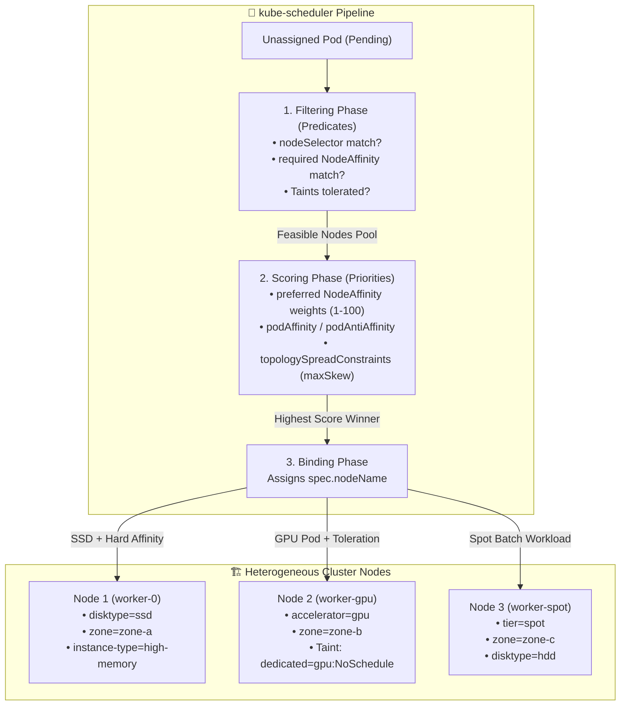
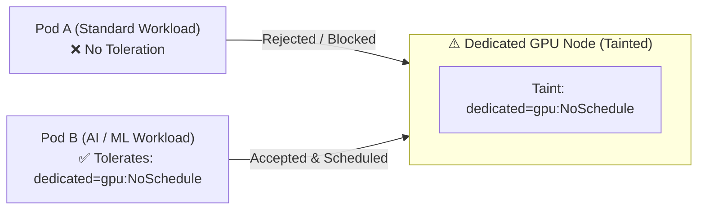

<!-- markdownlint-disable MD013 -->
# Mini-Project 12: Advanced Pod Scheduling: Node Affinity, Taints, and Tolerations

> **Domain**: 04. Kubernetes & Orchestration  
> **Level**: Intermediate to Advanced  
> **Infrastructure**: Local (Multi-Node K3d / Kind / OrbStack / Minikube) or Cloud (EKS / GKE / AKS)  

---

## 🎯 Overview & Context

In a production Kubernetes cluster, nodes are rarely identical. Modern enterprise clusters are **heterogeneous**: some worker nodes have high-speed NVMe SSDs, others host expensive GPU accelerators (e.g., NVIDIA A100/H100), some operate on discount Cloud Spot/Preemptible instances, and others reside across geographically separated availability zones.

Without explicit scheduling rules, the default `kube-scheduler` distributes pods based purely on CPU and memory capacity. This can lead to severe architectural issues:

- **Resource Misallocation**: A lightweight batch worker might land on a $10,000/month GPU node, blocking critical deep learning workloads.
- **Latency Spikes**: Tightly coupled services (e.g., web API and Redis cache) might end up in different availability zones, adding cross-zone network latency and data transfer costs.
- **Single Points of Failure**: All replicas of a mission-critical deployment might land on the exact same physical node. If that node reboots, the service goes down completely.

This mini-project demonstrates how to gain full control over pod placement using Kubernetes' rich suite of scheduling directives: **Node Selectors**, **Hard & Soft Node Affinity**, **Taints & Tolerations** (with `NoSchedule` and `NoExecute`), **Pod Affinity & Anti-Affinity**, and **Topology Spread Constraints**.



---

## 🧠 Core Kubernetes Scheduling Internals Deep-Dive

### 1. The Two-Phase Scheduling Pipeline: Filtering vs. Scoring

When a Pod is submitted to the API server with `spec.nodeName: ""` (empty), `kube-scheduler` executes a deterministic two-phase algorithm:

1. **Filtering (Predicates)**:
   The scheduler filters out nodes that cannot satisfy the pod's mandatory requirements.
   - Does the node satisfy `nodeSelector`?
   - Does it satisfy `requiredDuringSchedulingIgnoredDuringExecution`?
   - Does the node have any `Taints` that the pod does not have matching `Tolerations` for?
   - *Result*: A list of "feasible nodes". If no nodes pass, the pod transitions to `Pending`.

2. **Scoring (Priorities)**:
   The scheduler ranks all surviving feasible nodes from 0 to 100 based on soft preferences:
   - `preferredDuringSchedulingIgnoredDuringExecution` weights.
   - `podAffinity` and `podAntiAffinity` term scores.
   - `topologySpreadConstraints` distribution balance.
   - *Result*: The node with the highest cumulative score is selected.

---

### 2. Node Selection Mechanisms Comparison

| Scheduling Mechanism | Expressiveness | Enforcement Level | When Unsatisfied | Primary Use Case |
| :--- | :--- | :--- | :--- | :--- |
| **`nodeSelector`** | Exact key-value equality | Hard (Required) | Pod stays `Pending` | Simple legacy hardware targeting (`disktype: ssd`). |
| **Node Affinity (`required...`)** | Advanced Boolean operators (`In`, `NotIn`, `Exists`, `DoesNotExist`, `Gt`, `Lt`) | Hard (Required) | Pod stays `Pending` | Multi-zone compliance, OS architecture, strict hardware isolation. |
| **Node Affinity (`preferred...`)** | Weighted expressions (weights 1 to 100) | Soft (Best Effort) | Schedules on best available node | Cost optimization (prefer Spot instances or Arm64 if available). |
| **Taints & Tolerations** | Node-driven repellent policy (`NoSchedule`, `PreferNoSchedule`, `NoExecute`) | Hard or Soft depending on effect | Node rejects untolerated pods | Dedicated GPU nodes, master node protection, node drain evacuation. |
| **`podAffinity`** | Inter-pod co-location based on `topologyKey` | Hard or Soft | Pods cluster together | Minimizing microservice latency (Web + In-Memory Cache). |
| **`podAntiAffinity`** | Inter-pod avoidance based on `topologyKey` | Hard or Soft | Pods spread apart | High availability and blast-radius minimization. |
| **`topologySpreadConstraints`** | Strict distribution with `maxSkew` | Hard or Soft | Enforces even balance | Spreading replicas evenly across multi-cloud availability zones. |

---

### 3. Taints and Tolerations: Attracting vs. Repelling

While **Node Affinity attracts** pods to specific nodes, **Taints allow a node to repel** a set of pods:



#### Taint Effects

1. **`NoSchedule`**: Kubernetes will not schedule untolerated pods onto the node. Existing running pods on the node remain unaffected.
2. **`PreferNoSchedule`**: Soft version; the scheduler avoids placing untolerated pods on the node if alternatives exist.
3. **`NoExecute`**: Eviction effect. If a node is tainted with `NoExecute`, any existing pod on that node without matching toleration is **immediately evicted**. Pods with `tolerationSeconds` remain running only for that duration.

#### Example NoExecute Graceful Eviction Manifest (`manifests/05-taint-no-execute-eviction.yaml`)

```yaml
tolerations:
  - key: "maintenance"
    operator: "Equal"
    value: "drain"
    effect: "NoExecute"
    tolerationSeconds: 30
```

---

### 4. Inter-Pod Affinity and Anti-Affinity

Pod Affinity and Anti-Affinity inspect the labels of **other pods already running on nodes** within a shared `topologyKey` (e.g., `kubernetes.io/hostname` or `topology.kubernetes.io/zone`):

```yaml
affinity:
  # Co-locate web frontend on the same host as Redis cache
  podAffinity:
    preferredDuringSchedulingIgnoredDuringExecution:
      - weight: 100
        podAffinityTerm:
          labelSelector:
            matchExpressions:
              - key: app.kubernetes.io/name
                operator: In
                values:
                  - redis-cache
          topologyKey: kubernetes.io/hostname
  # Avoid scheduling two frontend pods on the exact same physical node
  podAntiAffinity:
    preferredDuringSchedulingIgnoredDuringExecution:
      - weight: 90
        podAffinityTerm:
          labelSelector:
            matchExpressions:
              - key: app.kubernetes.io/name
                operator: In
                values:
                  - web-frontend-affinity
          topologyKey: kubernetes.io/hostname
```

---

## 📁 Repository Structure

```text
04-orchestration/12-pod-scheduling-node-affinity-taints/
├── README.md                              # Comprehensive architectural guide (markdownlint compliant)
├── app/
│   ├── main.go                            # Lightweight workload reporter emitting node scheduling metadata
│   ├── go.mod                             # Go module definition
│   └── Dockerfile                         # Multi-stage minimal container (<10MB, non-root UID 10001)
├── manifests/
│   ├── 00-namespace.yaml                  # Dedicated scheduling-demo namespace
│   ├── 01-node-selector.yaml              # Basic nodeSelector placement (disktype=ssd)
│   ├── 02-node-affinity-required.yaml     # Hard requiredDuringSchedulingIgnoredDuringExecution
│   ├── 03-node-affinity-preferred.yaml    # Soft preferredDuringSchedulingIgnoredDuringExecution (weights)
│   ├── 04-taints-and-tolerations.yaml     # Dedicated GPU node taints (NoSchedule) & matching tolerations
│   ├── 05-taint-no-execute-eviction.yaml  # NoExecute taint testing automated pod eviction
│   ├── 06-pod-affinity-anti-affinity.yaml # Co-location (podAffinity) and spread (podAntiAffinity)
│   └── 07-topology-spread-constraints.yaml# Multi-zone topologySpreadConstraints (maxSkew: 1)
├── node_setup.sh                          # CLI script labeling and tainting cluster nodes (with --restore)
├── verify_scheduling.sh                   # Comprehensive manifest validation & scheduling assertions
├── test_advanced_scheduling.sh            # End-to-end automated testing orchestrator
└── cleanup.sh                             # Teardown script (un-taints nodes, purges namespaces & images)
```

---

## 🛠️ Step-by-Step Execution & Testing Guide

### Prerequisites

- `kubectl` (v1.24+)
- `docker` (for building the workload reporter image)
- *(Recommended)* Local multi-node cluster (`k3d` or `kind`) or single-node cluster (`orbstack` / `minikube`)

---

### Step 1: Label and Taint Cluster Nodes

Run the provided node setup script to label and taint your cluster nodes:

```bash
./node_setup.sh --apply
```

Inspect current node labels and taints at any time:

```bash
./node_setup.sh --status
```

---

### Step 2: Validate Manifest Declarations Offline

Execute the built-in policy validator to verify all 22 scheduling assertions across all manifest files:

```bash
./verify_scheduling.sh
```

**Expected Output**:

```text
======================================================================
  ⚖️  Kubernetes Advanced Scheduling Policy Validator
======================================================================

▶ Step 1: Checking Required Tools...
  [PASS] kubectl CLI is available

▶ Step 2: Validating Manifest Declarations...
  [PASS] Manifest file presence: 00-namespace.yaml
  [PASS] Manifest file presence: 01-node-selector.yaml
  [PASS] Manifest file presence: 02-node-affinity-required.yaml
  [PASS] Manifest file presence: 03-node-affinity-preferred.yaml
  [PASS] Manifest file presence: 04-taints-and-tolerations.yaml
  [PASS] Manifest file presence: 05-taint-no-execute-eviction.yaml
  [PASS] Manifest file presence: 06-pod-affinity-anti-affinity.yaml
  [PASS] Manifest file presence: 07-topology-spread-constraints.yaml

▶ Step 3: Asserting Declarative Scheduling Mechanisms...
  [1. NodeSelector Assertions]
  [PASS] nodeSelector enforces 'disktype: ssd'

  [2. Hard Node Affinity (Required)]
  [PASS] Hard affinity rule defined (requiredDuringSchedulingIgnoredDuringExecution)
  [PASS] matchExpressions with operator 'In' targeting zone-a & zone-b
  [PASS] Advanced operators 'NotIn' (environment) and 'Exists' (disktype) defined

  [3. Soft Node Affinity (Preferred with Weights)]
  [PASS] Soft affinity rule defined (preferredDuringSchedulingIgnoredDuringExecution)
  [PASS] Weighted scheduling preferences configured (weight: 80 high-memory / weight: 20 spot)

  [4. Taints & Tolerations (NoSchedule)]
  [PASS] Toleration for 'dedicated=gpu:NoSchedule' configured on GPU workload
  [PASS] Standard workload lacks GPU tolerations (prohibits scheduling on tainted GPU nodes)

  [5. NoExecute Taint & Graceful Eviction]
  [PASS] NoExecute toleration with 30s evacuation window (tolerationSeconds: 30)

  [6. Pod Affinity (Co-location) & Pod Anti-Affinity (Spread)]
  [PASS] podAffinity configured to co-locate web-frontend with redis-cache
  [PASS] podAntiAffinity configured with topologyKey: kubernetes.io/hostname

  [7. Topology Spread Constraints]
  [PASS] topologySpreadConstraints configured with maxSkew: 1
  [PASS] Strict constraint enforcement enabled (whenUnsatisfiable: DoNotSchedule)

======================================================================
  ✅ ALL SCHEDULING VALIDATION CHECKS PASSED (22/22)
======================================================================
```

---

### Step 3: Build the Workload Container Image

Build the lightweight container image:

```bash
docker build -t workload-reporter:latest ./app
```

---

### Step 4: Deploy and Observe Pod Placements

Deploy the workloads to your cluster:

```bash
kubectl apply -f manifests/00-namespace.yaml
kubectl apply -f manifests/01-node-selector.yaml
kubectl apply -f manifests/02-node-affinity-required.yaml
kubectl apply -f manifests/04-taints-and-tolerations.yaml
kubectl apply -f manifests/06-pod-affinity-anti-affinity.yaml
```

Inspect the node assignment column (`NODE`) and confirm exact rule compliance:

```bash
kubectl get pods -n scheduling-demo -o wide
```

Query a pod endpoint to inspect its internal Downward API metadata:

```bash
kubectl port-forward deployment/gpu-accelerated-workload -n scheduling-demo 18080:8080 &
curl -s http://127.0.0.1:18080 | jq .
```

---

### Step 5: Run the Complete End-to-End Automated Test Suite

Execute the full automated validation pipeline:

```bash
./test_advanced_scheduling.sh
```

---

## 🧹 Teardown & Environment Cleanup

To ensure a clean environment for subsequent mini-projects, execute the provided teardown script:

```bash
./cleanup.sh
```

### What `cleanup.sh` Automatically Purges

1. **Port-Forward Tunnels**: Terminates any background `kubectl port-forward` processes for `workload-reporter`.
2. **Kubernetes Resources & Namespace**: Deletes the `scheduling-demo` namespace and all enclosed deployments and pods.
3. **Node Labels & Taints**: Runs `node_setup.sh --restore` to strip all custom labels (`disktype`, `topology.kubernetes.io/zone`, `accelerator`, `instance-type`, `tier`, `environment`) and taints (`dedicated=gpu:NoSchedule`, `maintenance=drain:NoExecute`) from cluster nodes.
4. **Local Docker Artifacts**: Purges the `workload-reporter:latest` container image and temporary test containers.
5. **Temporary Files**: Deletes all `.tmp_*` logs and caches strictly within the mini-project directory.

### Manual Cleanup Commands (Reference)

```bash
# 1. Terminate port-forwards
pkill -f "port-forward.*workload-reporter" || true

# 2. Delete namespace
kubectl delete namespace scheduling-demo --ignore-not-found=true

# 3. Restore nodes
./node_setup.sh --restore

# 4. Remove Docker image
docker rmi -f workload-reporter:latest 2>/dev/null || true
```

---

## 📚 Key Learnings & SRE Takeaways

1. **Defense-in-Depth Scheduling**: Always pair node labels with Taints. Node Affinity attracts targeted workloads, but only Taints prevent untargeted workloads from consuming dedicated/expensive resources.
2. **Hard vs. Soft Tradeoffs**: Use `requiredDuringScheduling...` strictly for non-negotiable requirements (e.g. GPU hardware, compliance zones). Use `preferredDuringScheduling...` for optimizations to avoid leaving pods in `Pending` when capacity fluctuates.
3. **High Availability via Anti-Affinity**: In production, critical services must configure `podAntiAffinity` on `topologyKey: kubernetes.io/hostname` or `topologySpreadConstraints` to survive single-node crashes.
4. **Graceful Maintenance with `NoExecute`**: Use `NoExecute` taints with `tolerationSeconds` to allow in-flight connections to drain gracefully before nodes undergo kernel updates or hardware retirement.
