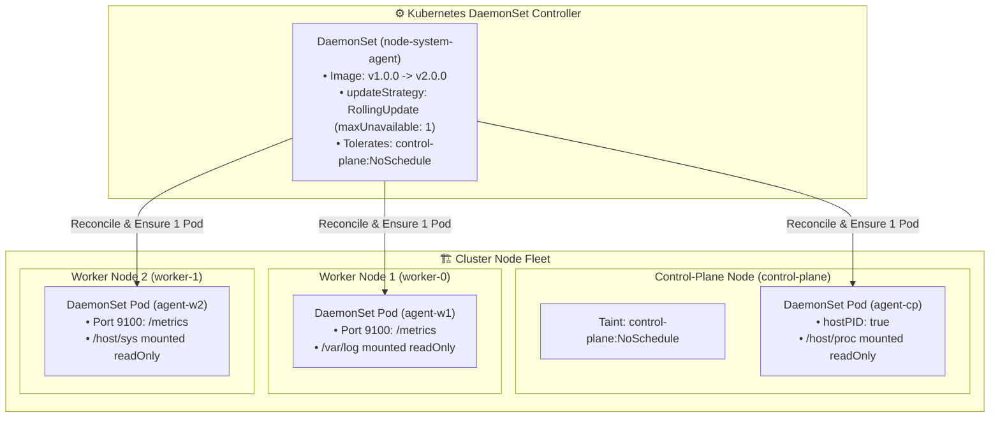
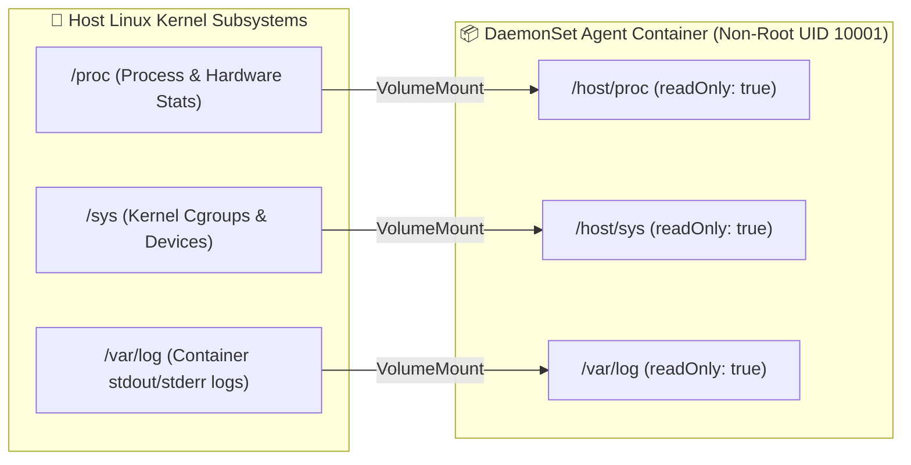
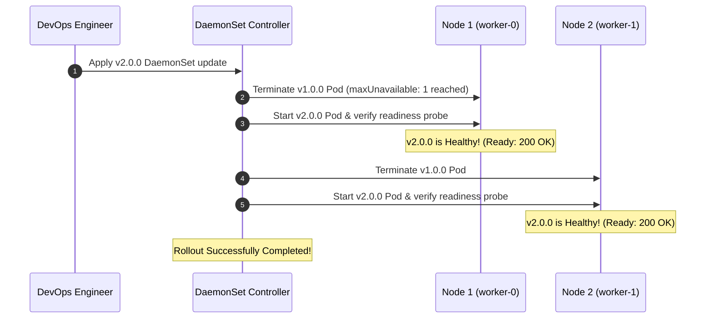

<!-- markdownlint-disable MD013 -->
# Mini-Project 13: DaemonSets and Node-Level System Agents

> **Domain**: 04. Kubernetes & Orchestration  
> **Level**: Intermediate  
> **Infrastructure**: Local (Multi-Node K3d / Kind / OrbStack / Minikube) or Cloud (EKS / GKE / AKS)  

---

## 🎯 Overview & Context

In a production Kubernetes cluster, certain background services must run on **every single node** (or a specific subset of nodes) rather than as a floating pool of arbitrary replicas. These include:

1. **Host & Hardware Metrics Exporters**: Prometheus `node-exporter` gathering host CPU, RAM, disk I/O, and GPU statistics from the Linux kernel `/proc` and `/sys` filesystems.
2. **Cluster Log Collectors**: Fluent Bit, Vector, or Promtail tailing `/var/log/pods` and systemd journal logs on each node.
3. **Container Network Interface (CNI) Agents**: Cilium, Calico, or Flannel managing kernel eBPF programs, iptables rules, and virtual ethernet interfaces.
4. **Security & Compliance Scanners**: Falco, Aqua, or Wazuh inspecting host syscalls and container runtime events in real-time.

A Kubernetes **DaemonSet** ensures that all (or some) nodes run a copy of a Pod. As new worker or control-plane nodes join the cluster, the DaemonSet Controller automatically schedules the daemon pod onto them. When a node is decommissioned, the DaemonSet pod is garbage collected.



---

## 🧠 Core DaemonSet Architectural Concepts

### 1. DaemonSets vs. Standard Deployments

| Feature | DaemonSet | Standard Deployment |
| :--- | :--- | :--- |
| **Replica Semantics** | Exactly 1 Pod per Node (or per node matching `nodeSelector` / `nodeAffinity`) | Arbitrary `N` replicas distributed across the cluster based on available capacity |
| **Control-Plane Placement** | Tolerates control-plane taints to monitor masters | Excluded from control-plane nodes by default |
| **Cordoned Node Behavior** | **Ignores** `Unschedulable` cordoning; continues running during node maintenance | Pods evicted or cannot be scheduled on cordoned nodes |
| **Autoscaling** | Automatically scales horizontally with cluster node count | Scales based on CPU/RAM/Custom metrics via Horizontal Pod Autoscaler (HPA) |
| **Common Use Cases** | Node Exporters, Log Shippers, Security Agents, CNI Daemons | Web APIs, Microservices, Background Async Workers, Database Replicas |

---

### 2. Host Filesystem Projection & Security Hardening

Node monitoring agents must inspect host operating system metrics without running in full privileged container mode. This is achieved by mounting specific host paths into the container as **read-only volumes**:



#### Manifest Hardening Example (`manifests/02-daemonset-standard.yaml`)

```yaml
securityContext:
  runAsNonRoot: true
  runAsUser: 10001
  runAsGroup: 10001
volumeMounts:
  - name: host-proc
    mountPath: /host/proc
    readOnly: true
  - name: host-sys
    mountPath: /host/sys
    readOnly: true
  - name: host-log
    mountPath: /var/log
    readOnly: true
volumes:
  - name: host-proc
    hostPath:
      path: /proc
  - name: host-sys
    hostPath:
      path: /sys
  - name: host-log
    hostPath:
      path: /var/log
```

---

### 3. Control-Plane Tolerations & `hostPID`

By default, Kubernetes control-plane nodes have taints preventing regular application pods from scheduling on them:

```text
node-role.kubernetes.io/control-plane:NoSchedule
node-role.kubernetes.io/master:NoSchedule
```

To deploy cluster-wide monitoring or logging daemons that inspect master nodes, the DaemonSet must explicitly declare matching tolerations:

```yaml
spec:
  hostPID: true  # Allows the agent to view host process IDs (PIDs)
  tolerations:
    - key: "node-role.kubernetes.io/control-plane"
      operator: "Exists"
      effect: "NoSchedule"
    - key: "node-role.kubernetes.io/master"
      operator: "Exists"
      effect: "NoSchedule"
    - key: "CriticalAddonsOnly"
      operator: "Exists"
```

---

### 4. Zero-Downtime Rolling Update Strategy

When upgrading an agent from `v1.0.0` to `v2.0.0`, Kubernetes supports two update strategies for DaemonSets:

1. **`OnDelete`**: The old pod is replaced only when the operator manually kills/deletes it.
2. **`RollingUpdate`** (Recommended): The DaemonSet Controller automatically terminates old pods and starts new pods one node at a time, strictly honoring `maxUnavailable`:

```yaml
spec:
  updateStrategy:
    type: RollingUpdate
    rollingUpdate:
      maxUnavailable: 1
  minReadySeconds: 5
```



---

## 📁 Repository Structure

```text
04-orchestration/13-daemonsets-node-level-agents/
├── README.md                          # Comprehensive architectural guide (markdownlint compliant)
├── app/
│   ├── main.go                        # Node system exporter daemon in Go (reads /proc, /sys, host stats)
│   ├── go.mod                         # Go module definition
│   └── Dockerfile                     # Multi-stage minimal container build (<10MB, non-root UID 10001)
├── manifests/
│   ├── 00-namespace.yaml              # Dedicated node-monitoring namespace
│   ├── 01-rbac.yaml                   # ServiceAccount, ClusterRole, ClusterRoleBinding for node inspection
│   ├── 02-daemonset-standard.yaml     # Production-grade Node Exporter DaemonSet (worker nodes)
│   ├── 03-daemonset-control-plane.yaml# DaemonSet with control-plane tolerations & hostPID
│   └── 04-daemonset-rolling-update.yaml# Demonstrates updateStrategy: RollingUpdate (maxUnavailable: 1)
├── daemonset_rollout_test.sh          # Script testing zero-downtime rolling update & cordon/uncordon
├── verify_daemonset.sh                # Automated manifest & DaemonSet policy validator
├── test_daemonset_pipeline.sh         # End-to-end automated test orchestrator
└── cleanup.sh                         # Teardown script (purges DaemonSet, RBAC, images & temp files)
```

---

## 🛠️ Step-by-Step Execution & Testing Guide

### Prerequisites

- `kubectl` (v1.24+)
- `docker` (for container image builds)
- *(Recommended)* Local multi-node cluster (`k3d` or `kind`) or single-node cluster (`orbstack` / `minikube`)

---

### Step 1: Validate DaemonSet Manifests Offline

Run the automated validator to verify all policy assertions:

```bash
./verify_daemonset.sh
```

**Expected Output**:

```text
======================================================================
  🛡️  Kubernetes DaemonSet Architecture & Policy Validator
======================================================================

▶ Step 1: Checking Required Tools...
  [PASS] kubectl CLI is available

▶ Step 2: Validating Manifest Declarations...
  [PASS] Manifest file presence: 00-namespace.yaml
  [PASS] Manifest file presence: 01-rbac.yaml
  [PASS] Manifest file presence: 02-daemonset-standard.yaml
  [PASS] Manifest file presence: 03-daemonset-control-plane.yaml
  [PASS] Manifest file presence: 04-daemonset-rolling-update.yaml

▶ Step 3: Asserting DaemonSet Configurations...
  [1. Host Filesystem Mounting & Read-Only Hardening]
  [PASS] hostPath volumes (/proc, /sys, /var/log) configured
  [PASS] Host mounts hardened with readOnly: true

  [2. Downward API Node Metadata Injection]
  [PASS] Downward API injects spec.nodeName and status.hostIP

  [3. Control-Plane Tolerations & HostPID Isolation]
  [PASS] Tolerations for control-plane and master taints configured
  [PASS] hostPID: true enabled for low-level node inspection

  [4. Zero-Downtime Rolling Update Strategy]
  [PASS] updateStrategy: RollingUpdate configured with maxUnavailable: 1
  [PASS] Rolling update manifest targets v2.0.0 image release

  [5. RBAC Least-Privilege Node Read Permissions]
  [PASS] ClusterRole grants read access to 'nodes', 'nodes/metrics', 'nodes/stats'
  [PASS] ClusterRoleBinding attaches ServiceAccount 'node-agent-sa'

======================================================================
  ✅ ALL DAEMONSET VALIDATION CHECKS PASSED (15/15)
======================================================================
```

---

### Step 2: Build Multi-Stage Docker Images

Build both `v1.0.0` and `v2.0.0` releases of the Go monitoring daemon:

```bash
docker build -t node-system-agent:v1.0.0 -t node-system-agent:v2.0.0 ./app
```

---

### Step 3: Deploy and Observe DaemonSet Rollout

Apply the namespace, RBAC permissions, and the initial `v1.0.0` DaemonSet:

```bash
kubectl apply -f manifests/00-namespace.yaml
kubectl apply -f manifests/01-rbac.yaml
kubectl apply -f manifests/02-daemonset-standard.yaml
```

Track the DaemonSet rollout across all nodes:

```bash
kubectl get daemonset -n node-monitoring
kubectl get pods -n node-monitoring -o wide
```

Notice that exactly one pod is created per worker node.

---

### Step 4: Perform Rolling Upgrade to v2.0.0

Upgrade the DaemonSet image version:

```bash
kubectl apply -f manifests/04-daemonset-rolling-update.yaml
kubectl rollout status daemonset/node-system-agent -n node-monitoring
```

---

### Step 5: Test Node Cordoning Behavior

Mark a node as unschedulable (cordoned) and observe how the DaemonSet behaves:

```bash
kubectl cordon <node-name>
kubectl get pods -n node-monitoring -o wide
kubectl uncordon <node-name>
```

> [!NOTE]
> DaemonSets **ignore** the `Unschedulable` cordon flag because infrastructure monitoring daemons must continue reporting telemetry and health status even when application workloads are drained from a node for maintenance.

---

### Step 6: Run the Full Automated Test Suite

Execute the complete end-to-end verification pipeline:

```bash
./test_daemonset_pipeline.sh
```

---

## 🧹 Teardown & Environment Cleanup

To ensure a clean environment for subsequent mini-projects, execute the provided teardown script:

```bash
./cleanup.sh
```

### What `cleanup.sh` Automatically Purges

1. **Active Port-Forward Tunnels**: Terminates any background `kubectl port-forward` processes associated with `node-system-agent`.
2. **Kubernetes Resources & Namespace**: Deletes the `node-monitoring` namespace and all enclosed DaemonSets and Pods.
3. **Cluster-Level RBAC**: Purges `ClusterRole/node-agent-role` and `ClusterRoleBinding/node-agent-rolebinding`.
4. **Node Cordon Restoration**: Automatically uncordons any cluster nodes left cordoned during testing.
5. **Local Docker Artifacts**: Purges the `node-system-agent:v1.0.0` and `node-system-agent:v2.0.0` container images.
6. **Temporary Files**: Cleans up all `.tmp_*` logs and caches strictly within the mini-project directory.

### Manual Cleanup Commands (Reference)

```bash
# 1. Terminate port-forwards
pkill -f "port-forward.*node-system-agent" || true

# 2. Delete namespace and RBAC
kubectl delete namespace node-monitoring --ignore-not-found=true
kubectl delete clusterrolebinding node-agent-rolebinding --ignore-not-found=true
kubectl delete clusterrole node-agent-role --ignore-not-found=true

# 3. Delete local Docker images
docker rmi -f node-system-agent:v1.0.0 node-system-agent:v2.0.0 2>/dev/null || true
```

---

## 📚 Key Learnings & SRE Takeaways

1. **Infrastructure Daemons vs. Microservices**: Use DaemonSets exclusively for node-level operations (metrics, logging, security, networking). Use Deployments for scalable application services.
2. **HostPath Hardening**: Always mount `/proc`, `/sys`, and `/var/log` with `readOnly: true` to prevent containerized agents from modifying host kernel state or writing arbitrary log data.
3. **Cluster-Wide Observability**: Control-plane nodes must be monitored just like worker nodes. Explicitly declare tolerations for `node-role.kubernetes.io/control-plane:NoSchedule` so telemetry agents cover 100% of cluster hardware.
4. **Safe Maintenance**: DaemonSets survive node cordoning by design, allowing SREs to drain user workloads (`kubectl drain`) while maintaining complete visibility via logging and Prometheus scrapers throughout maintenance windows.
