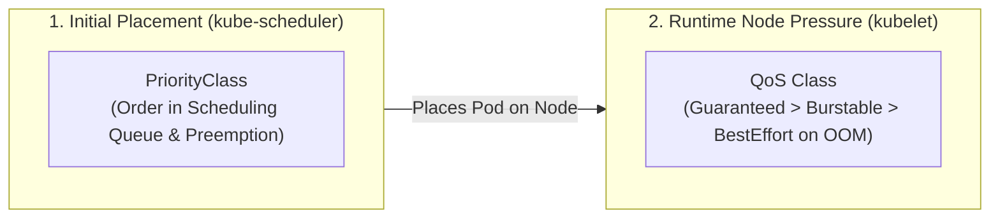

<!-- markdownlint-disable MD013 -->
# Mini-Project 15: Pod Priority Classes, Preemption, and Resource Quotas

> **Domain**: 04. Kubernetes & Orchestration  
> **Level**: Intermediate to Advanced  
> **Infrastructure**: Local (K3d / Kind / OrbStack / Minikube) or Cloud (EKS / GKE / AKS)  

---

## 🎯 Overview & Context

In a busy, multi-tenant Kubernetes cluster, computing resources (CPU and Memory) are finite. During peak traffic spikes, batch processing runs, or unexpected node failures, cluster resource capacity can become completely exhausted (**resource starvation**).

Without explicit priority and preemption controls:

- Low-priority background tasks (e.g., data analytics batch jobs, image resizing) could consume all remaining CPU and RAM.
- A critical production API or payment processing service attempting to scale up will remain stuck in `Pending` state indefinitely.
- The business suffers costly outages simply because the cluster scheduler treats all workloads with equal importance.

Kubernetes solves this with **PriorityClasses**, **Pod Preemption**, **ResourceQuotas**, and **LimitRanges**:

1. **`PriorityClass`**: Assigns an explicit integer priority to workloads (from `0` up to `1,000,000,000`).
2. **Automated Preemption**: When a high-priority pod cannot schedule due to insufficient capacity, `kube-scheduler` automatically evicts lower-priority pods to reclaim space.
3. **`ResourceQuota` & `LimitRange`**: Constrains the total amount of resources and pod counts a team or namespace can consume, with optional scopes restricting quotas based on PriorityClass.

```mermaid
flowchart TD
    subgraph SchedulingQueue ["📥 kube-scheduler Priority Queue"]
        HighPod["🚨 Critical Payment Pod\n• Priority: 1,000,000 (critical-production)\n• PreemptionPolicy: PreemptLowerPriority"]
        LowPod["📦 Batch Analytics Pod\n• Priority: 1,000 (batch-low-priority)\n• PreemptionPolicy: Never"]
    end

    subgraph ClusterNode ["🏗️ Saturated Worker Node (100% CPU Utilized)"]
        Victim1["Victim Pod A (Batch Low-Priority)"]
        Victim2["Victim Pod B (Batch Low-Priority)"]
    end

    HighPod -->|Cannot Fit (Starvation)| PreemptEngine["Preemption Engine"]
    PreemptEngine -->|1. Evicts & Gracefully Terminates| Victim1
    PreemptEngine -->|2. Reclaims CPU & RAM| ClusterNode
    PreemptEngine -->|3. Binds Critical Pod| SchedWin["Scheduled & Running: Critical Payment Pod"]
```

---

## 🧠 Core Kubernetes Scheduling & Governance Concepts

### 1. The Preemption Lifecycle

When a high-priority pod arrives and no nodes have sufficient unallocated resources:

1. **Nomination**: `kube-scheduler` identifies a node where evicting one or more lower-priority pods would free enough CPU/memory to schedule the high-priority pod.
2. **Victim Selection**: The scheduler selects the minimal set of lower-priority pods (victims) necessary to satisfy resource requirements.
3. **Graceful Eviction**: The victim pods receive a `SIGTERM` signal and are given their `terminationGracePeriodSeconds` to shut down cleanly.
4. **Nominated Node Reservation**: The scheduler sets `spec.nominatedNodeName` on the high-priority pod while victims terminate.
5. **Binding**: Once the victims terminate and resources are released, the high-priority pod is bound to the node and transitions to `Running`.

---

### 2. Priority Classes vs. Quality of Service (QoS)

A common point of confusion in Kubernetes SRE is the difference between **PriorityClasses** and **QoS Classes**:

| Dimension | Quality of Service (QoS Class) | PriorityClass |
| :--- | :--- | :--- |
| **How It Is Determined** | Inferred automatically from `requests` vs `limits` | Explicitly configured via `spec.priorityClassName` |
| **Enforcing Component** | Local Node **Kubelet** (OOM Killer) | Cluster **Kube-Scheduler** (Queue) |
| **When It Takes Effect** | When a node runs out of physical Memory/Disk (OOM) | When pods are queued for initial node placement |
| **Class Categories** | `Guaranteed`, `Burstable`, `BestEffort` | Integer values: `1,000` (Batch) to `1,000,000` (Prod) |
| **Action Taken** | Kubelet terminates `BestEffort` pods first on node OOM | Scheduler evicts lower priority pods during starvation |



---

### 3. Preemption Policies: `PreemptLowerPriority` vs. `Never`

```yaml
apiVersion: scheduling.k8s.io/v1
kind: PriorityClass
metadata:
  name: critical-production
value: 1000000
preemptionPolicy: PreemptLowerPriority  # Can evict lower priority pods
globalDefault: false
---
apiVersion: scheduling.k8s.io/v1
kind: PriorityClass
metadata:
  name: batch-low-priority
value: 1000
preemptionPolicy: Never  # Cannot evict other pods; waits patiently in queue
globalDefault: false
```

- **`PreemptLowerPriority`** (Default): If resources are scarce, the scheduler evicts lower-priority pods to make room.
- **`Never`**: The pod is prioritized ahead of lower-priority pods in the queue, but it will **never evict running pods**. It waits until capacity naturally becomes available.

---

### 4. Multi-Tenant Governance: ResourceQuotas & LimitRanges

To prevent any single team from starving the cluster, Kubernetes provides two layers of namespace governance:

1. **`LimitRange`**: Enforces default `requests` and `limits` on any container created without them, and sets minimum/maximum resource boundaries.
2. **`ResourceQuota`**: Sets hard ceilings on total CPU, Memory, and Pod counts within a namespace.
3. **Scoped ResourceQuotas**: Restricts resource usage specifically for pods belonging to a designated `PriorityClass`:

```yaml
apiVersion: v1
kind: ResourceQuota
metadata:
  name: prod-critical-priority-quota
  namespace: prod-critical
spec:
  hard:
    count/pods: "5"
    requests.cpu: "400m"
    requests.memory: 256Mi
  scopeSelector:
    matchExpressions:
      - scopeName: PriorityClass
        operator: In
        values:
          - critical-production
```

---

## 📁 Repository Structure

```text
04-orchestration/15-priority-classes-preemption-quotas/
├── README.md                              # Comprehensive educational guide (markdownlint compliant)
├── app/
│   ├── main.go                            # Lightweight workload reporter (reports priority, QoS class, memory usage)
│   ├── go.mod                             # Go module definition
│   └── Dockerfile                         # Multi-stage minimal container build (<10MB, non-root UID 10001)
├── manifests/
│   ├── 00-namespace.yaml                  # Dedicated namespaces (prod-critical & batch-jobs)
│   ├── 01-priority-classes.yaml           # PriorityClass objects (critical-production, standard, batch-low-priority)
│   ├── 02-limit-range.yaml                # LimitRange setting default requests/limits and min/max bounds
│   ├── 03-resource-quota.yaml             # ResourceQuota constraining CPU, memory, and pod count
│   ├── 04-batch-filler-workload.yaml      # Low-priority batch deployment consuming available quota/capacity
│   └── 05-critical-preempting-workload.yaml # High-priority workload triggering automated preemption
├── starvation_test.sh                     # Automated preemption and resource starvation simulation test
├── verify_priority_preemption.sh          # Policy and manifest validation script (PriorityClasses, Quotas, Limits)
├── test_priority_pipeline.sh              # End-to-end automated test runner
└── cleanup.sh                             # Teardown script (purges PriorityClasses, namespaces, images & temp files)
```

---

## 🛠️ Step-by-Step Execution & Testing Guide

### Prerequisites

- `kubectl` (v1.24+)
- `docker` (for building workload test containers)
- *(Recommended)* Local Kubernetes cluster (`k3d`, `kind`, `orbstack`, or `minikube`)

---

### Step 1: Validate Priority & Quota Manifests Offline

Run the automated validator to verify all PriorityClass definitions, preemption policies, and quota scopes:

```bash
./verify_priority_preemption.sh
```

**Expected Output**:

```text
======================================================================
  ⚖️  Kubernetes PriorityClasses, Preemption & Quotas Validator
======================================================================

▶ Step 1: Checking Required Tools...
  [PASS] kubectl CLI is available

▶ Step 2: Validating Manifest Declarations...
  [PASS] Manifest file presence: 00-namespace.yaml
  [PASS] Manifest file presence: 01-priority-classes.yaml
  [PASS] Manifest file presence: 02-limit-range.yaml
  [PASS] Manifest file presence: 03-resource-quota.yaml
  [PASS] Manifest file presence: 04-batch-filler-workload.yaml
  [PASS] Manifest file presence: 05-critical-preempting-workload.yaml

▶ Step 3: Asserting PriorityClasses, Preemption & Quota Governance...
  [1. PriorityClass & Preemption Policies]
  [PASS] critical-production PriorityClass (value: 1000000, PreemptLowerPriority)
  [PASS] standard-tier configured as cluster globalDefault: true
  [PASS] batch-low-priority PriorityClass (value: 1000, preemptionPolicy: Never)

  [2. LimitRange Namespace Resource Constraints]
  [PASS] LimitRange enforces default requests and limits per container
  [PASS] LimitRange defines min/max resource allocation guardrails

  [3. ResourceQuota Multi-Tenant Capacity Management]
  [PASS] ResourceQuota constrains CPU, Memory, and Pod counts
  [PASS] Scoped ResourceQuota restricts capacity by PriorityClass (scopeSelector)

  [4. Workload PriorityClass Binding]
  [PASS] Critical Payment API binds to 'critical-production' PriorityClass
  [PASS] Batch Filler Workload binds to 'batch-low-priority' PriorityClass

======================================================================
  ✅ ALL PRIORITY & QUOTA VALIDATION CHECKS PASSED (14/14)
======================================================================
```

---

### Step 2: Build the Priority Workload Container Image

Build the lightweight container image:

```bash
docker build -t priority-workload:v1.0.0 ./app
```

---

### Step 3: Deploy PriorityClasses and Namespaces

Deploy the cluster-wide PriorityClasses and namespace governance:

```bash
kubectl apply -f manifests/00-namespace.yaml
kubectl apply -f manifests/01-priority-classes.yaml
kubectl apply -f manifests/02-limit-range.yaml
kubectl apply -f manifests/03-resource-quota.yaml
```

Inspect the registered PriorityClasses:

```bash
kubectl get priorityclasses
```

---

### Step 4: Run the Starvation & Preemption Test

Execute the automated starvation and quota test:

```bash
./starvation_test.sh
```

Inspect how ResourceQuota tracks capacity and how pod priority is reflected in the scheduling queue:

```bash
kubectl describe resourcequota -n batch-jobs
kubectl describe resourcequota -n prod-critical
```

---

### Step 5: Run the Complete Automated Test Suite

Execute the full end-to-end pipeline:

```bash
./test_priority_pipeline.sh
```

---

## 🧹 Teardown & Environment Cleanup

To ensure a clean environment for subsequent mini-projects, execute the provided teardown script:

```bash
./cleanup.sh
```

### What `cleanup.sh` Automatically Purges

1. **Namespaces & Workloads**: Deletes the `prod-critical` and `batch-jobs` namespaces along with all enclosed Deployments, Pods, ResourceQuotas, and LimitRanges.
2. **Cluster PriorityClasses**: Purges `critical-production`, `standard-tier`, and `batch-low-priority`.
3. **Port-Forward Tunnels**: Terminates any background port-forward processes associated with `priority-workload`.
4. **Local Docker Artifacts**: Purges the `priority-workload:v1.0.0` container image.
5. **Temporary Files**: Cleans up all `.tmp_*` logs and test caches strictly within the mini-project directory.

### Manual Cleanup Commands (Reference)

```bash
# 1. Delete namespaces
kubectl delete namespace prod-critical batch-jobs --ignore-not-found=true

# 2. Delete PriorityClasses
kubectl delete priorityclass critical-production standard-tier batch-low-priority --ignore-not-found=true

# 3. Terminate port-forwards
pkill -f "port-forward.*priority-workload" || true

# 4. Remove Docker image
docker rmi -f priority-workload:v1.0.0 2>/dev/null || true
```

---

## 📚 Key Learnings & SRE Takeaways

1. **Strategic Priority Design**: Define a disciplined priority hierarchy (e.g. System Critical > Production API > General Workload > Batch / Spot). Avoid setting everything to high priority.
2. **Preemption Safety with `preemptionPolicy: Never`**: Use `Never` for non-urgent background batch workloads. They will still jump ahead in the queue over lower-priority pods but will not destabilize running services.
3. **Pair Priority with Quotas**: Always combine PriorityClasses with scoped `ResourceQuotas` so a single team cannot flood the cluster with high-priority pods that preempt other teams' essential services.
4. **Graceful Eviction Handling**: Ensure all workloads handle `SIGTERM` gracefully (`terminationGracePeriodSeconds`) to finish in-flight requests before preemption terminates them.
