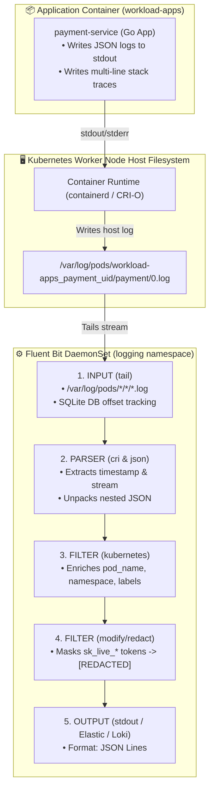

<!-- markdownlint-disable MD013 -->
# Mini-Project 16: Kubernetes Cluster Logging with Fluent Bit / Vector DaemonSet

> **Domain**: 04. Kubernetes & Orchestration  
> **Level**: Intermediate to Advanced  
> **Infrastructure**: Local (K3d / Kind / OrbStack / Minikube) or Cloud (EKS / GKE / AKS)  

---

## 🎯 Overview & Context

In a production Kubernetes cluster, hundreds of containerized microservices concurrently write logs to `stdout` and `stderr`. Because containers are ephemeral and can be rescheduled or deleted at any moment, logs written inside a container will vanish when the pod terminates.

To achieve enterprise-grade observability, compliance, and rapid incident response, Kubernetes clusters rely on a **Node-Level Logging Agent Pattern**:

1. **Host-Level Aggregation**: The container runtime (`containerd` or `CRI-O`) streams each container's standard output to the host filesystem at `/var/log/pods/<namespace>_<pod>_<uid>/<container>/0.log`.
2. **Log Shipper DaemonSet**: A lightweight log collector (such as **Fluent Bit** or **Vector**) runs on every node as a DaemonSet, tailing log files from `/var/log/pods`.
3. **Parsing & Multi-Line Handling**: Raw CRI log lines are parsed into structured timestamps, streams, and message payloads, reconstructing multi-line stack traces.
4. **Kubernetes Metadata Enrichment**: The `kubernetes` filter inspects the file path, queries local API caches, and enriches every log record with `pod_name`, `namespace_name`, `container_name`, and `labels`.
5. **PII & Secret Redaction**: Security filters automatically mask sensitive data (such as API tokens, passwords, and credit card numbers) before logs leave the node.
6. **Centralized Ingestion**: Structured JSON records are streamed to centralized sinks (Elasticsearch, OpenSearch, Grafana Loki, Kafka, or AWS CloudWatch).



---

## 🧠 Core Kubernetes Logging Architectural Concepts

### 1. The Container Log Lifecycle Under the Hood

When a process inside a container executes `fmt.Println(...)`, the following low-level path is traversed:

```mermaid
sequenceDiagram
    autonumber
    participant App as App Process (UID 10001)
    participant Linux as Linux Pipe /dev/stdout
    participant CRI as Containerd / CRI-O Runtime
    participant Disk as Host Disk (/var/log/pods)
    participant FB as Fluent Bit DaemonSet
    participant Sink as Central Log Sink

    App->>Linux: Write log line
    Linux->>CRI: Captured by container runtime
    CRI->>Disk: Appends formatted CRI record to /var/log/pods/
    Note over Disk: Format: &lt;time&gt; &lt;stream&gt; &lt;logtag&gt; &lt;payload&gt;
    FB->>Disk: Inotify / Tail reads new bytes
    FB->>FB: Parses CRI format & extracts JSON
    FB->>FB: Enriches with Pod Name, Namespace & Labels
    FB->>FB: Redacts secrets (sk_live_...)
    FB->>Sink: Emits enriched structured JSON log
```

---

### 2. Anatomy of a Fluent Bit Pipeline Configuration

A production Fluent Bit configuration (`manifests/02-fluentbit-configmap.yaml`) consists of five distinct pipeline phases:

#### 1. `[INPUT]`: Tailing Host Pod Logs

```ini
[INPUT]
    Name              tail
    Tag               kube.*
    Path              /var/log/pods/*/*/*.log
    Parser            cri
    DB                /var/log/flb_kube.db
    Mem_Buf_Limit     50MB
    Skip_Long_Lines   On
    Refresh_Interval  10
```

- **`DB /var/log/flb_kube.db`**: Stores file offsets in a local SQLite database. If Fluent Bit restarts, it resumes exactly where it left off without duplicating or losing logs.
- **`Mem_Buf_Limit 50MB`**: Prevents Fluent Bit from consuming unbounded memory if the downstream sink slows down.

#### 2. `[PARSER]`: CRI-O and Containerd Log Parsing

Container runtimes wrap container output with metadata:

```text
2026-08-26T04:50:00.123456789Z stdout F {"level":"info","service":"payment"}
```

The CRI regex parser extracts the raw payload:

```ini
[PARSER]
    Name        cri
    Format      regex
    Regex       ^(?<time>[^ ]+) (?<stream>stdout|stderr) (?<logtag>[^ ]*) (?<log>.*)$
    Time_Key    time
    Time_Format %Y-%m-%dT%H:%M:%S.%L%z
    Time_Keep   On
```

#### 3. `[FILTER]`: Kubernetes Metadata Enrichment

```ini
[FILTER]
    Name                kubernetes
    Match               kube.*
    Kube_URL            https://kubernetes.default.svc:443
    Kube_Tag_Prefix     kube.var.log.pods.
    Merge_Log           On
    Merge_Log_Key       log_processed
    Keep_Log            Off
    K8S-Logging.Parser  On
```

- **`Merge_Log On`**: Automatically unpacks JSON payloads emitted by applications into top-level JSON fields.

#### 4. `[FILTER]`: Secret & PII Redaction

```ini
[FILTER]
    Name                modify
    Match               kube.*
    Condition Key_Value_Matches log_processed.api_token sk_live_.*
    Set log_processed.api_token [REDACTED_API_TOKEN]
```

---

### 3. Log Collector Comparison: Fluent Bit vs. Vector vs. Promtail

| Dimension | Fluent Bit | Vector (Datadog) | Promtail (Grafana) |
| :--- | :--- | :--- | :--- |
| **Language** | C | Rust | Go |
| **Memory Footprint** | Ultralight (~15MB - 30MB) | Low (~30MB - 60MB) | Medium (~50MB - 100MB) |
| **Transformation Engine** | Regex, Modify, Lua scripts | Native **VRL** (Vector Remap Language) | Pipeline stages (regex, json) |
| **Supported Sinks** | Elasticsearch, OpenSearch, Kafka, S3, Loki, CloudWatch | ClickHouse, Kafka, S3, Loki, Datadog | Grafana Loki exclusively |
| **Industry Adoption** | Cloud-Native standard (EKS/GKE default) | Modern high-throughput choice | Prometheus/Grafana stack |

---

## 📁 Repository Structure

```text
04-orchestration/16-cluster-logging-fluentbit-vector/
├── README.md                              # Comprehensive educational guide (markdownlint compliant)
├── app/
│   ├── main.go                            # Multi-format log generator (JSON logs, multi-line stack traces, PII)
│   ├── go.mod                             # Go module definition
│   └── Dockerfile                         # Multi-stage minimal container build (<10MB, non-root UID 10001)
├── manifests/
│   ├── 00-namespace.yaml                  # Dedicated logging & workload namespaces
│   ├── 01-rbac.yaml                       # ServiceAccount & ClusterRole for Kubernetes API metadata enrichment
│   ├── 02-fluentbit-configmap.yaml        # Fluent Bit pipeline: Inputs, Parsers, Kubernetes Filter, Redaction Filter
│   ├── 03-fluentbit-daemonset.yaml        # Fluent Bit DaemonSet with hostPath volume mounts (/var/log)
│   ├── 04-log-generator-workload.yaml     # Log generator deployment emitting diverse log streams
│   └── 05-mock-log-sink.yaml              # Centralized mock log collector sink service
├── verify_log_pipeline.sh                 # Declarative parser, filter, and manifest validator
├── test_logging_pipeline.sh               # End-to-end automated test orchestrator
└── cleanup.sh                             # Teardown script (purges logging namespace, RBAC, images & temp files)
```

---

## 🛠️ Step-by-Step Execution & Testing Guide

### Prerequisites

- `kubectl` (v1.24+)
- `docker` (for building the log generator container image)
- *(Recommended)* Local Kubernetes cluster (`k3d`, `kind`, `orbstack`, or `minikube`)

---

### Step 1: Validate Logging Pipeline Manifests Offline

Run the automated validator to verify all pipeline stages, parser regexes, and security volume hardening:

```bash
./verify_log_pipeline.sh
```

**Expected Output**:

```text
======================================================================
  📜 Kubernetes Cluster Logging & Fluent Bit Pipeline Validator
======================================================================

▶ Step 1: Checking Required Tools...
  [PASS] kubectl CLI is available

▶ Step 2: Validating Manifest Declarations...
  [PASS] Manifest file presence: 00-namespace.yaml
  [PASS] Manifest file presence: 01-rbac.yaml
  [PASS] Manifest file presence: 02-fluentbit-configmap.yaml
  [PASS] Manifest file presence: 03-fluentbit-daemonset.yaml
  [PASS] Manifest file presence: 04-log-generator-workload.yaml
  [PASS] Manifest file presence: 05-mock-log-sink.yaml

▶ Step 3: Asserting Fluent Bit Pipeline Architecture...
  [1. Input Tail & Checkpointing Engine]
  [PASS] Input Tail configured for /var/log/pods with SQLite checkpoint DB

  [2. Container Runtime Parser Definitions]
  [PASS] Parsers for CRI (containerd/CRI-O), Docker, and JSON defined

  [3. Kubernetes Filter Metadata Enrichment]
  [PASS] Kubernetes Filter enabled with JSON payload merging (Merge_Log On)

  [4. Data Privacy & Secret Redaction]
  [PASS] Modify filter redacts sensitive credentials (sk_live_ -> [REDACTED_API_TOKEN])

  [5. HostPath Volume Hardening]
  [PASS] Host volume /var/log mounted as readOnly: true

  [6. RBAC Metadata Discovery Permissions]
  [PASS] ClusterRole grants read permissions on pods and namespaces

======================================================================
  ✅ ALL LOGGING PIPELINE VALIDATION CHECKS PASSED (12/12)
======================================================================
```

---

### Step 2: Build the Log Generator Container Image

Build the multi-format log generator image:

```bash
docker build -t log-generator-app:v1.0.0 ./app
```

---

### Step 3: Deploy the Cluster Logging Stack

Deploy the namespaces, RBAC, Fluent Bit DaemonSet, and workload:

```bash
kubectl apply -f manifests/00-namespace.yaml
kubectl apply -f manifests/01-rbac.yaml
kubectl apply -f manifests/02-fluentbit-configmap.yaml
kubectl apply -f manifests/03-fluentbit-daemonset.yaml
kubectl apply -f manifests/04-log-generator-workload.yaml
```

---

### Step 4: Inspect Enriched and Redacted Logs

Tail the output of the Fluent Bit DaemonSet:

```bash
kubectl logs -n logging -l app.kubernetes.io/name=fluent-bit -f
```

Notice how every record contains:

- Application JSON payload fields (`order_id`, `amount`, `event`).
- Injected Kubernetes metadata (`pod_name`, `namespace_name`, `container_name`, `pod_id`).
- Redacted API tokens (`[REDACTED_API_TOKEN]`).

---

### Step 5: Run the Complete Automated Test Suite

Execute the end-to-end automated test runner:

```bash
./test_logging_pipeline.sh
```

---

## 🧹 Teardown & Environment Cleanup

To ensure a clean environment for subsequent mini-projects, execute the provided teardown script:

```bash
./cleanup.sh
```

### What `cleanup.sh` Automatically Purges

1. **Namespaces & DaemonSets**: Deletes the `logging` and `workload-apps` namespaces and all enclosed Fluent Bit DaemonSets, ConfigMaps, and workloads.
2. **Cluster RBAC**: Purges `ClusterRole/fluent-bit-role` and `ClusterRoleBinding/fluent-bit-rolebinding`.
3. **Port-Forward Tunnels**: Terminates any background port-forward processes associated with `fluent-bit` or `log-generator`.
4. **Local Docker Artifacts**: Purges the `log-generator-app:v1.0.0` container image.
5. **Temporary Files**: Cleans up all `.tmp_*` logs and test caches strictly within the mini-project directory.

### Manual Cleanup Commands (Reference)

```bash
# 1. Delete namespaces and RBAC
kubectl delete namespace logging workload-apps --ignore-not-found=true
kubectl delete clusterrolebinding fluent-bit-rolebinding --ignore-not-found=true
kubectl delete clusterrole fluent-bit-role --ignore-not-found=true

# 2. Terminate port-forwards
pkill -f "port-forward.*fluent-bit" || true

# 3. Remove Docker image
docker rmi -f log-generator-app:v1.0.0 2>/dev/null || true
```

---

## 📚 Key Learnings & SRE Takeaways

1. **Offset Tracking Matters**: Always configure `DB /var/log/flb_kube.db` on tail inputs to guarantee zero data loss and avoid re-indexing millions of historical logs on daemon restart.
2. **Security at Ingestion**: Redact credentials, auth headers, and PII on the node before logs leave the cluster boundary to satisfy GDPR/SOC2 compliance.
3. **Structured JSON vs. Raw Strings**: Standardize all backend services to emit structured JSON logs. Fluent Bit's `Merge_Log On` eliminates the need for expensive post-processing regex parsers in Elasticsearch/Loki.
4. **Memory Guardrails**: Always enforce `Mem_Buf_Limit` on inputs so slow network sinks do not cause Fluent Bit to exhaust host RAM and trigger OOM killer panics.
