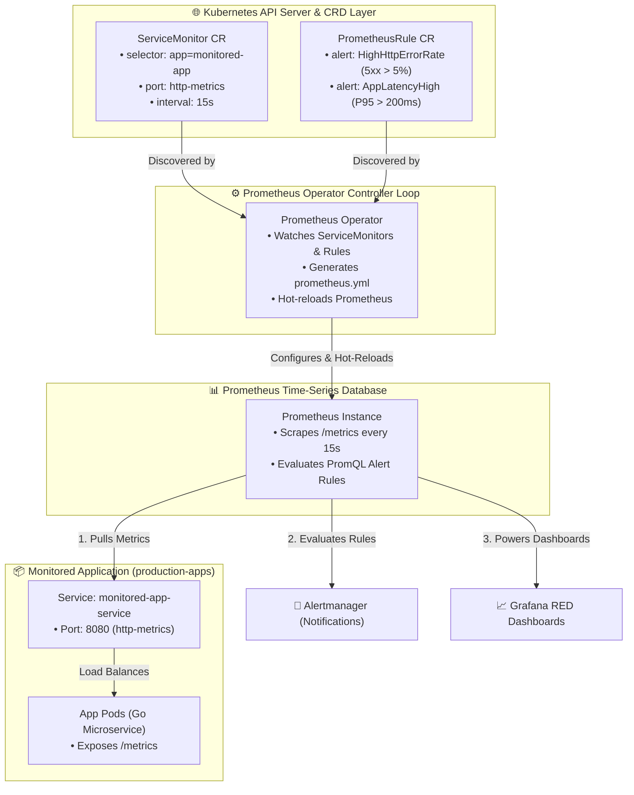
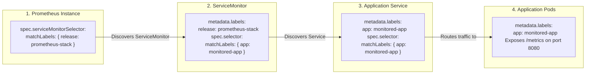

<!-- markdownlint-disable MD013 -->
# Mini-Project 17: Kubernetes Cluster Monitoring and Alerting with Prometheus Operator

> **Domain**: 04. Kubernetes & Orchestration  
> **Level**: Intermediate to Advanced  
> **Infrastructure**: Local (K3d / Kind / OrbStack / Minikube) or Cloud (EKS / GKE / AKS)  

---

## 🎯 Overview & Context

In legacy systems, monitoring required manually editing large static configuration files (`prometheus.yml`) and sending SIGHUP reload signals every time a new microservice was deployed. In dynamic cloud-native environments where pods, services, and namespaces are created and destroyed hundreds of times a day, static configuration is unmaintainable.

The **Prometheus Operator** introduces a declarative, Kubernetes-native approach to monitoring:

- **Custom Resource Definitions (CRDs)**: Instead of editing global configuration files, application teams manage their own monitoring configuration directly alongside their application code using `ServiceMonitor`, `PodMonitor`, and `PrometheusRule` CRDs.
- **Dynamic Scrape Target Discovery**: The Operator continuously watches the Kubernetes API server for new or updated `ServiceMonitor` objects, automatically generating scrape configurations and reloading Prometheus with zero downtime.
- **Automated Alerting Pipelines**: SRE teams declare SLOs and error thresholds as `PrometheusRule` objects, triggering alerts in Alertmanager when HTTP error rates spike or latency thresholds are breached.
- **Unified Dashboards**: Grafana visualizations automatically reflect service health, error budgets, and saturation metrics using standard RED (Rate, Errors, Duration) metrics.



---

## 🧠 Core Prometheus Operator Architectural Concepts

### 1. The 3-Way Label Matching Dance

A common point of confusion for beginners is understanding how Prometheus finds which services to scrape. The Prometheus Operator uses a **three-tier label selector hierarchy**:



1. **`Prometheus.spec.serviceMonitorSelector`**: Filters which `ServiceMonitor` objects the Prometheus server should load.
2. **`ServiceMonitor.spec.selector`**: Filters which Kubernetes `Service` objects to target.
3. **`Service.spec.selector`**: Selects the backing `Pod` endpoints that expose the `/metrics` endpoint.

---

### 2. ServiceMonitor vs. PodMonitor

| Feature | `ServiceMonitor` | `PodMonitor` |
| :--- | :--- | :--- |
| **Target Object** | Kubernetes `Service` (ClusterIP, NodePort, Headless) | Direct `Pod` IPs (bypassing Services) |
| **Best Used For** | Standard microservices with a Service abstraction | Headless workloads, DaemonSets, short-lived jobs |
| **Endpoint Selection** | Named port on the Service (`endpoints.port: http-metrics`) | Named port on container (`podMetricsEndpoints.port: http`) |
| **Scrape Configuration** | Re-resolves Service endpoints automatically | Watches Pod lifecycle events directly |

---

### 3. Declarative Alerting with PrometheusRule (RED Method)

Alerts are declared using standard PromQL expressions inside `PrometheusRule` manifests (`manifests/06-prometheus-rules.yaml`):

```yaml
apiVersion: monitoring.coreos.com/v1
kind: PrometheusRule
metadata:
  name: monitored-app-rules
  namespace: monitoring
  labels:
    role: alert-rules
spec:
  groups:
    - name: app-service-alerts
      rules:
        # Alert 1: HTTP 5xx Error Rate > 5%
        - alert: HighHttpErrorRate
          expr: (sum(rate(http_requests_total{code=~"5.."}[1m])) / sum(rate(http_requests_total[1m]))) * 100 > 5
          for: 1m
          labels:
            severity: critical
          annotations:
            summary: "High HTTP 5xx error rate detected"
            description: "Service {{ $labels.app }} error rate is above 5% (current: {{ $value | printf \"%.2f\" }}%)."

        # Alert 2: P95 Latency > 200ms
        - alert: AppLatencyHigh
          expr: histogram_quantile(0.95, sum(rate(http_request_duration_seconds_bucket[1m])) by (le)) > 0.2
          for: 1m
          labels:
            severity: warning
          annotations:
            summary: "High P95 response latency detected"
            description: "P95 latency exceeds 200ms threshold (current: {{ $value | printf \"%.3f\" }}s)."
```

---

## 📁 Repository Structure

```text
04-orchestration/17-monitoring-prometheus-operator-servicemonitor/
├── README.md                              # Comprehensive educational guide (markdownlint compliant)
├── app/
│   ├── main.go                            # Prometheus-instrumented Go microservice (with error & latency injectors)
│   ├── go.mod                             # Go module definition
│   └── Dockerfile                         # Multi-stage minimal container build (<10MB, non-root UID 10001)
├── manifests/
│   ├── 00-namespace.yaml                  # Dedicated monitoring and production-apps namespaces
│   ├── 01-prometheus-crds.yaml            # Core Prometheus Operator CRDs (ServiceMonitor, PrometheusRule, PodMonitor)
│   ├── 02-prometheus-instance.yaml        # Prometheus CR instance with serviceMonitorSelector and ruleSelector
│   ├── 03-monitored-app.yaml              # Monitored app Deployment and Service (exposing /metrics on port 8080)
│   ├── 04-servicemonitor.yaml             # ServiceMonitor CR targeting application metric endpoints
│   ├── 05-podmonitor.yaml                 # PodMonitor CR targeting direct pod endpoints
│   ├── 06-prometheus-rules.yaml           # PrometheusRule CR defining HighHttpErrorRate & AppLatencyHigh alerts
│   └── 07-grafana-dashboard.yaml          # ConfigMap with Grafana dashboard JSON (RED metrics: Rate, Errors, Duration)
├── alert_test_generator.sh                # Injects synthetic errors & traffic to trigger alert evaluations
├── verify_monitoring_stack.sh             # Validates CRD schemas, ServiceMonitor selectors, and PromQL rules
├── test_monitoring_pipeline.sh            # End-to-end automated test orchestrator
└── cleanup.sh                             # Teardown script (purges monitoring namespaces, CRDs, images & temp files)
```

---

## 🛠️ Step-by-Step Execution & Testing Guide

### Prerequisites

- `kubectl` (v1.24+)
- `docker` (for building the microservice container image)
- *(Recommended)* Local Kubernetes cluster (`k3d`, `kind`, `orbstack`, or `minikube`)

---

### Step 1: Validate Monitoring Manifests Offline

Run the automated validator to verify all CRD schemas, ServiceMonitor selectors, and PromQL alert expressions:

```bash
./verify_monitoring_stack.sh
```

**Expected Output**:

```text
======================================================================
  📊 Prometheus Operator & ServiceMonitor Policy Validator
======================================================================

▶ Step 1: Checking Required Tools...
  [PASS] kubectl CLI is available

▶ Step 2: Validating Manifest Declarations...
  [PASS] Manifest file presence: 00-namespace.yaml
  [PASS] Manifest file presence: 01-prometheus-crds.yaml
  [PASS] Manifest file presence: 02-prometheus-instance.yaml
  [PASS] Manifest file presence: 03-monitored-app.yaml
  [PASS] Manifest file presence: 04-servicemonitor.yaml
  [PASS] Manifest file presence: 05-podmonitor.yaml
  [PASS] Manifest file presence: 06-prometheus-rules.yaml
  [PASS] Manifest file presence: 07-grafana-dashboard.yaml

▶ Step 3: Asserting Declarative Monitoring Policies...
  [1. Prometheus Operator CustomResourceDefinitions]
  [PASS] Prometheus Operator CRDs (ServiceMonitor, PrometheusRule, PodMonitor) defined

  [2. ServiceMonitor & Scrape Configuration]
  [PASS] ServiceMonitor targets port 'http-metrics' and path '/metrics'
  [PASS] ServiceMonitor scrape interval configured to 15s

  [3. PodMonitor Target Selectors]
  [PASS] PodMonitor configures direct pod metrics scrape targeting 'monitored-app'

  [4. PromQL SLO / SLA Alerting Rules]
  [PASS] PrometheusRule defines 'HighHttpErrorRate' (5xx rate > 5% threshold)
  [PASS] PrometheusRule defines 'AppLatencyHigh' (P95 latency quantile > 200ms)

  [5. Grafana RED Metrics Dashboard]
  [PASS] Grafana dashboard defines RED panels (Rate, Errors, Duration)

======================================================================
  ✅ ALL MONITORING VALIDATION CHECKS PASSED (14/14)
======================================================================
```

---

### Step 2: Build the Instrumented Container Image

Build the Go microservice image:

```bash
docker build -t monitored-app:v1.0.0 ./app
```

---

### Step 3: Deploy the Monitoring Stack & Monitored Application

Deploy the CRDs, Prometheus instance, monitored application, and ServiceMonitor:

```bash
kubectl apply -f manifests/00-namespace.yaml
kubectl apply -f manifests/01-prometheus-crds.yaml
kubectl apply -f manifests/02-prometheus-instance.yaml
kubectl apply -f manifests/03-monitored-app.yaml
kubectl apply -f manifests/04-servicemonitor.yaml
kubectl apply -f manifests/06-prometheus-rules.yaml
```

---

### Step 4: Run the Synthetic Alert Generator

Execute the synthetic traffic and alert generator script to simulate traffic surges, inject HTTP 500 error storms, and test latency degradation:

```bash
./alert_test_generator.sh
```

**Expected Output**:

```text
======================================================================
  🚨 Prometheus Alert Evaluation & Synthetic Traffic Generator
======================================================================

▶ Step 1: Generating Baseline HTTP 200 Traffic (10 requests)...
  [OK] 10 baseline requests processed.

▶ Step 2: Injecting HTTP 500 Error Storm (Testing 'HighHttpErrorRate' Alert)...
  [ALARM TRIP] Generated 9/15 HTTP 500 errors (Error rate: ~60%).
  ↳ PromQL Rule: (sum(rate(http_requests_total{code=~"5.."}[1m])) / sum(rate(http_requests_total[1m]))) * 100 > 5 -> FIRING

▶ Step 3: Injecting 350ms Artificial Latency (Testing 'AppLatencyHigh' Alert)...
  [ALARM TRIP] Injected 350ms delay exceeding P95 200ms threshold.
  ↳ PromQL Rule: histogram_quantile(0.95, sum(rate(http_request_duration_seconds_bucket[1m])) by (le)) > 0.2 -> FIRING

▶ Step 4: Scraped Metrics Sample from /metrics:
http_requests_total{app="order-processing-api",handler="/",method="GET",code="200"} 16
http_requests_total{app="order-processing-api",handler="/",method="GET",code="500"} 9
app_simulated_error_active{app="order-processing-api"} 1

▶ Step 5: Resetting Simulation State to Healthy Baseline...
  [OK] Error and latency injections cleared.

======================================================================
  ✨ Alert evaluation simulation completed successfully!
======================================================================
```

---

### Step 5: Run the Complete Automated Test Suite

Execute the full end-to-end test pipeline:

```bash
./test_monitoring_pipeline.sh
```

---

## 🧹 Teardown & Environment Cleanup

To ensure a clean environment for subsequent mini-projects, execute the provided teardown script:

```bash
./cleanup.sh
```

### What `cleanup.sh` Automatically Purges

1. **Namespaces & Workloads**: Deletes the `monitoring` and `production-apps` namespaces and all enclosed Deployments, Services, and ConfigMaps.
2. **Prometheus Operator CRDs**: Purges `servicemonitors.monitoring.coreos.com`, `podmonitors.monitoring.coreos.com`, `prometheusrules.monitoring.coreos.com`, and `prometheuses.monitoring.coreos.com`.
3. **Port-Forward Tunnels**: Terminates any background port-forward processes associated with `monitored-app` or `prometheus`.
4. **Local Docker Artifacts**: Purges the `monitored-app:v1.0.0` container image and temporary test containers.
5. **Temporary Files**: Cleans up all `.tmp_*` logs and test caches strictly within the mini-project directory.

### Manual Cleanup Commands (Reference)

```bash
# 1. Delete namespaces
kubectl delete namespace monitoring production-apps --ignore-not-found=true

# 2. Delete Prometheus CRDs
kubectl delete crd servicemonitors.monitoring.coreos.com podmonitors.monitoring.coreos.com prometheusrules.monitoring.coreos.com prometheuses.monitoring.coreos.com --ignore-not-found=true

# 3. Terminate port-forwards
pkill -f "port-forward.*monitored-app" || true

# 4. Remove Docker image
docker rmi -f monitored-app:v1.0.0 2>/dev/null || true
```

---

## 📚 Key Learnings & SRE Takeaways

1. **Decoupled Architecture**: Developers own the `ServiceMonitor` alongside application code; SREs manage the Prometheus infrastructure. No central configuration bottleneck.
2. **The RED Method**: Focus alerts and dashboards on **Rate** (requests/sec), **Errors** (5xx HTTP responses), and **Duration** (latency percentiles like P95/P99) rather than raw CPU/RAM saturation.
3. **Prevent Alert Fatigue with `for:` Durations**: Always specify a `for: 1m` (or 5m) evaluation window to prevent temporary 1-second transient spikes from paging on-call engineers.
4. **Scrape Port Naming Consistency**: Always use named ports (e.g. `name: http-metrics`) rather than raw numbers in Service and ServiceMonitor manifests to simplify port changes across environments.
