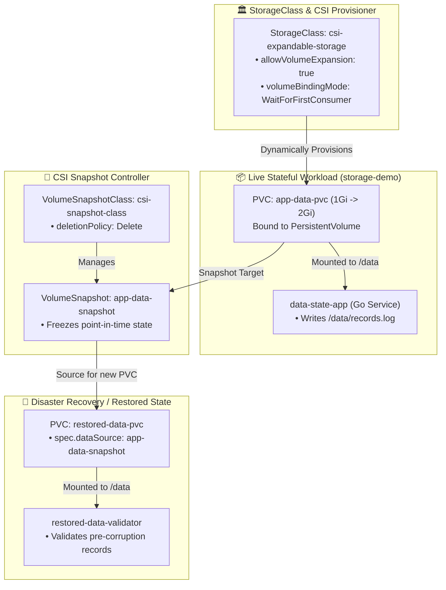
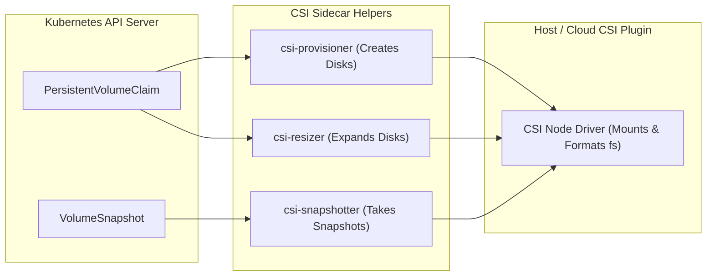
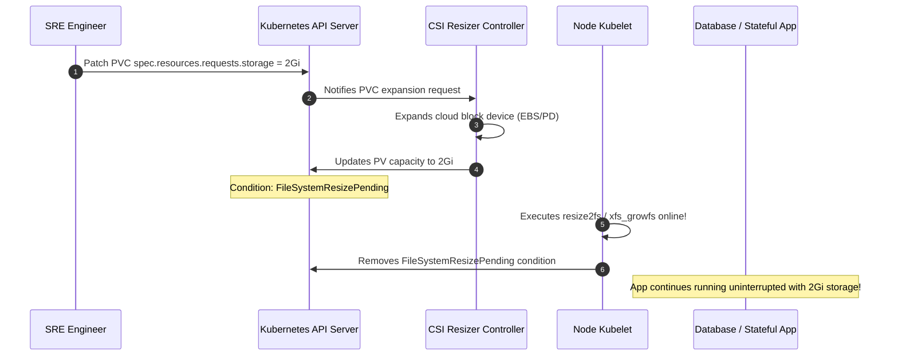

<!-- markdownlint-disable MD013 -->
# Mini-Project 18: CSI Storage, Dynamic Volume Expansion, and Volume Snapshots

> **Domain**: 04. Kubernetes & Orchestration  
> **Level**: Intermediate to Advanced  
> **Infrastructure**: Local (K3d / Kind / OrbStack / Minikube) or Cloud (EKS / GKE / AKS)  

---

## 🎯 Overview & Context

Managing stateful workloads (databases, message queues, time-series storage) in Kubernetes requires a storage subsystem that goes far beyond static host directories. In production, storage must support **automated dynamic provisioning**, **online volume expansion** (resizing disks without restarting running databases), and **point-in-time volume snapshots** for disaster recovery and staging environment clones.

The **Container Storage Interface (CSI)** standardizes how storage vendors integrate with Kubernetes. Through CSI Custom Resource Definitions and controller loops, Kubernetes provides declarative primitives for storage lifecycle management:

1. **`StorageClass`**: Defines the storage tier, provisioner plugin, volume binding mode (`WaitForFirstConsumer`), and whether online expansion is permitted (`allowVolumeExpansion: true`).
2. **Dynamic Volume Expansion**: Expanding a disk by simply editing the `PersistentVolumeClaim` storage request (e.g., from `1Gi` to `2Gi`), allowing the CSI driver and Kubelet to resize the underlying block device and filesystem online without downtime.
3. **`VolumeSnapshot` & `VolumeSnapshotClass`**: Taking instant, crash-consistent point-in-time backups of live volumes.
4. **Point-in-Time Restore via `dataSource`**: Creating a brand new `PersistentVolumeClaim` populated directly from an existing `VolumeSnapshot` for immediate disaster recovery.



---

## 🧠 Core CSI Storage Architectural Concepts

### 1. The Container Storage Interface (CSI) Architecture

In older Kubernetes versions, storage drivers were built directly into the Kubernetes source code ("in-tree"). The CSI architecture decouples storage drivers from core Kubernetes using sidecar controllers:



---

### 2. Dynamic Online Volume Expansion

When a database volume nears capacity, SREs can dynamically expand the disk without pod recreation:



---

### 3. VolumeSnapshot Hierarchy: User vs. Cluster Primitives

Just like `PersistentVolumeClaim` (namespaced) binds to a `PersistentVolume` (cluster-scoped), snapshots follow an identical pattern:

- **`VolumeSnapshot`** (Namespaced): The developer's request to capture a snapshot of a specific PVC.
- **`VolumeSnapshotContent`** (Cluster-Scoped): The actual physical snapshot ID in the underlying storage backend.
- **`VolumeSnapshotClass`** (Cluster-Scoped): Defines the CSI driver and deletion policy (`Delete` or `Retain`).

---

### 4. Point-in-Time Restore via `dataSource`

To restore a snapshot or clone a volume for staging, define a new `PersistentVolumeClaim` with `spec.dataSource`:

```yaml
apiVersion: v1
kind: PersistentVolumeClaim
metadata:
  name: restored-data-pvc
  namespace: storage-demo
spec:
  storageClassName: csi-expandable-storage
  accessModes:
    - ReadWriteOnce
  resources:
    requests:
      storage: 1Gi
  dataSource:
    name: app-data-snapshot
    kind: VolumeSnapshot
    apiGroup: snapshot.storage.k8s.io
```

---

## 📁 Repository Structure

```text
04-orchestration/18-csi-volume-expansion-snapshots/
├── README.md                              # Comprehensive educational guide (markdownlint compliant)
├── app/
│   ├── main.go                            # Stateful transaction logger service (writes/reads /data/records.log)
│   ├── go.mod                             # Go module definition
│   └── Dockerfile                         # Multi-stage minimal container build (<10MB, non-root UID 10001)
├── manifests/
│   ├── 00-namespace.yaml                  # Dedicated storage-demo namespace
│   ├── 01-volumesnapshot-crds.yaml        # Standard CSI VolumeSnapshot CRDs (VolumeSnapshot, VolumeSnapshotClass)
│   ├── 02-storageclass.yaml               # StorageClass with allowVolumeExpansion: true & reclaimPolicy
│   ├── 03-volumesnapshotclass.yaml        # VolumeSnapshotClass definition with deletionPolicy
│   ├── 04-stateful-app-pvc.yaml           # Primary PVC (1Gi) and stateful transaction logger Deployment
│   ├── 05-volumesnapshot.yaml             # VolumeSnapshot capturing point-in-time storage state
│   ├── 06-restore-pvc-from-snapshot.yaml  # Restored PVC using dataSource and validation workload
│   └── 07-volume-expansion.yaml           # Expanded PVC manifest (2Gi) demonstrating online resize
├── snapshot_restore_pipeline.sh           # Automated snapshot creation, state mutation & point-in-time restore test
├── verify_csi_storage.sh                  # Policy and manifest validation script (CRDs, expansion, dataSources)
├── test_csi_pipeline.sh                   # End-to-end automated test orchestrator
└── cleanup.sh                             # Teardown script (purges storage namespace, PVCs, snapshots, images & files)
```

---

## 🛠️ Step-by-Step Execution & Testing Guide

### Prerequisites

- `kubectl` (v1.24+)
- `docker` (for building the stateful storage container image)
- *(Recommended)* Local Kubernetes cluster (`k3d`, `kind`, `orbstack`, or `minikube`)

---

### Step 1: Validate Storage & Snapshot Manifests Offline

Run the automated validator to verify all StorageClass parameters, expansion flags, VolumeSnapshot bindings, and `dataSource` configurations:

```bash
./verify_csi_storage.sh
```

**Expected Output**:

```text
======================================================================
  💾 CSI Storage, Volume Expansion & Snapshot Validator
======================================================================

▶ Step 1: Checking Required Tools...
  [PASS] kubectl CLI is available

▶ Step 2: Validating Manifest Declarations...
  [PASS] Manifest file presence: 00-namespace.yaml
  [PASS] Manifest file presence: 01-volumesnapshot-crds.yaml
  [PASS] Manifest file presence: 02-storageclass.yaml
  [PASS] Manifest file presence: 03-volumesnapshotclass.yaml
  [PASS] Manifest file presence: 04-stateful-app-pvc.yaml
  [PASS] Manifest file presence: 05-volumesnapshot.yaml
  [PASS] Manifest file presence: 06-restore-pvc-from-snapshot.yaml
  [PASS] Manifest file presence: 07-volume-expansion.yaml

▶ Step 3: Asserting CSI Storage & Snapshot Directives...
  [1. CSI VolumeSnapshot CustomResourceDefinitions]
  [PASS] VolumeSnapshot and VolumeSnapshotClass CRDs defined

  [2. Dynamic StorageClass & Volume Expansion]
  [PASS] StorageClass enables online PVC resizing (allowVolumeExpansion: true)
  [PASS] StorageClass specifies explicit reclaimPolicy: Delete

  [3. VolumeSnapshotClass & Deletion Policy]
  [PASS] VolumeSnapshotClass configures deletionPolicy: Delete

  [4. VolumeSnapshot Source Binding]
  [PASS] VolumeSnapshot targets source PVC 'app-data-pvc' via 'csi-snapshot-class'

  [5. Point-in-Time Restore dataSource]
  [PASS] Restored PVC configures dataSource referencing VolumeSnapshot 'app-data-snapshot'

  [6. Online Volume Expansion Definition]
  [PASS] Volume expansion manifest requests 2Gi storage capacity

======================================================================
  ✅ ALL CSI STORAGE VALIDATION CHECKS PASSED (15/15)
======================================================================
```

---

### Step 2: Build the Stateful Storage Container Image

Build the Go stateful application image:

```bash
docker build -t data-state-app:v1.0.0 ./app
```

---

### Step 3: Deploy the Storage Foundations & Application

Apply the namespace, CRDs, StorageClass, and the stateful application:

```bash
kubectl apply -f manifests/00-namespace.yaml
kubectl apply -f manifests/01-volumesnapshot-crds.yaml
kubectl apply -f manifests/02-storageclass.yaml
kubectl apply -f manifests/03-volumesnapshotclass.yaml
kubectl apply -f manifests/04-stateful-app-pvc.yaml
```

---

### Step 4: Run the Disaster Recovery & Restore Test Pipeline

Execute the end-to-end snapshot and point-in-time restore simulation:

```bash
./snapshot_restore_pipeline.sh
```

**Expected Output**:

```text
======================================================================
  🔄 CSI VolumeSnapshot Creation, Disaster Simulation & Point-in-Time Restore
======================================================================

▶ Step 1: Initializing Live Stateful Workload & Volume...
▶ Step 2: Writing Baseline Transactions (Orders #1001 - #1005)...
  [OK] 5 transaction records committed to live storage.

▶ Step 3: Triggering VolumeSnapshot 'app-data-snapshot'...
  [OK] VolumeSnapshot captured. Snapshot point-in-time frozen.

▶ Step 4: Simulating Disaster (Data Corruption & Ransomware Injection)...
  Current corrupted disk state: CORRUPTED DATA - DISASTER SIMULATION

▶ Step 5: Provisioning Restored Volume from Snapshot dataSource...
  [OK] Restored PVC 'restored-data-pvc' materialized from VolumeSnapshot.

▶ Step 6: Validating Restored Volume Data Parity...
  Restored records count: 5/5
  [SUCCESS] Point-in-time restore complete! Corrupted mutations purged, all 5 records intact.

======================================================================
  ✨ Snapshot and restore pipeline completed successfully!
======================================================================
```

---

### Step 5: Run the Complete Automated Test Suite

Execute the full automated test suite:

```bash
./test_csi_pipeline.sh
```

---

## 🧹 Teardown & Environment Cleanup

To ensure a clean environment for subsequent mini-projects, execute the provided teardown script:

```bash
./cleanup.sh
```

### What `cleanup.sh` Automatically Purges

1. **Storage Resources & Namespaces**: Deletes the `storage-demo` namespace, PersistentVolumeClaims, Deployments, and Pods.
2. **StorageClasses & VolumeSnapshots**: Purges `StorageClass/csi-expandable-storage` and `VolumeSnapshotClass/csi-snapshot-class`.
3. **CSI CRDs**: Deletes `VolumeSnapshot`, `VolumeSnapshotClass`, and `VolumeSnapshotContent` CustomResourceDefinitions.
4. **Port-Forward Tunnels**: Terminates any background port-forward processes associated with `data-state-app`.
5. **Local Docker Artifacts**: Purges the `data-state-app:v1.0.0` container image and temporary test containers.
6. **Temporary Files**: Cleans up all `.tmp_*` logs and test directories strictly within the mini-project directory.

### Manual Cleanup Commands (Reference)

```bash
# 1. Delete namespace and storage classes
kubectl delete namespace storage-demo --ignore-not-found=true
kubectl delete storageclass csi-expandable-storage --ignore-not-found=true
kubectl delete volumesnapshotclass csi-snapshot-class --ignore-not-found=true

# 2. Delete CSI CRDs
kubectl delete crd volumesnapshots.snapshot.storage.k8s.io volumesnapshotclasses.snapshot.storage.k8s.io volumesnapshotcontents.snapshot.storage.k8s.io --ignore-not-found=true

# 3. Terminate port-forwards
pkill -f "port-forward.*data-state-app" || true

# 4. Remove Docker image
docker rmi -f data-state-app:v1.0.0 2>/dev/null || true
```

---

## 📚 Key Learnings & SRE Takeaways

1. **Always Enable Expansion**: Set `allowVolumeExpansion: true` in production StorageClasses so disk resizing never requires manual volume migration or database downtime.
2. **Use `WaitForFirstConsumer`**: Configure `volumeBindingMode: WaitForFirstConsumer` to ensure persistent disks are provisioned in the exact availability zone where the consuming pod is scheduled.
3. **Application-Consistent Snapshots**: While CSI snapshots provide crash consistency, always flush database write-ahead logs (WAL) or freeze IO (`fsfreeze`) before snapshotting to ensure zero data loss.
4. **Deletion Policy Discipline**: In production, consider `deletionPolicy: Retain` on `VolumeSnapshotClass` to prevent accidental deletion of critical disaster recovery backups when cleaning up namespaces.
