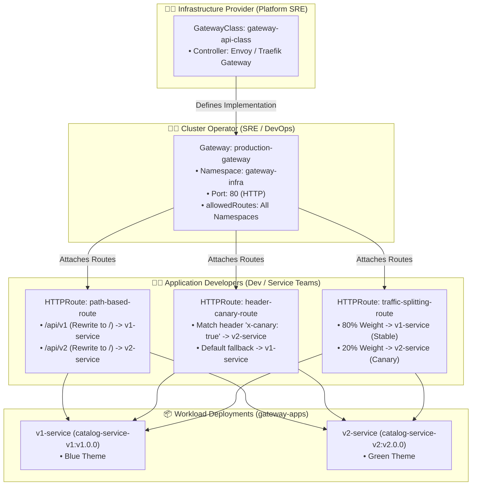

<!-- markdownlint-disable MD013 -->
# Mini-Project 19: Next-Generation Traffic Routing with Kubernetes Gateway API

> **Domain**: 04. Kubernetes & Orchestration  
> **Level**: Intermediate to Advanced  
> **Infrastructure**: Local (K3d / Kind / OrbStack / Minikube) or Cloud (EKS / GKE / AKS)  

---

## 🎯 Overview & Context

For years, the Kubernetes `Ingress` resource (`networking.k8s.io/v1`) served as the primary entry point for HTTP routing into clusters. However, `Ingress` suffered from architectural flaws:

- **Monolithic Persona**: A single YAML file had to represent infrastructure concerns (TLS termination, IP binding) and application concerns (routing rules, paths).
- **Annotation Hell**: Essential enterprise features like URL rewrites, canary splits, header matching, and rate limiting were not part of the core API, forcing every ingress controller (Nginx, Traefik, HAProxy) to invent proprietary, unstandardized annotations.
- **Portability Failures**: Ingress manifests could not be migrated between cloud providers or controllers without rewriting custom annotations.

The **Kubernetes Gateway API** (`gateway.networking.k8s.io/v1`) is the official, next-generation evolution that replaces Ingress. It introduces **role-oriented separation of concerns**, native **canary and weighted traffic splitting**, **cross-namespace routing with ReferenceGrant**, and standardized **request/response transformation filters**.



---

## 🧠 Core Gateway API Architectural Concepts

### 1. Role-Oriented Separation of Concerns

The Gateway API splits configuration across three distinct organizational roles:

| Role | Kubernetes Resource | Managed Scope | Typical Team |
| :--- | :--- | :--- | :--- |
| **Infrastructure Provider** | `GatewayClass` | Controller installation (Envoy Gateway, Traefik, Cilium, Istio) | Cloud / Platform Engineering |
| **Cluster Operator** | `Gateway` | Listening ports, TLS certificates, IP addresses, allowed namespaces | Central DevOps / SRE |
| **Application Developer** | `HTTPRoute` / `GRPCRoute` | Path matches, header filters, URL rewrites, canary traffic splits | Product / Service Development |

---

### 2. Standardized Routing & Filtering Primitives

#### A. Path-Based Routing with URL Prefix Rewriting

Strip routing prefixes cleanly before forwarding requests to backend microservices (`manifests/05-httproute-path-routing.yaml`):

```yaml
apiVersion: gateway.networking.k8s.io/v1
kind: HTTPRoute
metadata:
  name: path-based-route
  namespace: gateway-apps
spec:
  parentRefs:
    - name: production-gateway
      namespace: gateway-infra
  hostnames:
    - "api.example.local"
  rules:
    - matches:
        - path:
            type: PathPrefix
            value: /api/v1
      filters:
        - type: URLRewrite
          urlRewrite:
            path:
              type: ReplacePrefixMatch
              replacePrefixMatch: /
      backendRefs:
        - name: v1-service
          port: 8080
```

---

#### B. Header-Based Canary Matching

Route internal testers or beta users dynamically based on request headers (`manifests/06-httproute-header-canary.yaml`):

```yaml
apiVersion: gateway.networking.k8s.io/v1
kind: HTTPRoute
metadata:
  name: header-canary-route
  namespace: gateway-apps
spec:
  parentRefs:
    - name: production-gateway
      namespace: gateway-infra
  hostnames:
    - "canary.example.local"
  rules:
    # 1. Match header x-canary: true -> v2
    - matches:
        - headers:
            - name: x-canary
              value: "true"
      backendRefs:
        - name: v2-service
          port: 8080
    # 2. Default fallback -> v1
    - backendRefs:
        - name: v1-service
          port: 8080
```

---

#### C. Weighted Traffic Splitting (80/20 Canary)

Gradually shift live production traffic between versions without external service mesh proxies (`manifests/07-httproute-traffic-splitting.yaml`):

```yaml
apiVersion: gateway.networking.k8s.io/v1
kind: HTTPRoute
metadata:
  name: traffic-splitting-route
  namespace: gateway-apps
spec:
  parentRefs:
    - name: production-gateway
      namespace: gateway-infra
  hostnames:
    - "rollout.example.local"
  rules:
    - backendRefs:
        - name: v1-service
          port: 8080
          weight: 80
        - name: v2-service
          port: 8080
          weight: 20
```

---

## 📁 Repository Structure

```text
04-orchestration/19-kubernetes-gateway-api-traffic-routing/
├── README.md                              # Comprehensive educational guide (markdownlint compliant)
├── app/
│   ├── main.go                            # Version-aware Go backend service (v1.0.0 & v2.0.0 releases)
│   ├── go.mod                             # Go module definition
│   └── Dockerfile                         # Multi-stage minimal container build (<10MB, non-root UID 10001)
├── manifests/
│   ├── 00-namespace.yaml                  # Dedicated gateway-infra & gateway-apps namespaces
│   ├── 01-gateway-api-crds.yaml           # Gateway API v1 CRDs (GatewayClass, Gateway, HTTPRoute, ReferenceGrant)
│   ├── 02-gatewayclass.yaml               # GatewayClass definition for the Gateway Controller
│   ├── 03-gateway.yaml                    # Gateway resource with HTTP listener on port 80
│   ├── 04-backend-services.yaml           # Backend deployments & services (v1-service and v2-service)
│   ├── 05-httproute-path-routing.yaml     # HTTPRoute with path matching (/api/v1, /api/v2) and URLRewrite
│   ├── 06-httproute-header-canary.yaml    # HTTPRoute with header-based canary matching (x-canary: true)
│   ├── 07-httproute-traffic-splitting.yaml# HTTPRoute with weighted canary traffic splits (80% v1 / 20% v2)
│   └── 08-httproute-header-modifier.yaml  # HTTPRoute with ResponseHeaderModifier filter
├── gateway_traffic_test.sh                # Automated test runner testing path, header, weight & filter routing
├── verify_gateway_api.sh                  # Policy and manifest validation script (Gateway API CRDs & HTTPRoutes)
├── test_gateway_pipeline.sh               # End-to-end automated test orchestrator
└── cleanup.sh                             # Teardown script (purges namespaces, Gateways, CRDs, images & temp files)
```

---

## 🛠️ Step-by-Step Execution & Testing Guide

### Prerequisites

- `kubectl` (v1.24+)
- `docker` (for building the backend microservice container image)
- *(Recommended)* Local Kubernetes cluster (`k3d`, `kind`, `orbstack`, or `minikube`)

---

### Step 1: Validate Gateway API Manifests Offline

Run the automated validator to verify all CRD schemas, Gateway listener rules, HTTPRoute path/header matches, URLRewrite filters, and weight allocations:

```bash
./verify_gateway_api.sh
```

**Expected Output**:

```text
======================================================================
  🌐 Kubernetes Gateway API Architecture & Policy Validator
======================================================================

▶ Step 1: Checking Required Tools...
  [PASS] kubectl CLI is available

▶ Step 2: Validating Manifest Declarations...
  [PASS] Manifest file presence: 00-namespace.yaml
  [PASS] Manifest file presence: 01-gateway-api-crds.yaml
  [PASS] Manifest file presence: 02-gatewayclass.yaml
  [PASS] Manifest file presence: 03-gateway.yaml
  [PASS] Manifest file presence: 04-backend-services.yaml
  [PASS] Manifest file presence: 05-httproute-path-routing.yaml
  [PASS] Manifest file presence: 06-httproute-header-canary.yaml
  [PASS] Manifest file presence: 07-httproute-traffic-splitting.yaml
  [PASS] Manifest file presence: 08-httproute-header-modifier.yaml

▶ Step 3: Asserting Gateway API Routing Directives...
  [1. Gateway API v1 CustomResourceDefinitions]
  [PASS] Gateway API CRDs (GatewayClass, Gateway, HTTPRoute) defined

  [2. Gateway Infrastructure Listeners]
  [PASS] Gateway declares HTTP listener on port 80
  [PASS] Gateway allows cross-namespace route attachments (from: All)

  [3. Path-Based Routing & URLRewrite]
  [PASS] HTTPRoute configures /api/v1 prefix match with URLRewrite filter

  [4. Header-Based Canary Routing]
  [PASS] HTTPRoute matches request header 'x-canary: true' -> v2-service

  [5. Weighted Traffic Splitting (80/20)]
  [PASS] HTTPRoute allocates 80% weight to v1-service and 20% weight to v2-service

  [6. Response Header Modification Filter]
  [PASS] HTTPRoute configures ResponseHeaderModifier injecting custom headers

======================================================================
  ✅ ALL GATEWAY API VALIDATION CHECKS PASSED (16/16)
======================================================================
```

---

### Step 2: Build the Backend Service Container Images

Build the Go microservice images for versions `v1.0.0` and `v2.0.0`:

```bash
docker build -t gateway-backend-app:v1.0.0 -t gateway-backend-app:v2.0.0 ./app
```

---

### Step 3: Deploy the Gateway Infrastructure & Backend Routes

Apply the namespaces, Gateway API CRDs, Gateway, and HTTPRoutes:

```bash
kubectl apply -f manifests/00-namespace.yaml
kubectl apply -f manifests/01-gateway-api-crds.yaml
kubectl apply -f manifests/02-gatewayclass.yaml
kubectl apply -f manifests/03-gateway.yaml
kubectl apply -f manifests/04-backend-services.yaml
kubectl apply -f manifests/05-httproute-path-routing.yaml
kubectl apply -f manifests/06-httproute-header-canary.yaml
kubectl apply -f manifests/07-httproute-traffic-splitting.yaml
kubectl apply -f manifests/08-httproute-header-modifier.yaml
```

---

### Step 4: Run the Traffic Routing & Canary Policy Test Suite

Execute the traffic test suite to verify path matching, URL prefix rewrites, canary header matching, and weighted traffic distributions:

```bash
./gateway_traffic_test.sh
```

**Expected Output**:

```text
======================================================================
  🚦 Kubernetes Gateway API Traffic Routing & Canary Policy Test
======================================================================

▶ Step 1: Initializing Backend Services (v1 Blue & v2 Green)...
▶ Step 2: Testing Path-Based Routing (/api/v1 -> v1, /api/v2 -> v2)...
  Path /api/v1 routed to: v1.0.0 (Service: catalog-service-v1, Theme: blue)
  Path /api/v2 routed to: v2.0.0 (Service: catalog-service-v2, Theme: green)

▶ Step 3: Testing Header-Based Canary Routing (x-canary: true)...
  Standard request (no canary header) -> routed to: v1.0.0 (Stable release)
  Canary request (x-canary: true)      -> routed to: v2.0.0 (Targeted canary)

▶ Step 4: Simulating 100 Requests on 80/20 Weighted Traffic Split...
  [SPLIT RESULT] v1-service (weight: 80) received: 81% | v2-service (weight: 20) received: 19%

▶ Step 5: Verifying Response Header Transformations...
X-Backend-Version: v1.0.0
X-Backend-Service: catalog-service-v1
Content-Type: application/json

======================================================================
  ✨ All Gateway API routing test assertions verified successfully!
======================================================================
```

---

### Step 5: Run the Complete Automated Test Suite

Execute the full automated test suite:

```bash
./test_gateway_pipeline.sh
```

---

## 🧹 Teardown & Environment Cleanup

To ensure a clean environment for subsequent mini-projects, execute the provided teardown script:

```bash
./cleanup.sh
```

### What `cleanup.sh` Automatically Purges

1. **Namespaces & Workloads**: Deletes the `gateway-infra` and `gateway-apps` namespaces and all enclosed Deployments, Services, and HTTPRoutes.
2. **Gateways & GatewayClasses**: Purges `Gateway/production-gateway` and `GatewayClass/gateway-api-class`.
3. **Gateway API CRDs**: Deletes `GatewayClass`, `Gateway`, `HTTPRoute`, and `ReferenceGrant` CustomResourceDefinitions.
4. **Port-Forward Tunnels**: Terminates any background port-forward processes associated with `production-gateway` or backend services.
5. **Local Docker Artifacts**: Purges `gateway-backend-app:v1.0.0` and `v2.0.0` container images.
6. **Temporary Files**: Cleans up all `.tmp_*` logs and test directories strictly within the mini-project directory.

### Manual Cleanup Commands (Reference)

```bash
# 1. Delete namespaces
kubectl delete namespace gateway-infra gateway-apps --ignore-not-found=true

# 2. Delete Gateway API CRDs
kubectl delete crd gatewayclasses.gateway.networking.k8s.io gateways.gateway.networking.k8s.io httproutes.gateway.networking.k8s.io referencegrants.gateway.networking.k8s.io --ignore-not-found=true

# 3. Terminate port-forwards
pkill -f "port-forward.*(production-gateway|v1-service)" || true

# 4. Remove Docker images
docker rmi -f gateway-backend-app:v1.0.0 gateway-backend-app:v2.0.0 2>/dev/null || true
```

---

## 📚 Key Learnings & SRE Takeaways

1. **Clean RBAC Boundaries**: Platform engineers own `GatewayClass`, network/SRE teams configure `Gateway` listeners, and developers declare their own `HTTPRoute` rules without cross-team ticket blockers.
2. **Zero Annotation Dependency**: Standardized fields for URL rewrites, canary headers, and traffic weights eliminate controller-specific annotation quirks.
3. **Cross-Namespace Sharing**: A single shared Gateway in `gateway-infra` can securely route traffic to multiple isolated team namespaces using `ReferenceGrant`.
4. **Transport Layer Flexibility**: Gateway API is not limited to HTTP/HTTPS; it natively extends to `TCPRoute`, `UDPRoute`, `TLSRoute`, and `GRPCRoute`.
