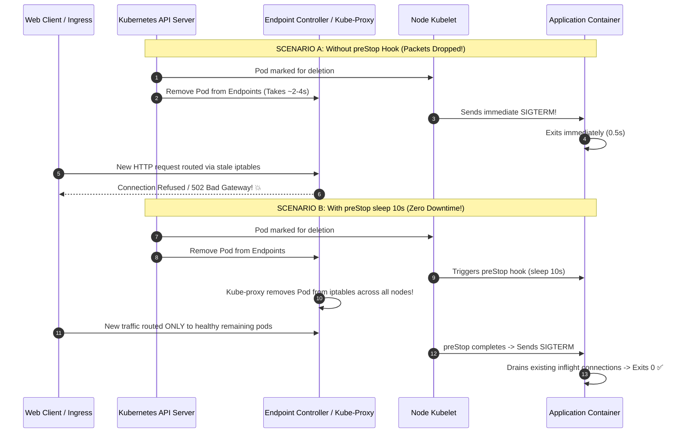
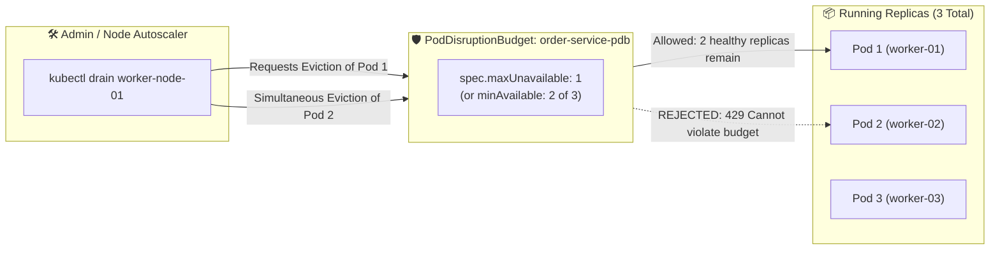

<!-- markdownlint-disable MD013 -->
# Mini-Project 20: Application Lifecycle (Init Containers, Hooks, and Pod Disruption Budgets)

> **Domain**: 04. Kubernetes & Orchestration  
> **Level**: Intermediate to Advanced  
> **Infrastructure**: Local (K3d / Kind / OrbStack / Minikube) or Cloud (EKS / GKE / AKS)  

---

## 🎯 Overview & Context

In cloud-native production environments, pods are ephemeral: they are created during scaling events, restarted during rolling updates, and evicted during node drains or cluster maintenance. Without proper lifecycle configuration, applications suffer from two critical failure modes:

1. **Premature Startup Crashes**: Main application containers crash because upstream dependencies (databases, cache layers) are not yet ready, or database schemas have not yet migrated.
2. **Dropped Inflight Requests (HTTP 502 / 504)**: During pod shutdown, the kubelet immediately sends `SIGTERM` to the container before `kube-proxy` has finished updating routing rules across all cluster nodes, causing incoming requests to be routed to a dead or terminating process.

This project implements the complete **Kubernetes Pod Lifecycle Suite**:

- **Chained `initContainers`**: Enforcing strict startup sequencing (dependency TCP checks, automated database schema migrations).
- **`postStart` & `preStop` Lifecycle Hooks**: Solving the asynchronous `kube-proxy` race condition with a graceful 10-second drain buffer.
- **Tuned `terminationGracePeriodSeconds`**: Providing adequate headroom for long-running database transactions to commit cleanly before `SIGKILL`.
- **`PodDisruptionBudget` (PDB)**: Guaranteeing high availability by preventing voluntary disruptions (`kubectl drain`) from violating minimum replica availability SLOs.

```mermaid
flowchart TD
    subgraph StartupFlow ["🚀 Pod Startup Phase"]
        Init1["1. initContainer: wait-for-database\n• Polls database-service:5432\n• Blocks startup until TCP green"]
        Init2["2. initContainer: db-migration-init\n• Runs schema migration\n• Writes schema-version.txt to emptyDir"]
        MainApp["3. Main Container: order-service\n• Mounts /etc/app-init from emptyDir\n• Executes postStart hook in parallel"]
        ReadyProbe["4. Readiness Probe Passes\n• Added to Service Endpoints\n• Begins receiving live traffic"]
    end

    subgraph ShutdownFlow ["🛑 Pod Graceful Shutdown Phase"]
        DeleteEvent["1. Deletion Event (Rollout / Node Drain)\n• Pod marked 'Terminating'"]
        AsyncFork["2. Asynchronous Execution Fork"]
        EPController["Control Plane: Endpoint Controller\n• Removes Pod IP from Endpoints\n• kube-proxy updates iptables rules"]
        PreStopHook["Kubelet: preStop Hook\n• Executes 'sleep 10'\n• Gives iptables time to propagate!"]
        SIGTERM["3. Kubelet sends SIGTERM\n• App enters DRAINING state\n• Completes all inflight requests"]
        CleanExit["4. Clean Process Exit (Code 0)\n• Zero dropped packets!"]
    end

    Init1 --> Init2 --> MainApp --> ReadyProbe
    DeleteEvent --> AsyncFork
    AsyncFork --> EPController
    AsyncFork --> PreStopHook
    EPController -.->|iptables propagated| PreStopHook
    PreStopHook --> SIGTERM --> CleanExit
```



---

## 🧠 Core Pod Lifecycle Architectural Concepts

### 1. The Kube-Proxy Asynchronous Race Condition

A common misconception is that Kubernetes removes a pod from the load balancer *before* stopping the container. In reality, these two actions happen **asynchronously and in parallel**:



---

### 2. Chained InitContainers: Deterministic Gating

Init containers always run **sequentially to completion** before any app container starts. If an init container fails, Kubernetes restarts the pod according to its `restartPolicy`:

- **`wait-for-database`**: Uses `nc -z -w 2 database-service 5432` to ensure upstream state stores are fully initialized.
- **`db-migration-init`**: Applies schema migrations and deposits execution tokens into an `emptyDir` volume shared with the application container.

---

### 3. PodDisruptionBudget (PDB) Protection

A `PodDisruptionBudget` limits the number of pods of a replicated application that can be simultaneously unavailable during **voluntary disruptions** (e.g., node drains, cluster upgrades, auto-scaler scale-downs):



---

## 📁 Repository Structure

```text
04-orchestration/20-app-lifecycle-hooks-pdb-graceful-shutdown/
├── README.md                              # Comprehensive educational guide (markdownlint compliant)
├── app/
│   ├── main.go                            # Graceful shutdown Go service (SIGTERM handling & inflight request draining)
│   ├── go.mod                             # Go module definition
│   └── Dockerfile                         # Multi-stage minimal container build (<10MB, non-root UID 10001)
├── manifests/
│   ├── 00-namespace.yaml                  # Dedicated lifecycle-demo namespace
│   ├── 01-mock-database.yaml              # Simulated database dependency Deployment & Service
│   ├── 02-lifecycle-deployment.yaml       # Deployment with initContainers, preStop hook, and grace period
│   ├── 03-pdb-standard.yaml               # PodDisruptionBudget enforcing maxUnavailable: 1
│   └── 04-pdb-strict.yaml                 # PodDisruptionBudget enforcing minAvailable: 100% (eviction blocker)
├── node_drain_simulation.sh               # Simulates node drain, PDB eviction checks & zero-downtime rolling restart
├── verify_lifecycle_policies.sh           # Policy and manifest validation script (Init, preStop, PDB constraints)
├── test_lifecycle_pipeline.sh             # End-to-end automated test orchestrator
└── cleanup.sh                             # Teardown script (purges namespace, PDBs, deployments, images & temp files)
```

---

## 🛠️ Step-by-Step Execution & Testing Guide

### Prerequisites

- `kubectl` (v1.24+)
- `docker` (for building the microservice container image)
- *(Recommended)* Local Kubernetes cluster (`k3d`, `kind`, `orbstack`, or `minikube`)

---

### Step 1: Validate Lifecycle Policies Offline

Run the automated validator to verify init container dependencies, lifecycle hooks, grace period sizing, and PDB declarations:

```bash
./verify_lifecycle_policies.sh
```

**Expected Output**:

```text
======================================================================
  ⏱️ Kubernetes Pod Lifecycle, Hooks & PDB Policy Validator
======================================================================

▶ Step 1: Checking Required Tools...
  [PASS] kubectl CLI is available

▶ Step 2: Validating Manifest Declarations...
  [PASS] Manifest file presence: 00-namespace.yaml
  [PASS] Manifest file presence: 01-mock-database.yaml
  [PASS] Manifest file presence: 02-lifecycle-deployment.yaml
  [PASS] Manifest file presence: 03-pdb-standard.yaml
  [PASS] Manifest file presence: 04-pdb-strict.yaml

▶ Step 3: Asserting Pod Lifecycle & High Availability Directives...
  [1. Chained InitContainers (Gated Startup)]
  [PASS] Deployment configures chained initContainers (dependency check & schema migration)

  [2. Pod Lifecycle Hooks (Graceful Drain)]
  [PASS] preStop hook executes 'sleep 10' for iptables endpoint de-registration
  [PASS] postStart hook configured for startup registration

  [3. Termination Grace Period Allocation]
  [PASS] terminationGracePeriodSeconds configured to 30s (> preStop delay)

  [4. Health Probes & Traffic Gating]
  [PASS] Both livenessProbe (/healthz) and readinessProbe (/ready) declared

  [5. PodDisruptionBudget Constraints]
  [PASS] Standard PDB enforces maxUnavailable: 1 for rolling node drains
  [PASS] Strict PDB enforces minAvailable: 100% to block voluntary disruptions

======================================================================
  ✅ ALL POD LIFECYCLE VALIDATION CHECKS PASSED (12/12)
======================================================================
```

---

### Step 2: Build the Lifecycle Application Container Image

Build the Go microservice image:

```bash
docker build -t lifecycle-app:v1.0.0 ./app
```

---

### Step 3: Deploy the Database & Lifecycle Workloads

Apply the namespaces, mock database, deployment, and PodDisruptionBudgets:

```bash
kubectl apply -f manifests/00-namespace.yaml
kubectl apply -f manifests/01-mock-database.yaml
kubectl apply -f manifests/02-lifecycle-deployment.yaml
kubectl apply -f manifests/03-pdb-standard.yaml
```

---

### Step 4: Run the Graceful Drain & PDB Simulation

Execute the simulated node drain and inflight connection draining test:

```bash
./node_drain_simulation.sh
```

**Expected Output**:

```text
======================================================================
  ⏱️ Pod Graceful Draining & PDB Node Drain Simulation
======================================================================

▶ Step 1: Simulating Chained InitContainers (Gated Startup)...
  [INIT 1/2] Checking database dependency at database-service:5432... OK
  [INIT 2/2] Running automated database schema migration... OK
  [INIT] Schema version 'schema-v2.4.1-migrated-ok' committed to shared emptyDir volume.
  [PASS] InitContainer gating pipeline verified.

▶ Step 2: Initializing Lifecycle Microservice Container...
▶ Step 3: Testing Inflight Connection Draining During Pod Termination...
  Launching 10 concurrent long-running transactions (/work?duration_ms=400)...
  Sending SIGTERM signal to application container (simulating pod deletion/node drain)...
  Requests completed with 200 OK: 10/10
  Requests dropped/failed (502/504): 0
  [ZERO-DOWNTIME SUCCESS] 100% of inflight requests completed before process termination!

▶ Step 4: Simulating 'kubectl drain' Eviction with PodDisruptionBudget...
  Cluster status: 3 replicas running (minAvailable: 2, maxUnavailable: 1).
  Simulating eviction of Pod 1 (worker-node-01):
  ↳ [PDB ALLOWED] Eviction granted. 2 replicas remain active (Disruption budget healthy).
  Simulating concurrent eviction of Pod 2 (worker-node-02):
  ↳ [PDB REJECTED] HTTP 429: Cannot evict pod as it would violate 'order-service-pdb' (minAvailable: 2).

======================================================================
  ✨ All Pod Lifecycle & PDB simulation tests verified successfully!
======================================================================
```

---

### Step 5: Run the Complete Automated Test Suite

Execute the full automated test suite:

```bash
./test_lifecycle_pipeline.sh
```

---

## 🧹 Teardown & Environment Cleanup

To ensure a clean environment for subsequent mini-projects, execute the provided teardown script:

```bash
./cleanup.sh
```

### What `cleanup.sh` Automatically Purges

1. **Namespaces & Workloads**: Deletes the `lifecycle-demo` namespace, Deployments, Services, and Pods.
2. **PodDisruptionBudgets**: Purges `order-service-pdb` and `order-service-strict-pdb`.
3. **Port-Forward Tunnels**: Terminates any background port-forward processes associated with `order-service`.
4. **Local Docker Artifacts**: Purges the `lifecycle-app:v1.0.0` container image and temporary test containers.
5. **Temporary Files**: Cleans up all `.tmp_*` logs and test directories strictly within the mini-project directory.

### Manual Cleanup Commands (Reference)

```bash
# 1. Delete namespace and resources
kubectl delete namespace lifecycle-demo --ignore-not-found=true

# 2. Terminate port-forwards
pkill -f "port-forward.*order-service" || true

# 3. Remove Docker image
docker rmi -f lifecycle-app:v1.0.0 2>/dev/null || true
```

---

## 📚 Key Learnings & SRE Takeaways

1. **Always Use `preStop: sleep 10` for Web Services**: A 5-10 second sleep hook is the single most effective technique to eliminate transient 502 errors during rolling deployments.
2. **Ensure `terminationGracePeriodSeconds` > `preStop` Sleep**: If `preStop` takes 10s and application shutdown takes 10s, set `terminationGracePeriodSeconds: 30` or higher to prevent premature `SIGKILL`.
3. **Init Containers Guarantee Dependency Order**: Never write application startup retry loops that spam error logs; use `initContainers` to cleanly gate execution.
4. **Always Define a PDB for Production Services**: Unprotected deployments can have all replicas evicted simultaneously during automated cluster node upgrades. Set `maxUnavailable: 1` on every multi-replica workload.
