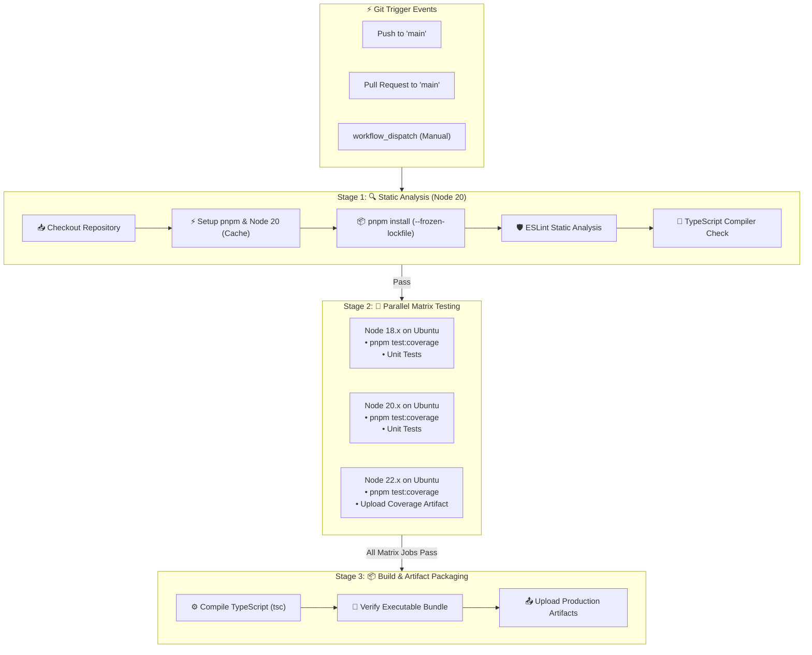

<!-- markdownlint-disable MD013 -->
# Mini-Project 01: GitHub Actions Matrix Lint and Test Workflow

> **Domain**: 05. CI/CD Pipelines  
> **Level**: Beginner to Intermediate  
> **Infrastructure**: GitHub Actions (Cloud) / Docker & Act CLI (Local)  

---

## 🎯 Overview & Context

In modern Site Reliability Engineering (SRE) and DevOps practices, **Continuous Integration (CI)** is the automated process of validating code changes before they are merged into production branches. A reliable CI pipeline prevents regression bugs, enforces uniform code style, guarantees type safety, and ensures that libraries remain backwards-compatible across different runtime versions and operating systems.

This mini-project demonstrates how to construct an enterprise-grade, scalable **GitHub Actions Matrix Workflow** for an SRE metrics calculation utility.



### Core Problems Solved by Matrix CI Pipelines

1. **Multi-Runtime Compatibility**:
   Software often behaves differently across major runtime releases (such as Node.js 18 LTS, Node.js 20 LTS, and Node.js 22 LTS) due to deprecated APIs, updated V8 engines, or updated ECMAScript features. Matrix builds execute tests in parallel across all targeted runtimes simultaneously.
2. **Early Feedback Loop (Fail-Fast vs Non-Blocking)**:
   By separating static analysis (fast: ~10s) from unit testing matrices (longer: ~30-60s), developers receive instant feedback on formatting and syntax errors before consuming extensive test runner compute minutes.
3. **Build Acceleration via Content-Addressable Caching**:
   Re-downloading hundreds of megabytes of dependencies on every commit wastes bandwidth and increases CI queue times. Using `actions/cache` or `actions/setup-node` with pnpm store caching reduces dependency installation time by up to 80%.
4. **Deterministic & Immutable Dependency Resolution**:
   CI pipelines must build from the exact same package tree as local development. Using `pnpm install --frozen-lockfile` prevents uncommitted or floating transitive dependency updates from breaking production builds.
5. **Traceable Quality Gates & Artifact Retention**:
   Generating and storing HTML/LCOV code coverage reports as CI build artifacts allows teams to audit test coverage over time and enforce minimum quality gates.

---

## 🧠 GitHub Actions Internals Deep-Dive

### 1. The GitHub Actions Execution Hierarchy

GitHub Actions organizes automation into a hierarchy of components:

```text
Workflow (.github/workflows/*.yml)
 ├── Triggers (push, pull_request, workflow_dispatch)
 ├── Concurrency (cancel-in-progress: true)
 └── Jobs (Executed on independent Virtual Machine runners)
      ├── Job 1: lint-and-typecheck (ubuntu-latest)
      │    └── Steps (Actions & Shell Run commands)
      ├── Job 2: matrix-test (Matrix expansion: 18.x, 20.x, 22.x)
      │    └── Steps (Checkout -> Setup -> Cache -> Test -> Upload Artifact)
      └── Job 3: build-and-package (ubuntu-latest)
           └── Steps (Compile -> Verify -> Upload Dist)
```

- **Runners**: Virtual machines hosted by GitHub (e.g. `ubuntu-latest`, `macos-latest`, `windows-latest`) or self-hosted servers running the Actions Runner daemon.
- **Jobs**: Units of execution that run in parallel by default unless dependency constraints (`needs: [job_name]`) are specified.
- **Steps**: Individual tasks executed sequentially inside the runner container or shell.

---

### 2. The Build Matrix Strategy (`strategy.matrix`)

A matrix strategy allows a single job definition to spawn multiple job runs by interpolating combinations of variables:

```yaml
strategy:
  fail-fast: false
  matrix:
    os: [ubuntu-latest]
    node-version: [18.x, 20.x, 22.x]
```

- **`matrix` Expansion**: If you define 2 operating systems and 3 Node versions, GitHub Actions dynamically generates $2 \times 3 = 6$ parallel jobs.
- **`fail-fast: false`**: By default (`fail-fast: true`), if any matrix job fails, GitHub cancels all remaining active matrix jobs. Setting `fail-fast: false` ensures all versions complete, giving you a full visibility report across all runtimes.

---

### 3. Dependency Caching Mechanics (`actions/cache`)

Package managers store packages in a local global store. In GitHub Actions, each job runs on a brand new, ephemeral virtual machine.

```text
Commit Push
   │
   ▼
Compute Hash: hashFiles('**/pnpm-lock.yaml')
   │
   ├─► Cache HIT  ──► Restore store directly from GitHub Cache (~2s)
   │
   └─► Cache MISS ──► Download packages from registry & Save new cache (~25s)
```

The workflow uses `actions/setup-node@v4` with built-in pnpm cache support:

```yaml
- name: 🟢 Setup Node.js Runtime with Dependency Caching
  uses: actions/setup-node@v4
  with:
    node-version: ${{ matrix.node-version }}
    cache: 'pnpm'
    cache-dependency-path: 05-ci-cd/01-github-actions-lint-test-workflow/pnpm-lock.yaml
```

---

### 4. Concurrency & Waste Prevention

When developers push several commits in rapid succession to a pull request, running full CI workflows on obsolete commits wastes runner minutes and money.

```yaml
concurrency:
  group: ${{ github.workflow }}-${{ github.ref }}
  cancel-in-progress: true
```

Whenever a new commit arrives on the same Git reference (`github.ref`), GitHub automatically cancels any running workflow for that reference and prioritizes the newest commit.

---

### 5. Least-Privilege Security Permissions

By default, workflows inherit broad repository permissions. In compliance with SRE security best practices, our workflow explicitly restricts permissions to read-only:

```yaml
permissions:
  contents: read
```

---

## 📂 Project Structure

```text
05-ci-cd/01-github-actions-lint-test-workflow/
├── .github/
│   └── workflows/
│       └── ci.yml             # GitHub Actions CI Matrix Workflow definition
├── src/
│   ├── calculator.ts          # SRE metric calculations (SLO, Error Budget, MTTR, Burn Rate)
│   ├── formatter.ts           # Markdown & JSON summary report formatters
│   ├── validator.ts           # Input sanitization and threshold assertions
│   └── index.ts               # Public module exports and CLI demo runner
├── tests/
│   ├── calculator.test.ts     # Unit tests for SRE metrics algorithms
│   ├── formatter.test.ts      # Unit tests for report outputs
│   ├── validator.test.ts      # Unit tests for input boundary assertions
│   └── index.test.ts          # Integration tests for exports and CLI execution
├── .eslintrc.json             # ESLint configuration for static analysis
├── .eslintignore              # Ignored paths for linter
├── .markdownlint.json         # Markdownlint rule configurations
├── tsconfig.json              # TypeScript compiler configuration
├── package.json               # Project scripts, dependencies, and metadata
├── pnpm-workspace.yaml        # Workspace configuration and script permissions
├── local_ci_test.sh           # Automated local CI matrix pipeline test script
├── cleanup.sh                 # Resource and artifact teardown script
└── README.md                  # Comprehensive educational project guide
```

---

## 🛠️ The Sample Application: SRE Metrics Engine

The mini-project includes a production-grade TypeScript utility module modeling real-world Site Reliability Engineering calculations:

1. **`calculateAllowedDowntime(targetPercent, windowDays)`**:
   Calculates total allowable downtime in seconds, minutes, and hours for given availability targets (e.g., $99.9\%$ over 30 days = 43.2 minutes).
2. **`calculateErrorBudget(targetPercent, totalRequests, failedRequests)`**:
   Computes remaining error budget, percentage of budget consumed, and determines if the SLO budget is exhausted.
3. **`calculateBurnRate(consumedBudgetPercent, observedHours, totalWindowDays)`**:
   Calculates the rate at which error budget is being consumed relative to standard pacing. Triggers `WARNING` or `CRITICAL` alerts according to Google SRE alerting standards.
4. **`calculateMTTR(durationsMinutes)`**:
   Calculates Mean Time to Recovery from incident duration telemetry.

---

## 🚀 Step-by-Step Execution Guide

### Prerequisites

Ensure the following tools are available on your system:

- **Node.js**: v18.0.0 or higher (`node --version`)
- **pnpm**: v9.0.0 or higher (`pnpm --version`)
- **Docker** (Optional, for containerized local matrix testing): (`docker --version`)

---

### Method 1: Automated Local CI Runner (`local_ci_test.sh`)

The mini-project includes an automated test runner script that simulates all stages of the GitHub Actions pipeline locally without requiring a remote push:

```bash
# Navigate to the mini-project directory
cd 05-ci-cd/01-github-actions-lint-test-workflow

# Install dependencies with pnpm
pnpm install

# Run the complete local CI matrix pipeline
./local_ci_test.sh
```

#### What the Test Runner Does

1. **Prerequisite Verification**: Checks for `pnpm`, `node`, and `docker`.
2. **Workflow Schema Validation**: Verifies YAML structure, matrix parameters, and stages in `.github/workflows/ci.yml`.
3. **Stage 1 (Static Analysis)**: Runs `pnpm lint` and `pnpm tsc --noEmit`.
4. **Stage 2 (Matrix Testing)**: Executes tests across Node.js 18, 20, and 22 runtimes (using isolated Docker containers or local runtime fallback).
5. **Code Coverage Validation**: Generates test coverage report (`coverage/index.html`) and verifies assertions.
6. **Stage 3 (Production Build)**: Compiles TypeScript (`pnpm build`) and executes `node dist/index.js` to ensure the final bundle runs properly.
7. **Summary Table**: Displays a formatted, color-coded report of all pipeline checks.

---

### Method 2: Running with Act CLI (GitHub Actions Locally)

If you have [nektos/act](https://github.com/nektos/act) installed, you can execute the actual GitHub Actions workflow in local Docker containers:

```bash
# Run workflow simulating a pull request
act pull_request -W .github/workflows/ci.yml
```

---

### Method 3: Testing Directly on GitHub

To run the workflow on GitHub's cloud infrastructure:

1. Push your repository to GitHub.
2. Navigate to your repository on GitHub.
3. Click on the **Actions** tab.
4. Select the **CI Matrix Pipeline** workflow from the left sidebar.
5. Click **Run workflow** -> **Run workflow** (triggers `workflow_dispatch`).
6. Observe the parallel execution of the `lint-and-typecheck`, `matrix-test` (3 parallel jobs), and `build-and-package` jobs.
7. Download the generated **`code-coverage-node-22.x`** and **`production-dist`** artifacts from the run summary page.

---

## 🧪 Verification & Testing Criteria

### 1. Verify Code Quality & Type Safety

```bash
# Run ESLint static analysis
pnpm lint

# Run TypeScript typecheck without emitting files
pnpm tsc --noEmit
```

### 2. Verify Unit Tests & Coverage

```bash
# Run all unit tests
pnpm test

# Run tests with code coverage report
pnpm test:coverage
```

Expected Coverage Output:

```text
 % Coverage report from v8
---------------|---------|----------|---------|---------|-------------------
File           | % Stmts | % Branch | % Funcs | % Lines | Uncovered Line #s 
---------------|---------|----------|---------|---------|-------------------
All files      |   99.46 |    96.77 |     100 |   99.46 |                   
 calculator.ts |     100 |       96 |     100 |     100 |                   
 formatter.ts  |     100 |      100 |     100 |     100 |                   
 index.ts      |   95.45 |       50 |     100 |   95.45 |                   
 validator.ts  |     100 |      100 |     100 |     100 |                   
---------------|---------|----------|---------|---------|-------------------
```

### 3. Verify Production Build & Executable

```bash
# Compile TypeScript to JavaScript in dist/
pnpm build

# Execute compiled entrypoint
node dist/index.js
```

---

## 🧹 Cleanup & Teardown Guide

After testing, you should clean up all generated build artifacts, temporary test files, and any Docker containers to keep your workspace pristine.

### Automated Cleanup via Script

The project includes a dedicated `cleanup.sh` script:

```bash
# Basic cleanup: removes dist/, coverage/, temp files, and test containers
./cleanup.sh

# Full cleanup: also removes node_modules
./cleanup.sh --full
```

### Manual Cleanup Steps

If you prefer to perform cleanup manually:

```bash
# 1. Stop and remove any test matrix Docker containers
docker rm -f $(docker ps -a --filter "name=ci-matrix-runner-" -q) 2>/dev/null || true

# 2. Remove local build and coverage directories
rm -rf dist coverage .nyc_output .tmp_ci_test

# 3. (Optional) Remove node_modules
rm -rf node_modules
```

---

## 🛡️ Best Practices & SRE Takeaways

1. **Always Use `--frozen-lockfile` in CI**:
   Never allow CI pipelines to resolve or update dependencies dynamically. A missing or mutated lockfile leads to non-reproducible builds.
2. **Design Matrix Builds Intentionally**:
   Only include runtime versions that your application officially supports (e.g. active Node.js LTS versions: 18, 20, 22). Avoid running non-critical combinations on expensive OS runners (such as macOS runners, which consume 10x more billing minutes).
3. **Artifact Retention Limits**:
   Always specify `retention-days` for uploaded build and test artifacts (e.g. 7 days). Leaving default retention (90 days) consumes unnecessary storage quota.
4. **Isolate CI Temp Files**:
   Ensure all test runners and scripts generate artifacts exclusively within the project directory structure, avoiding collisions with other workflows or host system paths.
