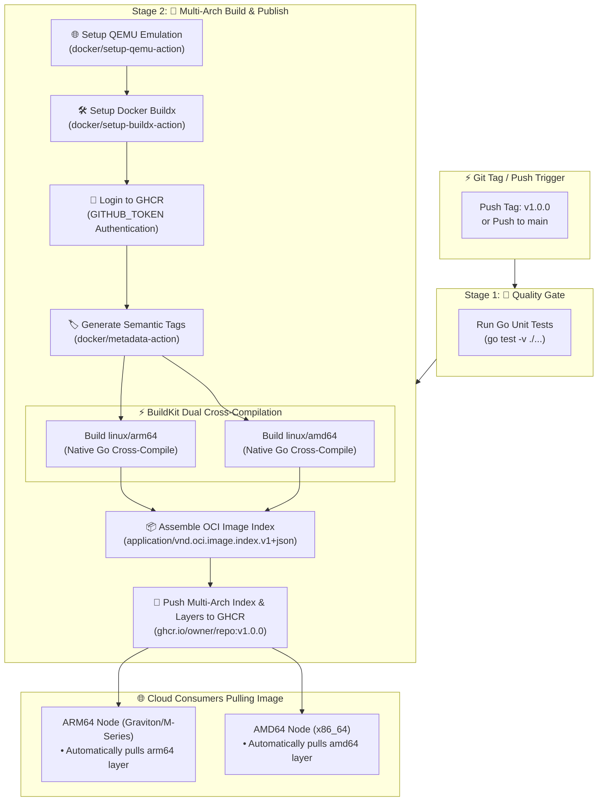

<!-- markdownlint-disable MD013 -->
# Mini-Project 02: Multi-Arch Docker Build and Push Pipeline

> **Domain**: 05. CI/CD Pipelines  
> **Level**: Beginner to Intermediate  
> **Infrastructure**: Cloud (GitHub Actions + GHCR) / Local (Docker BuildKit & Buildx)  

---

## 🎯 Overview & Context

In modern Cloud-Native Engineering and Site Reliability Engineering (SRE), computing infrastructure has shifted away from homogeneous x86_64 server farms toward heterogeneous hardware architectures. Cloud providers heavily leverage ARM64 processors—such as **AWS Graviton**, **Google Cloud Tau T2A**, and **Ampere Altra** on Microsoft Azure—to offer up to **40% better price-performance** and significantly lower electrical power consumption compared to traditional Intel/AMD x86_64 chips.

Simultaneously, software developers frequently build and test microservices on ARM64 workstations (such as Apple Silicon M-series Macs or ARM Linux laptops) while deploying workloads to x86_64 Kubernetes clusters.

When an image compiled strictly for `linux/arm64` is run on a `linux/amd64` machine, the operating system kernel immediately fails with the classic container error:

```text
standard_init_linux.go:228: exec user process caused: exec format error
```

This mini-project demonstrates how to construct an automated, enterprise-grade **Multi-Architecture CI/CD Pipeline** that compiles, tags, and publishes unified multi-arch container images supporting both **`linux/amd64`** and **`linux/arm64`** to the **GitHub Container Registry (GHCR)**.



---

## 🧠 Deep-Dive: OCI Image Specs & Multi-Arch Mechanics

### 1. OCI Image Index (Manifest List) vs Image Manifest

A multi-architecture Docker image is not a single binary file. Instead, it is an **OCI Image Index** (historically known as a Docker Manifest List) that serves as a pointer directory to distinct, platform-specific image manifests.

```text
OCI Image Index (Tag: ghcr.io/org/app:v1.0.0)
 ├── Manifest 1: linux/amd64 (Digest: sha256:6d3116...)
 │    ├── Config: Config JSON (Architecture: amd64, OS: linux)
 │    └── Layers: [Layer 1 (amd64), Layer 2 (amd64), Layer 3 (amd64)]
 │
 └── Manifest 2: linux/arm64 (Digest: sha256:ada16c...)
      ├── Config: Config JSON (Architecture: arm64, OS: linux)
      └── Layers: [Layer 1 (arm64), Layer 2 (arm64), Layer 3 (arm64)]
```

When a container engine (such as Docker, containerd, or CRI-O) executes `docker run ghcr.io/org/app:v1.0.0`:

1. The client requests the image tag from the registry.
2. The registry responds with the **Image Index** (`application/vnd.oci.image.index.v1+json`).
3. The container runtime inspects its own host CPU architecture (`runtime.GOARCH` / `uname -m`).
4. The runtime selects the matching child manifest (e.g. `linux/arm64`) and downloads **only the layers for that architecture**, ignoring the other platform layers completely.

---

### 2. High-Speed Native Cross-Compilation vs QEMU Emulation

Traditionally, building multi-arch images required running entire build steps under **QEMU user-mode CPU emulation** (`qemu-user-static`), which translates foreign machine code instructions at runtime. Emulating a full GCC or Go compiler under QEMU is notoriously slow (often **10x to 20x slower** than native execution).

In this project, our `Dockerfile` solves this bottleneck by combining **Docker BuildKit platform arguments** with **Go's native cross-compiler**:

```dockerfile
# Stage 1: The builder runs natively on the host architecture (fast!)
FROM --platform=$BUILDPLATFORM golang:1.24-alpine AS builder

# BuildKit automatically injects target platform information
ARG TARGETOS
ARG TARGETARCH

# Go natively compiles machine code for any target architecture
RUN CGO_ENABLED=0 GOOS=$TARGETOS GOARCH=$TARGETARCH go build -o /bin/server .
```

| Strategy | Builder CPU | Compiler Speed | Output Architecture | Overhead |
| :--- | :--- | :--- | :--- | :--- |
| **Pure QEMU Emulation** | Emulated Foreign CPU | Very Slow (~10x slower) | Target CPU | High (CPU instruction translation) |
| **BuildKit Cross-Compile** | Native Host CPU | Instant / Full Host Speed | Target CPU | **Zero overhead** (Fastest approach) |

---

### 3. Automated Semantic Tagging with `docker/metadata-action`

Publishing container images in production requires strict semantic versioning tags to guarantee immutable deployments. Our workflow leverages `docker/metadata-action` to parse Git tags and commit metadata into multiple standardized tags:

```yaml
- name: 🏷️ Extract Docker Metadata and Semantic Tags
  id: meta
  uses: docker/metadata-action@v5
  with:
    images: ghcr.io/${{ github.repository }}
    tags: |
      type=semver,pattern={{version}}
      type=semver,pattern={{major}}.{{minor}}
      type=semver,pattern={{major}}
      type=sha,format=short,prefix=sha-
      type=raw,value=latest,enable={{is_default_branch}}
```

When you push a Git tag `v1.2.3`, GitHub Actions automatically generates and publishes:

- `ghcr.io/org/repo:1.2.3` (Patch release tag)
- `ghcr.io/org/repo:1.2` (Minor release tracking tag)
- `ghcr.io/org/repo:1` (Major release tracking tag)
- `ghcr.io/org/repo:sha-abc1234` (Commit SHA immutable reference)
- `ghcr.io/org/repo:latest` (Default branch latest tag)

---

### 4. Authentication & Least Privilege via GHCR and OIDC

The workflow authenticates directly to the GitHub Container Registry (`ghcr.io`) using the ephemeral, short-lived `GITHUB_TOKEN` provided automatically by the runner environment:

```yaml
permissions:
  contents: read
  packages: write
  id-token: write

- name: 🔐 Authenticate with GitHub Container Registry
  uses: docker/login-action@v3
  with:
    registry: ghcr.io
    username: ${{ github.actor }}
    password: ${{ secrets.GITHUB_TOKEN }}
```

This adheres to SRE security best practices: no long-lived Personal Access Tokens (PATs) or static credentials need to be stored in repository secrets.

---

## 📂 Project Structure

```text
05-ci-cd/02-multi-arch-docker-build-push-pipeline/
├── .github/
│   └── workflows/
│       └── docker_publish.yml  # GitHub Actions Multi-Arch CI Pipeline definition
├── app/
│   ├── go.mod                  # Go module definition
│   ├── main.go                 # Microservice with architecture & health endpoints
│   └── main_test.go            # Unit tests for all endpoints and architecture checks
├── .dockerignore               # Build context exclusions
├── Dockerfile                  # Multi-stage, multi-platform cross-compilation Dockerfile
├── verify_multiarch_build.sh   # Automated local multi-arch verification script
├── cleanup.sh                  # Resource & container cleanup script
└── README.md                   # Comprehensive educational project guide
```

---

## 🛠️ The Sample Microservice

The included Go microservice is designed specifically to demonstrate multi-architecture awareness and observability:

- **`GET /`**: Returns welcoming status message along with the detected runtime architecture and OS.
- **`GET /healthz`**: Standard liveness/readiness endpoint returning HTTP 200 OK with server uptime in seconds.
- **`GET /info`**: Returns detailed runtime metadata including `architecture` (`runtime.GOARCH`), `os` (`runtime.GOOS`), `num_cpu`, `go_version`, and `hostname`.
- **`GET /metrics`**: Prometheus-formatted exposition metrics (`service_uptime_seconds`, `service_requests_total`, `service_go_info{arch="...", os="..."}`).

---

## 🚀 Step-by-Step Execution Guide

### Prerequisites

Ensure the following tools are available on your system:

- **Docker**: v24.0.0 or higher with Buildx plugin (`docker buildx version`)
- **curl**: Standard CLI HTTP client
- **Go** (Optional, for running host unit tests): v1.22 or higher

---

### Method 1: Automated Local Verification (`verify_multiarch_build.sh`)

The project includes an end-to-end local verification script that tests the entire multi-arch pipeline on your machine:

```bash
# Navigate to the mini-project directory
cd 05-ci-cd/02-multi-arch-docker-build-push-pipeline

# Run the automated verification suite
./verify_multiarch_build.sh
```

#### What the Verification Script Does

1. **Prerequisite Check**: Validates Docker daemon and Docker Buildx capabilities.
2. **Workflow Schema Validation**: Confirms YAML syntax and multi-platform flags in `docker_publish.yml`.
3. **Application Unit Tests**: Runs `go test -v ./...` to ensure application correctness.
4. **Local OCI Registry Setup**: Spawns an ephemeral local container registry (`registry:2`) on `localhost:5055`.
5. **Buildx Builder Creation**: Instantiates a multi-platform Buildx container builder (`multiarch-test-builder`).
6. **Multi-Arch Compilation & Push**: Compiles `linux/amd64` and `linux/arm64` simultaneously and pushes the image index to `localhost:5055/multiarch-demo:test`.
7. **OCI Manifest List Inspection**: Executes `docker buildx imagetools inspect` to prove that both `linux/amd64` and `linux/arm64` platform manifests are published.
8. **Live Container Test**: Runs the container locally, queries `/healthz`, `/info`, and `/metrics`, and verifies that the microservice identifies the host CPU architecture.
9. **Automatic Cleanup**: Removes test containers and builder instances on exit.

---

### Method 2: Manual Local Buildx Commands

To build and inspect multi-architecture images manually:

```bash
# 1. Start a temporary local registry container
docker run -d --name local-registry -p 5055:5000 registry:2

# 2. Create and switch to a multi-platform Buildx builder
docker buildx create --name mybuilder --driver docker-container --use
docker buildx inspect --bootstrap

# 3. Build and push both architectures simultaneously
docker buildx build \
    --platform linux/amd64,linux/arm64 \
    -t localhost:5055/multiarch-demo:manual \
    --push \
    .

# 4. Inspect the OCI Image Index manifest
docker buildx imagetools inspect localhost:5055/multiarch-demo:manual
```

Expected Output from `imagetools inspect`:

```text
Name:      localhost:5055/multiarch-demo:manual
MediaType: application/vnd.oci.image.index.v1+json
Digest:    sha256:142381fb9e743014330d54615b74f223c56f8fa8ffeebe8b034a30816b55241d
           
Manifests: 
  Name:        localhost:5055/multiarch-demo:manual@sha256:6d3116ba90e6...
  MediaType:   application/vnd.oci.image.manifest.v1+json
  Platform:    linux/amd64
               
  Name:        localhost:5055/multiarch-demo:manual@sha256:ada16c46599e...
  MediaType:   application/vnd.oci.image.manifest.v1+json
  Platform:    linux/arm64
```

---

### Method 3: Testing on GitHub with GitHub Container Registry (GHCR)

To publish multi-arch images directly to GHCR:

1. Push your repository to GitHub.
2. Create and push a Git semantic version tag:

   ```bash
   git tag v1.0.0
   git push origin v1.0.0
   ```

3. Open your repository on GitHub and navigate to the **Actions** tab.
4. Watch the **Multi-Arch Docker Build and Publish** workflow execute:
   - Sets up QEMU and Buildx.
   - Cross-compiles for `linux/amd64` and `linux/arm64`.
   - Pushes tags (`v1.0.0`, `v1.0`, `v1`, `sha-xxxx`, `latest`) to `ghcr.io/<owner>/<repo>/multiarch-microservice`.
5. On the main page of your GitHub repository, click on **Packages** in the right-hand sidebar to inspect your published multi-arch container image!

---

## 🧪 Verification & Testing Criteria

### 1. Test Application Code Quality

```bash
cd app
go test -v ./...
cd ..
```

### 2. Verify Multi-Architecture Platform Digests

```bash
docker buildx imagetools inspect localhost:5055/multiarch-demo:test
```

Verify that the output contains two distinct manifest digests:

- One with `Platform: linux/amd64`
- One with `Platform: linux/arm64`

### 3. Verify HTTP Endpoints on Live Container

```bash
# Run container locally
docker run -d --name test-service -p 8080:8080 localhost:5055/multiarch-demo:test

# Check Health endpoint (Expect 200 OK)
curl -s http://127.0.0.1:8080/healthz

# Check Runtime Info endpoint (Verify architecture match)
curl -s http://127.0.0.1:8080/info

# Check Prometheus Metrics endpoint
curl -s http://127.0.0.1:8080/metrics

# Remove test container
docker rm -f test-service
```

---

## 🧹 Cleanup & Teardown Guide

After completing your experiments, purge all created resources to keep your Docker daemon and host environment pristine.

### Automated Cleanup via Script

The project provides a dedicated `cleanup.sh` script:

```bash
# Basic cleanup: stops test containers, removes test registry and Buildx builders
./cleanup.sh

# Full cleanup: also removes tagged test images from local Docker cache
./cleanup.sh --images
```

### Manual Cleanup Steps

If you prefer to perform cleanup manually:

```bash
# 1. Stop and remove all test and registry containers
docker rm -f multiarch-service-test multiarch-test-registry 2>/dev/null || true

# 2. Remove the Buildx multi-arch builder instance
docker buildx rm multiarch-test-builder 2>/dev/null || true

# 3. Prune dangling build cache
docker builder prune -f

# 4. Remove local test images
docker rmi localhost:5055/multiarch-demo:test 2>/dev/null || true
```

---

## 🛡️ Best Practices & SRE Takeaways

1. **Leverage `--platform=$BUILDPLATFORM` for Compilers**:
   Always run language compilers (Go, Rust, C++) natively on the host platform and instruct the compiler to output target architecture binaries (`GOARCH=$TARGETARCH`). Avoid running compilers inside QEMU emulation.
2. **Always Use Statically Linked Binaries (`CGO_ENABLED=0`)**:
   Dynamic C libraries (`glibc`, `musl`) differ between architectures and minimal distributions. Static binaries eliminate runtime dynamic linking errors across Linux distributions.
3. **Use Ephemeral OIDC & `GITHUB_TOKEN` for Registries**:
   Never use hardcoded user credentials or static personal access tokens in CI pipelines. Use GitHub's built-in OIDC token with minimal write permissions.
4. **Implement GHA Cache Backend (`cache-from: type=gha`)**:
   Multi-arch builds can be network-intensive. Using GitHub Actions build cache dramatically reduces layer rebuild times on subsequent commits.
