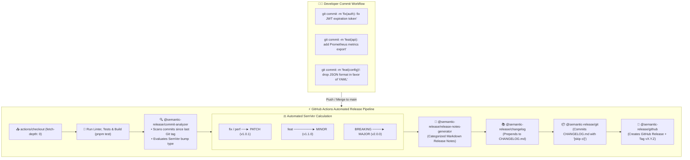

<!-- markdownlint-disable MD013 -->
# Mini-Project 03: Semantic Release and Automated Changelog

> **Domain**: 05. CI/CD Pipelines  
> **Level**: Beginner to Intermediate  
> **Infrastructure**: Cloud (GitHub Actions) / Local (Node.js & pnpm)  

---

## 🎯 Overview & Context

In modern Site Reliability Engineering (SRE) and DevOps practices, **Release Engineering** is the discipline of transforming verified code commits into consumable, versioned software artifacts. Traditionally, releasing software was a manual, error-prone task: engineers had to manually decide version numbers, remember which bug fixes were included, edit `CHANGELOG.md` files by hand, tag Git commits, and draft release notes on GitHub.

Manual release processes suffer from severe vulnerabilities:

- **Human Error & Inconsistent Versioning**: Breaking changes mistakenly released as patch updates break downstream production consumers.
- **Out-of-Sync Documentation**: Changelog files become neglected or inaccurate.
- **Release Bottlenecks**: Software updates get delayed because releasing requires human intervention and approvals.

**Semantic Release** solves these challenges by turning releases into an automated, non-human decision based entirely on structured **Conventional Commits**.



---

## 🧠 Deep-Dive: Semantic Release & Conventional Commits Internals

### 1. Semantic Versioning (SemVer 2.0.0) Rules

Semantic Versioning formalizes software version numbers as three integers separated by dots: **`MAJOR.MINOR.PATCH`** (e.g. `2.4.1`):

$$\text{Version} = \underbrace{\text{MAJOR}}_{\text{Breaking Changes}} \,.\, \underbrace{\text{MINOR}}_{\text{New Features (Backwards-Compatible)}} \,.\, \underbrace{\text{PATCH}}_{\text{Bug Fixes \& Patches}}$$

1. **`PATCH` (+0.0.1)**: Incremented when backwards-compatible bug fixes or performance optimizations are applied.
2. **`MINOR` (+0.1.0)**: Incremented when new, backwards-compatible functionality is introduced.
3. **`MAJOR` (+1.0.0)**: Incremented when breaking API changes, deprecations, or incompatible contract alterations are made.

---

### 2. The Conventional Commits Specification

To automate SemVer calculations, developers structure commit messages using the **Conventional Commits 1.0.0** standard:

$$\text{Format:} \quad \mathbf{\text{type}}(\text{optional-scope}): \quad \text{description}$$

```text
feat(metrics): add Prometheus latency histogram exporter (#104)
│    │        │
│    │        └─► Concise summary in imperative mood
│    └──────────► Scope: Subsystem or package affected
└───────────────► Type: feat, fix, perf, docs, chore, etc.
```

#### Mapping Commit Types to Release Bumps

| Commit Pattern | Intent & Example | SemVer Bump | Triggered Release? |
| :--- | :--- | :--- | :--- |
| **`fix(...)`** / **`fix:`** | Patches a defect (`fix: prevent memory leak`) | **PATCH** (`+0.0.1`) | ✅ Yes |
| **`perf(...)`** / **`perf:`** | Performance improvement (`perf: optimize SQL query`) | **PATCH** (`+0.0.1`) | ✅ Yes |
| **`feat(...)`** / **`feat:`** | New functionality (`feat: add OAuth2 login`) | **MINOR** (`+0.1.0`) | ✅ Yes |
| **`feat!:`** or **`BREAKING CHANGE:`** | Incompatible breaking change (`feat!: drop v1 API`) | **MAJOR** (`+1.0.0`) | ✅ Yes |
| **`docs:`** | Documentation edits (`docs: update setup guide`) | None | ❌ No |
| **`chore:`** / **`test:`** / **`ci:`** | Maintenance, tests, or CI workflow updates | None | ❌ No |

---

### 3. The 5-Stage Semantic Release Plugin Lifecycle

When `semantic-release` executes in GitHub Actions, it invokes a pipeline of plugins in strict sequence:

```text
1. commit-analyzer        ──► Scans commit history, parses types, determines bump
2. release-notes-generator ──► Formats changelog markdown using conventional template
3. changelog              ──► Updates and writes CHANGELOG.md file
4. git                    ──► Commits updated CHANGELOG.md and package.json with [skip ci]
5. github                 ──► Pushes Git Tag (vX.Y.Z) & Publishes GitHub Release
```

Our project configures this pipeline in `.releaserc.json`:

```json
{
  "branches": ["main"],
  "plugins": [
    ["@semantic-release/commit-analyzer", { "preset": "conventionalcommits" }],
    ["@semantic-release/release-notes-generator", { "preset": "conventionalcommits" }],
    ["@semantic-release/changelog", { "changelogFile": "CHANGELOG.md" }],
    ["@semantic-release/git", { "assets": ["CHANGELOG.md", "package.json"], "message": "chore(release): ${nextRelease.version} [skip ci]" }],
    ["@semantic-release/github", { "assets": [{ "path": "dist/**", "label": "Distribution" }] }]
  ]
}
```

---

### 4. Preventing Infinite CI Loops with `[skip ci]`

When `@semantic-release/git` commits the updated `CHANGELOG.md` and `package.json` back to the `main` branch, that commit would normally trigger the GitHub Actions `on: push` workflow again, causing an infinite loop of releases!

To prevent this, Semantic Release appends **`[skip ci]`** to the commit message:

```text
chore(release): 1.1.0 [skip ci]
```

GitHub Actions inspects incoming commit messages and automatically skips workflow execution when `[skip ci]` or `[ci skip]` is present.

---

### 5. Critical Git History Requirement (`fetch-depth: 0`)

By default, `actions/checkout` executes a shallow clone (`git clone --depth=1`) containing only the latest commit. Semantic Release must inspect all commits since the last Git release tag to determine version increments.

Therefore, the workflow explicitly configures full history fetching:

```yaml
- name: 📥 Checkout Repository with Full Git History
  uses: actions/checkout@v4
  with:
    fetch-depth: 0
    token: ${{ secrets.GITHUB_TOKEN }}
```

---

## 📂 Project Structure

```text
05-ci-cd/03-semantic-release-automated-changelog/
├── .github/
│   └── workflows/
│       └── release.yml          # GitHub Actions Automated Release Workflow
├── src/
│   ├── commit-parser.ts         # Conventional Commits regex parser & tokenizer
│   ├── version-calculator.ts    # SemVer release calculator & markdown changelog generator
│   └── index.ts                 # Main library exports & CLI demo runner
├── tests/
│   ├── commit-parser.test.ts    # Unit tests for commit parsing & breaking change flags
│   ├── version-calculator.test.ts # Unit tests for SemVer calculations across scenarios
│   └── index.test.ts            # Integration tests for public exports
├── .eslintrc.json               # ESLint static code analysis configuration
├── .eslintignore                # Ignored paths for linter
├── .markdownlint.json           # Markdownlint rule configurations
├── .releaserc.json              # Semantic Release plugin pipeline configuration
├── tsconfig.json                # Strict TypeScript compiler configuration
├── package.json                 # Project dependencies, scripts, and release commands
├── simulate_commits.sh          # Local Conventional Commits simulation & testing script
├── cleanup.sh                   # Resource and temporary file teardown script
└── README.md                    # Comprehensive educational project guide
```

---

## 🛠️ The Sample Application: Conventional Release Engine

The project includes an educational TypeScript library implementing the core mechanics of Conventional Commits analysis:

1. **`parseCommitMessage(message)`**:
   Parses raw commit strings into structured tokens (`type`, `scope`, `description`, `isBreaking`, `breakingDescription`, `issueReferences`).
2. **`calculateNextRelease(currentVersion, commits)`**:
   Evaluates a batch of parsed commits against the current version string, determining whether the required release is `MAJOR`, `MINOR`, `PATCH`, or `NONE`.
3. **`generateReleaseNotes(version, commits)`**:
   Generates a structured, categorized Markdown changelog matching GitHub Release formatting.

---

## 🚀 Step-by-Step Execution Guide

### Prerequisites

Ensure the following tools are available on your system:

- **Node.js**: v18.0.0 or higher (`node --version`)
- **pnpm**: v9.0.0 or higher (`pnpm --version`)

---

### Method 1: Automated Local Simulation Runner (`simulate_commits.sh`)

The project includes an automated test runner script that simulates all Conventional Commit release scenarios locally without modifying your repository's Git history:

```bash
# Navigate to the mini-project directory
cd 05-ci-cd/03-semantic-release-automated-changelog

# Install dependencies with pnpm
pnpm install

# Run the local Conventional Commits simulation suite
./simulate_commits.sh
```

#### What the Simulation Runner Does

1. **Tooling Verification**: Verifies `node` and `pnpm` availability.
2. **Workflow & Config Validation**: Validates `.releaserc.json` and `.github/workflows/release.yml`.
3. **Quality Gate Execution**: Runs `pnpm lint` and `pnpm test` with Vitest.
4. **Scenario 1 (Patch Release)**: Analyzes `fix:` and `perf:` commits -> verifies `v1.0.0` $\rightarrow$ `v1.0.1`.
5. **Scenario 2 (Minor Release)**: Analyzes `feat:` commits -> verifies `v1.0.1` $\rightarrow$ `v1.1.0`.
6. **Scenario 3 (Major Release)**: Analyzes `feat!:` / `BREAKING CHANGE:` commits -> verifies `v1.1.0` $\rightarrow$ `v2.0.0`.
7. **Changelog Generation**: Generates and formats the categorized Markdown release notes.
8. **Summary Report**: Prints a colorized matrix of all tested release scenarios.

---

### Method 2: Running Dry-Run Semantic Release

To execute `semantic-release` in dry-run mode (which analyzes Git history and prints what release would be created without making any changes or network calls):

```bash
# Run dry-run release check
pnpm release:dry-run
```

---

### Method 3: Testing on GitHub

To trigger automated releases in production:

1. Push your repository to GitHub.
2. Create feature branches using Conventional Commits:
   - `git commit -m "feat(auth): add OAuth2 token validation"`
   - `git commit -m "fix(db): correct SQL pool connection leak (#42)"`
3. Open a Pull Request into `main` and squash-merge it.
4. Open the **Actions** tab on GitHub:
   - The **Semantic Release Automation** workflow will execute.
   - It analyzes the merged commits.
   - If release-triggering commits exist, it automatically creates a new Git Tag (e.g. `v1.1.0`), commits the updated `CHANGELOG.md`, and publishes the GitHub Release with formatted release notes and attached distribution assets!

---

## 🧪 Verification & Testing Criteria

### 1. Verify Code Quality & Type Safety

```bash
# Run ESLint static analysis
pnpm lint

# Run TypeScript compiler check
pnpm tsc --noEmit
```

### 2. Verify Unit Tests & Code Coverage

```bash
# Run Vitest unit tests with coverage
pnpm test:coverage
```

Expected Coverage Output:

```text
 % Coverage report from v8
-------------------|---------|----------|---------|---------|-------------------
File               | % Stmts | % Branch | % Funcs | % Lines | Uncovered Line #s 
-------------------|---------|----------|---------|---------|-------------------
All files          |   99.28 |    96.66 |     100 |   99.28 |                   
 commit-parser.ts  |     100 |      100 |     100 |     100 |                   
 index.ts          |   95.65 |       75 |     100 |   95.65 |                   
 version-calculator|     100 |    97.36 |     100 |     100 |                   
-------------------|---------|----------|---------|---------|-------------------
```

### 3. Verify Compiled Production Bundle

```bash
# Compile TypeScript to dist/
pnpm build

# Execute CLI demo
node dist/index.js
```

---

## 🧹 Cleanup & Teardown Guide

After testing, clean up all temporary test sandboxes, build outputs, and coverage files.

### Automated Cleanup via Script

The project provides a dedicated `cleanup.sh` script:

```bash
# Standard cleanup: removes dist/, coverage/, temp sandboxes, and logs
./cleanup.sh

# Full cleanup: also removes node_modules
./cleanup.sh --full
```

### Manual Cleanup Steps

If you prefer to perform cleanup manually:

```bash
# Remove build artifacts and temporary test sandboxes
rm -rf dist coverage .nyc_output .tmp_sandbox CHANGELOG.md

# (Optional) Remove node_modules
rm -rf node_modules
```

---

## 🛡️ Best Practices & SRE Takeaways

1. **Enforce Conventional Commits via Git Hooks & PR Linting**:
   Use tools like `commitlint` and GitHub Actions PR title validators to ensure developers write valid Conventional Commits before merging.
2. **Always Use Squash-and-Merge on Pull Requests**:
   Squash-merging PRs condenses messy intermediate WIP commits into a single, clean Conventional Commit on the `main` branch.
3. **Never Manually Tag or Modify Versions**:
   Once Semantic Release is implemented, eliminate manual `git tag` commands to prevent tag conflicts and release desynchronization.
4. **Use Granular GitHub Token Permissions**:
   Restrict the workflow's permissions to `contents: write`, `issues: write`, and `pull-requests: write` to maintain least privilege.
