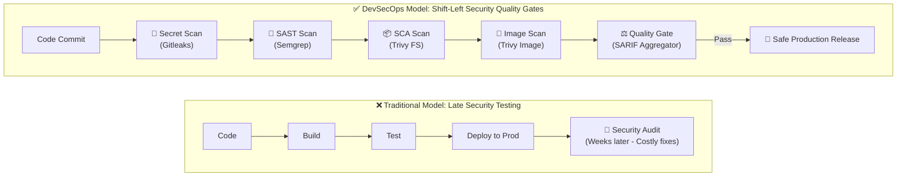
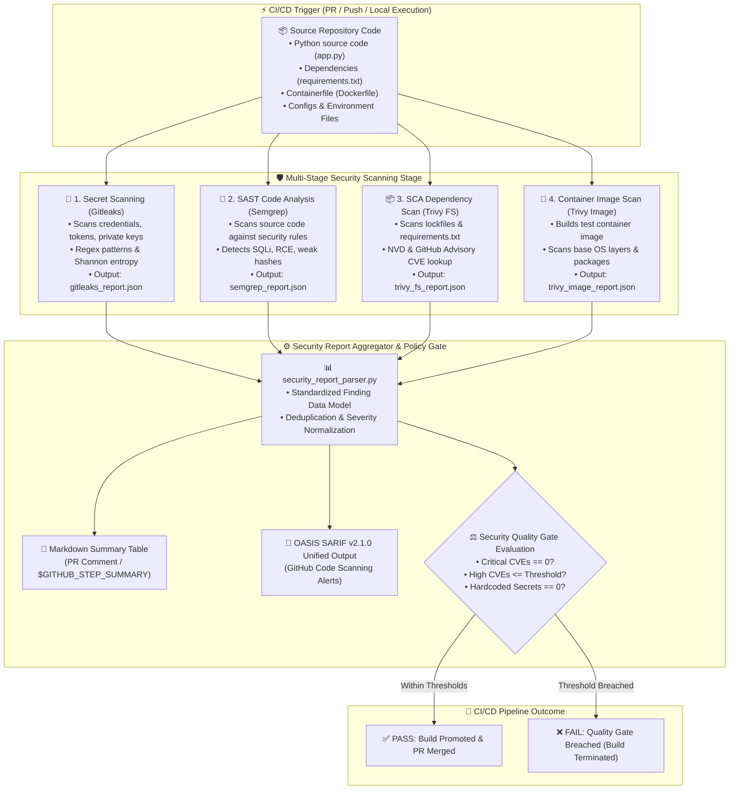

<!-- markdownlint-disable MD013 -->
# Mini-Project 04: Multi-Stage Security Scanning Pipeline

> **Domain**: 05. CI/CD Pipelines  
> **Level**: Beginner to Intermediate  
> **Infrastructure**: Cloud (GitHub Actions) / Local (OrbStack / Docker + Python 3)  

---

## 🎯 Overview & Context

In modern Cloud-Native Engineering and Site Reliability Engineering (SRE), **DevSecOps** is the practice of integrating automated security verification directly into the continuous integration and continuous delivery (CI/CD) lifecycle. Traditionally, security assessments occurred late in the software development lifecycle (right before production deployment or via quarterly external penetration tests). This reactive posture results in expensive emergency patches, production outages, data breaches, and severe technical debt.

**Shift-Left Security** moves vulnerability detection as close as possible to the developer's workstation and Pull Request (PR) stage. By catching security flaws during automated CI/CD builds, engineering teams resolve security bugs while code context is fresh and before artifacts ever reach staging or production environments.



---

## 🏗️ Architecture & Pipeline Flow

This mini-project implements an end-to-end, multi-stage automated security scanning pipeline combining three industry-standard open-source security engines:

1. **Gitleaks**: High-entropy and regex-based secret scanning to prevent hardcoded API keys, JWT secrets, and credentials from entering git history.
2. **Semgrep**: Fast, semantic Static Application Security Testing (SAST) using Abstract Syntax Tree (AST) pattern matching to detect code-level vulnerabilities (e.g. SQL Injection, Command Injection, weak cryptography).
3. **Trivy**: Comprehensive Software Composition Analysis (SCA) and Container Image Security scanning to detect known Common Vulnerabilities and Exposures (CVEs) in open-source dependencies and base container images.
4. **Security Report Parser & Quality Gate (`security_report_parser.py`)**: Python-based aggregator that unifies all scanner outputs into standard **OASIS SARIF v2.1.0** reports, renders GitHub Actions Markdown summaries, and enforces customizable security thresholds (blocking builds on Critical/High findings or leaked secrets).



---

## 🧠 Deep-Dive: Security Scanning Pillars

### 1. Secret Scanning with Gitleaks

- **The Problem**: Developers accidentally commit `.env` files, API tokens (AWS keys, GitHub PATs, Stripe private keys), or SSL certificates into Git repositories. Once committed, secrets persist in Git history even if deleted in a later commit.
- **How Gitleaks Works**: Gitleaks uses regular expressions combined with **Shannon Entropy** calculation. High entropy indicates random strings characteristic of cryptographically secure tokens.
- **Remediation**:
  - Store secrets in cloud vaults (e.g. AWS Secrets Manager, HashiCorp Vault, GitHub Encrypted Secrets).
  - Inject secrets into containers as environment variables at runtime, never baking them into source code or Docker images.

### 2. Static Application Security Testing (SAST) with Semgrep

- **The Problem**: Code-level flaws like SQL Injection (SQLi) and Remote Code Execution (RCE) arise when untrusted user input is directly evaluated or concatenated into SQL queries or system commands.
- **How Semgrep Works**: Unlike traditional grep tools that match simple strings, Semgrep constructs an **Abstract Syntax Tree (AST)** of the source code. It traces data flow and matches patterns semantically, recognizing that `cursor.execute(f"SELECT * FROM users WHERE name = '{user}'")` is an unsafe dynamic query regardless of variable naming or whitespace formatting.
- **CWE & OWASP Mapping**:
  - **CWE-89**: SQL Injection (OWASP Top 10 - A03:2021 Injection).
  - **CWE-78**: OS Command Injection (OWASP Top 10 - A03:2021 Injection).
  - **CWE-328**: Weak Cryptographic Hashing (MD5/SHA1).

### 3. Software Composition Analysis (SCA) & Container Scanning with Trivy

- **The Problem**: Over 80% of modern cloud-native applications consist of third-party open-source libraries and base container images. Outdated packages frequently contain publicly known CVEs that attackers exploit.
- **How Trivy Works**:
  - **Filesystem Scan (`trivy fs`)**: Analyzes `requirements.txt`, `package.json`, or `go.sum` and queries the Aqua Vulnerability Database, NVD, and GitHub Security Advisories.
  - **Image Scan (`trivy image`)**: Inspects compiled container image layers, Debian/Alpine packages, and installed OS libraries.
- **CVSS v3 Scoring**:
  - **CRITICAL (9.0 - 10.0)**: Remote unauthenticated code execution without user interaction.
  - **HIGH (7.0 - 8.9)**: Privilege escalation, sensitive data exposure.
  - **MEDIUM (4.0 - 6.9)**: Local denial of service, conditional authentication bypass.
  - **LOW (0.1 - 3.9)**: Minor information disclosure.

### 4. OASIS SARIF v2.1.0 Standard

**SARIF** (*Static Analysis Results Interchange Format*) is an OASIS standard JSON format supported by GitHub, GitLab, and Azure DevOps. By converting outputs from multiple security tools into a single SARIF file, the CI/CD pipeline uploads a unified security report directly into GitHub's **Security > Code scanning alerts** dashboard.

---

## 📁 Project Directory Structure

```text
05-ci-cd/04-multi-stage-security-scanning-pipeline/
├── .github/
│   └── workflows/
│       └── security.yml             # GitHub Actions multi-stage CI/CD security workflow
├── test_fixtures/
│   ├── app/                         # Vulnerable test application
│   │   ├── Dockerfile               # Outdated base image & root execution
│   │   ├── app.py                   # Intentional SAST flaws (SQLi, RCE, MD5)
│   │   └── requirements.txt         # Outdated packages with public CVEs
│   ├── secrets/                     # Synthetic test credentials
│   │   ├── config.py                # Dummy JWT secret & RSA private key
│   │   └── dummy_api_keys.env       # Dummy AWS, GitHub, Slack, Stripe tokens
│   └── secure_app/                  # Hardened compliant application
│       ├── Dockerfile               # Multi-stage, non-root user, minimal base
│       ├── app.py                   # Parameterized queries, safe subprocess, SHA-256
│       └── requirements.txt         # Patched, up-to-date dependencies
├── tests/
│   ├── fixtures/                    # Mock JSON reports for offline testing
│   │   ├── mock_gitleaks.json
│   │   ├── mock_semgrep.json
│   │   ├── mock_trivy_fs.json
│   │   └── mock_trivy_image.json
│   └── test_security_parser.py      # Python unittest suite for parser & SARIF generator
├── security_report_parser.py        # CLI report aggregator, SARIF builder & quality gate
├── run_security_scans.sh            # Local automated pipeline execution script
├── cleanup.sh                       # Resource and artifact teardown script
├── .markdownlint.json               # Markdownlint configuration
├── .gitignore                       # Git ignore rules for generated scan artifacts
└── README.md                        # Comprehensive educational documentation
```

---

## 🚀 Step-by-Step Hands-On Guide

### Prerequisites

Ensure you have the following installed on your workstation:

- **Docker** or **OrbStack** (to run containerized security scanners)
- **Python 3.8+** (to run the report parser and unit tests)

---

### Step 1: Run Automated Local Security Scans

The repository provides a complete local runner script (`run_security_scans.sh`) that pulls official scanner Docker images and executes the full four-stage security scan against both the vulnerable test fixtures and the hardened secure application:

```bash
./run_security_scans.sh
```

#### What Happens During Execution

1. **Phase A (Vulnerable Fixtures)**:
   - Gitleaks detects synthetic dummy credentials in `test_fixtures/secrets/`.
   - Semgrep flags SQL Injection and Command Injection in `test_fixtures/app/app.py`.
   - Trivy identifies critical CVEs in `test_fixtures/app/requirements.txt` and the vulnerable container image.
   - The Security Quality Gate calculates threshold breaches and **blocks the build**.
2. **Phase B (Hardened Secure App)**:
   - All scans run against `test_fixtures/secure_app/`.
   - Zero hardcoded secrets, zero SAST injection flaws, and zero critical CVEs are found.
   - The Security Quality Gate **passes with 100% compliance**.

---

### Step 2: Running Scanners Individually

If you wish to execute each security scanner manually in Docker:

#### Step 2.1: Secret Scanning with Gitleaks

```bash
docker run --rm -v "$(pwd):/repo" zricethezav/gitleaks:latest \
  detect --source="/repo/test_fixtures" --no-git \
  --report-format="json" --report-path="/repo/reports/gitleaks_report.json"
```

#### Step 2.2: SAST Code Scanning with Semgrep

```bash
docker run --rm -v "$(pwd):/src" semgrep/semgrep \
  semgrep scan --config="p/security-audit" --config="p/python" \
  --json --output="/src/reports/semgrep_report.json" /src/test_fixtures/app
```

#### Step 2.3: Dependency Vulnerability Scanning with Trivy

```bash
docker run --rm -v "$(pwd):/scan_root" aquasec/trivy:latest \
  fs --format json --output "/scan_root/reports/trivy_fs_report.json" \
  /scan_root/test_fixtures/app
```

#### Step 2.4: Container Image Scanning with Trivy

```bash
docker build -t vulnerable-test-app:latest ./test_fixtures/app

docker run --rm -v /var/run/docker.sock:/var/run/docker.sock -v "$(pwd):/scan_root" \
  aquasec/trivy:latest image --format json \
  --output "/scan_root/reports/trivy_image_report.json" vulnerable-test-app:latest
```

---

### Step 3: Aggregate Reports and Evaluate the Security Gate

Run the `security_report_parser.py` tool to aggregate scan results into a consolidated terminal summary, a Markdown report for PR comments, and an OASIS SARIF file:

```bash
python3 security_report_parser.py \
  --gitleaks reports/gitleaks_report.json \
  --semgrep reports/semgrep_report.json \
  --trivy-fs reports/trivy_fs_report.json \
  --trivy-image reports/trivy_image_report.json \
  --markdown-output reports/security_summary.md \
  --sarif-output reports/security_unified.sarif \
  --max-critical 0 \
  --max-high 0 \
  --max-secrets 0 \
  --fail-on-breach
```

#### Sample Terminal Output

```text
================================================================================
🛡️  MULTI-STAGE DEVSECOPS SECURITY SCAN REPORT & QUALITY GATE
================================================================================

📊 Findings Breakdown by Severity:
  • CRITICAL: 4 (Threshold limit: 0)
  • HIGH:     4 (Threshold limit: 0)
  • MEDIUM:   1
  • LOW/INFO: 0
  • TOTAL:    9

🔍 Findings Breakdown by Category:
  • 🔑 Secret Scanning (Gitleaks): 2 (Limit: 0)
  • 🔎 Static Code Analysis (Semgrep): 3
  • 📦 Software Composition (Trivy FS): 2
  • 🐳 Container Image (Trivy Image): 2

❌ QUALITY GATE FAILED: Policy threshold breaches detected:
  ✖ Critical vulnerabilities count (4) exceeds allowed threshold (0).
  ✖ High vulnerabilities count (4) exceeds allowed threshold (0).
  ✖ Hardcoded secrets count (2) exceeds allowed threshold (0).
```

---

### Step 4: Run the Python Unit Test Suite

The project includes unit tests verifying report parsing, secret masking, SARIF generation, and quality gate threshold calculations:

```bash
python3 -m unittest discover -s tests -p "test_*.py" -v
```

All 10 tests run offline using mock fixtures in `tests/fixtures/`.

---

## ⚙️ GitHub Actions CI/CD Integration

The repository includes a production-ready GitHub Actions workflow at `.github/workflows/security.yml`.

### Workflow Stages

1. **`secret-scan`**: Executes Gitleaks against repository commits and file changes.
2. **`sast-scan`**: Executes Semgrep rulesets `p/security-audit` and `p/python`.
3. **`sca-and-container-scan`**: Runs Trivy against filesystem dependencies and builds the application Docker container to check OS layers.
4. **`security-gate-and-report`**:
   - Aggregates all JSON reports using `security_report_parser.py`.
   - Posts a rich Markdown summary table to `$GITHUB_STEP_SUMMARY`.
   - Uploads `security_unified.sarif` to GitHub Code Scanning via `github/codeql-action/upload-sarif`.
   - Enforces the Quality Gate to block PR merges if critical issues exist.

---

## 🧹 Complete Resource Cleanup Guide

To maintain a clean and pristine development workstation, run the included `cleanup.sh` script after completing all tests:

```bash
./cleanup.sh --images
```

### Resources Removed by Cleanup Script

1. **Docker Containers**: Stops and removes any lingering Gitleaks, Semgrep, or Trivy containers.
2. **Docker Images**: Purges local test container images (`vulnerable-test-app:latest`, `secure-test-app:latest`, `test-app:local`).
3. **Report Files**: Deletes generated `reports/` directory containing JSON, SARIF, and Markdown logs.
4. **Python Caches**: Cleans `__pycache__` and `.pytest_cache` directories.

### Manual Cleanup Commands

If you prefer executing teardown commands manually:

```bash
# 1. Remove tagged test Docker images
docker rmi -f vulnerable-test-app:latest secure-test-app:latest test-app:local 2>/dev/null || true

# 2. Remove generated scan reports and caches
rm -rf reports downloaded_reports __pycache__ tests/__pycache__ *.sarif
```

---

## 🛡️ SRE & DevSecOps Best Practices Checklist

- [x] **Shift-Left**: Run security scanners on pull requests before code is merged into `main`.
- [x] **Never Commit Secrets**: Use pre-commit hooks or CI secret scanners with Shannon entropy analysis.
- [x] **Non-Root Containers**: Always configure `USER 10001:10001` in Dockerfiles (Principle of Least Privilege).
- [x] **Pin Dependencies**: Use precise dependency lockfiles and automate security patch updates (e.g. Dependabot / Renovate).
- [x] **Parameterized Queries**: Always use parameterized placeholders for SQL statements to eliminate SQL injection.
- [x] **Safe Subprocess Calls**: Never pass `shell=True` with user input; provide argument lists instead.
- [x] **Export SARIF**: Standardize security alerts across all tools using OASIS SARIF v2.1.0 for unified dashboard reporting.
