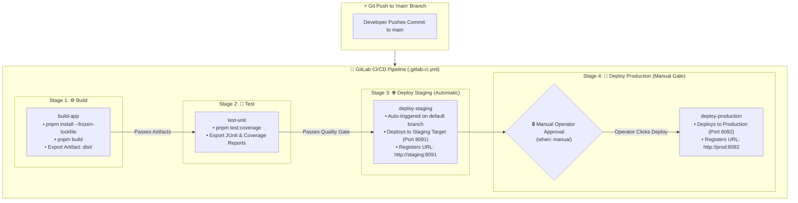

<!-- markdownlint-disable MD013 -->
# Mini-Project 05: GitLab CI Multi-Environment Delivery Pipeline

> **Domain**: 05. CI/CD Pipelines  
> **Level**: Beginner to Intermediate  
> **Infrastructure**: Cloud (GitLab.com Free Tier) / Local (Docker & Node.js)  

---

## 🎯 Overview & Context

In enterprise DevOps and Site Reliability Engineering (SRE), deploying software directly to production upon every commit introduces significant operational risk. To mitigate outages and ensure high availability, organizations employ **Multi-Environment Delivery Pipelines**:

1. **Development & CI**: Code is continuously built, linted, and tested.
2. **Staging (Pre-Production)**: Code that passes tests is **automatically deployed** to an isolated staging environment that mirrors production architecture, allowing automated smoke tests and QA verification.
3. **Production**: Deploying to production is protected by a **Manual Approval Gate** (`when: manual`), requiring an authorized operator or release engineer to explicitly approve the release after reviewing staging performance.

This mini-project demonstrates how to implement an enterprise **GitLab CI/CD Delivery Pipeline** (`.gitlab-ci.yml`) managing build artifacts, test quality gates, automatic staging deployment, environment URL registration, and manual-gated production releases.



---

## 🧠 Deep-Dive: GitLab CI/CD Architecture & Mechanics

### 1. The 4-Stage Delivery Pipeline

GitLab CI executes stages sequentially. If any job in an earlier stage fails, subsequent stages are blocked:

```text
Pipeline (.gitlab-ci.yml)
 ├── 1. build              ──► Compiles TypeScript into dist/ artifacts
 ├── 2. test               ──► Runs unit test suite and asserts code coverage
 ├── 3. deploy-staging     ──► Automatic Continuous Deployment (Port 8091)
 └── 4. deploy-production  ──► Manual Operator Gate -> Production (Port 8092)
```

---

### 2. Passing Build Artifacts Between Stages (`dependencies`)

Each job in GitLab CI runs in an isolated runner container. To avoid rebuilding source code in every stage, the `build-app` job exports its compiled `dist/` directory as an artifact:

```yaml
build-app:
  stage: build
  script:
    - pnpm install --frozen-lockfile
    - pnpm build
  artifacts:
    name: "dist-${CI_COMMIT_SHORT_SHA}"
    paths:
      - 05-ci-cd/05-gitlab-ci-multi-environment-pipeline/dist/
    expire_in: 1 week
```

Subsequent deployment jobs specify `dependencies: [build-app]`, which instructs GitLab Runner to download the pre-compiled artifact bundle instantly.

---

### 3. Environment URL Tracking & Environments Dashboard

GitLab provides a dedicated **Deployments > Environments** dashboard to monitor active versions across infrastructure tiers:

```yaml
deploy-staging:
  stage: deploy-staging
  environment:
    name: staging
    url: http://127.0.0.1:8091
    on_stop: stop-staging
```

When this job completes:

- GitLab records a new deployment record under the `staging` environment.
- An **"Open Live URL"** button appears in the GitLab Web UI directly linking to `http://127.0.0.1:8091`.
- Operators can view deployment history, commit SHAs, and trigger rollbacks directly from the UI.

---

### 4. Manual Approval Gates (`when: manual`)

In compliance with SRE change management and separation of duties, production releases require human intervention:

```yaml
deploy-production:
  stage: deploy-production
  environment:
    name: production
    url: http://127.0.0.1:8092
  when: manual
  rules:
    - if: '$CI_COMMIT_BRANCH == $CI_DEFAULT_BRANCH'
```

- When the pipeline reaches Stage 4, `deploy-production` transitions into a **Waiting for Action** (blocked) state.
- The pipeline remains green, and production is not altered until an authorized engineer clicks the **▶ Play** button.

---

## 📂 Project Structure

```text
05-ci-cd/05-gitlab-ci-multi-environment-pipeline/
├── .gitlab-ci.yml           # GitLab CI/CD multi-environment pipeline manifest
├── src/
│   ├── app.ts               # Environment-aware HTTP request handlers (/healthz, /info)
│   └── server.ts            # Server bootstrap and graceful shutdown hooks
├── tests/
│   ├── app.test.ts          # Unit tests verifying staging vs production behavior
│   └── server.test.ts       # Server export integration tests
├── .eslintrc.json           # ESLint static code analysis configuration
├── .eslintignore            # Excluded linter paths
├── .markdownlint.json       # Markdownlint rules configuration
├── .gitignore               # Git ignored patterns
├── Dockerfile               # Production container image definition
├── .dockerignore            # Build context exclusions
├── tsconfig.json            # Strict TypeScript configuration
├── package.json             # Dependencies, scripts, and runtime commands
├── deploy_mock.sh           # Zero-downtime multi-environment deployment script
├── run_gitlab_pipeline.sh   # Automated local GitLab CI pipeline test runner
├── cleanup.sh               # Environment and container teardown script
└── README.md                # Comprehensive educational project guide
```

---

## 🛠️ The Sample Application: Environment-Aware Microservice

The included microservice dynamically configures its runtime behavior according to the deployment tier:

- **`GET /`**: Returns welcoming message, active tier (`staging` vs `production`), and version.
- **`GET /healthz`**: Liveness and readiness probe used by deployment scripts for zero-downtime smoke tests.
- **`GET /info`**: Returns detailed metadata including `environment`, `port`, `node_version`, `commit_sha`, and timestamps.
- **`GET /version`**: Returns semantic version string.

---

## 🚀 Step-by-Step Execution Guide

### Prerequisites

Ensure the following tools are available on your system:

- **Node.js**: v18.0.0 or higher (`node --version`)
- **pnpm**: v9.0.0 or higher (`pnpm --version`)
- **Docker**: v24.0.0 or higher (`docker --version`)
- **curl**: Standard CLI HTTP client

---

### Method 1: Automated Local Pipeline Runner (`run_gitlab_pipeline.sh`)

The project includes an automated test runner script that simulates all 4 stages of the GitLab CI pipeline locally:

```bash
# Navigate to the mini-project directory
cd 05-ci-cd/05-gitlab-ci-multi-environment-pipeline

# Install dependencies with pnpm
pnpm install

# Run the complete local GitLab CI pipeline simulation
./run_gitlab_pipeline.sh
```

#### What the Local Pipeline Runner Does

1. **Prerequisite Check**: Validates `pnpm`, `node`, `docker`, and `curl`.
2. **Manifest Schema Validation**: Confirms stages, environment definitions, and `when: manual` triggers in `.gitlab-ci.yml`.
3. **Stage 1 (`build`)**: Runs `pnpm lint` and `pnpm build`, compiling artifacts into `dist/`.
4. **Stage 2 (`test`)**: Executes unit tests with coverage reporting (`pnpm test:coverage`).
5. **Stage 3 (`deploy-staging`)**: Automatically deploys the staging container (`app-staging`) on port `8091` and runs post-deployment smoke tests.
6. **Stage 4 (`deploy-production`)**: Simulates the operator manual approval gate, deploys the production container (`app-production`) on port `8092`, and verifies health.
7. **Summary Report**: Prints active environment URLs and verification status.

---

### Method 2: Manual Deployment by Environment Target

You can also run individual environment deployments using `deploy_mock.sh`:

```bash
# Compile latest code
pnpm build

# Deploy to Staging (Port 8091)
./deploy_mock.sh staging 8091

# Verify Staging endpoint
curl -s http://127.0.0.1:8091/info

# Deploy to Production (Port 8092)
./deploy_mock.sh production 8092

# Verify Production endpoint
curl -s http://127.0.0.1:8092/info
```

---

### Method 3: Testing on GitLab.com

To run the pipeline on GitLab's cloud runners:

1. Push your repository to a project on [GitLab.com](https://gitlab.com).
2. Navigate to **Build > Pipelines** in the left sidebar.
3. Observe the pipeline running `build-app`, `test-unit`, and `deploy-staging` automatically.
4. Once staging completes, navigate to **Deployments > Environments** to view the active Staging URL.
5. In the pipeline graph, click the **▶ Play** button on the `deploy-production` job to approve the production release!

---

## 🧪 Verification & Testing Criteria

### 1. Verify Unit Tests & Code Quality

```bash
# Run ESLint static analysis
pnpm lint

# Run unit tests with code coverage report
pnpm test:coverage
```

### 2. Verify Live Environment Endpoints

```bash
# Check Staging Health & Metadata (Port 8091)
curl -s http://127.0.0.1:8091/healthz
curl -s http://127.0.0.1:8091/info

# Check Production Health & Metadata (Port 8092)
curl -s http://127.0.0.1:8092/healthz
curl -s http://127.0.0.1:8092/info
```

Expected Output from `GET /info` on Staging:

```json
{
  "service": "multi-env-delivery-service",
  "environment": "staging",
  "version": "1.0.0",
  "commit_sha": "local-test",
  "port": 8080,
  "node_version": "v20.20.2",
  "timestamp": "2026-08-21T22:42:08.146Z"
}
```

---

## 🧹 Cleanup & Teardown Guide

After testing, clean up all running Docker containers, images, and build files to keep your environment pristine.

### Automated Cleanup via Script

The project provides a dedicated `cleanup.sh` script:

```bash
# Standard cleanup: stops staging and production containers, removes dist/ and reports
./cleanup.sh

# Full cleanup: also removes built Docker images and node_modules
./cleanup.sh --full
```

### Manual Cleanup Steps

If you prefer to perform cleanup manually:

```bash
# 1. Stop and remove staging and production containers
docker rm -f app-staging app-production 2>/dev/null || true

# 2. Remove local built image
docker rmi multi-env-delivery-app:local 2>/dev/null || true

# 3. Remove build artifacts and deployment records
rm -rf dist coverage .nyc_output deployment_report_*.json
```

---

## 🛡️ Best Practices & SRE Takeaways

1. **Always Use Manual Approval for Production**:
   Prevent unintended deployments by adding `when: manual` to production stages, accompanied by protected branch rules requiring authorized maintainer privileges.
2. **Register Environment URLs**:
   Use GitLab's `environment.url` property to provide immediate visibility into live deployment endpoints for automated smoke tests and manual QA audits.
3. **Implement Pre- and Post-Deployment Healthchecks**:
   Never assume a container is healthy just because `docker run` returned code 0. Always probe `/healthz` endpoints before marking a deployment successful.
4. **Use Immutable Build Artifacts**:
   Build your application code once in the `build` stage and pass the compiled `dist/` artifacts downstream to ensure identical binaries are deployed to staging and production.
