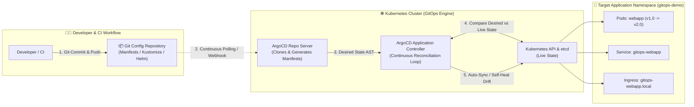
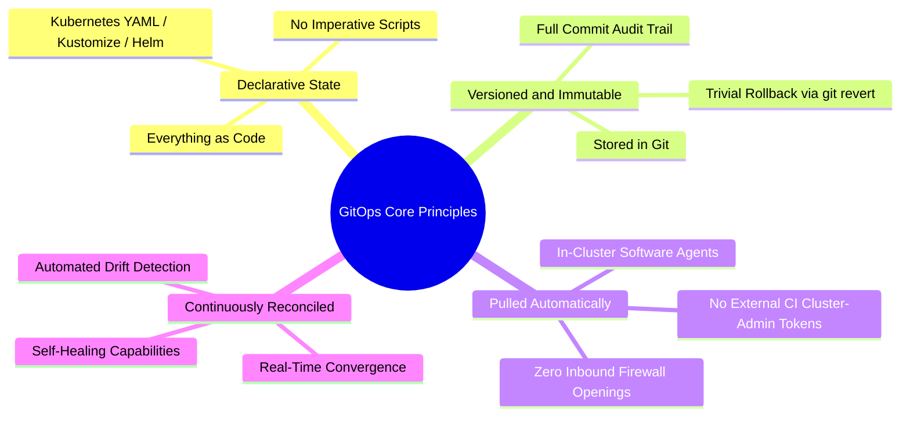
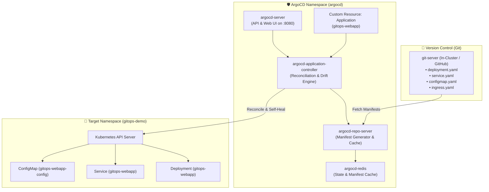
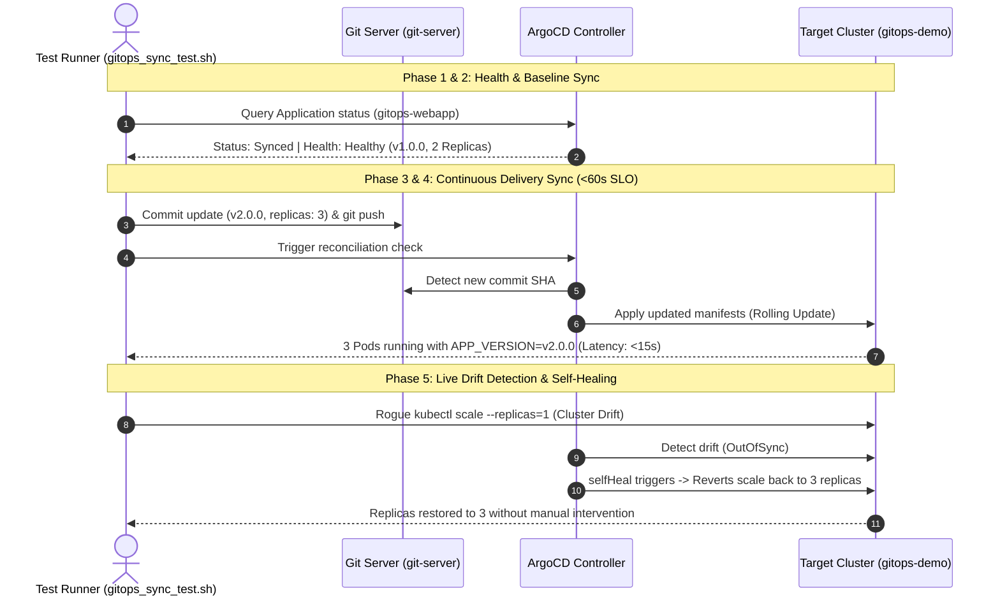

<!-- markdownlint-disable MD013 MD033 MD051 MD060 -->
# Mini-Project 06: GitOps Continuous Delivery with ArgoCD

> **Domain**: 05. CI/CD Pipelines  
> **Level**: Intermediate to Advanced  
> **Infrastructure**: Local (K3d / K3s / OrbStack / Minikube + ArgoCD v2.13+) or Cloud (GCP GKE / AWS EKS)

---

## 🎯 Overview & Educational Context

In traditional CI/CD workflows, continuous deployment tools use a **"Push-based"** model: an external CI runner (e.g., Jenkins, GitLab CI, GitHub Actions) holds direct cluster administration credentials and pushes changes to Kubernetes via `kubectl apply` or Helm commands.

While intuitive for small teams, push-based pipelines present major operational, reliability, and security challenges:

- **Security Risks**: External CI runners require wide administrative credentials (`cluster-admin`), dramatically enlarging the cluster attack surface.
- **Configuration Drift**: If an engineer manually edits a resource using `kubectl edit` or scales replicas during an emergency, the live cluster diverges from source control without alerting the team.
- **Complex Rollbacks**: Reverting a failed release requires triggering new CI jobs or executing manual rollbacks, increasing Mean Time to Recovery (MTTR).
- **Lack of Single Source of Truth**: Multiple developers or automated scripts can apply disparate changes, making auditability and compliance difficult.

**GitOps** solves these fundamental issues by inverting the model to a **"Pull-based"** architecture using **Git as the single source of truth** for both infrastructure and application definitions.



---

## 🧠 Core Principles of GitOps

According to the **OpenGitOps** standard, a system is truly operating under GitOps when it adheres to four fundamental principles:



1. **Declarative**: The entire system state (deployments, services, ingress, configuration) is described declaratively (e.g., Kubernetes YAML, Kustomize, Helm).
2. **Versioned and Immutable**: The desired state is stored in version control (Git), providing complete auditability, commit provenance, and instant rollback capability via `git revert`.
3. **Pulled Automatically**: Software agents running *inside* the target cluster continuously pull the desired state from Git, eliminating the need to expose cluster API endpoints or credentials to external CI platforms.
4. **Continuously Reconciled**: The GitOps engine monitors live cluster state, detects drift, alerts operators (`OutOfSync`), and automatically reconciles (`selfHeal`) the live environment to match Git.

---

## 🏗️ ArgoCD Architecture Deep-Dive

ArgoCD is implemented as a Kubernetes controller that continuously monitors running applications and compares the live state against the desired state defined in Git.



### Key ArgoCD Components

| Component | Role & Functionality |
| :--- | :--- |
| **`argocd-application-controller`** | Core background daemon that compares live state in etcd against desired state in Git, computes diffs, and triggers synchronization / self-healing. |
| **`argocd-repo-server`** | Clones Git repositories, extracts manifests, evaluates Kustomize/Helm overlays, and caches generated Kubernetes YAML. |
| **`argocd-server`** | Exposes the gRPC and REST APIs, serves the Web UI dashboard, and manages authentication and Role-Based Access Control (RBAC). |
| **`argocd-redis`** | In-memory key-value cache storing parsed Git manifests, repository tree states, and application health snapshots. |
| **`Application` CRD** | The primary Custom Resource Definition (`argoproj.io/v1alpha1`) binding a source Git repo + path to a target cluster + namespace. |

---

## 📂 Project Structure & Deliverables

```text
05-ci-cd/06-gitops-cd-argocd/
├── .markdownlint.json                 # Markdown linting configuration
├── package.json                       # Tooling scripts (pnpm lint:md, test, cleanup)
├── argocd_app.yaml                    # ArgoCD Application CRD (GitOps sync config)
├── config_repo/                       # Declarative Kubernetes application manifests
│   ├── kustomization.yaml             # Kustomize overlay definition
│   ├── deployment.yaml                # Production-ready web microservice Deployment
│   ├── service.yaml                   # ClusterIP Service manifest
│   ├── ingress.yaml                   # Ingress routing rules
│   └── configmap.yaml                 # Application configuration & feature flags
├── git-server/                        # Self-contained in-cluster Git repository service
│   ├── git-server.yaml                # Git HTTP daemon, ConfigMap seed & Service specs
│   └── kustomization.yaml             # Kustomize manifest for Git server
├── setup_gitops_cluster.sh            # Automated provisioning script (k3d, ArgoCD, Git server)
├── gitops_sync_test.sh                # End-to-end GitOps sync, drift detection & latency test suite
├── cleanup.sh                         # Complete teardown of cluster, containers, volumes & temp files
└── README.md                          # Comprehensive documentation & educational guide
```

---

## 🔍 Understanding the Declarative Manifests

### 1. The ArgoCD Application CRD (`argocd_app.yaml`)

The `Application` Custom Resource defines the GitOps contract between Git and Kubernetes:

```yaml
apiVersion: argoproj.io/v1alpha1
kind: Application
metadata:
  name: gitops-webapp
  namespace: argocd
  finalizers:
    # Cascading deletion: deleting the Application deletes deployed workloads
    - resources-finalizer.argocd.argoproj.io
spec:
  project: default
  source:
    # Git repository hosting the declarative manifests
    repoURL: http://git-server.gitops-system.svc.cluster.local:8080/repo.git
    targetRevision: HEAD
    path: .
  destination:
    # Target Kubernetes cluster and namespace
    server: https://kubernetes.default.svc
    namespace: gitops-demo
  syncPolicy:
    automated:
      prune: true      # Automatically delete resources removed from Git
      selfHeal: true   # Automatically revert unauthorized manual cluster modifications
      allowEmpty: false
    syncOptions:
      - CreateNamespace=true    # Automatically provision target namespace if missing
      - ApplyOutOfSyncOnly=true # Optimize sync by only patching modified resources
      - PruneLast=true
    retry:
      limit: 5
      backoff:
        duration: 5s
        factor: 2
        maxDuration: 1m
```

### 2. The Application Manifests (`config_repo/`)

- **`deployment.yaml`**: Configures a rolling update web frontend with 2 replicas, CPU/memory resource limits, security contexts (`drop: ALL`, `allowPrivilegeEscalation: false`), and readiness/liveness health probes.
- **`configmap.yaml`**: Injects environment variables (`APP_VERSION`, `APP_MESSAGE`, `FEATURE_ANALYTICS`) consumed directly by the application pods.
- **`service.yaml`**: Exposes the pods over internal port 80 via `ClusterIP`.
- **`ingress.yaml`**: Routes external HTTP traffic (`gitops-webapp.local`) to the service.

---

## ⚡ Quick Start: Step-by-Step Hands-On Guide

### Prerequisites

Ensure the following tools are installed on your workstation:

- **Docker**: Container runtime ([Docker Desktop](https://www.docker.com/), [OrbStack](https://orbstack.dev/), or Colima).
- **k3d**: Lightweight k3s cluster manager (`brew install k3d`).
- **kubectl**: Kubernetes command-line interface (`brew install kubectl`).
- **Node.js & pnpm** *(Optional)*: For running `pnpm lint:md`.

---

### Step 1: Provision the GitOps Cluster & ArgoCD

Run the automated provisioning script:

```bash
./setup_gitops_cluster.sh
```

What this script executes:

1. Creates an isolated local k3d Kubernetes cluster named `gitops-argocd-cluster`.
2. Deploys the in-cluster Git server in namespace `gitops-system` pre-seeded with the `config_repo` manifests.
3. Installs official ArgoCD control plane components into namespace `argocd`.
4. Waits for all pods and controllers to report `Ready`.
5. Applies `argocd_app.yaml` to register the `gitops-webapp` application.
6. Retrieves the generated ArgoCD `admin` credentials.

```text
======================================================================
  🎉 GitOps Environment Provisioning Complete!
======================================================================
  ArgoCD Web UI Access:
    • URL:      https://localhost:8080
    • Username: admin
    • Password: <auto-generated-password>
```

---

### Step 2: Access the ArgoCD Web Dashboard

To explore the visual dashboard:

1. Forward the ArgoCD UI port:

   ```bash
   kubectl port-forward -n argocd svc/argocd-server 8080:443
   ```

2. Open `https://localhost:8080` in your web browser (accept the self-signed certificate).
3. Log in with:
   - **Username**: `admin`
   - **Password**: Retrieve with:

     ```bash
     kubectl -n argocd get secret argocd-initial-admin-secret -o jsonpath="{.data.password}" | base64 -d
     ```

You will see the `gitops-webapp` application card showing **Synced** and **Healthy**!

---

### Step 3: Run the Automated GitOps Sync & Drift Test Suite

Execute the complete end-to-end verification suite:

```bash
./gitops_sync_test.sh
```

The test runner rigorously verifies 5 core operational phases:



Sample output:

```text
======================================================================
  🧪 ArgoCD GitOps Continuous Delivery & Self-Healing Test Suite
======================================================================
▶ [Phase 1/5] Checking Kubernetes Cluster & ArgoCD Status...
  [PASS] Kubernetes Cluster Connectivity Node(s) responsive
  [PASS] ArgoCD Application Controller Pod is Ready
  [PASS] In-Cluster Git Server Git repository service responsive
  [PASS] ArgoCD Application CRD (gitops-webapp) Application registered

▶ [Phase 2/5] Verifying Baseline Deployment & Sync State...
  [PASS] Baseline GitOps State Status: Synced | Health: Healthy
  [PASS] Baseline Workload Verification Replicas: 2, Version: v1.0.0, Image: nginx:1.27-alpine

▶ [Phase 3/5] Simulating GitOps Commit: Updating Application to v2.0.0 & Scaling to 3 Replicas...
  [✓] Git commit pushed: a9b3e1f (feat(release): upgrade webapp to v2.0.0 and scale replicas to 3)

▶ [Phase 4/5] Measuring ArgoCD Reconciliation Latency (SLO: < 60s)...
  [PASS] GitOps Continuous Delivery Reconciliation Reconciled in 8s (SLO target: <= 60s)

▶ [Phase 5/5] Testing Cluster Drift Detection & Self-Healing (selfHeal: true)...
  [Drift Injection] Manually scaling live deployment in cluster to 1 replica...
  [PASS] Automated Drift Self-Healing Restored replicas 1 -> 3 in 6s without human intervention
  [PASS] Target Microservice Pod Health 3/3 pods Ready in namespace gitops-demo

======================================================================
  📊 ArgoCD GitOps Verification Summary Report
======================================================================
  • Total Test Steps:       8
  • Tests Passed:           8
  • Tests Failed:           0
  • GitOps Sync Latency:    8s (SLO Target: < 60s)
  • Drift Recovery Latency: 6s
  • Active Version:         v2.0.0
  • Active Pod Replicas:    3
  • Detailed JSON Report:   05-ci-cd/06-gitops-cd-argocd/.tmp_sandbox/test-results.json
======================================================================

✨ ALL GITOPS PIPELINE TESTS PASSED SUCCESSFULLY!
```

---

## 🧹 Complete Environment Cleanup & Teardown

To ensure complete hygiene and leave your workstation pristine for subsequent mini-projects, execute the provided `cleanup.sh` script:

```bash
./cleanup.sh
```

### What `cleanup.sh` Cleans Up

1. **Background Processes**: Kills any active `kubectl port-forward` tunnels for ArgoCD, Git Server, or the web application.
2. **Kubernetes Resources**: Deletes the `gitops-webapp` Application CRD (triggering finalizer cascade), followed by namespaces `gitops-demo`, `gitops-system`, and `argocd`.
3. **k3d Cluster**: Permanently deletes the k3d cluster `gitops-argocd-cluster`.
4. **Docker Containers & Volumes**: Purges all associated container instances, local volume storage mounts, and bridge networks created by k3d.
5. **Local Temporary Sandboxes**: Removes all temporary files, logs, and cached manifests inside `.tmp_sandbox/`.

### Manual Cleanup Verification

Verify that no leftover Docker containers, volumes, or k3d clusters remain:

```bash
# Verify no k3d clusters exist
k3d cluster list

# Verify no orphaned containers remain
docker ps --filter "name=gitops-argocd"

# Verify no orphaned Docker volumes remain
docker volume ls --filter "name=gitops-argocd"
```

---

## 🛠️ Troubleshooting Guide & FAQ

### 1. `setup_gitops_cluster.sh` fails with port conflict on 8080

**Cause**: Another local service (e.g., local proxy, alternative web server) is already listening on host port 8080.  
**Fix**: Stop the conflicting process or modify the port mapping in `setup_gitops_cluster.sh`:

```bash
lsof -i :8080
kill -9 <PID>
```

### 2. Application stays in `OutOfSync` state

**Cause**: Auto-sync may be delayed or waiting for repository polling interval (default 3 minutes).  
**Fix**: Force an instant hard refresh using kubectl:

```bash
kubectl -n argocd annotate application gitops-webapp argocd.argoproj.io/refresh="hard" --overwrite
```

### 3. Modifying resources manually doesn't self-heal

**Cause**: `selfHeal: true` is required under `spec.syncPolicy.automated` in `argocd_app.yaml`.  
**Fix**: Verify your Application manifest contains:

```yaml
spec:
  syncPolicy:
    automated:
      selfHeal: true
```

---

## 📖 Key Takeaways & Best Practices

1. **Single Source of Truth**: All configuration must live in Git. Never apply emergency fixes directly with `kubectl edit` in production without committing to Git.
2. **Eliminate CI Cluster Credentials**: CI pipelines should only build container images, run automated tests, and push updated image tags into the GitOps repository. The in-cluster GitOps agent pulls changes safely.
3. **Automate Drift Detection & Remediation**: Configure `selfHeal: true` to prevent configuration drift caused by operator error or manual overrides.
4. **Declarative Everything**: Even the ArgoCD `Application` resources themselves can be managed by ArgoCD using the **App-of-Apps** or **ApplicationSet** pattern.
