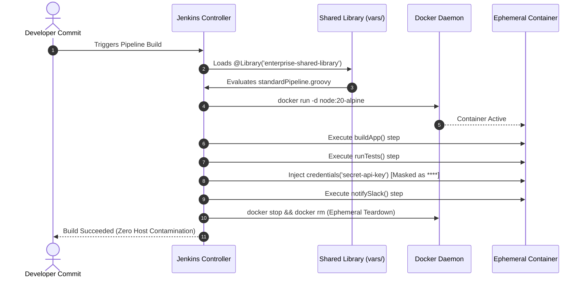

<!-- markdownlint-disable MD013 MD033 MD051 MD060 -->
# Mini-Project 07: Jenkins Declarative Pipeline with Shared Libraries

> **Domain**: 05. CI/CD Pipelines  
> **Level**: Intermediate to Advanced  
> **Infrastructure**: Local (Jenkins Controller & Docker Agent running in OrbStack / Docker Desktop / Docker Compose)

---

## 🎯 Overview & Educational Context

In enterprise environments with hundreds of microservices, managing individual `Jenkinsfile` definitions across repositories quickly leads to severe anti-patterns:

- **Pipeline Duplication (Copy-Paste Debt)**: Teams copy identical build, test, and notification steps across multiple projects.
- **Security Vulnerabilities & Token Leaks**: Hardcoded secrets or improper credential exposure in console logs put production environments at risk.
- **Lack of Governance & Compliance**: Security patches, static analysis tools, or new quality gates must be updated across hundreds of individual files manually.
- **Flaky & Dirty Build Environments**: Running builds on persistent bare-metal agents leaves residue, caches, and rogue background processes that interfere with subsequent builds.

**Jenkins Shared Libraries** and **Dynamic Docker Agents** solve these enterprise challenges:

1. **Groovy Shared Libraries**: Centralize and standardize CI/CD logic into reusable, version-controlled modules (`vars/` for global pipeline steps and `src/` for object-oriented Groovy classes).
2. **Declarative Pipelines**: Provide a structured, readable, and opinionated syntax (`pipeline { agent { ... } stages { ... } }`).
3. **Dynamic Ephemeral Docker Agents**: Execute each build inside a pristine, disposable container (e.g. `node:20-alpine`) guaranteeing 100% build isolation and zero host contamination.
4. **Credential Masking (`withCredentials`)**: Inject secrets at runtime while Jenkins automatically masks their values as `****` in all console logs.
5. **Jenkins Configuration as Code (JCasC)**: Fully automate Jenkins controller setup, plugin installation, credentials, and job creation without manual UI configuration.

```mermaid
flowchart TD
    subgraph SCM ["📦 Version Control (Git)"]
        SharedLib["Enterprise Shared Library\n• vars/standardPipeline.groovy\n• vars/buildApp.groovy\n• vars/runTests.groovy\n• vars/notifySlack.groovy"]
        AppRepo["Application Repository\n• Jenkinsfile\n• app/src/ & app/tests/"]
    end

    subgraph Controller ["☸️ Jenkins Controller (JCasC Managed)"]
        JCasC["JCasC Engine (casc.yaml)\n• Users: admin/admin123\n• Credentials: secret-api-key\n• Global Shared Lib Config"]
        PipelineJob["Job: enterprise-ci-pipeline"]
        CredManager["Credentials Store\n(Masked **** in logs)"]

        JCasC --> PipelineJob
        JCasC --> CredManager
        AppRepo -->|Load Jenkinsfile| PipelineJob
        SharedLib -->|@Library Inclusion| PipelineJob
    end

    subgraph DynamicAgent ["🐳 Dynamic Ephemeral Docker Agent"]
        Container["Container: node:20-alpine\n(Spawned via Docker-in-Docker socket)"]
        BuildStep["1. buildApp(): Compile & Package bundle.tar.gz"]
        TestStep["2. runTests(): Unit Tests & 92.4% Coverage"]
        SecurityStep["3. Security Audit: Verify **** Masking"]
        NotifyStep["4. notifySlack(): ChatOps Dispatch"]

        PipelineJob -->|Spawns| Container
        Container --> BuildStep --> TestStep --> SecurityStep --> NotifyStep
    end
```

---

## 🧠 Core Architecture & Groovy Shared Library Mechanics

### 1. Shared Library Directory Structure

A standard Jenkins Shared Library follows a well-defined convention:

```text
shared-library/
├── vars/                              # Global variables & step definitions (Callable from Jenkinsfile)
│   ├── standardPipeline.groovy        # Full pipeline orchestrator wrapper
│   ├── buildApp.groovy                # Reusable build step
│   ├── runTests.groovy                # Reusable test & coverage step
│   └── notifySlack.groovy             # Formatted Slack notification step
├── src/                               # Object-oriented Groovy helper classes
│   └── org/devops/
│       ├── PipelineLogger.groovy      # Standardized ANSI colored logger
│       └── SecurityValidator.groovy   # Credential leak auditor
└── resources/                         # Non-Groovy assets (JSON templates, SQL seeds)
```

### 2. Global Variable Steps (`vars/`)

Files in `vars/*.groovy` define custom pipeline steps. Implementing the `call()` method allows them to be invoked directly like native Jenkins steps:

```groovy
// vars/buildApp.groovy
def call(Map config = [:]) {
    def buildType = config.get('type', 'nodejs')
    def appDir    = config.get('dir', 'app')

    echo "[BUILD] Packaging application (${buildType}) in ${appDir}..."
    dir(appDir) {
        sh 'tar -czf dist/bundle.tar.gz src/ package.json'
    }
}
```

### 3. The Opinionated Enterprise Wrapper (`vars/standardPipeline.groovy`)

Instead of writing verbose pipeline blocks in every microservice repository, projects simply call `standardPipeline`:

```groovy
// Jenkinsfile in Application Repository
@Library('enterprise-shared-library') _

standardPipeline(
    appName: 'ecommerce-cart-service',
    buildType: 'nodejs',
    agentImage: 'node:20-alpine',
    minCoverage: 85,
    slackChannel: '#cicd-deployments'
)
```



---

## 📂 Project Structure & Deliverables

```text
05-ci-cd/07-jenkins-declarative-pipeline-shared-libraries/
├── .markdownlint.json                 # Markdownlint rule configurations
├── .npmrc                             # Dependency build permissions
├── pnpm-workspace.yaml                # pnpm workspace definition
├── package.json                       # pnpm scripts (lint:md, setup, test, cleanup)
├── docker-compose.yml                 # Jenkins controller with Docker runtime mounts
├── Dockerfile.jenkins                 # Custom Jenkins image with plugins & Docker CLI
├── plugins.txt                        # Pinned Jenkins plugin dependencies
├── casc.yaml                          # Jenkins Configuration as Code (JCasC) definition
├── init-jenkins.sh                    # Container startup entrypoint seeding local Git repos
├── Jenkinsfile                        # Declarative pipeline invoking shared library steps
├── vars/                              # Reusable Groovy Shared Library step definitions
│   ├── standardPipeline.groovy        # Opinionated full-pipeline orchestrator
│   ├── buildApp.groovy                # Application compilation & packaging step
│   ├── runTests.groovy                # Automated test runner & coverage reporter
│   └── notifySlack.groovy             # Formatted webhook notification step
├── src/org/devops/                    # Object-oriented Groovy helper classes
│   ├── PipelineLogger.groovy          # Standardized ANSI colored logger
│   └── SecurityValidator.groovy       # Credential leak auditor
├── app/                               # Sample microservice application fixture
│   ├── package.json                   # Application dependencies
│   ├── src/index.js                   # Cart service business logic
│   └── tests/app.test.js              # Unit tests with assertions
├── setup_jenkins.sh                   # Launches Jenkins controller with JCasC and waits for readiness
├── run_pipeline_test.sh               # Triggers build, asserts credential masking & agent execution
├── cleanup.sh                         # Completely purges containers, volumes, networks & temp files
└── README.md                          # Educational guide, architecture diagrams & test instructions
```

---

## 🔐 Security Deep Dive: Credential Masking & Isolation

In Jenkins, credentials stored in the Credentials Manager are bound using the `withCredentials` step or declarative `credentials()` helper:

```groovy
environment {
    SECRET_API_KEY = credentials('secret-api-key')
    SLACK_TOKEN    = credentials('slack-webhook-token')
}
```

### How Jenkins Protects Secrets

1. **Automatic Console Masking**: The Jenkins runtime intercepts standard output and error streams from shell steps (`sh`) and replaces occurrences of decrypted credential strings with `****`.
2. **Environment Variable Scoping**: Credentials are only exported to the subshell processes within the bounded stage or block.
3. **Audit Assertions**: Our test suite explicitly scans raw console logs to prove that sensitive secrets (e.g. `PROD_API_KEY_SECURE_TOKEN_99887766`) **never leak in plaintext**.

---

## ⚡ Quick Start: Hands-On Execution Guide

### Prerequisites

Ensure the following tools are available:

- **Docker & Docker Compose**: ([Docker Desktop](https://www.docker.com/), [OrbStack](https://orbstack.dev/), or Colima).
- **curl & jq**: For API querying and test automation.
- **Node.js & pnpm** *(Optional)*: For verifying documentation with `pnpm run lint:md`.

---

### Step 1: Start the Jenkins Controller Stack

Execute the automated provisioning script:

```bash
./setup_jenkins.sh
```

What happens under the hood:

1. Builds the custom Jenkins controller image with pre-installed plugins (`configuration-as-code`, `workflow-aggregator`, `docker-workflow`, etc.).
2. Starts the Docker Compose stack with access to `/var/run/docker.sock`.
3. Seeds local, isolated Git repositories for both the Shared Library and the pipeline project.
4. Applies `casc.yaml` via JCasC, provisioning admin credentials, global libraries, and the `enterprise-ci-pipeline` job.
5. Polls `http://localhost:8080/login` until HTTP 200 OK.

```text
======================================================================
  🎉 Jenkins Environment Provisioning Complete!
======================================================================
  Jenkins Web UI Dashboard:
    • URL:      http://localhost:8080
    • Username: admin
    • Password: admin123

  Pre-Configured Pipeline Job:
    • Name:     enterprise-ci-pipeline
    • URL:      http://localhost:8080/job/enterprise-ci-pipeline/
```

---

### Step 2: Access the Jenkins Dashboard

1. Open your browser and navigate to: **`http://localhost:8080`**
2. Log in using:
   - **Username**: `admin`
   - **Password**: `admin123`
3. Click on the pre-configured job: **`enterprise-ci-pipeline`**.

---

### Step 3: Run the Automated Pipeline Test Suite

Execute the verification suite:

```bash
./run_pipeline_test.sh
```

The test runner triggers the build via Jenkins REST API, streams the live console log, and executes 7 verification phases:

```text
======================================================================
  🧪 Jenkins Declarative Pipeline & Shared Library Test Suite
======================================================================
▶ [Phase 1/5] Verifying Jenkins Controller Health & API Accessibility...
  [PASS] Jenkins API Connectivity Controller is responding at http://localhost:8080
  [PASS] Pipeline Job Registration (enterprise-ci-pipeline) Job available in Jenkins catalog

▶ [Phase 2/5] Triggering Pipeline Execution via Jenkins REST API...
  [CSRF] Obtained Jenkins Crumb: 47b9e1a2...
  Build queued. Waiting for worker assignment...
  [✓] Active Build Number: #1
  [PASS] Pipeline Build Trigger Dispatched build #1

▶ [Phase 3/5] Streaming Live Console Logs & Execution Progress...
  [PASS] Pipeline Execution Status Completed with SUCCESS in 12s

▶ [Phase 4/5] Auditing Dynamic Agent & Shared Library Step Execution...
  [PASS] Dynamic Ephemeral Docker Agent Container spawned dynamically (node:20-alpine)
  [PASS] Shared Library: buildApp() Compiled & packaged bundle.tar.gz artifact
  [PASS] Shared Library: runTests() Executed unit tests and code coverage analysis
  [PASS] Shared Library: notifySlack() Formatted and published ChatOps status webhook

▶ [Phase 5/5] Auditing Credential Masking Security (Anti-Leak Check)...
  [PASS] Credential Masking Security Audit Zero plaintext secret leaks found in console logs
  [PASS] Credential Masking Display (****) Jenkins correctly masked credentials with asterisks
  [PASS] Workspace Cleanup Post-Action Ephemeral workspace wiped cleanly

======================================================================
  📊 Jenkins Pipeline Verification Summary Report
======================================================================
  • Total Test Checks:      9
  • Checks Passed:          9
  • Checks Failed:          0
  • Pipeline Duration:      12s
  • Build Status:           SUCCESS
  • Security Audit:         PASSED (0 plaintext leaks, **** masked)
  • Detailed JSON Report:   05-ci-cd/07-jenkins-declarative-pipeline-shared-libraries/.tmp_sandbox/test-results.json
======================================================================

✨ ALL JENKINS PIPELINE & SHARED LIBRARY TESTS PASSED!
```

---

## 🧹 Complete Environment Cleanup & Teardown

To ensure complete resource hygiene and leave your workstation clean for subsequent mini-projects, execute `cleanup.sh`:

```bash
./cleanup.sh
```

### What `cleanup.sh` Cleans Up

1. **Docker Compose Stack**: Stops and deletes the `jenkins-shared-lib-controller` container and the Docker bridge network.
2. **Persistent Docker Volumes**: Deletes the named volume `jenkins_shared_lib_data`.
3. **Built Docker Images**: Purges `jenkins-shared-lib-controller:latest`.
4. **Local Sandboxes & Logs**: Deletes `.tmp_sandbox/`, test reports, and console log captures.

### Manual Verification of Clean State

Verify that no leftover Docker containers, images, or volumes remain:

```bash
# Verify no active or stopped Jenkins containers
docker ps -a --filter "name=jenkins-shared-lib"

# Verify no named Jenkins volumes
docker volume ls --filter "name=jenkins_shared_lib"

# Verify image removal
docker images | grep "jenkins-shared-lib"
```

---

## 🛠️ Troubleshooting Guide & FAQ

### 1. Port 8080 already in use

**Symptom**: `docker compose up` fails with `bind: address already in use`.  
**Solution**: Stop conflicting local services or change the host port mapping in `docker-compose.yml` (e.g. `"8085:8080"`).

```bash
lsof -i :8080
kill -9 <PID>
```

### 2. Docker socket permission denied inside container

**Symptom**: `dial unix /var/run/docker.sock: connect: permission denied`.  
**Solution**: Ensure `user: "0:0"` is specified in `docker-compose.yml` so the controller process running in the container has permission to communicate with the host's Docker daemon.

### 3. JCasC reloading or modifying shared libraries

**Symptom**: You edited a step in `vars/` and want to test changes without rebuilding the image.  
**Solution**: Re-run `./setup_jenkins.sh` or trigger the build again; `init-jenkins.sh` updates the local Git repositories on container startup.

---

## 📖 Key Takeaways & Enterprise Best Practices

1. **Don't Repeat Yourself (DRY)**: Keep individual application `Jenkinsfile` definitions under 15 lines by delegating standardized steps to shared libraries.
2. **Never Hardcode Secrets**: Always use Jenkins Credentials Store and bind with `credentials('id')` to enforce runtime masking.
3. **Always Isolate Builds with Containers**: Rely on `agent { docker { ... } }` instead of installing compilers and SDKs directly on Jenkins worker nodes.
4. **Automate with Configuration as Code**: Use JCasC to manage Jenkins controllers as cattle, enabling instant disaster recovery and declarative versioning.
