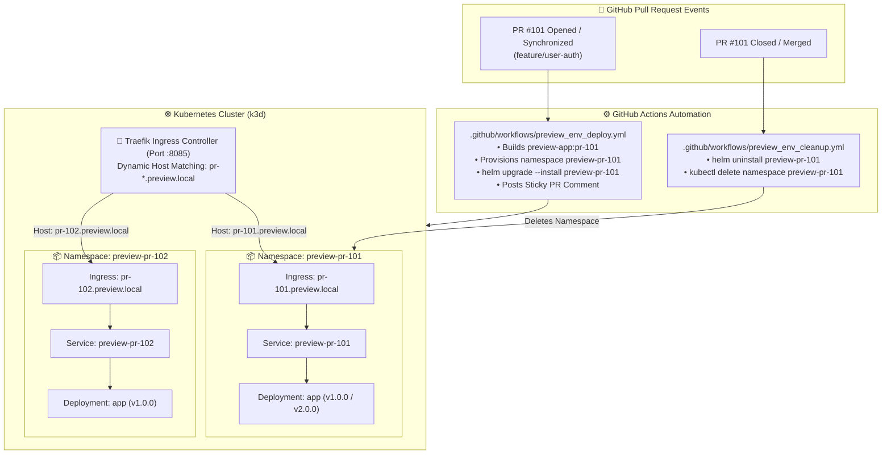
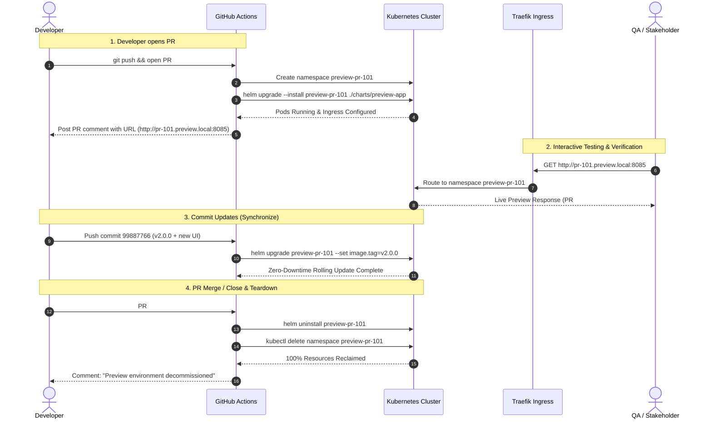

<!-- markdownlint-disable MD013 MD033 MD051 MD060 -->
# Mini-Project 08: Ephemeral Preview Environments per Pull Request

> **Domain**: 05. CI/CD Pipelines  
> **Level**: Intermediate to Advanced  
> **Infrastructure**: Local (K3s / K3d + Traefik Ingress + GitHub Actions Automation)

---

## 🎯 Overview & Educational Context

In traditional development workflows, engineering teams share a single **Staging** environment. This architecture creates severe friction:

- **Staging Bottlenecks**: Feature A blocks Feature B from being verified while waiting for QA or stakeholder feedback.
- **Merge Hell & Broken Staging**: A bug introduced by an unmerged feature breaks staging for all developers.
- **Delayed Product & UX Feedback**: Product managers and UI/UX designers cannot interact with live features until code merges into trunk.

**Ephemeral Preview Environments (also known as Review Apps)** solve these bottlenecks by automatically provisioning an isolated, full-stack instance of the application on Kubernetes for **every open Pull Request**, routed via unique subdomains (e.g. `pr-101.preview.local`):

1. **Instant On-Demand Deployment**: Opening a PR triggers CI to create a dedicated Kubernetes namespace and deploy a parameterized Helm release.
2. **Dynamic Ingress Routing**: The Ingress controller dynamically exposes `pr-<NUMBER>.preview.local` without manual DNS or proxy changes.
3. **Automatic Synchronization**: Pushing new commits updates the preview environment automatically via rolling updates.
4. **Guaranteed Teardown (Zero Waste)**: Closing or merging the PR immediately deletes the namespace, releasing 100% of compute and memory resources.



---

## 🧠 Core Architecture & Lifecycle Mechanics



---

## 📂 Project Structure & Deliverables

```text
05-ci-cd/08-ephemeral-preview-environments-pr/
├── .gitignore                         # Ignores sandboxes, kubeconfig, and node_modules
├── .markdownlint.json                 # Markdownlint configuration rules
├── .npmrc                             # Dependency build settings
├── package.json                       # pnpm scripts (lint:md, setup, test, cleanup)
├── pnpm-workspace.yaml                # pnpm workspace definition
├── .github/
│   └── workflows/
│       ├── preview_env_deploy.yml     # Automated PR provision & update workflow
│       └── preview_env_cleanup.yml    # Automated PR teardown workflow
├── charts/
│   └── preview-app/                   # Reusable Preview Environment Helm Chart
│       ├── Chart.yaml                 # Chart metadata definition
│       ├── values.yaml                # Default values (PR #, image tag, limits)
│       └── templates/
│           ├── _helpers.tpl           # Ingress host and naming helpers
│           ├── configmap.yaml         # PR metadata environment variables
│           ├── deployment.yaml        # Application workload deployment
│           ├── ingress.yaml           # Dynamic host matching Ingress rule
│           ├── service.yaml           # ClusterIP service
│           └── serviceaccount.yaml    # Least-privilege pod service account
├── app/                               # Sample Preview Web Microservice
│   ├── Dockerfile                     # Multi-stage Node.js container image
│   ├── package.json                   # App dependencies
│   └── server.js                      # HTTP server rendering PR info & health endpoints
├── setup_preview_cluster.sh           # Provisions local k3d cluster with Ingress (:8085)
├── test_pr_lifecycle.sh               # Simulates PR open/update/close and asserts routing
├── cleanup.sh                         # Completely purges k3d cluster, images & sandboxes
└── README.md                          # Educational guide, architecture diagrams & tutorial
```

---

## ⚙️ Helm Chart Design & Parameterization

The Helm chart (`charts/preview-app`) is designed for maximum parameterization across Pull Requests:

### Dynamic Ingress Routing Helper (`_helpers.tpl`)

```yaml
{{/* Resolve dynamic Ingress Host */}}
{{- define "preview-app.ingressHost" -}}
{{- if .Values.ingress.host }}
{{- .Values.ingress.host }}
{{- else }}
{{- printf "pr-%s.preview.local" (toString .Values.prNumber) }}
{{- end }}
{{- end }}
```

### Ingress Manifest (`ingress.yaml`)

```yaml
spec:
  ingressClassName: traefik
  rules:
    - host: {{ include "preview-app.ingressHost" . | quote }}
      http:
        paths:
          - path: /
            pathType: Prefix
            backend:
              service:
                name: {{ include "preview-app.fullname" . }}
                port:
                  number: 80
```

---

## ⚡ Quick Start: Hands-On Execution Guide

### Prerequisites

Ensure the following tools are installed:

- **Docker**: Daemon running ([Docker Desktop](https://www.docker.com/), [OrbStack](https://orbstack.dev/), or Colima).
- **k3d & kubectl**: For local Kubernetes clustering.
- **helm**: For package deployment.
- **curl & jq**: For API querying and test assertions.

---

### Step 1: Provision the Local Preview Cluster

Run the cluster bootstrap script:

```bash
./setup_preview_cluster.sh
```

What this script automates:

1. Creates a local k3d cluster named `preview-env-cluster` with Ingress port mapping `8085:80`.
2. Stores the cluster `kubeconfig.yaml` strictly inside `.tmp_sandbox/` (leaving your global `~/.kube/config` untouched).
3. Builds the `preview-app:v1.0.0` and `preview-app:v2.0.0` container images.
4. Directly imports the container images into the k3d cluster runtime.
5. Verifies Traefik Ingress controller readiness.

```text
======================================================================
  🎉 Preview Environment Cluster Provisioned Successfully!
======================================================================
  • Cluster Name:      preview-env-cluster
  • Ingress Endpoint:  http://localhost:8085
  • Subdomain Pattern: pr-<NUMBER>.preview.local
  • Local Kubeconfig:  05-ci-cd/08-ephemeral-preview-environments-pr/.tmp_sandbox/kubeconfig.yaml
```

---

### Step 2: Run the Automated PR Lifecycle Test Suite

Execute the lifecycle verification suite:

```bash
./test_pr_lifecycle.sh
```

The test runner executes 6 comprehensive lifecycle phases:

```text
======================================================================
  🧪 Ephemeral PR Preview Environments: Lifecycle Test Suite
======================================================================
▶ [Phase 1/6] Verifying Cluster Connectivity & Ingress Controller...
  [PASS] Kubernetes Cluster Connectivity k3d cluster active with isolated kubeconfig
  [PASS] Traefik Ingress Controller 1 ready replica(s) available on port 8085

▶ [Phase 2/6] Simulating PR #101 Creation (pull_request.opened)...
  [PASS] PR #101 Helm Deployment Release 'preview-pr-101' deployed to namespace 'preview-pr-101'
  [PASS] PR #101 Ingress Reachability (pr-101.preview.local) HTTP 200 OK (Commit: a1b2c3d4, Version: v1.0.0)

▶ [Phase 3/6] Simulating Concurrent PR #102 Creation (Multi-Tenancy Check)...
  [PASS] PR #102 Helm Deployment Release 'preview-pr-102' deployed to namespace 'preview-pr-102'
  [PASS] PR #102 Ingress Reachability (pr-102.preview.local) HTTP 200 OK (PR #102 active)
  [PASS] Multi-Tenant Namespace Isolation PR #101 and PR #102 routed independently without collision

▶ [Phase 4/6] Simulating PR #101 Update & Feature Flag (synchronize)...
  [PASS] PR #101 Zero-Downtime Update Updated to v2.0.0 (Commit: 99887766, New UI: true)
  [PASS] PR Isolation Post-Update PR #102 remained isolated on v1.0.0

▶ [Phase 5/6] Simulating PR #101 Merge/Close & Cleanup...
  [PASS] PR #101 Namespace Decommission Namespace 'preview-pr-101' completely deleted
  [PASS] PR #101 Ingress Route Decommission Route returns HTTP 404 (Traffic terminated)

▶ [Phase 6/6] Simulating PR #102 Close & Complete Reclamation...
  [PASS] Total Preview Resource Reclamation 0 preview namespaces remain active in cluster

======================================================================
  📊 Ephemeral PR Preview Environments Verification Summary
======================================================================
  • Total Lifecycle Checks: 11
  • Checks Passed:          11
  • Checks Failed:          0
  • Multi-Tenancy Status:   VERIFIED (Zero Route/Namespace Collisions)
  • Cleanup Verification:   PASSED (100% Resource Reclamation)
  • Detailed JSON Report:   05-ci-cd/08-ephemeral-preview-environments-pr/.tmp_sandbox/preview-test-results.json
======================================================================

✨ ALL EPHEMERAL PREVIEW LIFECYCLE TESTS PASSED!
```

---

### Step 3: Manual Testing & Ingress Header Probing

You can manually interact with preview environments using `curl` with the `Host` header:

```bash
# Export the local kubeconfig
export KUBECONFIG="$(pwd)/.tmp_sandbox/kubeconfig.yaml"

# Deploy an ad-hoc PR #205 preview environment
helm upgrade --install preview-pr-205 ./charts/preview-app \
  --namespace preview-pr-205 \
  --create-namespace \
  --set prNumber=205 \
  --set commitSha="feat123" \
  --set branchName="feature/dark-mode"

# Probe the live endpoint via Ingress
curl -s -H "Host: pr-205.preview.local" http://localhost:8085/api/info | jq .

# Clean up manual test
helm uninstall preview-pr-205 --namespace preview-pr-205
kubectl delete namespace preview-pr-205
```

---

## 🧹 Complete Environment Cleanup & Teardown

To ensure complete resource hygiene and leave your workstation clean for subsequent mini-projects, execute `cleanup.sh`:

```bash
./cleanup.sh
```

### What `cleanup.sh` Cleans Up

1. **k3d Kubernetes Cluster**: Completely deletes `preview-env-cluster` and its Docker network/loadbalancer.
2. **Local Application Images**: Removes `preview-app:v1.0.0` and `preview-app:v2.0.0`.
3. **Local Sandboxes**: Removes `.tmp_sandbox/`, `kubeconfig.yaml`, and test reports.

### Manual Verification of Clean State

```bash
# Verify no k3d clusters remain
k3d cluster list preview-env-cluster

# Verify no preview Docker images remain
docker images | grep "preview-app"

# Verify no leftover containers
docker ps -a --filter "name=k3d-preview-env-cluster"
```

---

## 🛠️ Troubleshooting Guide & FAQ

### 1. Ingress returns HTTP 404 for a newly created PR

**Symptom**: `curl -H "Host: pr-101.preview.local" http://localhost:8085` returns 404.  
**Cause**: The Traefik Ingress route takes 2-3 seconds to detect the new Ingress resource and sync its routing table.  
**Solution**: Re-try the request after 3 seconds or verify that the Ingress resource exists: `kubectl get ingress -n preview-pr-101`.

### 2. Port 8085 is already bound on the host

**Symptom**: `k3d cluster create` fails with `port 8085 already in use`.  
**Solution**: Specify an alternate port using the `--port` flag:

```bash
./setup_preview_cluster.sh --port 8090
./test_pr_lifecycle.sh --port 8090
```

### 3. Namespace deletion hangs in Terminating state

**Symptom**: `kubectl get ns` shows `preview-pr-101 Terminating`.  
**Cause**: Lingering finalizers or unresponsive resources within the namespace.  
**Solution**: Ensure Helm release is uninstalled first (`helm uninstall preview-pr-101 -n preview-pr-101`) before deleting the namespace.

---

## 📖 Key Takeaways & Enterprise Best Practices

1. **Namespace-per-PR Pattern**: Isolates network policies, resource quotas, secrets, and role bindings per Pull Request.
2. **Dynamic Ingress Naming**: Using predictable URL patterns (`pr-<NUMBER>.domain.com`) enables automated link posting in CI comments.
3. **Strict Resource Quotas**: Always enforce CPU and memory limits on preview pods (`resources.limits`) to prevent runaway resource consumption across dozens of open PRs.
4. **Automated TTL Garbage Collection**: In production, install a Kubernetes TTL controller (like [kube-janitor](https://codeberg.org/hjacobs/kube-janitor)) to automatically reap preview namespaces older than 72 hours even if PR webhook events are missed.
