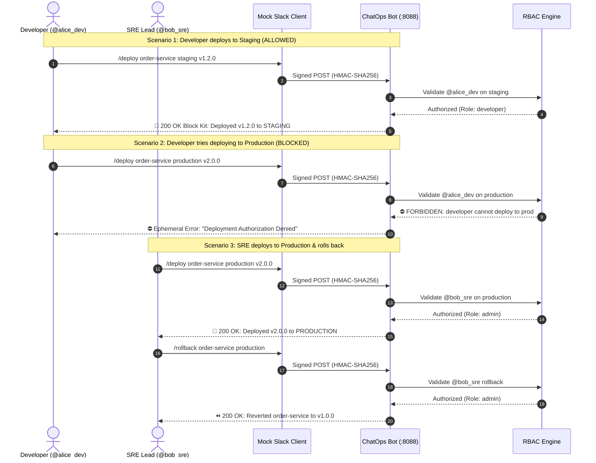

<!-- markdownlint-disable MD013 MD033 MD051 MD060 -->
# Mini-Project 09: ChatOps Slack Deployment Bot

> **Domain**: 05. CI/CD Pipelines  
> **Level**: Intermediate to Advanced  
> **Infrastructure**: Local (Docker / Python 3 + Mock Slack Client with Cryptographic HMAC-SHA256 Signing)

---

## 🎯 Overview & Educational Context

**ChatOps** is the practice of placing operational tools and workflows directly into team collaboration channels (such as Slack, Discord, or Microsoft Teams). Rather than context-switching between AWS Consoles, Kubernetes dashboards, CI portals, and terminals, developers and SREs execute and observe operations where communication already happens.

### Why Teams Adopt ChatOps

1. **Shared Operational Context**: Deployments, status changes, and rollbacks are visible to the entire engineering team in public channels, eliminating "who deployed what?" confusion.
2. **Built-In Auditability**: Every chat command leaves a permanent, time-stamped paper trail with user attribution.
3. **Rapid Incident Response & Rollback**: When a production incident occurs, an on-call engineer can execute `/rollback <service>` in seconds directly from their phone or laptop.
4. **Granular RBAC Security**: Strict permission matrices ensure junior developers can deploy to `staging` but only authorized SREs/Leads can deploy to `production` or trigger rollbacks.

```mermaid
flowchart TD
    subgraph SlackPlatform ["💬 Slack Workspace"]
        UserAlice["👩‍💻 @alice_dev (Developer)\n/deploy order-service staging v1.2.0"]
        UserBob["👨‍💻 @bob_sre (Admin/SRE)\n/deploy order-service production v2.0.0\n/rollback order-service production"]
        UserEve["🦹 @eve_attacker (Unregistered)\n/deploy order-service production"]
    end

    subgraph SecurityLayer ["🔒 Security & Authentication Layer"]
        HMAC["🔑 HMAC-SHA256 Signature Validator\n(X-Slack-Signature: v0=...)"]
        Replay["⏱️ Anti-Replay Timestamp Check\n(Skew < 300 seconds)"]
        RBAC["🛡️ RBAC Policy Engine\n(rbac_policy.json)"]
    end

    subgraph BotCore ["🤖 ChatOps Deployment Bot Engine"]
        Router["Slash Command Router\n(/deploy, /rollback, /status, /history, /help)"]
        StateEngine["Deployment State Machine\n(Service Catalog & Audit Trail)"]
        BlockKit["🎨 Slack Block Kit Formatter\n(Interactive Cards & Status Badges)"]
    end

    UserAlice -->|HTTP POST| HMAC
    UserBob -->|HTTP POST| HMAC
    UserEve -->|HTTP POST| HMAC

    HMAC -->|Valid Signature| Replay
    Replay -->|Fresh Timestamp| RBAC
    RBAC -->|Authorized| Router
    RBAC -->|Forbidden (403)| BlockKit

    Router --> StateEngine --> BlockKit
    BlockKit -->|JSON Block Kit UI| SlackPlatform
```

---

## 🔐 Security Architecture Deep Dive

Slack slash commands require enterprise-grade security to ensure malicious actors cannot forge requests or replay stale payloads:

### 1. Cryptographic HMAC-SHA256 Signature Verification

Every incoming HTTP request from Slack contains two special headers:

- `X-Slack-Request-Timestamp`: The epoch timestamp when Slack dispatched the request.
- `X-Slack-Signature`: The signature string `v0=<hex_hash>`.

The server verifies the signature by reconstructing the signature base string and computing:

$$\text{Signature} = \text{v0} + \text{"="} + \text{HMAC-SHA256}(\text{SigningSecret}, \text{"v0:"} + \text{Timestamp} + \text{":"} + \text{RawBody})$$

```python
# Constant-time comparison prevents timing attacks
computed_signature = f"v0={hmac.new(SECRET.encode(), sig_basestring, hashlib.sha256).hexdigest()}"
if not hmac.compare_digest(computed_signature, request_signature_header):
    raise Unauthorized("Signature mismatch")
```

### 2. Anti-Replay Attack Protection

If an attacker intercepts a valid signed HTTP payload, they might attempt to resend it later (a replay attack). The bot mitigates this by rejecting any request with a timestamp difference exceeding **300 seconds (5 minutes)**:

$$|\text{CurrentTime} - \text{RequestTimestamp}| > 300\text{s} \implies \text{HTTP 401 Unauthorized}$$

### 3. Role-Based Access Control (RBAC) Matrix

Access permissions are declaratively enforced via `rbac_policy.json`:

| Role | Permitted Slash Commands | Allowed Target Environments | Example Personas |
| :--- | :--- | :--- | :--- |
| **`admin`** | `/deploy`, `/rollback`, `/status`, `/history`, `/help` | `development`, `staging`, `production` | `@bob_sre`, `@carol_lead` |
| **`developer`** | `/deploy`, `/status`, `/history`, `/help` | `development`, `staging` | `@alice_dev`, `@dave_qa` |
| **`viewer`** | `/status`, `/history`, `/help` | _None (Read-Only)_ | `@viewer_dan` |
| **`unregistered`**| _None_ | _None (Blocked)_ | `@eve_attacker` |

---

## 🔄 Sequence Diagram: Deployment & Rollback Lifecycle



---

## 📂 Project Structure & Deliverables

```text
05-ci-cd/09-chatops-slack-deployment-bot/
├── .gitignore                         # Ignores .tmp_sandbox/, *.log, state files
├── .markdownlint.json                 # Markdownlint configuration rules
├── .npmrc                             # Dependency configuration
├── package.json                       # pnpm scripts (lint:md, setup, test, cleanup)
├── pnpm-workspace.yaml                # pnpm workspace definition
├── Dockerfile                         # Lightweight Alpine container for the bot
├── docker-compose.yml                 # Local Docker Compose stack exposing port 8088
├── rbac_policy.json                   # Declarative RBAC role assignments & rules
├── chatops_bot.py                     # Python webhook server with HMAC-SHA256 & RBAC
├── mock_chatops_client.sh             # Test client computing HMAC signatures & sending requests
├── setup_bot.sh                       # Starts the bot container and polls /health
├── test_chatops.sh                    # Automated test runner with 13-point assertion suite
├── cleanup.sh                         # Purges containers, images, and local test files
└── README.md                          # Educational guide, architecture diagrams & tutorial
```

---

## ⚡ Quick Start: Hands-On Execution Guide

### Prerequisites

Ensure the following tools are available:

- **Docker & Docker Compose**: For containerized execution.
- **Python 3**: For offline syntax validation and script execution.
- **OpenSSL**: For computing HMAC-SHA256 signatures (`openssl dgst -sha256 -hmac ...`).
- **curl & jq**: For API querying and JSON parsing.

---

### Step 1: Launch the ChatOps Bot Server

Run the setup script:

```bash
./setup_bot.sh
```

What this script automates:

1. Validates CLI prerequisites (`docker`, `curl`, `jq`).
2. Builds the `chatops-deployment-bot` Docker container.
3. Launches the server on port `8088`.
4. Proactively polls `http://localhost:8088/health` until HTTP 200 is returned.

```text
======================================================================
  🎉 ChatOps Deployment Bot Successfully Launched!
======================================================================
  • Webhook Endpoint:  http://localhost:8088/slack/commands
  • Health Endpoint:   http://localhost:8088/health
  • Signing Secret:    supersecret_slack_signing_token_123
```

---

### Step 2: Run the Automated Test Suite

Execute the comprehensive 13-point security and functional test suite:

```bash
./test_chatops.sh
```

The test runner validates cryptographic signing, replay protection, RBAC policies, deployments, rollbacks, and audit history:

```text
======================================================================
  🧪 ChatOps Slack Deployment Bot Test Suite
======================================================================
▶ [Phase 1/4] Verifying Bot Server Health & Cryptographic Security...
  [PASS] Bot Health Endpoint (GET /health) HTTP 200 (Service: chatops-slack-bot)
  [PASS] Cryptographic HMAC Signature Verification Valid v0=HMAC-SHA256 signature accepted
  [PASS] Tampered Signature Rejection (HTTP 401) Spoofed signature rejected
  [PASS] Anti-Replay Attack Protection Expired timestamp (>300s skew) rejected with HTTP 401

▶ [Phase 2/4] Testing RBAC Authorization & Deployment Lifecycle...
  [PASS] Developer Deploy to Staging (@alice_dev) Deployment permitted & dispatched (v1.2.0)
  [PASS] Developer Deploy to Production (@alice_dev) Blocked by RBAC policy (Role: developer)
  [PASS] Admin Deploy to Production (@bob_sre) Deployment authorized & dispatched (v2.0.0)
  [PASS] Fleet Status Query Verification (/status) Active version confirmed: v2.0.0 (by @bob_sre)

▶ [Phase 3/4] Testing Rollback Safety & Authorization...
  [PASS] Developer Rollback Prevention (@alice_dev) Blocked: rollback requires SRE/Admin role
  [PASS] Admin Rollback Execution (@bob_sre) Successfully reverted from v2.0.0 to v1.0.0
  [PASS] Post-Rollback State Verification Production health confirmed running v1.0.0

▶ [Phase 4/4] Testing Audit History & Unregistered Actors...
  [PASS] Audit History Tracking (/history) Chronological audit trail records DEPLOY & ROLLBACK
  [PASS] Unregistered Actor Rejection (@eve_attacker) Access denied with 0 permissions granted

======================================================================
  📊 ChatOps Slack Deployment Bot Verification Summary
======================================================================
  • Total Checks:          13
  • Checks Passed:         13
  • Checks Failed:         0
  • Cryptographic Security: PASSED (HMAC-SHA256 & Anti-Replay)
  • RBAC Authorization:    ENFORCED (Dev / Admin / Viewer / Unknown)
  • Detailed JSON Report:  05-ci-cd/09-chatops-slack-deployment-bot/.tmp_sandbox/test-results.json
======================================================================

✨ ALL CHATOPS BOT AND SECURITY TESTS PASSED!
```

---

### Step 3: Interactive Manual Testing with Mock Slack Client

You can simulate real Slack user interactions directly from the terminal using `mock_chatops_client.sh`:

#### 1. Display Help & Permitted Roles

```bash
./mock_chatops_client.sh --user alice_dev --command /help
```

#### 2. Developer Deploys to Staging

```bash
./mock_chatops_client.sh --user alice_dev --command /deploy --text "order-service staging v1.3.0"
```

#### 3. Developer Attempting Production Deployment (Blocked by RBAC)

```bash
./mock_chatops_client.sh --user alice_dev --command /deploy --text "order-service production v1.3.0"
```

#### 4. SRE Lead Deploys to Production (Authorized)

```bash
./mock_chatops_client.sh --user bob_sre --command /deploy --text "order-service production v2.1.0"
```

#### 5. Check Global Fleet Status

```bash
./mock_chatops_client.sh --user viewer_dan --command /status
```

#### 6. Emergency Rollback on Production

```bash
./mock_chatops_client.sh --user bob_sre --command /rollback --text "order-service production"
```

#### 7. Audit Deployment History

```bash
./mock_chatops_client.sh --user viewer_dan --command /history --text "order-service"
```

#### 8. Test Signature Tampering (Security Rejection)

```bash
./mock_chatops_client.sh --user bob_sre --command /status --tamper-signature
```

---

## 🧹 Complete Environment Cleanup & Teardown

To ensure complete resource hygiene and leave your workstation clean for subsequent mini-projects, execute `cleanup.sh`:

```bash
./cleanup.sh
```

### What `cleanup.sh` Purges

1. **Docker Containers**: Stops and removes `chatops-deployment-bot`.
2. **Docker Images**: Purges application container images.
3. **Local Sandboxes**: Removes `.tmp_sandbox/`, `bot_state.json`, and temporary logs.

### Manual Verification of Clean State

```bash
# Verify no running containers remain
docker ps -a --filter "name=chatops-deployment-bot"

# Verify no images remain
docker images | grep "chatops-deployment-bot"
```

---

## 🛠️ Troubleshooting Guide & FAQ

### 1. Error `HTTP 401: Signature verification failed`

**Symptom**: `mock_chatops_client.sh` returns HTTP 401 with `Signature verification failed`.  
**Cause**: The signing secret used by the client does not match the server's `SLACK_SIGNING_SECRET`.  
**Solution**: Ensure both client and server use the same secret (default: `supersecret_slack_signing_token_123`).

### 2. Error `HTTP 401: Request timestamp expired`

**Symptom**: Request is rejected due to clock skew.  
**Cause**: System clock difference between client and server exceeds 300 seconds (or `--replay-skew` was specified).  
**Solution**: Synchronize your host machine clock or verify that no artificial replay skew is configured.

### 3. Port 8088 is already in use

**Symptom**: `docker compose up` fails with `port 8088 is already allocated`.  
**Solution**: Run setup with an alternate port:

```bash
./setup_bot.sh --port 8092
./test_chatops.sh --url http://localhost:8092
```

---

## 📖 Key Takeaways & Enterprise Best Practices

1. **Never Trust Input Headers Without Verification**: Always validate `X-Slack-Signature` using constant-time string comparisons (`hmac.compare_digest`) before parsing request bodies.
2. **Enforce Least-Privilege RBAC**: Separate staging deployments from production deployments. Production releases must require approval from designated SRE/Admin roles.
3. **Instant Rollback Architecture**: Store the `previous_version` pointer alongside the active version to enable single-click, zero-hesitation rollbacks during incidents.
4. **Use Slack Block Kit for High-Signal UX**: Well-structured Block Kit messages with emoji badges, bold fields, and contextual timestamps reduce cognitive load during critical production deployments.
