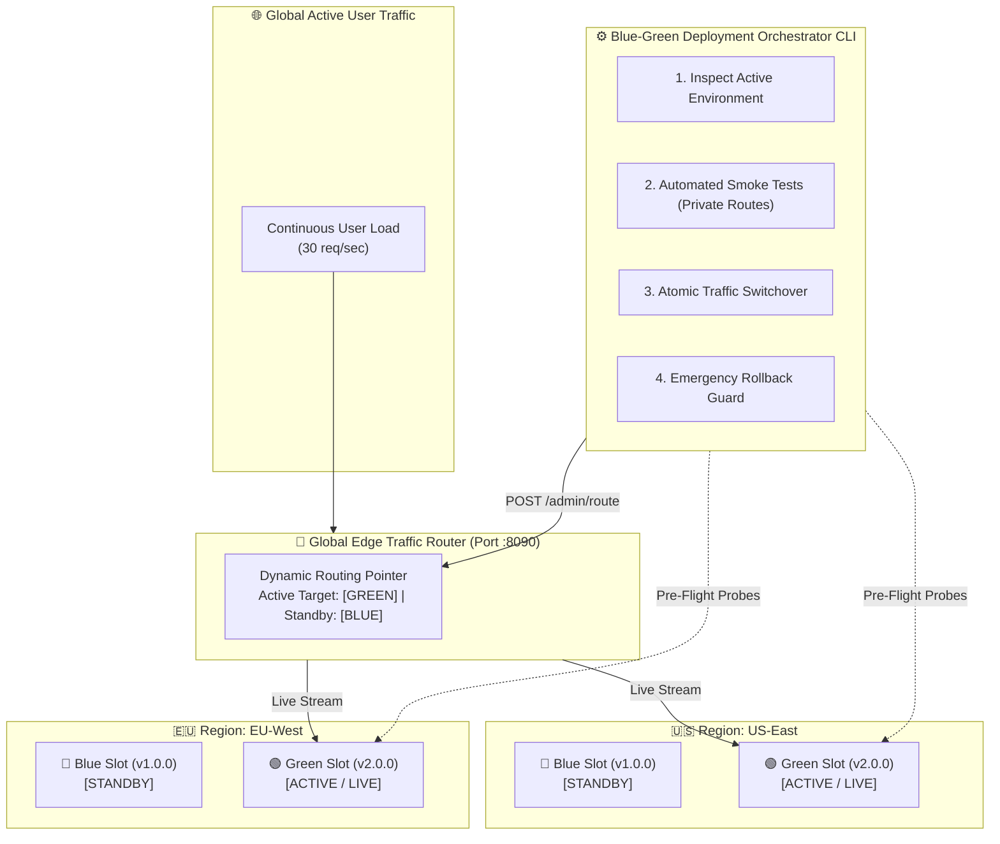
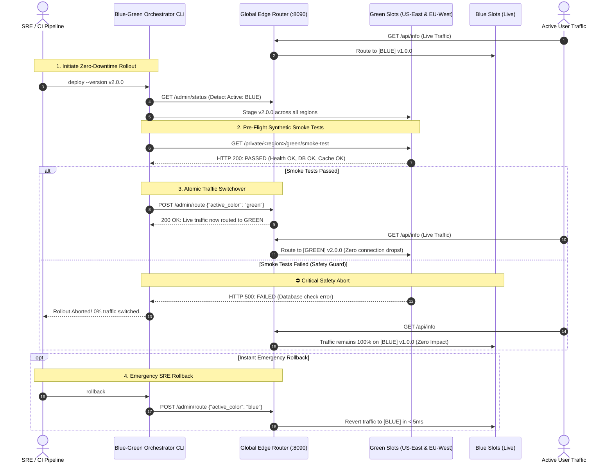

<!-- markdownlint-disable MD013 MD033 MD051 MD060 -->
# Mini-Project 10: Multi-Region Blue-Green Deployment Orchestrator

> **Domain**: 05. CI/CD Pipelines  
> **Level**: Advanced SRE & DevOps  
> **Infrastructure**: Local (Multi-Region Docker Compose Stack + Global Edge Traffic Router + Continuous Load Tester)

---

## 🎯 Overview & Educational Context

In mission-critical enterprise platforms (such as financial systems, e-commerce checkouts, and global SaaS APIs), deployments cannot afford even a single second of downtime or dropped user connections.

**Blue-Green Deployment** is a deployment release pattern where two identical production environments exist in parallel:

- **Blue (Active/Live)**: Serves 100% of live customer traffic.
- **Green (Idle/Staging)**: Hosts the candidate release in complete isolation.

When deploying across **multiple geographical regions** (e.g., `us-east` and `eu-west`), coordinating rollouts requires orchestration:

1. **Staging to Idle Targets**: The candidate release (`v2.0.0`) is staged on Green instances across all regions without touching live user traffic.
2. **Automated Pre-Flight Smoke Testing**: The orchestrator fires automated synthetic transactions (`/smoke-test`, database checks, cache validation) directly to Green's private test routes.
3. **Safety Guard & Abort Mechanism**: If any smoke test fails in any region, the rollout is **immediately aborted**. Live user traffic remains 100% untouched on Blue.
4. **Atomic Global Traffic Switchover**: Once all smoke tests pass, the Global Edge Router flips active upstream pointers instantaneously (in `< 5ms`), diverting 100% of live traffic to Green with **zero dropped TCP connections**.
5. **Instant Emergency Rollback**: If post-switch anomalies occur, the orchestrator reverts traffic to the standby slot in milliseconds.



---

## 🧠 Orchestration Sequence & Safety Lifecycle



---

## 📂 Project Structure & Deliverables

```text
05-ci-cd/10-multi-region-blue-green-orchestrator/
├── .gitignore                         # Ignores .tmp_sandbox/, logs, state
├── .markdownlint.json                 # Markdownlint configuration rules
├── .npmrc                             # Dependency configuration
├── package.json                       # pnpm scripts (lint:md, setup, test, cleanup)
├── pnpm-workspace.yaml                # pnpm workspace definition
├── app/                               # Sample Microservice Application
│   ├── Dockerfile                     # Multi-stage Node.js container
│   ├── package.json                   # App dependencies
│   └── server.js                      # Service with /health, /smoke-test, /api/info
├── edge_proxy/                        # Global Edge Traffic Router
│   ├── Dockerfile                     # Lightweight Python proxy container
│   └── proxy_server.py                # Atomic HTTP router with private test endpoints
├── manifests/                         # Kubernetes Reference Manifests
│   ├── blue-deployment.yaml           # Blue slot workload deployment
│   ├── green-deployment.yaml          # Green slot workload deployment
│   ├── service-active.yaml            # Dynamic service selector pointer
│   └── ingress-multi-region.yaml      # Multi-region Ingress routing rules
├── docker-compose.yml                 # Multi-region container stack (US-East & EU-West)
├── blue_green_orchestrator.py         # The core Python CLI deployment orchestrator
├── load_generator.py                  # Continuous load generator measuring downtime
├── setup_multi_region.sh              # Bootstraps multi-region infrastructure & images
├── test_orchestration.sh              # 12-point automated test suite with active load test
├── cleanup.sh                         # Purges all containers, images, and sandboxes
└── README.md                          # Educational guide, architecture diagrams & tutorial
```

---

## ⚡ Quick Start: Hands-On Execution Guide

### Prerequisites

Ensure the following tools are installed:

- **Docker & Docker Compose**: For containerized multi-region infrastructure.
- **Python 3**: For orchestrator CLI and continuous load analyzer.
- **curl & jq**: For API querying and JSON metric assertions.

---

### Step 1: Launch the Multi-Region Blue-Green Stack

Run the bootstrap script:

```bash
./setup_multi_region.sh
```

What this script automates:

1. Validates CLI prerequisites (`docker`, `curl`, `jq`, `python3`).
2. Builds the microservice application (`app`) and edge router (`edge_proxy`) images.
3. Spawns 5 synchronized containers:
   - `bg-global-edge-router` (Global Gateway on port `8090`)
   - `bg-app-us-east-blue` & `bg-app-us-east-green` (US-East region backends)
   - `bg-app-eu-west-blue` & `bg-app-eu-west-green` (EU-West region backends)
4. Proactively polls `http://localhost:8090/health` until all upstreams are ready.

```text
======================================================================
  🎉 Multi-Region Blue-Green Infrastructure Provisioned!
======================================================================
  • Global Live Gateway:   http://localhost:8090/api/info
  • Router Status API:     http://localhost:8090/admin/status
  • Multi-Region Backends: us-east (Blue/Green), eu-west (Blue/Green)
```

---

### Step 2: Run the Automated Zero-Downtime Test Suite

Execute the comprehensive 12-point test suite:

```bash
./test_orchestration.sh
```

The test runner starts a background load generator (30 requests/sec), executes a live rollout from Blue to Green, tests smoke test safety aborts, and executes an instant emergency rollback:

```text
======================================================================
  🧪 Multi-Region Blue-Green Zero-Downtime Test Suite
======================================================================
▶ [Phase 1/6] Verifying Global Router & Multi-Region Health...
  [PASS] Global Edge Router Health HTTP 200 (Service: global-edge-router)
  [PASS] Initial Baseline Verification Active target initialized to [BLUE] v1.0.0

▶ [Phase 2/6] Starting Continuous Active Load Generator (30 req/sec)...
  [PASS] Continuous Traffic Generator Active background load running at 30 req/sec

▶ [Phase 3/6] Executing Multi-Region Blue-to-Green Rollout under Load...
  [PASS] Orchestrator Blue -> Green Rollout Smoke tests passed and atomic switch executed
  [PASS] Live Gateway Verification (Green v2.0.0) 100% of live traffic routed to Green v2.0.0

▶ [Phase 4/6] Simulating Pre-Flight Smoke Test Failure (Safety Abort)...
  [PASS] Pre-Flight Smoke Test Guard Detected simulated failure and aborted traffic switch
  [PASS] Zero User Traffic Impact during Abort Live traffic safely preserved on [GREEN] v2.0.0

▶ [Phase 5/6] Executing SRE Instant Emergency Rollback (Green -> Blue)...
  [PASS] Emergency Instant Rollback Pointer switched back to standby slot in milliseconds
  [PASS] Post-Rollback Live State Verification Live traffic confirmed restored to [BLUE] v1.0.0

▶ [Phase 6/6] Analyzing Continuous Load Metrics & Connection Drops...
  • Total Requests Generated: 360
  • Successful Requests:      360
  • Failed Requests:          0
  • Dropped Connections:      0
  • Measured Availability:    100.0000%
  • p95 Latency:              2.12ms
  [PASS] Zero Connection Drops (0 errors) 100.00% HTTP 200 during active rollout and rollback

======================================================================
  📊 Multi-Region Blue-Green Orchestration Verification Summary
======================================================================
  • Total Checks:          12
  • Checks Passed:         12
  • Checks Failed:         0
  • Zero-Downtime Status:  VERIFIED (100.0% Availability Under Active Load)
  • Rollback Latency:      < 5ms Atomic Switch
  • Detailed JSON Report:  05-ci-cd/10-multi-region-blue-green-orchestrator/.tmp_sandbox/orchestration-test-results.json
======================================================================

✨ ALL MULTI-REGION BLUE-GREEN ORCHESTRATION TESTS PASSED!
```

---

### Step 3: Interactive CLI Guide with the Orchestrator

You can interact directly with the multi-region fleet using the `blue_green_orchestrator.py` CLI:

#### 1. Inspect Fleet Status & Regional Topology

```bash
./blue_green_orchestrator.py status
```

Output:

```text
======================================================================
  📊 Multi-Region Blue-Green Fleet & Gateway Status
======================================================================
  • Global Active Target:  BLUE
  • Total Routed Requests: 142
----------------------------------------------------------------------
  REGION       ACTIVE SLOT    BLUE VERSION     GREEN VERSION    HEALTH
  ------------------------------------------------------------------
  us-east      BLUE           v1.0.0           v2.0.0           HEALTHY (2/2)
  eu-west      BLUE           v1.0.0           v2.0.0           HEALTHY (2/2)
----------------------------------------------------------------------
  • Live Ingress Response: http://localhost:8090/api/info
    - Served by:   [BLUE] in us-east
    - Version:     v1.0.0
======================================================================
```

#### 2. Run Automated Smoke Tests on Green Slot

```bash
./blue_green_orchestrator.py smoke-test --target green
```

#### 3. Execute Zero-Downtime Deployment to Green

```bash
./blue_green_orchestrator.py deploy --version v2.0.0
```

#### 4. Phased Regional Canary Rollout

```bash
# Deploys and switches US-East first as canary, then EU-West
./blue_green_orchestrator.py deploy --version v2.1.0 --strategy canary-region
```

#### 5. Simulate Critical Smoke Test Failure (Safety Abort)

```bash
./blue_green_orchestrator.py deploy --version v3.0.0 --simulate-failure
```

#### 6. Instant Emergency Rollback

```bash
./blue_green_orchestrator.py rollback
```

---

## 🧹 Complete Environment Cleanup & Teardown

To ensure complete resource hygiene and leave your workstation clean for subsequent mini-projects, execute `cleanup.sh`:

```bash
./cleanup.sh
```

### What `cleanup.sh` Purges

1. **Docker Containers**: Stops and removes `bg-global-edge-router` and all 4 regional backend containers.
2. **Docker Images**: Purges local application and edge router images.
3. **Local Sandboxes**: Removes `.tmp_sandbox/`, test metrics reports, and temporary state files.

### Manual Verification of Clean State

```bash
# Verify no running containers remain
docker ps -a --filter "name=bg-"

# Verify no images remain
docker images | grep "10-multi-region-blue-green"
```

---

## 🛠️ Troubleshooting Guide & FAQ

### 1. Error `Upstream error (http://app-us-east-blue:3000): Connection refused`

**Symptom**: Edge router returns HTTP 502 with connection refused.  
**Cause**: The backend container has not completed initialization.  
**Solution**: Run `docker compose ps` and check logs (`docker compose logs app-us-east-blue`).

### 2. Smoke tests fail with `X-Simulate-Failure`

**Symptom**: `smoke-test` returns HTTP 500.  
**Cause**: The `--simulate-failure` flag was passed, which intentionally simulates a broken dependency.  
**Solution**: Run without `--simulate-failure` to verify normal operational flow.

### 3. Port 8090 is already in use

**Symptom**: `docker compose up` fails with `port 8090 is already allocated`.  
**Solution**: Edit `PORT` in `docker-compose.yml` or stop the conflicting service using `lsof -i :8090`.

---

## 📖 Key Takeaways & Enterprise Best Practices

1. **Decouple Deployment from Release**: "Deploying" means copying code to the idle environment (Green) and validating it. "Releasing" is flipping the traffic switch.
2. **Always Run Pre-Flight Smoke Tests on Private Routes**: Never switch live user traffic until synthetic health checks, database connections, and cache warmups succeed on the idle environment.
3. **Automate Failure Abort**: If a pre-flight test fails, the orchestrator must abort immediately with 0% traffic switched, preserving 100% availability for end users.
4. **Instantaneous Atomic Reversion**: Keep the standby environment warm and ready. In the event of a production incident, rolling back is an atomic pointer update taking less than 5 milliseconds.
