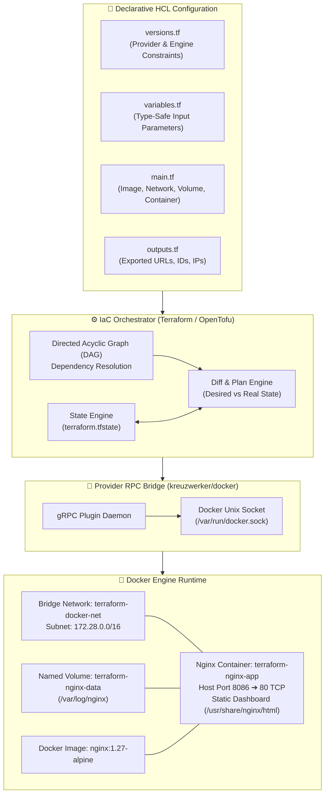
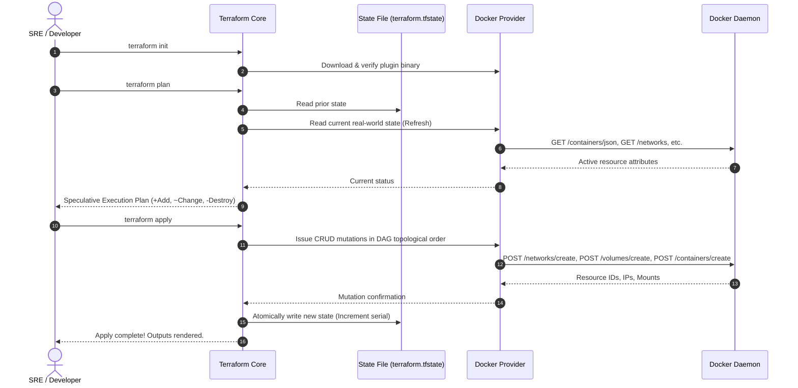
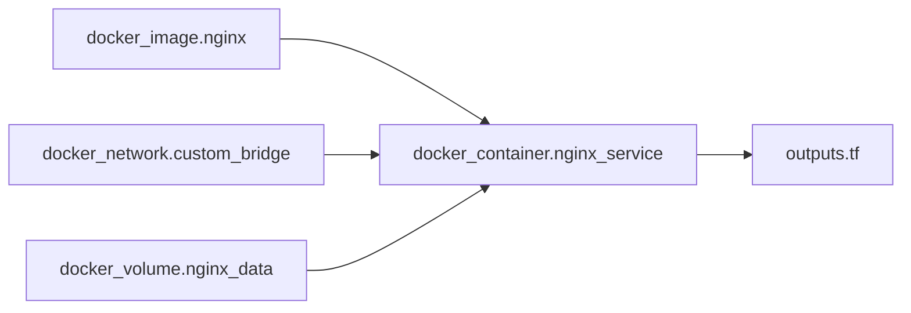

<!-- markdownlint-disable MD013 -->
# Mini-Project 01: Terraform Local Docker Provider Infrastructure

> **Domain**: 06. Infrastructure as Code (IaC)  
> **Level**: Beginner to Intermediate  
> **Infrastructure**: Local (Terraform / OpenTofu + Docker / OrbStack)  

---

## 🎯 Overview & Context

In modern Site Reliability Engineering (SRE) and Cloud-Native DevOps, **Infrastructure as Code (IaC)** is the discipline of provisioning, configuring, and managing computing environments through human-readable, version-controlled definition files rather than manual point-and-click console actions or ad-hoc shell scripts.

Historically, spinning up local development environments, test fixtures, and mock networks involved manually executing chains of `docker network create`, `docker volume create`, and `docker run` commands. This imperative approach introduces severe operational risks:

- **Configuration Drift**: Environments diverge across developer machines and staging servers.
- **Undocumented Dependencies**: Implicit startup orders and volume mappings fail silently.
- **Resource Leaks**: Abandoned containers, orphaned bridge networks, and dangling volumes consume system memory and port allocations.
- **Non-Idempotent Scripts**: Re-running an imperative bash script that fails halfway leaves the environment in an unknown, broken state.



This mini-project teaches the complete fundamentals of Infrastructure as Code by provisioning real, localized container infrastructure on your workstation using **Terraform** (and its open-source counterpart **OpenTofu**) paired with the **Docker Provider** (`kreuzwerker/docker`).

### Key Learning Objectives

1. **Declarative Architecture**: Define infrastructure desired state using HashiCorp Configuration Language (HCL).
2. **Provider Ecosystem**: Understand how Terraform communicates with local and cloud APIs via gRPC provider plugins.
3. **Resource Graphing**: Master implicit dependency resolution and Directed Acyclic Graphs (DAG).
4. **State Management**: Inspect `terraform.tfstate`, understand state serials, drift detection, and idempotency.
5. **Full Lifecycle Mastery**: Execute `init`, `validate`, `plan`, `apply`, `refresh`, and `destroy` workflows.
6. **Automated Testing & Teardown**: Run automated test suites and ensure 100% clean teardown of containers, networks, volumes, and images.

---

## 🧠 Terraform & IaC Internals Deep-Dive

### 1. Declarative vs. Imperative Infrastructure

| Dimension | Imperative (Bash, Docker CLI) | Declarative (Terraform, OpenTofu) |
| :--- | :--- | :--- |
| **Philosophy** | *How* to achieve the state (Step 1, Step 2, Step 3). | *What* the end state must look like. |
| **Idempotency** | Requires complex manual `if ! docker ps ...` logic. | Native. Re-applying identical code performs zero actions. |
| **Drift Detection** | None. Manual inspection required. | Automated. Compares real-world API state against state file. |
| **Rollbacks & Teardown** | Custom inverse script required. | Built-in via graph reversal (`terraform destroy`). |
| **State Tracking** | No persistent record of managed objects. | Explicit state graph stored in `terraform.tfstate`. |

---

### 2. The Terraform Provider Architecture

Terraform Core does not contain any built-in logic for Docker, AWS, GCP, or Kubernetes. Instead, it acts as an orchestration engine that communicates with **Providers** using a high-performance **gRPC IPC (Inter-Process Communication)** protocol:

```text
┌────────────────────────────────────────────────────────┐
│               Terraform / OpenTofu Core                │
│    (HCL Parser, Dependency DAG, State Reconciliation)  │
└───────────────────────────┬────────────────────────────┘
                            │  gRPC over Unix Domain Socket / Stdin
                            ▼
┌────────────────────────────────────────────────────────┐
│         Provider Plugin (kreuzwerker/docker)           │
│       (Translates HCL Schema to Docker SDK Calls)      │
└───────────────────────────┬────────────────────────────┘
                            │  Docker Engine API (HTTP/Socket)
                            ▼
┌────────────────────────────────────────────────────────┐
│           Docker Daemon (/var/run/docker.sock)         │
│          (Creates Containers, Networks, Volumes)       │
└────────────────────────────────────────────────────────┘
```

When you execute `terraform init`, Terraform reads `versions.tf`, downloads the compiled binary for `kreuzwerker/docker` from the registry into the local `.terraform/providers/` directory, and verifies its cryptographic checksum against `.terraform.lock.hcl`.

---

### 3. The Terraform Lifecycle Pipeline

Every Terraform resource transitions through a strict, deterministic lifecycle pipeline:



---

### 4. Dependency Graph & Resource Ordering

Terraform builds a **Directed Acyclic Graph (DAG)** to determine the exact order in which resources must be provisioned or destroyed:



Because `docker_container.nginx_service` references `docker_image.nginx.image_id`, `docker_network.custom_bridge.name`, and `docker_volume.nginx_data.name`, Terraform automatically infers **implicit dependencies**:

1. It downloads the image, creates the bridge network, and creates the persistent volume concurrently (in parallel).
2. Once all three prerequisites succeed, it provisions and starts the container.
3. During `terraform destroy`, Terraform reverses the graph: it stops/removes the container first, and only then deletes the volume, network, and image.

---

### 5. Anatomical Breakdown of State (`terraform.tfstate`)

The `terraform.tfstate` file is a JSON metadata map connecting declarative HCL resource names to real-world infrastructure IDs:

```json
{
  "version": 4,
  "terraform_version": "1.15.8",
  "serial": 16,
  "resources": [
    {
      "mode": "managed",
      "type": "docker_container",
      "name": "nginx_service",
      "provider": "provider[\"registry.terraform.io/kreuzwerker/docker\"]",
      "instances": [
        {
          "schema_version": 2,
          "attributes": {
            "id": "8ef6ce014ad38a1020aabe4423e0fcd0ac291e7dc347dc38a9fdf5fe02edd26c",
            "name": "terraform-nginx-app",
            "image": "sha256:96868d9fa38f469a86d2f25787e43ee9ad330339d30be260aa9f5a338bb03751",
            "network_data": [
              {
                "gateway": "172.28.0.1",
                "ip_address": "172.28.0.2",
                "network_name": "terraform-docker-net"
              }
            ]
          }
        }
      ]
    }
  ]
}
```

> [!IMPORTANT]
> Never manually edit `terraform.tfstate`. Direct state manipulation can desynchronize the state engine, causing accidental resource deletion or apply failures.

---

## 📁 Project Architecture & File Hierarchy

All project files are fully self-contained within this directory:

```text
06-infrastructure-as-code/01-terraform-local-docker-infrastructure/
├── .gitignore                    # Prevents committing local state, locks, and plan files
├── README.md                     # Comprehensive educational documentation (this file)
├── versions.tf                   # Terraform & OpenTofu version constraints + required provider
├── variables.tf                  # Type-safe input variable declarations with validation rules
├── main.tf                       # Core IaC resources: Image, Network, Volume, and Container
├── outputs.tf                    # Exported outputs: Container IDs, Network Subnets, Service URLs
├── terraform.tfvars.example      # Sample configuration overrides file for customization
├── cleanup.sh                    # Standalone teardown script for complete environment cleanup
├── terraform_lifecycle_test.sh   # 18-step automated end-to-end lifecycle verification suite
└── html/
    └── index.html                # Custom styled landing page injected into the Nginx container
```

### Resource Breakdown in `main.tf`

| Resource Type | Resource Identifier | Configuration Highlights |
| :--- | :--- | :--- |
| **`docker_image`** | `nginx` | Pulls `nginx:1.27-alpine`. `keep_locally = false` ensures zero image remnants on destroy. |
| **`docker_network`** | `custom_bridge` | Driver: `bridge`, Subnet: `172.28.0.0/16`, Gateway: `172.28.0.1`, tagged with `managed-by = terraform`. |
| **`docker_volume`** | `nginx_data` | Persistent named storage volume mounted to `/var/log/nginx` for persistent logging. |
| **`docker_container`** | `nginx_service` | Binds port 80 to host port `8086`, joins custom bridge network, mounts volume, runs healthcheck. |

---

## 🚀 Step-by-Step Beginner Walkthrough

### Prerequisites

Ensure the following tools are installed on your machine:

- **Docker Engine** / **OrbStack** / **Docker Desktop** (running and responsive)
- **Terraform** (`>= 1.5.0`) OR **OpenTofu** (`>= 1.6.0`)
- **curl** and **jq** (for testing and JSON inspection)

---

### Step 1: Navigate to Project Directory

```bash
cd 06-infrastructure-as-code/01-terraform-local-docker-infrastructure
```

---

### Step 2: Initialize Provider Plugins (`terraform init`)

Downloads the `kreuzwerker/docker` provider plugin and creates the dependency lockfile:

```bash
terraform init
```

*Expected Output:*

```text
Initializing the backend...
Initializing provider plugins...
- Finding kreuzwerker/docker versions matching ">= 3.0.0"...
- Installing kreuzwerker/docker v3.0.2...
- Installed kreuzwerker/docker v3.0.2 (signed by a HashiCorp partner)

Terraform has been successfully initialized!
```

---

### Step 3: Validate Syntax & Format (`terraform fmt` & `validate`)

```bash
# Check code formatting
terraform fmt -check

# Validate syntax, variable types, and resource schemas
terraform validate
```

*Expected Output:*

```text
Success! The configuration is valid.
```

---

### Step 4: Generate Speculative Plan (`terraform plan`)

Inspect what resources Terraform intends to create before making any actual system changes:

```bash
terraform plan -out=tfplan
```

*Expected Output:*

```text
Terraform will perform the following actions:

  + resource "docker_container" "nginx_service" { ... }
  + resource "docker_image" "nginx" { ... }
  + resource "docker_network" "custom_bridge" { ... }
  + resource "docker_volume" "nginx_data" { ... }

Plan: 4 to add, 0 to change, 0 to destroy.
```

---

### Step 5: Provision Infrastructure (`terraform apply`)

Apply the compiled execution plan to create the infrastructure on your local Docker daemon:

```bash
terraform apply tfplan
```

*Expected Output:*

```text
docker_image.nginx: Creating...
docker_volume.nginx_data: Creating...
docker_network.custom_bridge: Creating...
docker_volume.nginx_data: Creation complete after 0s [id=terraform-nginx-data]
docker_network.custom_bridge: Creation complete after 0s [id=5ff055b1b7c18c19...]
docker_image.nginx: Creation complete after 2s [id=sha256:96868d9fa38f...]
docker_container.nginx_service: Creating...
docker_container.nginx_service: Creation complete after 1s [id=8ef6ce014ad38a1...]

Apply complete! Resources: 4 added, 0 changed, 0 destroyed.

Outputs:

container_gateway = "172.28.0.1"
container_id = "8ef6ce014ad38a1020aabe4423e0fcd0ac291e7dc347dc38a9fdf5fe02edd26c"
container_ip_address = "172.28.0.2"
container_name = "terraform-nginx-app"
network_id = "5ff055b1b7c18c19bb2e6829611b1fe5d3200de682fdc64cf9827a42e02d752d"
network_name = "terraform-docker-net"
service_url = "http://127.0.0.1:8086"
volume_id = "terraform-nginx-data"
volume_name = "terraform-nginx-data"
```

---

### Step 6: Verify Runtime Infrastructure

Verify that Docker resources are active and healthy using both CLI and HTTP requests:

```bash
# 1. Check running container
docker ps --filter "name=terraform-nginx-app"

# 2. Inspect custom network subnet assignment
docker network inspect terraform-docker-net | jq '.[0].IPAM.Config'

# 3. Test HTTP landing page
curl -I http://127.0.0.1:8086/
```

*Expected HTTP Response:*

```text
HTTP/1.1 200 OK
Server: nginx/1.27.5
Content-Type: text/html
Connection: keep-alive
```

Open `http://127.0.0.1:8086` in your web browser to view the custom Terraform status dashboard.

---

### Step 7: Inspect Terraform State & Outputs

```bash
# Display formatted human-readable state summary
terraform show

# Query specific structured output
terraform output -raw service_url
terraform output -json container_ip_address
```

---

### Step 8: Verify Idempotency & Drift Detection

Re-running `terraform plan` should report that zero changes are required because the real infrastructure perfectly matches the declarative HCL code:

```bash
terraform plan -detailed-exitcode
```

*Expected Output:*

```text
No changes. Your infrastructure matches the configuration.
```

---

## 🧪 Automated Testing & Verification Suite

This project includes a comprehensive, automated end-to-end test suite (`terraform_lifecycle_test.sh`) that validates all 18 lifecycle requirements:

```bash
./terraform_lifecycle_test.sh
```

### Test Suite Execution Flags

| Flag | Purpose | Example Usage |
| :--- | :--- | :--- |
| **`--keep`** | Leaves infrastructure running after tests for browser exploration. | `./terraform_lifecycle_test.sh --keep` |
| **`--clean`** | Purges all containers, volumes, networks, and state files. | `./terraform_lifecycle_test.sh --clean` |
| **`--engine=tofu`** | Forces testing against the **OpenTofu** engine. | `./terraform_lifecycle_test.sh --engine=tofu` |
| **`--engine=terraform`** | Forces testing against the **HashiCorp Terraform** engine. | `./terraform_lifecycle_test.sh --engine=terraform` |

### What the Test Suite Verifies

| # | Scope | Assertion / Verification Criteria |
| :---: | :--- | :--- |
| **01** | Prerequisites | Asserts Docker engine daemon is responsive. |
| **02** | Engine Detection | Detects active IaC engine (`terraform` or `tofu`) and verifies version compatibility. |
| **03** | Utilities | Confirms availability of helper utilities (`curl`, `jq`). |
| **04** | Syntax Formatting | Validates canonical HCL formatting via `terraform fmt -check`. |
| **05** | Initialization | Validates provider plugin download and lockfile generation (`terraform init`). |
| **06** | Configuration Validation | Validates HCL resource types, schema constraints, and variables (`terraform validate`). |
| **07** | Speculative Planning | Asserts clean execution plan generation (`terraform plan`). |
| **08** | Provisioning | Provisions all 4 resources via `terraform apply` with zero errors. |
| **09** | State Integrity | Verifies `terraform.tfstate` JSON validity, serial tracking, and resource counts. |
| **10** | Outputs Verification | Asserts all required output variables resolve correctly. |
| **11** | Container Health | Inspects Docker container state to assert `Running: true`. |
| **12** | Network Allocation | Asserts container is attached to `terraform-docker-net` in subnet `172.28.0.0/16`. |
| **13** | Volume Attachment | Asserts `terraform-nginx-data` is mounted to `/var/log/nginx`. |
| **14** | HTTP Service Gateway | Asserts HTTP 200 response and validates custom dashboard HTML body. |
| **15** | IaC Idempotency | Confirms zero resource drift via `terraform plan -detailed-exitcode` (Exit Code 0). |
| **16** | Variable Overrides | Tests speculative plan changes when overriding input variables (`external_port=8095`). |
| **17** | Resource Destruction | Executes clean teardown via `terraform destroy -auto-approve`. |
| **18** | Post-Destroy State | Asserts zero leftover containers, bridge networks, or named volumes in Docker. |

---

## 🧹 Complete Resource Teardown & Cleanup Guide

To maintain a clean system state and avoid port or naming collisions with subsequent mini-projects, always destroy provisioned resources when testing is complete.

### Method 1: Automated Teardown Script (Recommended)

Run the included cleanup script:

```bash
# Standard cleanup (destroys Docker resources, keeps plugin cache)
./cleanup.sh

# Complete purge (destroys Docker resources and purges .terraform/, state files, and locks)
./cleanup.sh --all
```

*Expected Output:*

```text
======================================================================
  🧹 Cleaning Up Terraform Local Docker Infrastructure
======================================================================
▶ [1/4] Destroying infrastructure via IaC engine...
  [OK] Terraform resources destroyed successfully.
▶ [2/4] Purging project Docker containers, networks, and volumes...
  [OK] Docker resources checked and purged.
▶ [3/4] Removing temporary plan files and test artifacts...
  [OK] Temporary files removed.
▶ [4/4] State & plugin cache cleanup...
  [OK] State and plugin caches purged.

✨ CLEANUP COMPLETE: All project resources have been successfully purged.
```

---

### Method 2: Manual Step-by-Step Teardown

If you prefer to perform the cleanup manually using native Terraform and Docker commands:

#### 1. Destroy Terraform Managed Resources

```bash
terraform destroy -auto-approve
```

#### 2. Verify Docker Daemon is Clean

Ensure all project containers, networks, and volumes have been removed:

```bash
docker ps -a --filter "name=terraform-nginx-app"
docker network ls --filter "name=terraform-docker-net"
docker volume ls --filter "name=terraform-nginx-data"
```

If all three commands return empty tables, your Docker environment is 100% clean!

#### 3. (Optional) Remove Local State and Cache Files

```bash
rm -rf .terraform .terraform.lock.hcl terraform.tfstate terraform.tfstate.backup tfplan
```

---

## 💡 Troubleshooting & Common Gotchas

### 1. Docker Socket Connection Errors

**Symptom**: `Error: Error pinging Docker server: Cannot connect to the Docker daemon`  
**Cause**: The Docker daemon is stopped, or the socket path differs on macOS/OrbStack.  
**Resolution**:

```bash
# Ensure Docker daemon is running
docker info

# On macOS with OrbStack/Colima, ensure standard symlink exists:
sudo ln -sf ~/.orbstack/run/docker.sock /var/run/docker.sock
```

---

### 2. Port Collision (`port is already allocated`)

**Symptom**: `Bind for 0.0.0.0:8086 failed: port is already allocated`  
**Cause**: Another service is already using port `8086`.  
**Resolution**: Override the port variable during apply or in `terraform.tfvars`:

```bash
terraform apply -var="external_port=8092"
```

---

### 3. OpenTofu Provider Signature Warnings

**Symptom**: `Error while installing kreuzwerker/docker: authentication signature from unknown issuer`  
**Cause**: OpenTofu verifies provider GPG signatures against the OpenTofu registry.  
**Resolution**: Ensure `versions.tf` uses `version = ">= 3.0.0"`, and re-initialize with `tofu init -upgrade`.

---

## 📚 Key Takeaways & SRE Best Practices

1. **Keep Providers Modular**: Constrain provider versions in `versions.tf` (`>= 3.0.0`) to avoid unexpected breaking schema updates.
2. **Explicit Type Constraints & Validations**: Always declare `type` and `validation` blocks in `variables.tf` to catch invalid port ranges or naming typos early during the `validate` phase.
3. **Labels & Metadata Tagging**: Tag all Docker networks, volumes, and containers with `managed-by = "terraform"` to distinguish automated infrastructure from ad-hoc manual containers.
4. **State Hygiene**: Treat `terraform.tfstate` as sensitive source data. In production cloud environments, store state in remote backends (S3, GCS) with distributed state locking (DynamoDB).
