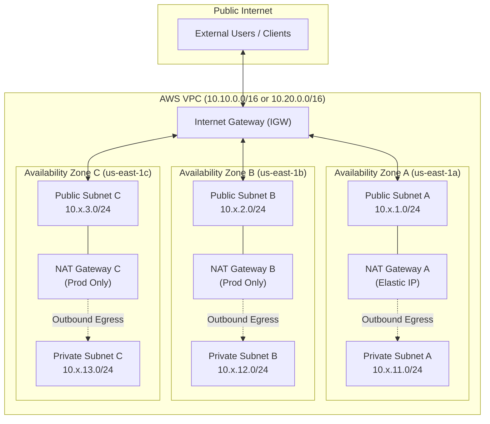
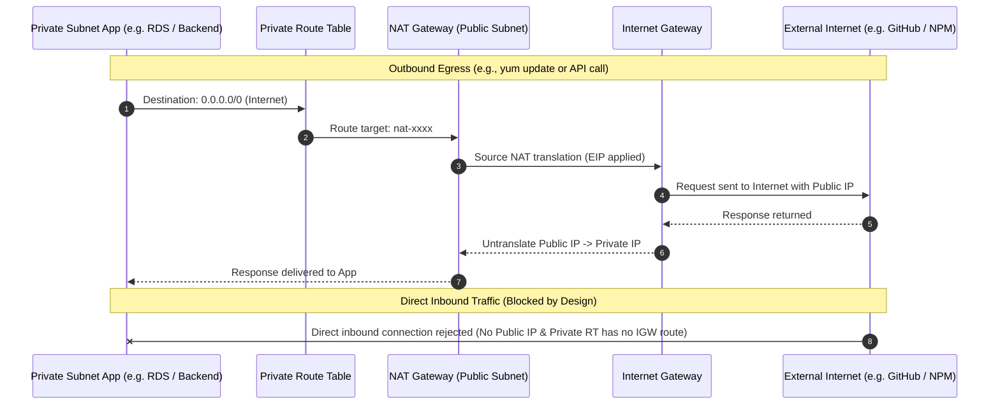

<!-- markdownlint-disable MD013 -->
# 02 - Modular High-Availability AWS VPC with Terraform & OpenTofu

> A reusable, production-ready Infrastructure as Code (IaC) module provisioning a multi-tier, High-Availability (HA) Amazon Virtual Private Cloud (VPC) across multiple Availability Zones, demonstrating environmental parameterization (Dev vs. Prod), automated linting with TFLint, automated documentation with terraform-docs, and 100% local testing using Docker-based AWS emulators.

---

## Table of Contents

1. [Architectural Overview](#architectural-overview)
2. [Theoretical Deep-Dive for Beginners](#theoretical-deep-dive-for-beginners)
   - [What is an Amazon VPC?](#what-is-an-amazon-vpc)
   - [CIDR Blocks & IP Subnetting](#cidr-blocks--ip-subnetting)
   - [Public Subnets vs. Private Subnets](#public-subnets-vs-private-subnets)
   - [Internet Gateways vs. NAT Gateways](#internet-gateways-vs-nat-gateways)
   - [Route Tables & Associations](#route-tables--associations)
   - [Dev (Cost-Optimized) vs. Prod (High-Availability)](#dev-cost-optimized-vs-prod-high-availability)
   - [Security Hardening: The Default Security Group](#security-hardening-the-default-security-group)
3. [Repository Structure](#repository-structure)
4. [Prerequisites](#prerequisites)
5. [Quickstart Guide](#quickstart-guide)
6. [Automated Verification & Doc Generation](#automated-verification--doc-generation)
7. [Step-by-Step Manual Deployment](#step-by-step-manual-deployment)
   - [1. Testing with Local AWS Emulator](#1-testing-with-local-aws-emulator)
   - [2. Deploying the Dev Environment](#2-deploying-the-dev-environment)
   - [3. Deploying the Prod Environment](#3-deploying-the-prod-environment)
   - [4. Deploying to Real AWS Cloud](#4-deploying-to-real-aws-cloud)
8. [Automated E2E Test Suite](#automated-e2e-test-suite)
9. [Troubleshooting & Gotchas](#troubleshooting--gotchas)
10. [Resource Teardown & Environment Cleanup](#resource-teardown--environment-cleanup)

---

## Architectural Overview

This project implements a reusable Terraform module (`modules/vpc`) consumed by two independent root environments (`environments/dev` and `environments/prod`):



### Route Table & Traffic Flow Model



---

## Theoretical Deep-Dive for Beginners

### What is an Amazon VPC?

An **Amazon Virtual Private Cloud (VPC)** is a logically isolated virtual network dedicated to your AWS account. It closely resembles a traditional on-premises network data center, but offers scalable AWS infrastructure benefits.

Within a VPC, you control:

- The IP address range (CIDR block).
- Subnets (subdivided network segments across Availability Zones).
- Route tables (traffic routing rules).
- Network gateways (Internet Gateways, NAT Gateways).
- Security controls (Security Groups, Network ACLs).

### CIDR Blocks & IP Subnetting

**CIDR (Classless Inter-Domain Routing)** is a method for allocating IP addresses and routing IP packets.

In this project:

- **VPC CIDR `/16`**: Provides $2^{(32 - 16)} = 65,536$ total IP addresses.
  - Dev: `10.10.0.0/16` (`10.10.0.0` to `10.10.255.255`).
  - Prod: `10.20.0.0/16` (`10.20.0.0` to `10.20.255.255`).
- **Subnet CIDR `/24`**: Provides $2^{(32 - 24)} = 256$ total IP addresses (251 usable, as AWS reserves 5 addresses per subnet).

| CIDR Prefix | Example Dev Range | Usable IPs | Role |
| :--- | :--- | :--- | :--- |
| `10.10.1.0/24` | `10.10.1.0` – `10.10.1.255` | 251 | Public Subnet 1 (AZ `us-east-1a`) |
| `10.10.2.0/24` | `10.10.2.0` – `10.10.2.255` | 251 | Public Subnet 2 (AZ `us-east-1b`) |
| `10.10.3.0/24` | `10.10.3.0` – `10.10.3.255` | 251 | Public Subnet 3 (AZ `us-east-1c`) |
| `10.10.11.0/24` | `10.10.11.0` – `10.10.11.255` | 251 | Private Subnet 1 (AZ `us-east-1a`) |
| `10.10.12.0/24` | `10.10.12.0` – `10.10.12.255` | 251 | Private Subnet 2 (AZ `us-east-1b`) |
| `10.10.13.0/24` | `10.10.13.0` – `10.10.13.255` | 251 | Private Subnet 3 (AZ `us-east-1c`) |

> [!NOTE]
> **AWS Reserved IP Addresses in Every Subnet:**
>
> 1. `10.0.0.0`: Network address.
> 2. `10.0.0.1`: Reserved by AWS for the VPC router.
> 3. `10.0.0.2`: Reserved by AWS for DNS resolution (`AmazonProvidedDNS`).
> 4. `10.0.0.3`: Reserved by AWS for future use.
> 5. `10.0.0.255`: Network broadcast address (AWS does not support broadcast, but reserves it).

### Public Subnets vs. Private Subnets

- **Public Subnet**: A subnet whose route table has a default route (`0.0.0.0/0`) pointing directly to an **Internet Gateway (IGW)**. Resources located here (ALBs, Bastion hosts) receive public IPs and can accept inbound connections from the internet.
- **Private Subnet**: A subnet whose route table does **not** have a route to an IGW. Its route table directs `0.0.0.0/0` to a **NAT Gateway**. Resources located here (Databases, backend microservices, Kubernetes worker nodes) cannot be reached directly from the internet, protecting them against unauthorized scans.

### Internet Gateways vs. NAT Gateways

- **Internet Gateway (IGW)**: A horizontally scaled, redundant, and highly available VPC component that enables bidirectional communication between your VPC instances and the internet. It performs 1:1 Network Address Translation (NAT) for public IP addresses. It has zero cost per hour.
- **NAT Gateway (Network Address Translation Gateway)**: A managed AWS service that enables instances in a private subnet to initiate outbound IPv4 connections to the internet (for software patches, OS updates, third-party APIs), while preventing external internet hosts from initiating inbound connections. It requires an **Elastic IP (EIP)** and resides in a public subnet.

### Route Tables & Associations

A route table contains a set of rules (called routes) that determine where network traffic from your subnet or gateway is directed:

- **Local Route**: Automatically created by AWS (e.g., `10.10.0.0/16 -> local`), allowing all subnets within the same VPC to communicate with each other with high speed and low latency.
- **Public Default Route**: `0.0.0.0/0 -> igw-xxxx` routes all non-local internet-bound traffic out to the Internet Gateway.
- **Private Default Route**: `0.0.0.0/0 -> nat-xxxx` routes all non-local internet-bound traffic to the assigned NAT Gateway for egress address translation.

### Dev (Cost-Optimized) vs. Prod (High-Availability)

In enterprise AWS architectures, NAT Gateways incur both hourly provisioning fees (~$0.045/hr ≈ $32.40/month per gateway) plus data processing fees.

| Feature | Dev Environment (`environments/dev`) | Prod Environment (`environments/prod`) |
| :--- | :--- | :--- |
| **VPC CIDR** | `10.10.0.0/16` | `10.20.0.0/16` |
| **Availability Zones** | 3 (`us-east-1a`, `us-east-1b`, `us-east-1c`) | 3 (`us-east-1a`, `us-east-1b`, `us-east-1c`) |
| **NAT Gateways** | **1 shared NAT Gateway** | **3 dedicated NAT Gateways** (1 per AZ) |
| **Private Route Tables** | 1 shared route table pointing to NAT 1 | 3 independent route tables (AZ $i \to$ NAT $i$) |
| **Fault Tolerance** | AZ failure in AZ-A disrupts egress for all | Full AZ independence; AZ outage isolated |
| **Cost Profile** | **Low** ($32.40/month in NAT cost) | **Enterprise HA** ($97.20/month in NAT cost) |

### Security Hardening: The Default Security Group

When an AWS VPC is created, AWS automatically provisions a `default` Security Group. By default, this security group permits all inbound traffic from member resources and all outbound traffic.

To adhere to the **CIS AWS Foundations Benchmark** and defense-in-depth best practices, our module adopts and hardens the default Security Group:

```hcl
resource "aws_default_security_group" "default" {
  vpc_id = aws_vpc.this.id

  # Adheres to CIS AWS Benchmark: No ingress or egress rules permitted
  ingress = []
  egress  = []

  tags = merge(local.common_tags, {
    Name = "${var.name_prefix}-default-sg-hardened"
  })
}
```

---

## Repository Structure

```text
06-infrastructure-as-code/02-modular-aws-vpc-terraform/
├── .gitignore                      # Git ignore rules for state, plans, and secrets
├── .tflint.hcl                     # TFLint ruleset & module inspection config
├── README.md                       # Comprehensive educational documentation
├── cleanup.sh                      # Standalone resource destruction script
├── test_modular_vpc.sh             # 18-point automated E2E lifecycle test suite
├── validate_and_docs.sh            # Canonical formatting, TFLint & terraform-docs script
├── modules/
│   └── vpc/                        # Reusable core VPC module
│       ├── README.md               # Generated module parameter documentation
│       ├── main.tf                 # VPC, Subnets, IGW, NAT GWs, EIPs, Routes
│       ├── outputs.tf              # VPC IDs, Subnet IDs, CIDRs, NAT IPs
│       ├── variables.tf            # Input variables & CIDR validation rules
│       └── versions.tf             # AWS provider & Terraform version constraints
└── environments/
    ├── dev/                        # Dev Root Module (Cost-optimized 1-NAT)
    │   ├── main.tf                 # Invocation of modules/vpc with 10.10.0.0/16
    │   ├── outputs.tf              # Dev outputs exposing VPC metadata
    │   ├── providers.tf            # AWS Provider with LocalStack/Moto endpoint support
    │   ├── terraform.tfvars.example # Sample variable overrides
    │   ├── variables.tf            # Environment-level variables
    │   └── versions.tf             # Engine & provider requirements
    └── prod/                       # Prod Root Module (Multi-AZ 3-NAT HA)
        ├── main.tf                 # Invocation of modules/vpc with 10.20.0.0/16
        ├── outputs.tf              # Prod outputs exposing VPC metadata
        ├── providers.tf            # AWS Provider with LocalStack/Moto endpoint support
        ├── terraform.tfvars.example # Sample variable overrides
        ├── variables.tf            # Environment-level variables
        └── versions.tf             # Engine & provider requirements
```

---

## Prerequisites

To run and inspect this project, ensure you have the following tools installed:

1. **Terraform** (`>= 1.5.0`) or **OpenTofu** (`>= 1.6.0`):

   ```bash
   brew install hashicorp/tap/terraform
   # or
   brew install opentofu
   ```

2. **Docker** (Required for local zero-cost AWS emulation):

   ```bash
   docker --version
   ```

3. **AWS CLI** (v2) & Utilities (`jq`, `curl`):

   ```bash
   brew install awscli jq curl
   ```

4. **TFLint & terraform-docs** (For linting and automated docs):

   ```bash
   brew install tflint terraform-docs
   ```

---

## Quickstart Guide

Run the full automated test suite in one command. It will format the code, run TFLint, update documentation, spin up an ephemeral local AWS emulator, deploy Dev, deploy Prod, assert 18 testing invariants, and clean up everything:

```bash
cd 06-infrastructure-as-code/02-modular-aws-vpc-terraform
./test_modular_vpc.sh
```

Sample output:

```text
======================================================================
  🏗️  Modular High-Availability AWS VPC E2E Lifecycle Test Suite
======================================================================
Phase 1: Tooling & Prerequisites Verification
  [PASS] Test 01: Docker engine is running and responsive
  [PASS] Test 02: IaC engine detected (terraform)
  [PASS] Test 03: Quality & Linting tools available (tflint, terraform-docs, jq)

Phase 2: Static Code Quality, TFLint & terraform-docs
  [PASS] Test 04: HCL formatting, TFLint recursive checks, and module docs verified

Phase 3: LocalStack Community Emulator Bootstrap
  [PASS] Test 05: Local AWS emulator is active and reachable

Phase 4: Dev Environment Lifecycle (Cost-Optimized Single NAT)
  [PASS] Test 06: Dev environment speculative plan generated
  [PASS] Test 07: Dev VPC infrastructure provisioned
  [PASS] Test 08: Dev VPC outputs resolved (3 public subnets, 3 private subnets)
  [PASS] Test 09: Dev single NAT Gateway cost-optimization verified
  [PASS] Test 10: Dev VPC verified via AWS EC2 API with CIDR 10.10.0.0/16
  [PASS] Test 11: Dev environment idempotency confirmed

Phase 5: Prod Environment Lifecycle (Multi-AZ 3-NAT HA)
  [PASS] Test 12: Prod environment speculative plan generated
  [PASS] Test 13: Prod VPC infrastructure provisioned
  [PASS] Test 14: Prod VPC outputs resolved (3 public subnets, 3 private subnets)
  [PASS] Test 15: Prod Multi-AZ High Availability verified (3 NAT Gateways across 3 AZs)
  [PASS] Test 16: Prod VPC verified via AWS EC2 API with CIDR 10.20.0.0/16
  [PASS] Test 17: Prod environment idempotency confirmed

Phase 6: Infrastructure Destruction & Teardown
  [PASS] Test 18: Complete infrastructure destruction and LocalStack cleanup
======================================================================
🎉 ALL MODULAR VPC LIFECYCLE TESTS PASSED PERFECTLY!
```

---

## Automated Verification & Doc Generation

The `validate_and_docs.sh` script executes 4 quality gates:

```bash
./validate_and_docs.sh
```

1. **HCL Canonical Formatting**: Checks that all `.tf` files adhere to standard formatting (`terraform fmt -check -recursive`).
2. **TFLint Static Analysis**: Recursively evaluates best practices, deprecated arguments, and module calls across all directories.
3. **terraform-docs Generation**: Automatically extracts module inputs, outputs, and requirements and updates `modules/vpc/README.md`.
4. **Terraform Validation**: Initializes backends and runs `terraform validate` on both `environments/dev` and `environments/prod`.

---

## Step-by-Step Manual Deployment

### 1. Testing with Local AWS Emulator

To test without incurring real AWS billing or requiring real AWS credentials, run the local AWS emulator:

```bash
docker run -d --name localstack-vpc-demo -p 4566:5000 motoserver/moto:latest
```

Configure your AWS CLI to talk to port 4566:

```bash
export AWS_ACCESS_KEY_ID="test"
export AWS_SECRET_ACCESS_KEY="test"
export AWS_DEFAULT_REGION="us-east-1"
```

Verify that the local emulator is active:

```bash
aws --endpoint-url=http://127.0.0.1:4566 ec2 describe-vpcs
```

### 2. Deploying the Dev Environment

```bash
cd environments/dev
terraform init
terraform plan -out=dev.tfplan
terraform apply dev.tfplan
```

Inspect the outputs:

```bash
terraform output
```

Verify the provisioned resources via the AWS CLI:

```bash
# Query VPC CIDR and State
aws --endpoint-url=http://127.0.0.1:4566 ec2 describe-vpcs --vpc-ids $(terraform output -raw vpc_id)

# Query Subnets
aws --endpoint-url=http://127.0.0.1:4566 ec2 describe-subnets --filters "Name=vpc-id,Values=$(terraform output -raw vpc_id)"

# Verify Single NAT Gateway in Dev
aws --endpoint-url=http://127.0.0.1:4566 ec2 describe-nat-gateways --filter "Name=vpc-id,Values=$(terraform output -raw vpc_id)"
```

### 3. Deploying the Prod Environment

```bash
cd ../prod
terraform init
terraform plan -out=prod.tfplan
terraform apply prod.tfplan
```

Verify the Multi-AZ 3 NAT Gateways in Prod:

```bash
# Verify 3 NAT Gateways across 3 AZs
aws --endpoint-url=http://127.0.0.1:4566 ec2 describe-nat-gateways --filter "Name=vpc-id,Values=$(terraform output -raw vpc_id)"
```

### 4. Deploying to Real AWS Cloud

To deploy to real AWS:

1. Configure your AWS credentials (`aws configure` or set `AWS_ACCESS_KEY_ID` and `AWS_SECRET_ACCESS_KEY`).
2. In `environments/dev/providers.tf` (or `environments/prod/providers.tf`), set `aws_endpoint = ""` or override via `terraform.tfvars`:

   ```hcl
   aws_endpoint = ""
   ```

3. Run `terraform plan` and `terraform apply`.

---

## Automated E2E Test Suite

The test suite `test_modular_vpc.sh` provides flags for testing workflows:

```bash
# Run tests with default engine (Terraform)
./test_modular_vpc.sh

# Force OpenTofu engine
./test_modular_vpc.sh --engine=tofu

# Keep provisioned resources and LocalStack container running for manual inspection
./test_modular_vpc.sh --keep

# Force full environment purge
./test_modular_vpc.sh --clean
```

---

## Troubleshooting & Gotchas

### 1. `terraform validate` Fails on Uninitialized Providers

- **Symptom**: `Error: Could not load plugin...`
- **Cause**: Root configurations containing providers require provider initialization before validation.
- **Solution**: Always run `terraform init -backend=false` before executing `terraform validate`.

### 2. AWS NAT Gateway Allocation Limits

- **Symptom**: `AddressLimitExceeded: The maximum number of addresses has been reached.`
- **Cause**: Standard AWS accounts have a default quota of 5 Elastic IPs per region. Prod uses 3 EIPs; Dev uses 1 EIP.
- **Solution**: If deploying multiple environments simultaneously in real AWS, ensure your EIP quota is sufficient, or use `single_nat_gateway = true` during staging.

### 3. Port 4566 Conflicts

- **Symptom**: `Bind for 0.0.0.0:4566 failed: port is already allocated`
- **Solution**: Run `./cleanup.sh` to remove any lingering emulator containers.

---

## Resource Teardown & Environment Cleanup

To ensure zero leftover cloud costs, Docker containers, or state artifacts:

```bash
# Clean up all active infrastructure and stop the emulator
./cleanup.sh

# Full purge: removes .terraform caches, state files, and lockfiles
./cleanup.sh --all
```

Verification of clean state:

```bash
# Confirm no Docker containers running
docker ps -a --filter "name=localstack-vpc-demo"

# Confirm no lingering state
ls -la environments/dev/terraform.tfstate environments/prod/terraform.tfstate
```
