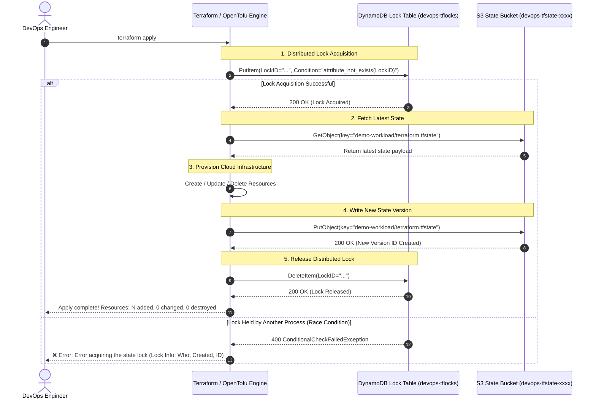

# Mini-Project 03: Remote State Locking with AWS S3 and DynamoDB

<!-- markdownlint-disable MD013 MD033 MD051 -->

## 📋 Table of Contents

1. [Project Overview & Learning Objectives](#-project-overview--learning-objectives)
2. [Why Remote State & Locking Matter](#-why-remote-state--locking-matter)
3. [Architecture & Concurrency Flow](#-architecture--concurrency-flow)
4. [Directory & File Structure](#-directory--file-structure)
5. [Prerequisites & Environment Setup](#-prerequisites--environment-setup)
6. [Step-by-Step Hands-On Guide](#-step-by-step-hands-on-guide)
7. [Automated Concurrency Testing](#-automated-concurrency-testing)
8. [Deploying to Real AWS Cloud](#-deploying-to-real-aws-cloud)
9. [Troubleshooting & State Lock Recovery](#-troubleshooting--state-lock-recovery)
10. [Teardown & Cleanup](#-teardown--cleanup)

---

## 🎯 Project Overview & Learning Objectives

In enterprise DevOps and Site Reliability Engineering (SRE) teams, multiple engineers, automated CI/CD pipelines, and scheduled automation runners execute Infrastructure as Code (IaC) simultaneously. Storing state files locally on individual laptops leads to out-of-sync configurations, accidental resource overwrites, and catastrophic race conditions.

This mini-project demonstrates how to implement a secure, production-grade **Remote State Backend** using **Amazon S3** for persistent, versioned, and encrypted state storage, combined with **Amazon DynamoDB** for distributed state locking.

### What You Will Learn

- **The Pitfalls of Local State**: Why storing `terraform.tfstate` on individual machines causes team collisions and state corruption.
- **S3 Remote State Architecture**: Configuring bucket versioning for instant rollbacks, server-side encryption (SSE-S3 AES-256) for sensitive data protection, and strict public access blocks.
- **Distributed State Locking**: How DynamoDB uses conditional writes (`attribute_not_exists(LockID)`) to block concurrent `apply` executions with `ConditionalCheckFailedException`.
- **Two-Phase Architecture**: Bootstrapping remote state infrastructure before configuring consuming workloads via partial backend configurations (`backend-config`).
- **Emergency Lock Recovery**: Using `terraform force-unlock <LOCK-ID>` to safely recover from orphaned locks when pipelines crash.
- **Dual Engine Compatibility**: Seamlessly running both HashiCorp Terraform (`>= 1.5.0`) and OpenTofu (`>= 1.6.0`).

---

## 🧠 Why Remote State & Locking Matter

### The Problem: Local State Collisions & Race Conditions

```text
Engineer Alice (Terminal 1)               Engineer Bob (Terminal 2)
        │                                         │
        ├─ Runs: terraform apply                  ├─ Runs: terraform apply
        │  (Reads local state v1)                 │  (Reads local state v1)
        │                                         │
        ├─ Modifies Security Group                ├─ Deletes Security Group
        │                                         │
        ├─ Writes local state v2                  ├─ Writes local state v2 (Overwrites Alice!)
        ▼                                         ▼
 💥 State Inconsistency: S3 / Cloud reflects unpredictable drift and orphaned resources!
```

### The Solution: Centralized S3 + DynamoDB Lock Table

```text
Engineer Alice (Terminal 1)               Engineer Bob (Terminal 2)
        │                                         │
        ├─ Acquires DynamoDB Lock                 │
        │  (LockID: my-app/terraform.tfstate)     │
        │                                         ├─ Attempts apply...
        │  [Status: APPLYING]                     ├─ DynamoDB returns:
        │                                         │  400 ConditionalCheckFailedException
        │                                         │  "Error acquiring the state lock!"
        │                                         ▼
        │                                   ⛔ BLOCKED & SAFE
        │
        ├─ Writes new state to S3 (Version 2)
        ├─ Releases DynamoDB Lock
        ▼
 ✅ SUCCESS: Bob can now pull Version 2 and apply cleanly without data loss.
```

---

## 🏛️ Architecture & Concurrency Flow

The following sequence diagram details how Terraform interacts with DynamoDB and S3 during speculative plans and resource modifications:



---

## 📂 Directory & File Structure

```text
06-infrastructure-as-code/03-remote-state-locking-s3-dynamodb/
├── .gitignore                      # Excludes local caches, logs, plans, and state files
├── .tflint.hcl                     # TFLint ruleset for AWS provider and HCL conventions
├── README.md                       # Comprehensive educational documentation (this file)
├── cleanup.sh                      # Standalone teardown script (purges S3 versions & containers)
├── test_state_lock.sh              # 17-point automated E2E concurrency test suite
├── validate_and_docs.sh            # Canonical formatting, TFLint recursive checks & validation
├── backend_bootstrap/              # Phase 1: Provisions S3 Bucket & DynamoDB Lock Table
│   ├── versions.tf                 # Terraform engine (>= 1.5.0) & AWS provider constraints
│   ├── providers.tf                # AWS provider with local emulator endpoint support
│   ├── variables.tf                # Bucket prefix, DynamoDB table name, region, tags
│   ├── main.tf                     # S3 bucket, versioning, AES256 encryption, public access block, DynamoDB
│   ├── outputs.tf                  # s3_bucket_name, dynamodb_table_name, backend config snippet
│   └── terraform.tfvars.example    # Sample variable overrides
└── demo_infrastructure/            # Phase 2: Consuming Workload configured with Remote S3 Backend
    ├── versions.tf                 # backend "s3" {} partial backend definition
    ├── providers.tf                # AWS provider with dynamic local emulator support
    ├── variables.tf                # Application variables & artificial delay parameter
    ├── main.tf                     # SSM parameters, S3 data bucket, time_sleep delay
    ├── outputs.tf                  # Sensitive parameter exports and bucket identifiers
    └── backend.hcl.example         # Example backend configuration file for local/cloud
```

---

## 🛠️ Prerequisites & Environment Setup

Ensure the following tools are installed on your workstation:

| Tool | Minimum Version | Purpose |
| :--- | :--- | :--- |
| **Docker / OrbStack** | `20.10+` | Runs the local zero-cost AWS emulator container (`motoserver/moto`) |
| **Terraform** / **OpenTofu** | `1.5.0+` / `1.6.0+` | Infrastructure as Code orchestration engine |
| **AWS CLI** (`aws`) | `2.0+` | Interacting with S3 bucket versions and DynamoDB tables |
| **jq** | `1.6+` | Parsing JSON metadata from AWS CLI and Terraform outputs |
| **tflint** | `0.50+` | Static linting and code quality analysis |

---

## 🚀 Step-by-Step Hands-On Guide

### Step 1: Start the Local AWS Emulator

To test without incurring real AWS cloud billing or requiring cloud credentials, start the local AWS emulator:

```bash
docker run -d \
    --name localstack-state-demo \
    -p 4566:5000 \
    motoserver/moto:latest
```

Verify that the emulator is responsive:

```bash
curl -s http://127.0.0.1:4566/
```

### Step 2: Provision Backend Bootstrap Infrastructure

Navigate to `backend_bootstrap/` to create the S3 state bucket and DynamoDB locking table:

```bash
cd backend_bootstrap

# Initialize Terraform
terraform init

# Review execution plan
terraform plan

# Apply infrastructure
terraform apply -auto-approve
```

Inspect the provisioned bucket name and DynamoDB lock table name:

```bash
terraform output
```

*Example Output:*

```text
s3_bucket_name      = "devops-tfstate-c7hpd1wm"
dynamodb_table_name = "devops-tflocks"
aws_region          = "us-east-1"
```

Verify S3 bucket versioning and encryption using the AWS CLI:

```bash
export AWS_ACCESS_KEY_ID="test"
export AWS_SECRET_ACCESS_KEY="test"
export AWS_DEFAULT_REGION="us-east-1"

# Check bucket versioning status (Must return 'Enabled')
aws --endpoint-url=http://127.0.0.1:4566 s3api get-bucket-versioning \
    --bucket $(terraform output -raw s3_bucket_name)

# Check server-side encryption (Must return 'AES256')
aws --endpoint-url=http://127.0.0.1:4566 s3api get-bucket-encryption \
    --bucket $(terraform output -raw s3_bucket_name)
```

---

### Step 3: Initialize Workload with Remote Backend

Navigate to `demo_infrastructure/` and configure the S3 remote backend:

```bash
cd ../demo_infrastructure

# Generate backend configuration file
cat << EOF > backend.hcl
bucket                      = "devops-tfstate-c7hpd1wm"
key                         = "demo-workload/terraform.tfstate"
region                      = "us-east-1"
dynamodb_table              = "devops-tflocks"
dynamodb_endpoint           = "http://127.0.0.1:4566"
endpoint                    = "http://127.0.0.1:4566"
encrypt                     = true
skip_credentials_validation = true
skip_metadata_api_check     = true
skip_requesting_account_id  = true
use_path_style              = true
EOF

# Initialize with remote backend
terraform init -backend-config=backend.hcl
```

Apply the demonstration workload:

```bash
terraform apply -auto-approve
```

Notice that **no local `terraform.tfstate` file is created** in `demo_infrastructure/`. The state is securely stored and versioned inside your S3 bucket!

---

## 🧪 Automated Concurrency Testing

The project includes an automated, 17-point end-to-end test suite (`test_state_lock.sh`) that simulates simultaneous `terraform apply` executions from two parallel processes to prove that race conditions are prevented.

```bash
# Run full E2E test suite using Terraform
./test_state_lock.sh

# Or run with OpenTofu
./test_state_lock.sh --engine=tofu
```

### Test Suite Execution Summary

```text
======================================================================
  🔒 S3 & DynamoDB Remote State Locking E2E Concurrency Test Suite
======================================================================

Phase 1: Tooling & Prerequisites Verification
  [PASS] Test 01: Docker engine is responsive
         ↳ Engine version: 29.4.0
  [PASS] Test 02: IaC engine detected (terraform)
         ↳ Terraform v1.15.8
  [PASS] Test 03: CLI utilities available (tflint, aws, jq, curl)
         ↳ All tools ready

Phase 2: Static Analysis & Validation
  [PASS] Test 04: HCL formatting, TFLint analysis, and schema validation
         ↳ Canonical formatting verified

Phase 3: Local AWS Emulator Bootstrap
  [PASS] Test 05: Local AWS emulator is active and reachable
         ↳ Endpoint: http://127.0.0.1:4566

Phase 4: Remote State Infrastructure Bootstrap
  [PASS] Test 06: Backend bootstrap applied (S3 State Bucket & DynamoDB Lock Table)
         ↳ Resources created successfully
  [PASS] Test 07: Bootstrap outputs resolved
         ↳ Bucket: devops-tfstate-c7hpd1wm | Table: devops-tflocks
  [PASS] Test 08: S3 Bucket versioning confirmed (Status = Enabled)
         ↳ Protects against state corruption & permits rollbacks
  [PASS] Test 09: S3 Server-Side Encryption verified (AES256)
         ↳ State files encrypted at rest
  [PASS] Test 10: DynamoDB State Lock table verified with Partition Key 'LockID'
         ↳ Table status: ACTIVE

Phase 5: Consuming Workload Remote Backend Initialization
  [PASS] Test 11: Workload initialized with Remote S3 backend & DynamoDB locks
         ↳ Backend configured successfully

Phase 6: Real-Time Concurrency & Race Condition Prevention
  [Process A] Starting long-running 'terraform apply' (holding state lock for 15s)...
  [PASS] Test 12: Active DynamoDB state lock item detected during execution
         ↳ LockID: devops-tfstate-c7hpd1wm/demo-workload/terraform.tfstate
  [Process B] Attempting concurrent 'terraform apply' (Expecting lock rejection)...
  [PASS] Test 13: Process B blocked by DynamoDB lock (Race condition PREVENTED)
         ↳ Rejected with 'Error acquiring the state lock'
  [PASS] Test 14: Process A completed successfully and released the lock
         ↳ Workload resources provisioned
  [PASS] Test 15: DynamoDB lock item automatically released and deleted
         ↳ Zero active locks remaining

Phase 7: S3 State Versioning & History Audit
  [PASS] Test 16: S3 State Versioning verified (2 immutable versions created)
         ↳ Complete state history preserved

Phase 8: Infrastructure Destruction & Teardown
  Destroying demo workload...
  Purging S3 state bucket versions...
  Destroying backend bootstrap infrastructure...
  Removing local emulator container...
  [PASS] Test 17: Complete infrastructure destruction and emulator container cleanup
         ↳ All AWS resources and Docker containers purged

======================================================================
  TEST SUITE RESULTS SUMMARY
======================================================================
  Total Tests Executed : 17
  Passed Assertions    : 17
  Failed Assertions    : 0
======================================================================
🎉 ALL REMOTE STATE LOCKING TESTS PASSED PERFECTLY!
```

---

## ☁️ Deploying to Real AWS Cloud

To deploy to real AWS:

1. Configure your AWS credentials via `aws configure` or IAM environment variables.
2. In `backend_bootstrap/terraform.tfvars`, set `aws_endpoint = ""` (or omit it).
3. Apply `backend_bootstrap/` in your target AWS account.
4. In `demo_infrastructure/`, create `backend-cloud.hcl`:

   ```hcl
   bucket         = "your-company-terraform-state-bucket"
   key            = "workloads/production/terraform.tfstate"
   region         = "us-east-1"
   dynamodb_table = "devops-tflocks"
   encrypt        = true
   ```

5. Run `terraform init -backend-config=backend-cloud.hcl` and `terraform apply`.

---

## 🚨 Troubleshooting & State Lock Recovery

### 1. Error: Error acquiring the state lock

**Cause**: Another engineer or CI/CD pipeline is currently modifying the infrastructure, or a previous execution crashed without releasing the lock.

**Error Message**:

```text
Error: Error acquiring the state lock
Lock Info:
  ID:        9a41065e-bc8e-4361-9ea6-f772393d2581
  Path:      devops-tfstate-xxxx/demo-workload/terraform.tfstate
  Operation: OperationTypeApply
  Who:       alice@macbook-pro.local
  Version:   1.15.8
  Created:   2026-08-22 03:08:40.123456 UTC
```

**Resolution**:

- If the process is currently running, wait for it to finish.
- If the runner crashed (orphaned lock), verify no process is active and force-unlock:

```bash
terraform force-unlock 9a41065e-bc8e-4361-9ea6-f772393d2581
```

---

### 2. Error: NoSuchBucket or AccessDenied on S3 Backend

**Cause**: The S3 bucket specified in `-backend-config` does not exist or your IAM credentials lack `s3:GetObject`, `s3:PutObject`, or `s3:ListBucket` permissions.

**Resolution**: Ensure `backend_bootstrap` has been applied first and that your IAM user/role has permissions on the state bucket ARN and DynamoDB table ARN.

---

## 🧹 Teardown & Cleanup

To purge all provisioned AWS resources, empty S3 versioned buckets, delete DynamoDB tables, stop local emulator containers, and clear temporary state caches:

```bash
# Run standalone cleanup script
./cleanup.sh --all
```

Options:

- `./cleanup.sh`: Destroys demo workloads, empties S3 state buckets, and destroys backend bootstrap resources.
- `./cleanup.sh --all`: Also purges local `.terraform/` caches, `.terraform.lock.hcl`, and state files, leaving the workspace 100% clean.
